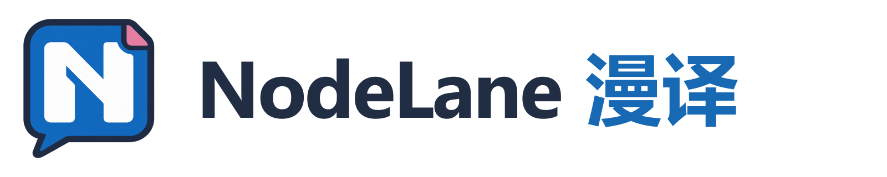
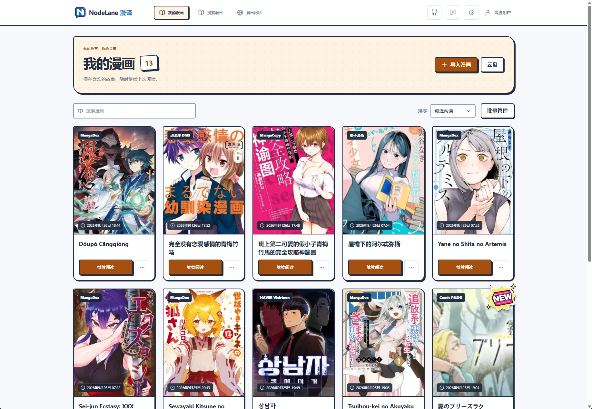
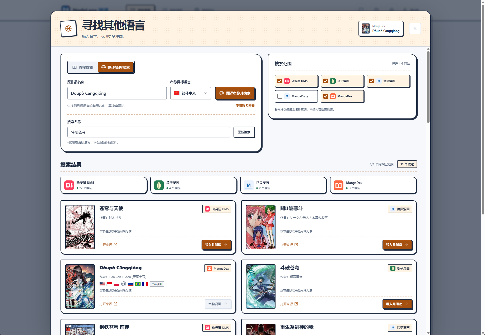
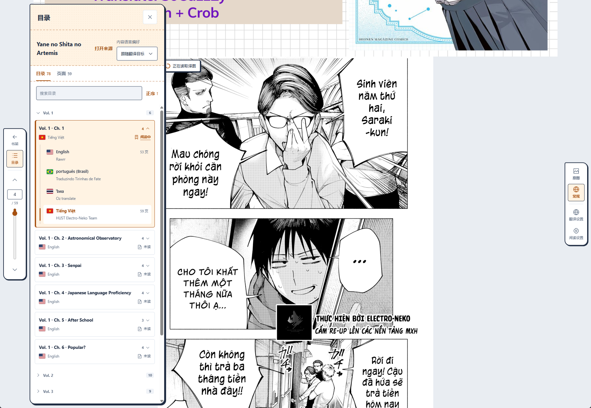
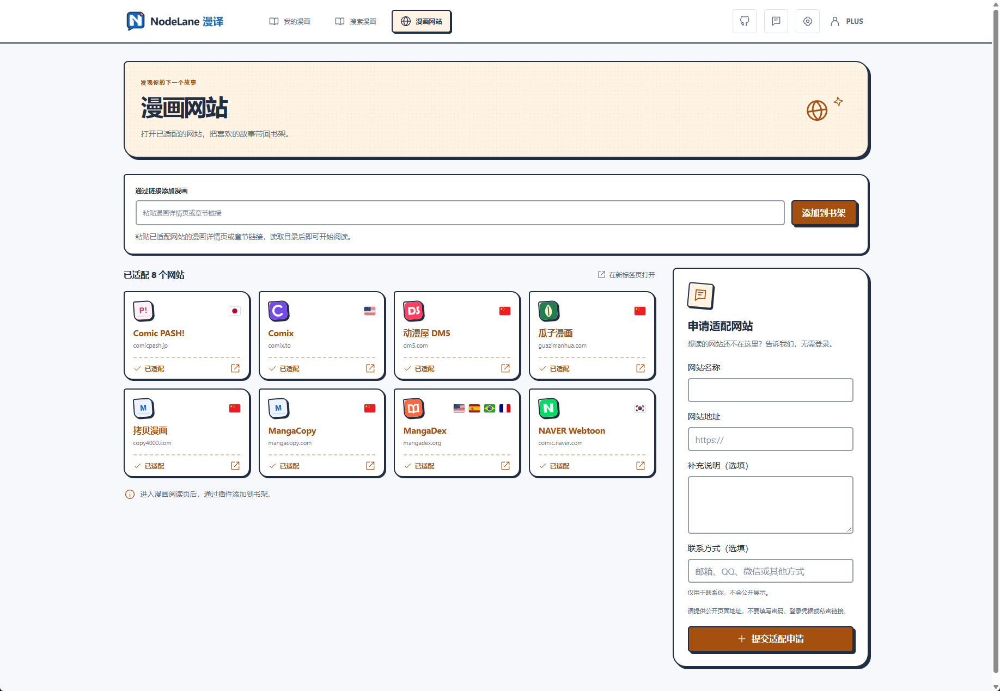
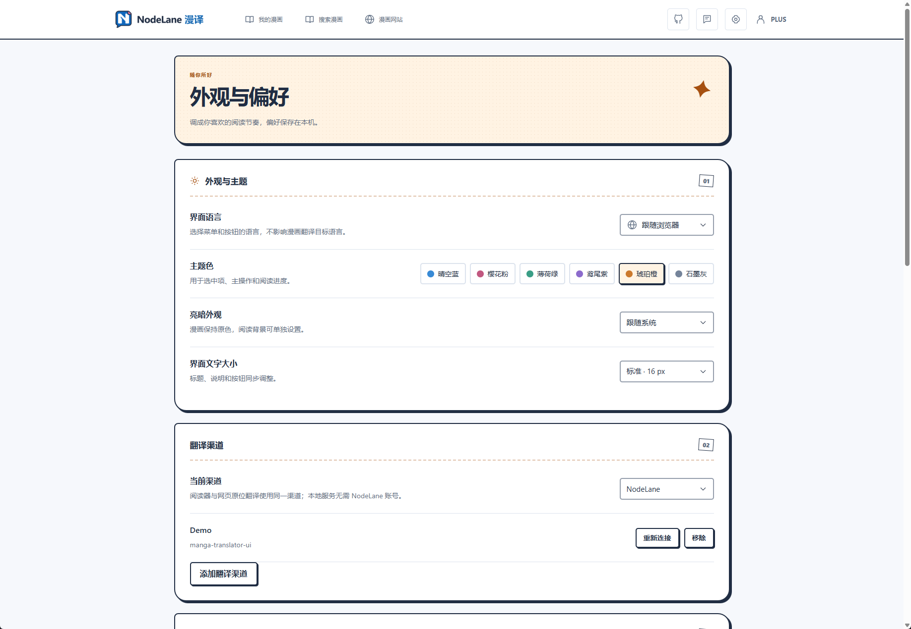

<picture>
  <source media="(prefers-color-scheme: dark)" srcset="apps/extension/src/assets/brand/logo-horizontal-zh-dark.webp">
  
</picture>

**简体中文** | [English](README_EN.md)

**在浏览器里阅读漫画，边看边译，随时对照原图。**

面向 Chrome、Edge、Firefox 的漫画阅读与翻译插件，支持本地漫画文件、Google Drive 和专门适配的网站，提供常规翻译与 AI 重绘。

支持本地翻译，可连接本地部署的 [manga-translator-ui](https://github.com/hgmzhn/manga-translator-ui) 服务。

## 产品体验

- **导入即读**：支持 CBZ / ZIP、CBR / RAR、PDF、无 DRM 的 MOBI，以及 Google Drive 和已适配网站。
- **边看边译**：常规翻译与 AI 重绘，支持原图／译图切换、并排对照与阅读位置恢复。
- **按习惯阅读**：连续阅读、单页翻页、阅读方向、缩放与独立阅读背景。
- **自选翻译渠道**：使用官方服务或连接本地 manga-translator-ui；本地渠道无需 NodeLane 账号。
- **界面随你调整**：16 种界面语言、六种主题色、亮暗外观与文字大小。

### 我的漫画

导入、搜索和管理漫画，继续上次阅读。

查看跨语言搜索、阅读目录、网站导入与外观设置

### 寻找其他语言

翻译作品名称，在选定的网站中搜索并查看候选结果。

### 阅读与目录

在阅读器中浏览章节目录，查看语言选项、页数与阅读状态。

### 漫画网站

粘贴已适配网站链接，读取目录并添加到书架。

### 外观与偏好

选择界面语言、主题色与亮暗外观，管理翻译渠道。

以上为用户提供的产品截图，漫画内容与封面版权归各自权利人所有。

## 交流与反馈

加入 [Telegram 交流群](https://t.me/+pPyxB0Sxocw0MDc1)，讨论使用体验与功能建议。遇到问题可提交 [GitHub Issue](https://github.com/Wy2926/node-comics/issues)，附上浏览器版本、复现步骤与必要截图。

## 开始开发

| 模块 | 用途与入口 |
| --- | --- |
| [浏览器插件](apps/extension/README.md) | 阅读器、书架、网站适配与翻译交互 |
| [后端](backend/README.md) | API、持久任务、账户、会员与管理后台 |
| [官网](backend/website/README.md) | 五语介绍、下载与账户页面 |
| [Drive 连接页](apps/drive-connect/README.md) | Google 授权与文件选择 |
| [计算节点](services/compute-node/README.md) | Windows 独立节点的安装、运行与构建 |
| [图像引擎](services/classic-engine/README.md) | 检测、OCR、LaMa 抹字与嵌字开发 |

各模块 README 提供环境要求和运行命令；验证工具见[脚本入口](scripts/README.md)。

## 开发规范

| 主题 | 文档 |
| --- | --- |
| 产品与阅读 | [产品设计](docs/PRODUCT_DESIGN.md)、[单来源阅读](docs/SIMPLE_COMIC_READING_DESIGN.md) |
| 架构与数据 | [系统架构](docs/ARCHITECTURE.md)、[来源与缓存](docs/COMIC_SOURCE_ARCHITECTURE.md) |
| 翻译与计算 | [翻译契约](docs/READING_TRANSLATION_CONTRACT.md)、[计算协议](docs/COMPUTE_PROTOCOL.md)、[集群调度](docs/TRANSLATION_CLUSTER_DESIGN.md) |
| 网站与界面 | [网站适配](docs/SITE_ADAPTERS.md)、[跨语言搜索设计](docs/COMIC_SEARCH_DESIGN.md)、[界面国际化](docs/UI_INTERNATIONALIZATION.md)、[品牌文案](docs/BRAND_AND_STORE_LISTING.md) |
| 账户与运营 | [会员额度](docs/MEMBERSHIP_AND_QUOTAS.md)、[支付](docs/STRIPE_BILLING.md)、[管理后台](docs/ADMIN_CONSOLE.md) |
| 部署与维护 | [部署](docs/DEPLOYMENT.md)、[备份与恢复](docs/OPERATIONS.md)、[代码规范](docs/CODE_QUALITY.md)、[API 契约](contracts/README.md) |

协作要求见 [AGENTS.md](AGENTS.md)。产品规则在所属专题维护，README 不重复定义。

## 许可证

除另有明确声明的第三方内容外，NodeLane Comics 的项目代码采用 **GNU General Public License v3.0 only（SPDX：`GPL-3.0-only`）**，完整条款见 [LICENSE](LICENSE)。本软件不提供任何担保，具体以许可证条款为准。

第三方代码、模型与字体按各自随附的许可使用，原有版权与许可声明继续保留；图像引擎的来源说明见 [THIRD_PARTY.md](services/classic-engine/THIRD_PARTY.md)。漫画内容、封面与用户数据不因本项目的软件许可证而获得授权。
