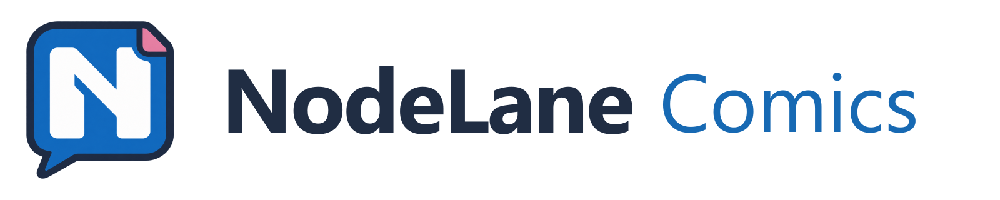
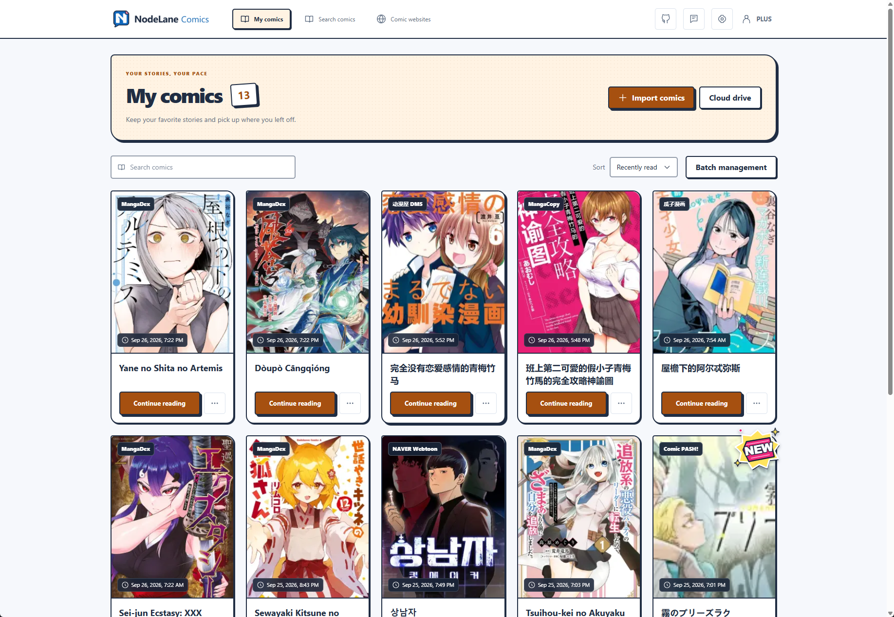
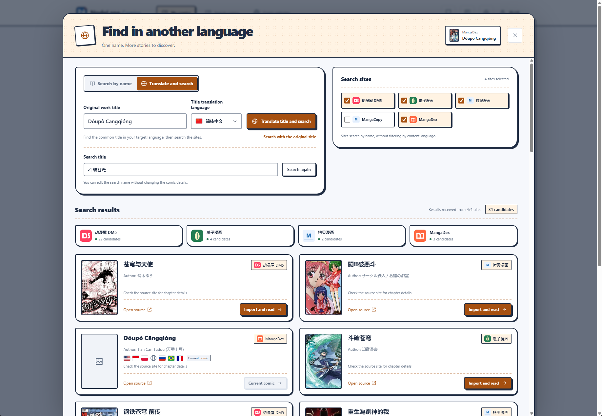
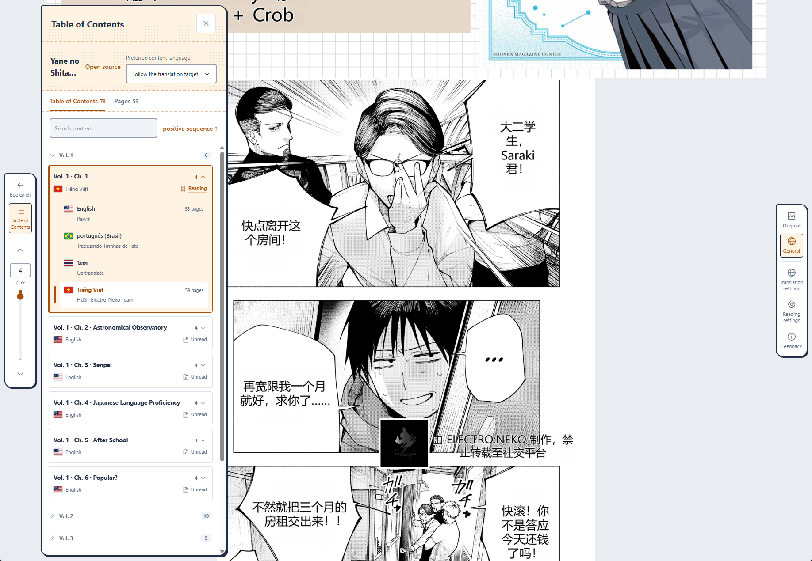
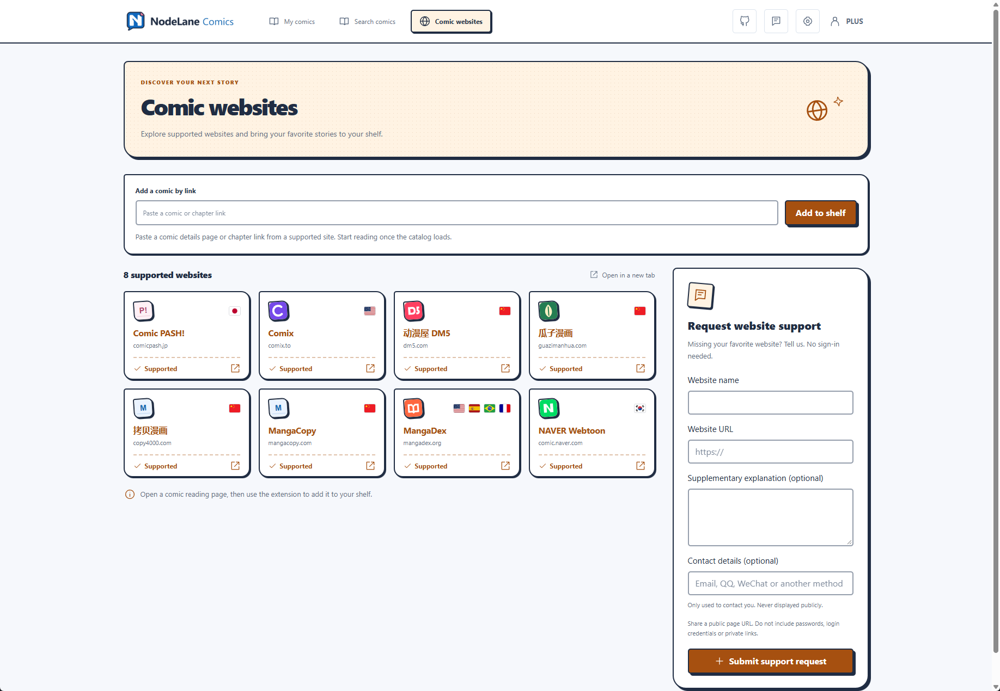
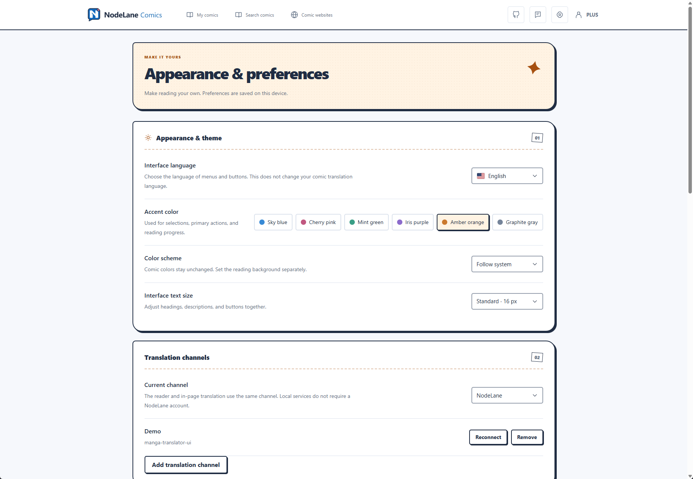

<picture>
  <source media="(prefers-color-scheme: dark)" srcset="apps/extension/src/assets/brand/logo-horizontal-en-dark.webp">
  
</picture>

[简体中文](README.md) | **English**

**Read comics in your browser, translate as you go, and compare with the original.**

A comic reader and translation extension for Chrome, Edge, and Firefox. Read local comic files, import from Google Drive or supported websites, and choose standard translation or AI redraw.

Local translation is supported through a self-hosted [manga-translator-ui](https://github.com/hgmzhn/manga-translator-ui) service.

## Features

- **Import and read**: Open CBZ / ZIP, CBR / RAR, PDF, and DRM-free MOBI files, or import from Google Drive and supported websites.
- **Translate as you read**: Use standard translation or AI redraw, switch between originals and translations, compare them side by side, and restore your reading position.
- **Read your way**: Choose continuous scrolling or single-page reading, reading direction, zoom, and a separate reading background.
- **Choose your translation service**: Use the official service or connect to a local manga-translator-ui instance. Local services do not require a NodeLane account.
- **Personalize the interface**: Choose from 16 interface languages, six accent colors, light and dark modes, and adjustable text sizes.

### My comics

Import, search, and manage comics, then pick up where you left off.

View title translation and search, chapter navigation, website imports, and preferences

### Find in another language

Translate a comic title, search selected websites, and browse matching candidates.

### Reading and chapter navigation

Browse chapters in the reader, with language options, page counts, and reading status.

### Comic websites

Paste a link from a supported website to load its chapter list and add the comic to your shelf.

### Appearance and preferences

Choose your interface language, accent color, and color scheme, and manage translation services.

These product screenshots were provided by a user. Comic content and cover artwork belong to their respective rights holders.

## Community and feedback

Join the [Telegram community](https://t.me/+pPyxB0Sxocw0MDc1) to discuss the extension and suggest features. To report a problem, open a [GitHub Issue](https://github.com/Wy2926/node-comics/issues) with your browser version, steps to reproduce, and relevant screenshots.

## Development

The module guides and technical documents linked below are currently in Chinese.

| Module | Purpose and entry point |
| --- | --- |
| [Browser extension](apps/extension/README.md) | Reader, library, website adapters, and translation UI |
| [Backend](backend/README.md) | API, persistent jobs, accounts, subscriptions, and administration |
| [Website](backend/website/README.md) | Product pages in five languages, downloads, and account pages |
| [Drive connection page](apps/drive-connect/README.md) | Google authorization and file selection |
| [Compute node](services/compute-node/README.md) | Install, run, and build the standalone Windows node |
| [Image engine](services/classic-engine/README.md) | Text detection, OCR, LaMa inpainting, and text rendering |

Each module README lists its requirements and run commands. See the [scripts guide](scripts/README.md) for validation tools.

## Development guidelines

| Topic | Documentation |
| --- | --- |
| Product and reading | [Product design](docs/PRODUCT_DESIGN.md), [Single-source reading](docs/SIMPLE_COMIC_READING_DESIGN.md) |
| Architecture and data | [System architecture](docs/ARCHITECTURE.md), [Sources and caching](docs/COMIC_SOURCE_ARCHITECTURE.md) |
| Translation and compute | [Translation contract](docs/READING_TRANSLATION_CONTRACT.md), [Compute protocol](docs/COMPUTE_PROTOCOL.md), [Cluster scheduling](docs/TRANSLATION_CLUSTER_DESIGN.md) |
| Websites and interface | [Website adapters](docs/SITE_ADAPTERS.md), [Cross-language search](docs/COMIC_SEARCH_DESIGN.md), [Interface localization](docs/UI_INTERNATIONALIZATION.md), [Brand copy](docs/BRAND_AND_STORE_LISTING.md) |
| Accounts and operations | [Membership and quotas](docs/MEMBERSHIP_AND_QUOTAS.md), [Payments](docs/STRIPE_BILLING.md), [Admin console](docs/ADMIN_CONSOLE.md) |
| Deployment and maintenance | [Deployment](docs/DEPLOYMENT.md), [Backup and recovery](docs/OPERATIONS.md), [Code standards](docs/CODE_QUALITY.md), [API contract](contracts/README.md) |

See [AGENTS.md](AGENTS.md) for collaboration guidelines. Product rules are maintained in their topic documents rather than duplicated in this README.

## Licenses

Except for third-party content with explicit separate licensing, the NodeLane Comics project code is licensed under the **GNU General Public License v3.0 only (SPDX: `GPL-3.0-only`)**. See [LICENSE](LICENSE) for the full terms. This software comes without any warranty, as detailed in the license.

Third-party code, models, and fonts remain subject to their accompanying licenses, with their original copyright and license notices retained. See the image engine's [THIRD_PARTY.md](services/classic-engine/THIRD_PARTY.md) for provenance. The software license does not grant rights to comic content, covers, or user data.
