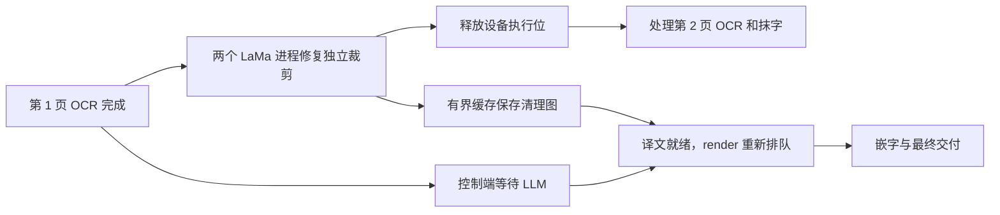

# AMD v3：等待文本不占设备，图像复用与裁剪并行

2026-09-16，本机 RX 6900 XT 16 GiB、Ryzen 7 5800X、32 GB RAM。延续原 MIT 检测、48px OCR、LaMa Large、字体、掩膜、裁剪上下文和翻译质量要求。本轮没有修改或调用在线 LLM。

## 1. 当前行为



- 每个图像阶段本来就单独持有租约；本次消除间接阻塞：`CLUSTER_MAX_IMAGE_STAGES` 不再计入抹字完成、只等待文本的页面，只统计活跃且已经 OCR、尚未抹字的页面。
- 完成抹字后设备立即可领取下一页。译文到达后 render 重新参与原来的阅读优先与用户公平调度，不抢断当前阶段。
- 等待文本的任务显示 `phase=text`，不再显示已结束的背景修复阶段。它仍是未交付任务，不提前显示成功、结算或释放用户在途容量。
- 图像缓存满只淘汰旧项，不等待文本消费；缓存丢失时重新抹字，复用控制端已保存的译文。持久恢复不依赖某个节点内存。
- 当所有已受理页面都已预处理、译文尚未就绪时，设备没有剩余图像阶段可执行；最终成品吞吐仍可能受 LLM 限制。本次保证有可执行图像工作时不会因为其他页等文本而停下。

## 2. 减少重复取图与编解码

代理按任务、原图 SHA-256、引擎配置保存原始字节及引擎引用。默认上限 128 MiB / 512 项 / 15 分钟绝对 TTL。正常同节点路径中，一页在 analyze 时下载原图，inpaint/render 不再重复从控制端读取原图字节。

每次缓存命中仍通过当前租约的 `GET /internal/leases/{id}/input/authorize` 校验节点、执行代次和原图有效性。该接口只返回已记录摘要，不读取 R2 对象。控制端对最终结果仍进行原图和掩膜保护验证，本次没有删除这次必要的取图。

引擎原图数组和清理图数组共享 256 MiB / 512 项 / 15 分钟绝对 TTL 的 LRU。按数组实际 `nbytes` 计量，不以行数代替字节数。中间清理图不再先编码 PNG 再解码；最终输出仍为可验证 PNG。

`image_ref` 绑定任务、摘要、配置，后续阶段只传引用。缓存丢失返回明确的 `410 ENGINE_INPUT_CACHE_MISS`，发生在模型运行之前，代理最多补发一次已授权原图。网络超时、版本错误及不确定执行结果不会按缓存缺失盲目重算。跨任务引用、已删除原图、旧租约和错误节点均有拒绝测试。

缓存是性能优化，不作为授权依据或持久结果；控制 API 与代理需要同步更新。

## 3. LaMa 独立裁剪并行

原单张有 10 个不同尺寸的裁剪，原来顺序调用一个 LaMa。此次使用两个常驻进程，每个持有同一套原 LaMa，仍保留原 CPU FourierUnit 和 GPU 空间网络。

父引擎在整个抹字阶段持有同一个物理设备锁。最多同时提交 2 个裁剪，不一次性排入整页裁剪；每次预测都读取原图，每个掩膜像素只由原裁剪计划指定的输出区域写回。失败时排空其他已提交工作后才释放设备。子进程异常退出会使当前阶段失败，下一次获准执行时重建进程池，由控制端维持阶段重试及租约代次。

父进程只加载一份检测/OCR，不再额外加载闲置的 LaMa。控制端依然只有一个设备、容量 1；这不是整条翻译流水线复制成多个实例。CPU/CUDA 不启用此 DirectML 专用裁剪池。

组件实验：每种配置预热后计时 3 次，修复结果像素差均为 0。

| LaMa 执行方式 | 修复平均耗时 |
| --- | ---: |
| 原进程内单模型，4 线程 | 1.045 秒 |
| 单独 1 进程，4 线程 | 0.981 秒 |
| 2 进程，每个 2 线程 | 0.688 秒 |
| **2 进程，每个 4 线程** | **0.611 秒** |

## 4. 真实 AMD 整页验证

原创 `starlight-bookshop.png`，1024×1536、11 个文本块，复用之前已验证译文。所有结果与独立保存的原方案 RGB 基准逐像素比较。

v3 同一轮中，每种配置计时 6 张，单请求顺序执行三阶段，包含 HTTP 和客户端校验：

| v3 请求方式 | 平均单张 | P95 |
| --- | ---: | ---: |
| 每阶段传完整原图 | 3.716 秒 | 3.769 秒 |
| **后续阶段复用图像引用** | **3.529 秒** | **3.543 秒** |
| 再次传完整原图 | 3.781 秒 | 3.996 秒 |

18/18 张计时成功，OCR、掩膜、字形和最终像素一致，无缓存重建。另外 5 张先全部完成 OCR/抹字，再统一提供译文：13.985 秒完成全部预处理，16.688 秒完成全部嵌字，5/5 结果相同，无重建。

引用模式的服务端平均检测/OCR 1.922 秒、抹字 0.695 秒、嵌字 0.409 秒。此轮计时阶段聚合进程专用显存峰值 4.20 GiB、共享 GPU 内存峰值 0.56 GiB、私有提交量峰值 6.71 GiB。监控包含父模型进程、分镜进程和两个 LaMa 进程。

额外缓存压力运行完成 34/34 张、120.25 秒，均值 3.536 秒、P95 3.589 秒，约 16.96 页/分钟；零失败、零输出差异、同页渲染零缓存重建。此轮累计超过缓存容量后，最终数组缓存为 252 MiB（配置上限 256 MiB），通过 LRU 淘汰继续处理。该持续阶段专用显存保持约 3.12 GiB、共享 GPU 内存约 0.56 GiB，私有提交量峰值 5.82 GiB。它验证短时稳定与缓存压力，不代表长期、多尺寸负载结论。

历史参考：v2 为 4.434 秒/张，仅加入缓冲复用的中间版本为 4.120 秒/张；本次 v3 为 3.529 秒/张，比历史 v2 少约 20.4%。这三个数字来自先后独立运行，不能替代同轮受控对照；上表仅隔离引用传输的差异。

样本原有 2 个未识别区域仍按原策略保留。本轮没有覆盖多语言、不同文字密度、所有尺寸的质量集，也未重测 R2/在线文本总等待；不将本地时间报告为完整产品交付时间。

## 5. 调度与恢复验证

- 后端真实状态测试把 LLM 调用阻塞，同时设图像水位为 1：第一张抹字结束后，同一图像设备仍能领取并完成第二张 OCR；首张仍处于 `running/text`，译文回来后 render 才就绪。
- 真实 HTTP 控制服务、工作进程和单个计算代理测试：阻塞文本池，水位设为 1，连续完成 5 张 OCR/抹字，期间没有成功页或占用中的图像租约。解除阻塞后 5 张全部完成，各结算一次。该测试的图像模型和文本回复为模拟；上一节 AMD 图片为真实模型。
- 缓存授权、跨任务隔离、输入摘要、拒绝过期租约、一次补传、原始输出重复交付、数组容量、TTL、元数据项数和裁剪失败排空有回归覆盖。
- 控制端测试覆盖原公平调度、会员队列和真实 HTTP 节点故障恢复。LLM 模型、参数、调用预算及文本池容量没有变化。

相关回归合计覆盖 33 项引擎测试、12 项代理测试和 53 项后端测试。最后对受阶段状态修改影响的 21 项后端测试再次运行通过；`git diff --check`、文档链接和证据 JSON 检查通过。

## 6. 入口与复现

默认版本为 `mit-95227a2-classic-v4-dml-v3`，控制端快照与本机启动脚本已同步，旧版本结果缓存身份不同。默认节点结构为一个计算代理、一个父引擎、一个 CPU 分镜进程、两个 LaMa 进程。

```powershell
# 正常本机集群入口
./scripts/start-local-amd.ps1

# 引用/完整图片对照、延迟译文，以及可选的缓存压力运行；不调用 LLM/R2
services/classic-engine/.venv/Scripts/python.exe scripts/benchmark_amd_buffers.py --pages 6 --deferred-pages 5 --soak-seconds 120

# 仅在独立基准中复现历史 v1/v2 单 LaMa 模型对照
services/classic-engine/.venv/Scripts/python.exe scripts/benchmark_amd_single_page.py --pages 10
```

证据见 [脱敏数据](evidence/amd-pipeline-20260916.json)。私有完整记录在 `amd-buffers-20260916-060626`（缓冲中间版）、`amd-buffers-20260916-061407`（v3 对照）、`amd-buffers-20260916-061748`（缓存压力）及 `amd-lama-crop-processes.json`。测试结束关闭所启动的进程，没有公开部署、提交或推送。
