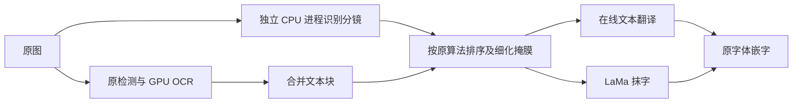

# RX 6900 XT 单张速度优化

后续默认入口已升级为 [AMD v3 流水线](AMD_PIPELINE_OPTIMIZATION.md)。本文保留 v2 的独立对照结果；`benchmark_amd_single_page.py` 明确使用单 LaMa 实例以复现本文，正常启动入口使用 v3。

2026-09-16，本机 Windows / RX 6900 XT 16 GiB / Ryzen 7 5800X / 32 GB RAM。

## 结果与范围

**单页本地 HTTP 耗时从 5.45 秒降至 4.43 秒，减少 18.6%。** 保留检测、48px OCR、LaMa Large、阅读顺序、掩膜与原嵌字算法，未更换权重、缩小输入或减少解码搜索。优化已接入 AMD 默认运行入口 `mit-95227a2-classic-v4-dml-v2`；CPU/CUDA 配置保持原版本。

样本为 `samples/starlight-bookshop.png`，1024×1536、11 个文本块。复用此前真实任务的相同译文，每次重新执行图像阶段，使用不同任务缓存作用域。单客户端、单 GPU 模型实例；独立 CPU 进程只负责当前页分镜。测试不调用在线 LLM 或 R2。

| 配置，均预热后计时 10 张 | 平均单张 | P95 | 检测/OCR 阶段 | 抹字阶段 | 嵌字阶段 |
| --- | ---: | ---: | ---: | ---: | ---: |
| 原 v1 | 5.450 秒 | 5.631 秒 | 3.094 秒 | 1.220 秒 | 0.406 秒 |
| **v2：GPU OCR + 分镜进程并行** | **4.434 秒** | **4.477 秒** | **2.065 秒** | **1.225 秒** | **0.411 秒** |
| 原 v1 复测 | 5.444 秒 | 5.540 秒 | 3.056 秒 | 1.239 秒 | 0.415 秒 |

单张总耗时包含本地 HTTP、图片编解码和客户端校验；各阶段列为服务端返回的阶段计时，因此不能直接相加得到总时间。首尾原版结果接近，排除了仅由预热或机器状态变化造成改善的解释。单次独立启动未计入单页：原版约 5.6 秒、v2 约 8.4 秒，v2 会先启动并预热 CPU 分镜进程。

30/30 张计时请求成功，无缓存重建。优化版与同一份原版基准比较：OCR 文本、抹字掩膜、字形掩膜及最终 RGB 像素全部一致，最大像素差为 0。另有 21 次组件配置计时，全部保持相同输出。该样本原有 2 个未识别区域仍保留原文及质量标记；此次不是多语言漫画质量集验收。

## 瓶颈在哪里

原组件剖析记录在 [组件证据](evidence/amd-components-20260916.json)：

1. **可消除的串行等待：分镜约 0.89 秒。** 原实现先完成 OCR，再调用只依赖原图的分镜识别。分镜内部有大量 Python 多边形拆分、线段合并循环。普通线程与 OCR 的 Python 控制争用解释器锁，改成独立进程后才有效重叠。
2. **OCR 自回归依赖。** 原 OCR 总计约 1.98 秒，其中 CPU 解码约 1.28 秒；下一步字符依赖前一步结果。v2 修正 DirectML 缓存切片写入问题，将原解码及束搜索张量计算放到 GPU，模型运算不变；仍存在 Python 控制、细粒度算子和同步开销。
3. **LaMa 的 CPU/GPU 混合边界。** 原样本 10 个修复块串行执行，每块有 36 个 FourierUnit，即 360 次 CPU FourierUnit 执行。原计时中 CPU 数学约 0.57 秒，含设备边界约 0.72 秒，属于约 1.33 秒抹字阶段的一部分。这不是 CPU 所有核心都能同时执行的独立任务。
4. **其余耗时。** 区域合并、掩膜细化、嵌字、PNG 编解码及接口传输仍在路径上。此次优化主要减少检测/OCR 阶段约 1 秒，其余阶段基本不变。

LaMa 的 10 个裁剪在原预处理后尺寸均不同。本轮未通过统一拉伸或扩大上下文来凑批次，也未改变 FourierUnit。其设备往返及逐块调用仍是后续单页优化空间；不能将多模型副本的跨页吞吐提升当成单页收益。



图中的在线文本与抹字并行原已由集群调度实现，本次新增的是分镜与检测/OCR 并行。

## CPU 为什么仍没有满载

下列为直接调用图像函数的组件实验，每种配置预热后测量 3 次；不含 HTTP，与上表口径不同。

| OCR / 分镜方式 | PyTorch CPU 线程数 | 单页均值 |
| --- | ---: | ---: |
| 原混合 OCR，串行分镜 | 4 | 4.889 秒 |
| GPU OCR，串行分镜 | 4 | 4.656 秒 |
| GPU OCR，线程并行分镜 | 4 | 4.514 秒 |
| GPU OCR，进程并行分镜 | 1 | 4.661 秒 |
| GPU OCR，进程并行分镜 | 2 | 4.067 秒 |
| **GPU OCR，进程并行分镜** | **4** | **3.808 秒** |
| GPU OCR，进程并行分镜 | 8 | 3.813 秒 |

因此本机单张配置保持 4 线程。增到 8 线程没有收益，减到 1/2 线程会拖慢 LaMa 的 CPU 部分。多实例试验中的 2 线程配置服务于总吞吐，不能直接用于最低单页延迟。

HTTP 对照资源采样包含模型进程和 CPU 分镜子进程：原版平均约占 2.97 个逻辑核，v2 约 2.71 个逻辑核；对应 16 逻辑核整机约 18.6% / 16.9%。GPU 最忙引擎采样均值从 5.55% 升至 24.06%。v2 进程专用显存峰值约 3.15 GiB，私有提交量峰值约 4.57 GiB。

CPU 占用下降与 OCR 转移到 GPU 一致；单页时间同时缩短。CPU/GPU 未满载仍受步骤依赖、Python 控制与设备同步限制。采样约每秒一次，不能用它代替逐算子硬件性能分析，也不能以总利用率判断某个核心没有成为瓶颈。

## 与此前约 49 秒真实整页的关系

重新读取 9 月 15 日 v1 在线任务记录：

- 整页 48.859 秒包含 R2、在线文本、调度和下载。
- 文本服务调用 9.272 秒；文本阶段租约约 9.316 秒。
- 抹字阶段租约约 2.268 秒，与文本阶段在时间上重叠。
- 上传校验阶段租约约 7.436 秒；渲染阶段租约约 5.573 秒，其中本地嵌字仅约 0.609 秒。

租约时间包含阶段处理和相关网络交付，不能都算作模型计算。要继续压缩实际阅读等待，还需单独测量 R2 传输和在线文本延迟；此次没有重跑付费全链路，不能把 18.6% 直接套到此前 48.859 秒上。

## 实现与复现

- [parallel_panels.py](../services/classic-engine/parallel_panels.py)：有界单 CPU 进程，沿用原分镜检测及区域排序；失败和无文字页也排空当前分镜任务，关闭引擎时回收进程。
- [ocr_directml.py](../services/classic-engine/ocr_directml.py)：保持原解码数学，重建缓存以绕过 DirectML 切片写入偏差。CPU 和本机 DirectML 均检查首步、中间步、末步及未写入缓存的保留。
- [server.py](../services/classic-engine/server.py) 与 [classic_config.py](../backend/app/classic_config.py)：AMD v2 版本、缓存身份与默认入口一致；保留容量 1 和物理设备互斥。
- [benchmark_amd_single_page.py](../scripts/benchmark_amd_single_page.py)：原版→优化版→原版复测，逐页验证输出。

```powershell
# 使用现有已校验权重、原图和私有 stages.json；无 LLM / R2 调用。
services/classic-engine/.venv/Scripts/python.exe scripts/benchmark_amd_single_page.py --pages 10

# 正常本机集群入口现在默认使用 AMD v2。
./scripts/start-local-amd.ps1
```

`ENGINE_DIRECTML_OPTIMIZED=0` 仅供独立基准引擎恢复 v1 作对照；正式控制端使用 v2 身份，不能把 v1 对照引擎接入 v2 任务。默认入口未增加 GPU 模型副本。

验证：26 项引擎测试、1 项后端配置/缓存身份测试通过，`git diff --check` 通过。本地 HTTP 服务已验证，测试结束已关闭所启动的服务与分镜进程；没有提交、推送或公开部署。

脱敏数字见 [完整证据](evidence/amd-single-page-20260916.json)。逐页私有记录在 `private-test-data/amd-single-http-20260916-053421/`，组件实验在 `private-test-data/amd-single-page/`。
