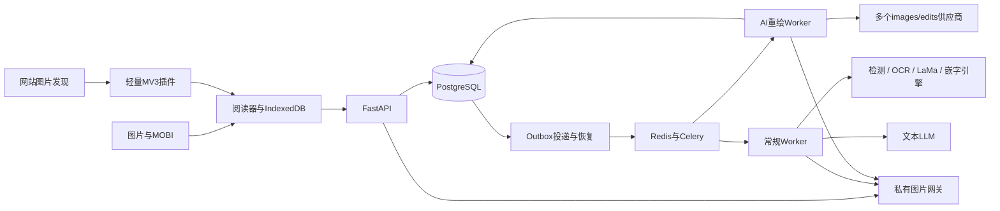

# Node Comics 架构 v0.3

2026-09-14：常规翻译 `classic` 与图片重绘 `redraw` 均已接入。常规引擎、文本预算及验证见[常规翻译实现](CLASSIC_IMPLEMENTATION.md)，历史方案见[调研](CLASSIC_TRANSLATION_RESEARCH.md)。

## 常规翻译扩展

建议保留 `redraw`，新增 `classic` 模式，复用现有身份、报价、任务、额度、批次与私有结果访问。检测／OCR／LaMa 抹字／嵌字放入独立引擎进程或容器，文本 LLM 使用单独适配器和能力配置；不复用图片编辑协议。前端仍只与产品 API 通信。

已扩展 worker 阶段与中间产物持久化，逐次记录 LLM 调用意图、用量和未知结果。文本 LLM 在统一重试次数和成本预算内自动恢复，未知调用保守预占预算，单页业务结算仍防重；已完成译文在本地渲染恢复时复用。中间文本、掩膜和译图共享原图的用户隔离、删除与到期规则。常规模式缓存纳入引擎、权重、掩膜、文本模型／提示词、上下文和字体配置版本。具体改动、成本与验证要求见调研文档第 5–7 节。

## 结构



WXT+React+TypeScript，FastAPI+SQLAlchemy/Alembic，PostgreSQL、Redis/Celery。一个业务后端按API、投递器和Worker进程部署。本地授权文件存储，未来可加私有S3；现有重绘链路无本地图像推理GPU依赖，新增常规引擎的硬件需求待实测。

## 插件与导入

站点适配器随插件发布，图片发现、字节获取、后端翻译分别管理。通用模式不声称完整章节。activeTab/scripting/storage/contextMenus与登录identity按功能使用，网站权限按需申请。消息校验sender、标签页、导航版本和登记资源，禁止任意跨域代理。凭据仅在可信扩展上下文。

清单、任务ID、原图与结果Blob存IndexedDB；Blob URL每次重建并撤销。连续阅读有限窗口解码，页面ID+相对位置恢复，原图尺寸占位。轮询在可见阅读器退避执行，重开查询服务端，不依赖MV3后台常驻。

MOBI按Blob分段读取PDB表与有限正文，解析PalmDOC和recindex；不执行电子书HTML，不全量读200MB文件进ArrayBuffer，不在解析时解码全卷。检查DRM、压缩、越界、展开大小、页数与单页限制。

## AI图片协议

```http
POST /v1/translations/redraw
Authorization: Bearer <product-token>
Idempotency-Key: <operation-id>
Content-Type: multipart/form-data

image: <binary image>  # 或asset_id，二选一
target_language: zh-Hans
```

内部稳定模式名redraw，用户界面显示“AI 重绘翻译”。业务输入只有原图与目标语言。后端版本化提示词要求翻译图中文字、尽量保留分镜、人物、线条、背景和颜色，不添加说明。图片内文字是数据，不能修改系统任务。

供应商base_url含/v1，适配器只追加/images/edits，HTTP客户端创建multipart boundary。profile配置供应商ID、后端credential_ref、模型、image/image[]、参数白名单、尺寸限制、超时、版本和结果域名。只发送该profile支持的参数。一个适配器支持多个供应商，聊天能力不是图片编辑能力证明。管理员显式测试才调用模型。

上传验证签名、格式、解码、像素、尺寸和字节。b64_json严格解码；URL返回需检查域名、DNS/IP、重定向、大小与超时并下载进私有存储。Key仅引用服务端环境。可解码、尺寸合理、持久化且归属正确后才完成结算。比例变化标记，不拉伸掩盖；request ID、usage和未知成本独立保存。

## 任务与计量

queued → running → succeeded | failed | cancelled | outcome_unknown。

任务、额度预占、outbox同事务提交。幂等键按用户和接口隔离并绑定请求摘要，改变参数返回冲突。内容缓存独立，包含用户、内容哈希、语言、有效模型profile和提示词版本；输入／输出过期删除不能命中。

队列可重复投递，Worker原子领取、持久attempt/租约/调用意图，仅当前执行权可调用与完成。现有图片重绘调用后超时、断连、Worker故障不自动重发收费请求；先查已有对象与证据，无法核实则outcome_unknown。新增文本 LLM 将采用上述预算内重试策略。

账本唯一交易键防重复结算。成功交付扣测试点数，明确失败和未执行取消释放。运行取消尽力停止，上游费用另记。核实期限释放后补交付不自动补扣。

批次绑定有序asset IDs、有效报价和预算，有限窗口投递，单页失败不阻塞；关闭浏览器不取消已确认任务。数据库是业务权威，Redis只调度，队列只传ID。

## API与实体

实体：User、Asset、Job、Attempt、ClassicState、TextCall、Batch、Quote、Provider、UsageLedger、Outbox，结果由任务私有输出引用表达。

| 接口 | 用途 |
| --- | --- |
| GET /v1/auth/config；POST /v1/auth/dev | 登录配置／显式本地测试登录 |
| GET /v1/capabilities | AI能力、语言、限制与额度 |
| POST /v1/images | 上传不自动翻译 |
| POST /v1/translations/redraw；/classic | 单图所选模式翻译 |
| GET /v1/jobs/{id}/classic | 所属用户的文字与阶段产物 |
| POST /v1/quotes；/translation-batches | 报价与预算绑定批次 |
| GET /v1/jobs/{id}；POST /v1/jobs/status | 单个／有界批量状态 |
| GET /v1/translation-batches/{id} | 分页批次状态 |
| POST /v1/jobs/{id}/cancel；/rerun | 取消／明确新版本 |
| POST /v1/translation-batches/{id}/cancel | 停止未完成范围 |
| GET /v1/images/{id}/access；/content | 私有授权图片 |
| DELETE /v1/images/{id} | 撤销输入与结果访问并清理 |
| GET /v1/me/usage | 余额、预占、分页账本 |
| /v1/admin/* | 管理员供应商、任务、额度与核实 |

以/openapi.json导出契约为实现权威。

## 身份与运维

生产OIDC验证JWT签名、issuer、audience、到期，浏览器授权码+PKCE并校验state。身份未配置拒绝私有操作。DEV_AUTH仅本地、随机签名密钥、127.0.0.1绑定，不能用于公开部署。

每个图片／任务／批次检查归属。删除先tombstone并撤销，任务丢弃后到输出。默认7天过期可配，回收孤立文件，数据库与图片卷一起备份。日志只记录任务ID、错误、阶段、耗时和脱敏计量。

公开发布仍需真实OIDC、精确扩展来源、HTTPS、运营策略与保留期限、目标站点和供应商质量验收。构建、本地运行和公开部署分别报告。
