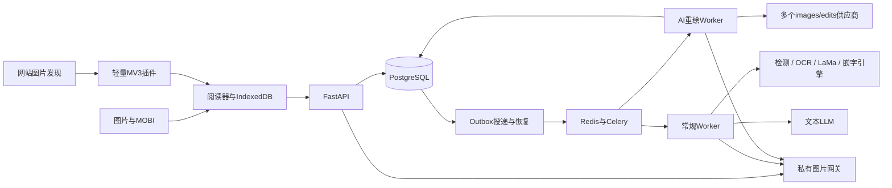

# Node Comics 架构 v0.3

2026-09-15：会员、周期页数和限时赠送已实现，详见[会员与翻译额度](MEMBERSHIP_AND_QUOTAS.md)。统一点数钱包、Quote 和 UserQueueSettings 已移除；任务幂等、结果权限、队列恢复与供应商成本记录继续保留。

2026-09-14：常规翻译 `classic` 与图片重绘 `redraw` 均已接入。常规引擎、文本预算及验证见[常规翻译实现](CLASSIC_IMPLEMENTATION.md)，历史方案见[调研](CLASSIC_TRANSLATION_RESEARCH.md)。

## 常规翻译扩展

建议保留 `redraw`，新增 `classic` 模式，复用现有身份、报价、任务、额度、批次与私有结果访问。检测／OCR／LaMa 抹字／嵌字放入独立引擎进程或容器，文本 LLM 使用单独适配器和能力配置；不复用图片编辑协议。前端仍只与产品 API 通信。

已扩展 worker 阶段与中间产物持久化，逐次记录 LLM 调用意图、用量和未知结果。文本 LLM 在统一重试次数和成本预算内自动恢复，未知调用保守预占预算，单页业务结算仍防重；已完成译文在本地渲染恢复时复用。中间文本、掩膜和译图共享原图的用户隔离、删除与到期规则。常规模式缓存纳入引擎、权重、掩膜、文本模型／提示词、上下文和字体配置版本。具体改动、成本与验证要求见调研文档第 5–7 节。

## 结构



WXT+React+TypeScript，FastAPI+SQLAlchemy/Alembic，PostgreSQL、Redis/Celery。一个业务后端按API、投递器和Worker进程部署。原图使用本地授权文件存储，译图支持本地或私有 Cloudflare R2（boto3/S3 兼容适配器），R2 授权短时直链由客户端直接下载，见[对象存储](OBJECT_STORAGE.md)；现有重绘链路无本地图像推理GPU依赖，新增常规引擎的硬件需求待实测。

## 漫画管理领域模型

作品管理按漫画内容与出版关系建立来源无关模型，见[通用漫画作品管理设计](COMIC_LIBRARY_DESIGN.md)。已实现作品、章节、内容版本、出版套系、卷册及收录关系，来源目录通过映射关联`ReadingCopy`。`Chapter`表示章节内容，不保存图片；页面与阅读锚点属于副本及其清单修订。使用独立 IndexedDB `node-comics-library`，事务协调元数据与副本身份，Web Locks 协调来源采集。旧扁平书架及存储模块已删除，没有旧数据迁移、兼容字段或结构回退。模块与运行证据见[实现记录](COMIC_LIBRARY_IMPLEMENTATION.md)。

MangaCopy是来源适配器之一，具体入口、原始标签映射和图片发现规则见[来源设计](MANGACOPY_LIBRARY_DESIGN.md)。站点分组、URL、章节UUID和图片地址不充当全局领域身份；源站变化不要求修改核心类的含义。

## 插件与导入

站点适配器随插件发布，图片发现、字节获取、后端翻译分别管理。通用模式不声称完整章节。activeTab/scripting/storage/contextMenus与登录identity按功能使用，网站权限按需申请。消息校验sender、标签页、导航版本和登记资源，禁止任意跨域代理。凭据仅在可信扩展上下文。

清单、任务ID、原图与结果Blob存IndexedDB；Blob URL每次重建并撤销。连续阅读有限窗口解码，页面ID+相对位置恢复，原图尺寸占位。轮询在可见阅读器退避执行，重开查询服务端，不依赖MV3后台常驻。

MOBI按Blob分段读取PDB表与有限正文，解析PalmDOC和recindex；不执行电子书HTML，不全量读200MB文件进ArrayBuffer，不在解析时解码全卷。检查DRM、压缩、越界、展开大小、页数与单页限制。

## AI图片协议

```http
POST /v1/translations/redraw
Authorization: Bearer <product-token>
Idempotency-Key: <operation-id>
Content-Type: multipart/form-data

image: <binary image>  # 或asset_id，二选一
target_language: zh-Hans
```

内部稳定模式名redraw，用户界面显示“AI 重绘翻译”。业务输入只有原图与目标语言。后端版本化提示词要求翻译图中文字、尽量保留分镜、人物、线条、背景和颜色，不添加说明。图片内文字是数据，不能修改系统任务。

供应商base_url含/v1，适配器只追加/images/edits，HTTP客户端创建multipart boundary。profile配置供应商ID、后端credential_ref、模型、image/image[]、参数白名单、尺寸限制、超时、版本和结果域名。只发送该profile支持的参数。一个适配器支持多个供应商，聊天能力不是图片编辑能力证明。管理员显式测试才调用模型。

上传验证签名、格式、解码、像素、尺寸和字节。b64_json严格解码；URL返回需检查域名、DNS/IP、重定向、大小与超时并下载进私有存储。Key仅引用服务端环境。可解码、尺寸合理、持久化且归属正确后才完成结算。比例变化标记，不拉伸掩盖；request ID、usage和未知成本独立保存。

## 任务与计量

queued → running → succeeded | failed | cancelled | outcome_unknown。

任务、额度预占、outbox同事务提交。幂等键按用户和接口隔离并绑定请求摘要，改变参数返回冲突。内容缓存独立，包含用户、内容哈希、语言、有效模型profile和提示词版本；输入／输出过期删除不能命中。

FilePage 按用户＋文件 SHA-256＋原始页索引唯一映射原图。MOBI、CBZ/ZIP、CBR/RAR 使用整个文件哈希，索引取解析原始顺序；单图文件使用自身哈希和索引 0；PDF 文件页标识纳入原文件、渲染配置和最终页图片摘要。重复导入先批量查询已有任务，按内容缓存键筛选当前模式／语言／配置下的有效版本与进行中任务，不创建收费任务。跨设备必须登录同一服务同一账户，原图／译图保留期和授权规则照常执行，不回填旧映射。2026-09-14 增加可选 `image_sha256`：没有文件映射时只在同账户的原图资产中回退查找；不会根据客户端摘要写入映射，已失效映射仍要求上传。细节见[格式与缓存说明](IMPORT_FORMATS_AND_CACHE.md)。

同一用户的创建事务串行核对进行中内容缓存键；两台设备用不同操作编号同时提交相同页面时，共用既有 queued／running／outcome_unknown 任务，不重复预占。JobRequest 为每次操作保存请求摘要与任务引用，失败／配置变更后重放原操作仍返回原任务。BatchItem 按预览页序记录各批次的请求原图与实际任务；返回 `requested_asset_id` 区分本次请求原图和共享任务的 `input_asset_id`，批次费用仅累计实际新增的任务。同账户取消共享任务会同时影响引用它的批次；主动生成新版本仍走有预算确认的 force／rerun。

有效原图的 no_text 可生成免费的同状态缓存版本，无需再次 OCR。普通重绘提交还会保护跨配置的同内容／语言 outcome_unknown：供应商配置变更不解除原任务的未知消耗状态，需明确确认 rerun 才创建新调用；成功结果和常规翻译仍按配置隔离。

队列可重复投递，Worker原子领取、持久attempt/租约/调用意图，仅当前执行权可调用与完成。现有图片重绘调用后超时、断连、Worker故障不自动重发收费请求；先查已有对象与证据，无法核实则outcome_unknown。新增文本 LLM 将采用上述预算内重试策略。

账本唯一交易键防重复结算。成功交付结算原额度记录中的页数；PLUS 常规记录不限量交付，明确失败和未执行取消释放。运行取消尽力停止，上游费用另记。核实期限释放后补交付不自动补扣。

批次绑定有序asset IDs、有效报价和预算，单页失败不阻塞；关闭浏览器不取消已确认任务。前端传输并发默认 2、可设 1–10。后端以 SchedulerState 保存轮转游标，QueueAdmission 保存已授予的执行名额和令牌，服务端套餐配置提供每用户并发（普通与 PLUS 均默认 2）；单页／批次和两种模式合并计数。每轮每用户取一页，先提交名额再投递，Worker 校验当前令牌并领取，恢复／撤销后的旧消息不能重新取得执行权。数据库是业务权威，Redis只调度，队列只传任务 ID 与执行名额令牌。

## API与实体

实体：User、Asset、FilePage、Job、JobRequest、Attempt、ClassicState、TextCall、Batch、BatchItem、TranslationPreview、QuotaPeriod、MembershipOperation、Provider、Ledger、Outbox、SchedulerState、QueueAdmission，结果由任务私有输出引用表达。

| 接口 | 用途 |
| --- | --- |
| GET /v1/auth/config；POST /v1/auth/dev | 登录配置／显式本地测试登录 |
| GET /v1/capabilities | AI能力、语言、限制与额度 |
| POST /v1/images | 上传不自动翻译 |
| POST /v1/translations/redraw；/classic | 单图所选模式翻译 |
| GET /v1/jobs/{id}/classic | 所属用户的文字与阶段产物 |
| POST /v1/translation-previews；/translation-batches | 预览与页数上限绑定批次 |
| GET /v1/jobs/{id}；POST /v1/jobs/status | 单个／有界批量状态 |
| GET /v1/translation-batches/{id} | 分页批次状态 |
| POST /v1/jobs/{id}/cancel；/rerun | 取消／明确新版本 |
| POST /v1/translation-batches/{id}/cancel | 停止未完成范围 |
| GET /v1/images/{id}/access；/content | 私有授权图片 |
| DELETE /v1/images/{id} | 撤销输入与结果访问并清理 |
| GET /v1/me/usage | 当前权益、分模式页数、分页账本 |
| /v1/admin/* | 管理员供应商、任务、额度与核实 |

以/openapi.json导出契约为实现权威。

## 身份与运维

生产OIDC验证JWT签名、issuer、audience、到期，浏览器授权码+PKCE并校验state。身份未配置拒绝私有操作。DEV_AUTH仅本地、随机签名密钥、127.0.0.1绑定，不能用于公开部署。

每个图片／任务／批次检查归属。删除先tombstone并撤销，任务丢弃后到输出。默认7天过期可配，回收孤立文件，数据库与图片卷一起备份。日志只记录任务ID、错误、阶段、耗时和脱敏计量。

公开发布仍需真实OIDC、精确扩展来源、HTTPS、运营策略与保留期限、目标站点和供应商质量验收。构建、本地运行和公开部署分别报告。
