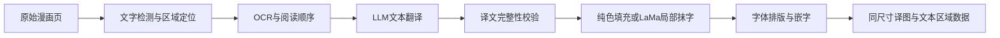

# 常规漫画翻译开源方案调研

2026-09-14 候选调研，以下比较保留当时结论，不代表当前依赖或许可核验。当前实现为 [classic-engine](../services/classic-engine/README.md) 的 NCNN/Vulkan 流水线，抹字使用 AOT-GAN；用户允许 LaMa 仍是产品边界，不代表当前实现采用 LaMa。实际组件、权重与许可见[第三方清单](../services/classic-engine/THIRD_PARTY.md)。

## 1. “常规翻译”的技术边界

- **常规翻译 `classic`（建议内部标识）**：检测、OCR、文本 LLM、掩膜内填充／LaMa 修复和字体嵌字分别执行，不依赖整页图片编辑服务完成翻译。
- **AI 重绘 `redraw`（现有标识）**：继续走现有图片编辑供应商。现有界面名称是“AI 翻译”；增加模式时建议明确显示为“AI 重绘翻译”。
- LaMa 属于学习式图像修复，已获用户同意，用于重建文字掩膜内背景。不要称它为“完全不用 AI 处理图像”。常规模式默认采用已确认的 LaMa 路线；Stable Diffusion、FLUX 等其他图像生成方案不随之自动加入。
- “不用 AI 生图”并不意味着不用 OCR 模型或 LLM，也不意味着无需服务器算力。

## 2. 候选项目与成熟度

以下信息来自调研当天的 GitHub 官方仓库、API 和固定提交源码。关注量仅说明生态规模；发布历史、调用入口、模块边界和故障行为更影响本项目接入。最近发布条目与被核查的分支提交不是同一概念，不将分支新增能力自动归入旧版发布包。

| 项目 | 已核实的能力与适用场景 | 接入代价／局限 | 本项目定位 |
| --- | --- | --- | --- |
| [manga-image-translator](https://github.com/zyddnys/manga-image-translator) | 2021 年创建，约 10.4k stars；Python；完整漫画处理链，CLI、Docker、HTTP API；自定义兼容 LLM 端点 | 已有 LaMa。内部重试、日志和结果判定需接入平台规则，不能直接作为公开业务后端 | **后端引擎首选验证对象**，模块复用便于与现有 Python worker 对接 |
| [BallonsTranslator](https://github.com/dmMaze/BallonsTranslator) | 2022 年创建，约 5.1k stars；Python／Qt；自动翻译、富文本校对、掩膜编辑；支持 headless 批处理；LLM 上下文和术语表 | 桌面工程与项目目录配置仍需隔离；日译中竖排在 README 中明确列为待改善。支持 LaMa，也有 OpenCV、PatchMatch | **效果对照与备选引擎**；需要人工校对时更值得优先试用 |
| [comic-translate](https://github.com/ogkalu2/comic-translate) | 2024 年创建，约 2.9k stars；日漫、韩漫、欧美漫画，多种 OCR、LLM 与自定义兼容接口；自动／手动模式、条漫处理 | 主流水线构造依赖 `main_page`，与桌面状态耦合；LaMa 已有，主要额外工作是服务化 | **多语言／韩漫备选**；其格式支持不自动扩大 Node Comics 导入范围 |
| [Koharu](https://github.com/koharu-rs/koharu) | 2025 年创建，约 5.6k stars；Rust／Tauri；分阶段处理、本地与远程 LLM、多语言排版和校对 | 当前应用接口为 Tauri 命令；已有独立 pipeline crate，但接 Python 服务仍需封装，且抹字模型路线含生成式修复 | **持续观察的替代引擎**；当前团队栈下不是最短接入路径 |

版本快照如下；完整 SHA、官方 API 来源和被读取文件的 SHA-256 见 [调研证据](evidence/classic-research-2026-09-14.json)。这些是调研复现信息，不表示已引入依赖。

| 项目 | 核查分支与提交 | 提交日期（UTC） | 最近发布条目 |
| --- | --- | --- | --- |
| manga-image-translator | `main` / `95227a2bb0fd` | 2026-07-20 | [beta-0.3](https://github.com/zyddnys/manga-image-translator/releases/tag/beta-0.3)，2022-04-23；发布条目较旧，PoC 应固定本次提交，不用浮动 `main` 镜像 |
| BallonsTranslator | `dev` / `84ba500ea1a4` | 2026-09-12 | [v1.5.15](https://github.com/dmMaze/BallonsTranslator/releases/tag/v1.5.15)，2026-09-08 |
| comic-translate | `main` / `8977b91a4f7a` | 2026-09-10 | [v2.8.9](https://github.com/ogkalu2/comic-translate/releases/tag/v2.8.9)，2026-09-11 |
| Koharu | `main` / `5ab47ee738c9` | 2026-09-13 | [0.82.1](https://github.com/koharu-rs/koharu/releases/tag/0.82.1)，2026-09-11 |

### 决定接入方式的源码发现

**manga-image-translator：**

- HTTP 层已有 `/translate/with-form/image`、JSON 与批次入口，证明具备程序化调用基础；这些是上游接口，不是 Node Comics 新的公开 API。[服务端源码](https://github.com/zyddnys/manga-image-translator/blob/95227a2bb0fd306cd4f0c104d57284026f991b3a/server/main.py)
- `InpainterConfig` 默认 `lama_large`；`none` 把掩膜覆盖像素设为白色，`original` 返回未抹字副本。因此 `none` 适合白底试验，不能当成通用背景修复；`original` 也不会去除旧文字。[配置](https://github.com/zyddnys/manga-image-translator/blob/95227a2bb0fd306cd4f0c104d57284026f991b3a/manga_translator/config.py)、[none 实现](https://github.com/zyddnys/manga-image-translator/blob/95227a2bb0fd306cd4f0c104d57284026f991b3a/manga_translator/inpainting/none.py)、[original 实现](https://github.com/zyddnys/manga-image-translator/blob/95227a2bb0fd306cd4f0c104d57284026f991b3a/manga_translator/inpainting/original.py)
- `custom_openai.py` 有超时重新发起请求、服务端错误重试及完整 prompt 的 debug 日志。文本 LLM 可保留自动重试，但应由 Node Comics 统一控制次数、预算、用量、未知成本和日志，避免上游库／SDK／队列叠加重试。[LLM 适配源码](https://github.com/zyddnys/manga-image-translator/blob/95227a2bb0fd306cd4f0c104d57284026f991b3a/manga_translator/translators/custom_openai.py)
- 开启 `ignore_errors` 时，OCR 失败可回退为空列表，渲染失败可回退到抹字图。接入时必须关闭这种错误吞并，区分“真的无文字”和“阶段失败”，防止把原图或只有抹字的图片判为交付成功。[处理流水线](https://github.com/zyddnys/manga-image-translator/blob/95227a2bb0fd306cd4f0c104d57284026f991b3a/manga_translator/manga_translator.py)

**BallonsTranslator：**

- README 给出 `python -m ballontranslator --headless --exec_dirs ...`，不能简单归类为“只有 GUI”。不过配置依赖项目配置文件，仍要验证并发目录隔离、Qt 无显示环境和固定 DPI 的渲染一致性。[固定提交说明](https://github.com/dmMaze/BallonsTranslator/blob/84ba500ea1a4f523ca79f1c77d8c642eea3d1d07/README.md)
- 代码中 `opencv-tela` 实际调用 `cv2.INPAINT_NS`，并非名称容易让人联想到的 Telea；另有 `patchmatch`。PoC 记录实际算法，不能只记录界面名称。[抹字实现](https://github.com/dmMaze/BallonsTranslator/blob/84ba500ea1a4f523ca79f1c77d8c642eea3d1d07/ballontranslator/modules/inpaint/inpaint_default.py)
- 当前 LLM 路径已有按文本块 ID 校验完整译文、历史上下文和术语表的设计，GUI 与 headless 共用。它很适合做翻译契约参考，但仍要按本项目的计量规则控制重试。[LLM 契约说明](https://github.com/dmMaze/BallonsTranslator/blob/84ba500ea1a4f523ca79f1c77d8c642eea3d1d07/doc/modules/llm_translator.md)

**另外两项：** comic-translate 的 `ComicTranslatePipeline(main_page)` 将多个 handler 绑定到桌面页面状态；Koharu 的 pipeline 已能逐阶段提交结果，耐久化由调用方的 `Committer` 承担，其完整应用使用 Tauri IPC。这些都是可复用能力，但不能视为已有与当前后端即插即用的服务。[comic-translate 流水线](https://github.com/ogkalu2/comic-translate/blob/8977b91a4f7a40c3917c5a268e9e7d78e1d818da/pipeline/main_pipeline.py)、[Koharu pipeline](https://github.com/koharu-rs/koharu/blob/5ab47ee738c9faa1e03f764bf93e850dcaa1149e/crates/koharu-pipeline/README.md)、[Koharu 应用边界](https://github.com/koharu-rs/koharu/blob/5ab47ee738c9faa1e03f764bf93e850dcaa1149e/crates/koharu/README.md)

## 当前接入与后续验证

中心受理与整页租约见[计算协议](COMPUTE_PROTOCOL.md)，文本协议、RPM、计量和有界自动重试见[文本供应商](TRANSLATION_PROVIDERS.md)。文本成本仅计量，不设页成本调用上限。

历史样张不能代表自然漫画质量。更换引擎仍需同样本检查漏译、OCR、背景修复、缺字、换行与气泡溢出，并记录实际模型、权重、字体与许可；质量工具见[引擎质量说明](../services/classic-engine/docs/QUALITY.md)。
