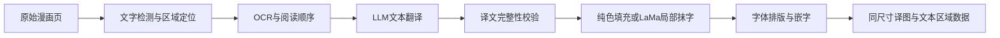

# 常规漫画翻译开源方案调研

调研日期：2026-09-14。用户确认：保留现有 AI 重绘，增加常规漫画翻译；文本可交给 LLM，允许 LaMa 局部抹字修复；低成本 LLM 的费用保护可简化为预算内自动重试。本轮按用户要求不评估许可证。

**建议优先采用 manga-image-translator 的检测／OCR／LaMa／嵌字模块，由 Node Comics 管理文本 LLM 调用；用 BallonsTranslator 做同样本效果对照与备选。** 两者都已有完整链路，允许 LaMa 后可直接验证常用修复方案，无需先自行实现通用抹字。最终采用哪个引擎，仍需真实漫画对比，不能仅凭项目演示确定。

后续实现更新：首版常规链路已接入，运行与验证状态见[常规翻译实现](CLASSIC_IMPLEMENTATION.md)。以下保留调研当时的方案状态及待验证建议。

本次调研交付是联网调研、关键源码核查和接入设计。没有安装推理依赖、下载模型权重、调用收费模型或修改运行代码；下述新接口、配置和处理阶段均未实现。当前可运行功能仍只有 `redraw`。

## 1. “常规翻译”的技术边界



- **常规翻译 `classic`（建议内部标识）**：检测、OCR、文本 LLM、掩膜内填充／LaMa 修复和字体嵌字分别执行，不依赖整页图片编辑服务完成翻译。
- **AI 重绘 `redraw`（现有标识）**：继续走现有图片编辑供应商。现有界面名称是“AI 翻译”；增加模式时建议明确显示为“AI 重绘翻译”。
- LaMa 属于学习式图像修复，已获用户同意，用于重建文字掩膜内背景。不要称它为“完全不用 AI 处理图像”。常规模式默认采用已确认的 LaMa 路线；Stable Diffusion、FLUX 等其他图像生成方案不随之自动加入。
- “不用 AI 生图”并不意味着不用 OCR 模型或 LLM，也不意味着无需服务器算力。

## 2. 候选项目与成熟度

以下信息来自调研当天的 GitHub 官方仓库、API 和固定提交源码。关注量仅说明生态规模；发布历史、调用入口、模块边界和故障行为更影响本项目接入。最近发布条目与被核查的分支提交不是同一概念，不将分支新增能力自动归入旧版发布包。

| 项目 | 已核实的能力与适用场景 | 接入代价／局限 | 本项目定位 |
| --- | --- | --- | --- |
| [manga-image-translator](https://github.com/zyddnys/manga-image-translator) | 2021 年创建，约 10.4k stars；Python；完整漫画处理链，CLI、Docker、HTTP API；自定义兼容 LLM 端点 | 已有 LaMa。内部重试、日志和结果判定需接入平台规则，不能直接作为公开业务后端 | **后端引擎首选验证对象**，模块复用便于与现有 Python worker 对接 |
| [BallonsTranslator](https://github.com/dmMaze/BallonsTranslator) | 2022 年创建，约 5.1k stars；Python／Qt；自动翻译、富文本校对、掩膜编辑；支持 headless 批处理；LLM 上下文和术语表 | 桌面工程与项目目录配置仍需隔离；日译中竖排在 README 中明确列为待改善。支持 LaMa，也有 OpenCV、PatchMatch | **效果对照与备选引擎**；需要人工校对时更值得优先试用 |
| [comic-translate](https://github.com/ogkalu2/comic-translate) | 2024 年创建，约 2.9k stars；日漫、韩漫、欧美漫画，多种 OCR、LLM 与自定义兼容接口；自动／手动模式、条漫处理 | 主流水线构造依赖 `main_page`，与桌面状态耦合；LaMa 已有，主要额外工作是服务化 | **多语言／韩漫备选**；其格式支持不自动扩大 Node Comics 导入范围 |
| [Koharu](https://github.com/koharu-rs/koharu) | 2025 年创建，约 5.6k stars；Rust／Tauri；分阶段处理、本地与远程 LLM、多语言排版和校对 | 当前应用接口为 Tauri 命令；已有独立 pipeline crate，但接 Python 服务仍需封装，且抹字模型路线含生成式修复 | **持续观察的替代引擎**；当前团队栈下不是最短接入路径 |

版本快照如下；完整 SHA、官方 API 来源和被读取文件的 SHA-256 见 [调研证据](evidence/classic-research-2026-09-14.json)。这些是调研复现信息，不表示已引入依赖。

| 项目 | 核查分支与提交 | 提交日期（UTC） | 最近发布条目 |
| --- | --- | --- | --- |
| manga-image-translator | `main` / `95227a2bb0fd` | 2026-07-20 | [beta-0.3](https://github.com/zyddnys/manga-image-translator/releases/tag/beta-0.3)，2022-04-23；发布条目较旧，PoC 应固定本次提交，不用浮动 `main` 镜像 |
| BallonsTranslator | `dev` / `84ba500ea1a4` | 2026-09-12 | [v1.5.15](https://github.com/dmMaze/BallonsTranslator/releases/tag/v1.5.15)，2026-09-08 |
| comic-translate | `main` / `8977b91a4f7a` | 2026-09-10 | [v2.8.9](https://github.com/ogkalu2/comic-translate/releases/tag/v2.8.9)，2026-09-11 |
| Koharu | `main` / `5ab47ee738c9` | 2026-09-13 | [0.82.1](https://github.com/koharu-rs/koharu/releases/tag/0.82.1)，2026-09-11 |

### 决定接入方式的源码发现

**manga-image-translator：**

- HTTP 层已有 `/translate/with-form/image`、JSON 与批次入口，证明具备程序化调用基础；这些是上游接口，不是 Node Comics 新的公开 API。[服务端源码](https://github.com/zyddnys/manga-image-translator/blob/95227a2bb0fd306cd4f0c104d57284026f991b3a/server/main.py)
- `InpainterConfig` 默认 `lama_large`；`none` 把掩膜覆盖像素设为白色，`original` 返回未抹字副本。因此 `none` 适合白底试验，不能当成通用背景修复；`original` 也不会去除旧文字。[配置](https://github.com/zyddnys/manga-image-translator/blob/95227a2bb0fd306cd4f0c104d57284026f991b3a/manga_translator/config.py)、[none 实现](https://github.com/zyddnys/manga-image-translator/blob/95227a2bb0fd306cd4f0c104d57284026f991b3a/manga_translator/inpainting/none.py)、[original 实现](https://github.com/zyddnys/manga-image-translator/blob/95227a2bb0fd306cd4f0c104d57284026f991b3a/manga_translator/inpainting/original.py)
- `custom_openai.py` 有超时重新发起请求、服务端错误重试及完整 prompt 的 debug 日志。文本 LLM 可保留自动重试，但应由 Node Comics 统一控制次数、预算、用量、未知成本和日志，避免上游库／SDK／队列叠加重试。[LLM 适配源码](https://github.com/zyddnys/manga-image-translator/blob/95227a2bb0fd306cd4f0c104d57284026f991b3a/manga_translator/translators/custom_openai.py)
- 开启 `ignore_errors` 时，OCR 失败可回退为空列表，渲染失败可回退到抹字图。接入时必须关闭这种错误吞并，区分“真的无文字”和“阶段失败”，防止把原图或只有抹字的图片判为交付成功。[处理流水线](https://github.com/zyddnys/manga-image-translator/blob/95227a2bb0fd306cd4f0c104d57284026f991b3a/manga_translator/manga_translator.py)

**BallonsTranslator：**

- README 给出 `python -m ballontranslator --headless --exec_dirs ...`，不能简单归类为“只有 GUI”。不过配置依赖项目配置文件，仍要验证并发目录隔离、Qt 无显示环境和固定 DPI 的渲染一致性。[固定提交说明](https://github.com/dmMaze/BallonsTranslator/blob/84ba500ea1a4f523ca79f1c77d8c642eea3d1d07/README.md)
- 代码中 `opencv-tela` 实际调用 `cv2.INPAINT_NS`，并非名称容易让人联想到的 Telea；另有 `patchmatch`。PoC 记录实际算法，不能只记录界面名称。[抹字实现](https://github.com/dmMaze/BallonsTranslator/blob/84ba500ea1a4f523ca79f1c77d8c642eea3d1d07/ballontranslator/modules/inpaint/inpaint_default.py)
- 当前 LLM 路径已有按文本块 ID 校验完整译文、历史上下文和术语表的设计，GUI 与 headless 共用。它很适合做翻译契约参考，但仍要按本项目的计量规则控制重试。[LLM 契约说明](https://github.com/dmMaze/BallonsTranslator/blob/84ba500ea1a4f523ca79f1c77d8c642eea3d1d07/doc/modules/llm_translator.md)

**另外两项：** comic-translate 的 `ComicTranslatePipeline(main_page)` 将多个 handler 绑定到桌面页面状态；Koharu 的 pipeline 已能逐阶段提交结果，耐久化由调用方的 `Committer` 承担，其完整应用使用 Tauri IPC。这些都是可复用能力，但不能视为已有与当前后端即插即用的服务。[comic-translate 流水线](https://github.com/ogkalu2/comic-translate/blob/8977b91a4f7a40c3917c5a268e9e7d78e1d818da/pipeline/main_pipeline.py)、[Koharu pipeline](https://github.com/koharu-rs/koharu/blob/5ab47ee738c9faa1e03f764bf93e850dcaa1149e/crates/koharu-pipeline/README.md)、[Koharu 应用边界](https://github.com/koharu-rs/koharu/blob/5ab47ee738c9faa1e03f764bf93e850dcaa1149e/crates/koharu/README.md)

## 3. 推荐的模块组合

| 阶段 | 首次验证建议 | 关键限制与验收 |
| --- | --- | --- |
| 检测与掩膜 | 对比 manga-image-translator 的默认检测器与 CTD；复用文字行、文本块、方向和掩膜 | 文本框矩形不等于文字像素掩膜；必须保护气泡边框、人物线条和注音。CTD 是漫画检测组件，不是完整翻译器。[CTD 官方仓库](https://github.com/dmMaze/comic-text-detector) |
| 日文 OCR | 对比内置 `48px` 与 `mocr`；分别记录识别和颜色提取结果 | Manga OCR 面向日文，支持竖排、横排及带注音的漫画文本，但可能在无字区域生成看似合理的文字；必须先检测，再识别，不能用 OCR 是否返回字符串判断有无文字。[Manga OCR](https://github.com/kha-white/manga-ocr) |
| 其他源语言 OCR | 英文先测内置 OCR；多语言需求再比较 PaddleOCR 的具体识别模型 | PaddleOCR 是检测／识别组件，不提供整套漫画抹字、阅读顺序和嵌字。不能从支持语言列表推导漫画准确率。[PaddleOCR](https://github.com/PaddlePaddle/PaddleOCR) |
| 文本翻译 | Node Comics 自建可配置 LLM 文本适配器，支持兼容聊天协议 | 按页组织有序文本块，返回固定 ID 映射。供应商、模型和用量独立于 `images/edits`；不把图片供应商可用当成文本模型可用 |
| 抹字 | 优先验证引擎内置 LaMa；高置信纯色气泡可用背景色填充节省推理，OpenCV／PatchMatch 为低资源备选 | LaMa 仅回填掩膜内区域。复杂网点、拟声词覆盖人物、渐变底色仍可能失真；不能承诺恢复被遮住的真实原画。[LaMa 原项目](https://github.com/advimman/lama)、[漫画微调权重](https://huggingface.co/dreMaz/AnimeMangaInpainting)、[OpenCV](https://docs.opencv.org/4.13.0/df/d3d/tutorial_py_inpainting.html) |
| 嵌字 | 优先复用成熟引擎的排版，固定字体、字号下限、描边和渲染配置 | 检查中日韩字形、竖排标点、长句溢出和气泡边界；Manga OCR 不负责排版。失败区域保留原文并标记，不能先擦字再丢失译文 |

优先验证日文→简体中文、英文→简体中文，作为选型样本组合；这不是对首批全部语言范围的新增承诺。韩漫、彩色条漫若成为优先目标，再提高 comic-translate 与对应 OCR 的评测权重。

**保画面策略（待实现）：** 在统一解码、保持原尺寸的 RGB/RGBA 图像上处理；最终仅合成已成功翻译区域的擦除掩膜及译文字形区域，其他像素使用原图。输出 PNG，避免重新压缩 JPEG 导致全图像素变化。对难以可靠清理的区域保留原图、标出未处理原因，必要时提供译文文本查看；不自动切换到 AI 重绘。正常无字页直接返回 `no_text`，不调用 LLM。

## 4. LLM 翻译如何组织

LLM 默认只接收 OCR 文本、目标语言和有界文本上下文。整页内按阅读顺序批量翻译，避免每个气泡一次请求导致语境缺失与请求数上升；超过 token 上限时按有序小组拆分。

内部契约示意，尚非已实现 API：

```json
{
  "target_language": "zh-Hans",
  "segments": [
    {"id": "b001", "source": "待翻译文本一"},
    {"id": "b002", "source": "待翻译文本二"}
  ],
  "glossary": []
}
```

```json
{
  "translations": [
    {"id": "b001", "text": "译文一"},
    {"id": "b002", "text": "译文二"}
  ]
}
```

- 模型不得增删 ID、串接气泡或执行漫画文字中的指令；文本是待翻译数据。限制响应大小，校验 ID 集合、重复 ID、值类型、空译文及输出长度。接口支持结构化输出时启用，兼容接口仍须本地校验。
- 首版以同页上下文为主。术语表可作为固定配置快照；跨页历史若引入，只使用同用户、同章节、确定可用的有界快照并纳入缓存，不阻塞后页等待某一失败页。
- JSON 解析失败、缺块、明显截断、OCR 失败分别记录。文本响应格式修复可在统一重试预算内自动完成，保留每次调用用量；不要把修复当成免费操作或重复向读者扣整页点数。
- LLM 已成功、抹字／嵌字失败时，复用已保存的文本结果重新执行本地阶段。文本调用超时允许在成本上限内重试，旧调用仍保留未知成本；图片重绘继续使用严格的 `outcome_unknown` 规则。具体策略见第 6 节。
- 默认不向文本 LLM 发送页面图像；以后若加入视觉辅助，需要独立能力配置和实测，不能与纯文本链路混记消耗。

## 5. 对 Node Comics 的接入设计

### 已核实的工程现状

现有前端 `Mode` 只有 `redraw`；后端请求类型、`configuration()`、能力列表也只接受 `redraw`。`process_job()` 直接调用图片编辑适配器，Celery 路由固定到 `redraw`。已有按用户、内容、模式、语言、配置版本的缓存、批次预算、持久任务和私有图片存储，可沿用业务框架，不能仅增加一个前端按钮。

### 待实现改动

| 位置 | 必要改动 |
| --- | --- |
| [前端类型](../apps/extension/src/types.ts)、[阅读器](../apps/extension/src/reader/Reader.tsx)、[任务入口](../apps/extension/src/App.tsx) | 增加 `classic`；选择翻译方式；原图／常规译图／重绘译图独立对照与版本切换；自动翻译和预算绑定所选模式并保持阅读位置 |
| [后端 API](../backend/app/main.py)、[响应类型](../backend/app/schemas.py)、[配置](../backend/app/providers.py) | 扩展 capabilities、报价及任务模式；建议增加 `POST /v1/translations/classic`，保留原 `redraw` 接口；文本供应商配置与图片供应商能力分开，密钥继续留后端 |
| [worker](../backend/app/workers.py)、[dispatcher](../backend/app/dispatcher.py) | 按模式调度；增加检测、OCR、文本调用、抹字、嵌字、验证阶段；区分本地阶段失败与上游结果未知；取消／恢复按阶段处理 |
| [数据模型](../backend/app/models.py)、[任务与计量](../backend/app/jobs.py) | 持久化文本块／掩膜／译文／阶段产物引用；每次外部调用单独记录意图、request ID、usage 和成本状态，避免多个分组调用覆盖同一个 Attempt 用量 |
| 部署与资源 | 单独的常规引擎进程／容器和队列，复用现有 API、PostgreSQL 与私有存储；模型常驻，限制图片像素与并发。API 进程不直接加载推理依赖 |
| 结果访问与清理 | OCR 文本和中间图与原图同样按用户授权；原图删除／到期时同步失效和清理，禁止跨用户缓存和全局上下文混用 |

建议运行关系：`插件 → 现有 API／报价／任务 → classic worker → 检测与 OCR 引擎 → 文本 LLM 适配器 → 抹字与嵌字引擎 → 私有结果`。引擎负责图像处理，Node Comics 拥有任务、费用、权限和版本。首个 PoC 可直接用上游 CLI／HTTP 做效果基线，正式接入使用阶段适配器与持久化中间结果。

缓存和报价快照至少覆盖：用户、原图内容、`classic` 模式、目标语言、检测／OCR 模型与权重版本、源语言路由、掩膜配置、抹字算法、文本模型与提示词版本、上下文／术语表摘要、字体与渲染配置。修改任一影响结果的配置，需要产生新配置版本；不同翻译模式不能共享最终译图缓存。

现有一次图片调用的 Attempt 语义需要扩展：本地检测崩溃可从检查点恢复；文本调用可以消耗有限重试预算，图片重绘的未知请求停止自动重发；本地阶段恢复复用成功文本，不再次调用 LLM。业务点数仍按已确认报价及页面交付结算，供应商 token 和本地推理资源成本分开记录。

常规翻译预期更少改变画面，费用由文本 LLM、检测／OCR／LaMa 的计算资源及存储组成。**本轮没有相同样本下的耗时或显存实测，下面的 token 账单测算与算力假设不能当成端到端实测成本。** CPU 可作小样本路线，吞吐量方案须实测后决定。

## 6. 成本告知与 LLM 重试优化

### LaMa 的成本

LaMa 使用下载的权重在自己的 CPU／GPU 上运行，不需要按图片付费给图片生成 API。[官方推理说明](https://github.com/advimman/lama#inference)提供 CPU 和 GPU 运行方式。这里建议复用候选引擎中的推理实现和漫画权重，不单独搭建上游完整训练环境。

- 自有设备：新增成本是电费、设备折旧与占用；OCR、检测和 LaMa 可共享推理硬件。
- 云端部署：主要是 CPU／GPU 实例运行时长，包含模型加载、空闲和失败处理，另计存储与流量；并非零成本。
- 统一分摊公式：`计算资源成本／页 = 实例元／小时 × 实测忙碌秒／页 ÷ 3600 ÷ 有效利用率`。这里秒／页统计检测、OCR、LaMa 等本地处理；利用率须与计费时段一致，也可以直接用当期实例账单除以成功交付页数。
- **纯算术示例，不是硬件报价或性能结论：** 假设实例 3 元／小时、每页占用 5 秒，充分利用时约 0.0042 元／页，即 100 页约 0.42 元；有效利用率只有 10% 时，100 页约 4.17 元。实际成本必须代入选定实例和样本耗时，避免忽略空闲计费。

### 文本 LLM 的成本示例

以 2026-09-14 查询的 DeepSeek 官方 `deepseek-flash`（DeepSeek-V4.1-Flash）人民币价格作为示例，不代表已选定供应商或验证翻译质量。**缓存未命中输入：空闲 1 元／百万 token、高峰 2 元；输出：空闲 4 元／百万 token、高峰 8 元。** 高峰为北京时间工作日 9–12 点及 14–18 点。[官方价目表](https://api-docs.deepseek.com/zh-cn/quick_start/pricing/)

假设每页总输入 1,500 token（含指令、上下文和 OCR），总计费输出 500 token：

| 情形 | 每页文本费用 | 100 页文本费用 |
| --- | --- | --- |
| 空闲价、一次调用 | 0.0035 元 | 0.35 元 |
| 高峰价、一次调用 | 0.007 元 | 0.70 元 |
| 每页发生两次额外等量重试，合计三次 | 0.0105–0.021 元 | 1.05–2.10 元 |

这是基于假定 token 的测算，未包含本地推理、存储、流量、长上下文或额外思考 token。建议为常规翻译显式配置非思考模式并限制输出；若启用思考，按供应商实际计费 token 计算。价格以实际调用时配置的供应商和价目版本为准，不把 `flash` 名称长期绑定为当前版本。

### 简化后的保护策略（建议起点，待实现）

| 情况 | 自动处理 | 成本与交付 |
| --- | --- | --- |
| 文本 LLM 429／暂时性 5xx／超时 | 遵守 Retry-After 或退避；默认最多额外 2 次；超时重试前结束本地等待并记录原调用状态 | 无需逐次确认；未知调用按请求输入及输出上限保守占用内部成本预算，不能按零费用释放 |
| 缺少文本块／JSON 错误／响应截断 | 优先本地解析校验，可自动修复或重译；与网络错误共用重试次数和预算 | 记录每次真实调用，读者只按同一页最终交付结算一次 |
| LLM 成功、LaMa／嵌字失败 | 复用已保存译文，重跑必要本地阶段 | 不重发成功的 LLM 请求；继续记录本地计算耗时 |
| 鉴权失败／余额不足／不支持模型 | 不重复尝试相同无效配置；返回可操作错误 | 不消耗无意义的重试次数 |
| 达到文本重试次数、总时限或金额上限 | 停止该页自动调用，其余页继续 | 已知失败显示失败；仍有无法核实的请求时保留未知成本状态，普通文本故障无需逐页人工核实 |
| 图片重绘调用后结果未知 | 保留现有严格规则，不自动重发 | 与低成本文本 LLM 区分 |

建议运营配置起点为**单页 LLM 成本上限 0.05 元**，覆盖该页所有分组、格式修复和未知请求的保守预占；每个分组最多 3 次调用。100 页对应最多 5 元文本成本预算。此为可配置的内部限额，不是产品售价或实测平均成本；若正常请求的预估上限已超限，在调用前拒绝或使用已配置的较小文本组。

所有调用先原子占用该页／批次成本预算，再发送；限制输入和输出 token，金额不足时不能启动下一次调用。关闭或纳管 SDK 自带重试，防止叠加超过限额。备用文本供应商仅在预先配置、同一预算内切换，不自动升级到更贵的模型；长任务跨高峰时段时采用上界费率或冻结的保守报价。

重复队列投递不能触发新业务调用；故障重试是有意创建的子调用。晚到结果与重试结果通过同一任务的原子状态竞争，只交付和结算一次；所有实际供应商消耗仍保留。这样可以接受小额 LLM 重复成本，同时保持业务幂等。

面向读者只需在任务开始展示页数、模式和总点数／预算，内含平台承担的有限文本重试；无需暴露每次技术重试。运营端区分已知文本费用、未知预占、重试次数和计算资源摊销。点数与人民币成本不能混为一项。

## 7. 最小效果验证方案

以下是下一步可执行的验证设计，不是已经通过的测试。

1. 固定两套候选提交、模型／字体文件和配置，使用隔离容器及私有样本目录；确认抹字采用已允许的 LaMa 或纯色填充，未误用整页图片生成服务。模型版本与掩膜策略分别记录。
2. 准备 24 页代表样本，每类 4 页：日文白底竖排、英文白底横排、日文注音／小字、灰度网点／非白气泡、彩色复杂背景、无字／低清／倾斜等边界。已有原创英文示例可作烟雾样本，不能代替日漫评测；已有 MOBI 页只在私有目录使用。
3. 第一轮仅对比检测与 OCR，人工标注阅读顺序、漏检／误检、文本错误；第二轮使用相同已校验译文对比抹字与嵌字；最后在相同文本模型／提示词下验证端到端效果。这样可区分 OCR、翻译与渲染造成的问题。
4. 每页保存原图、检测／掩膜、OCR 和译文结构、清理图、最终图、配置摘要及各阶段耗时，作为私有证据。公开报告只记统计和脱敏失败原因。
5. 冷启动与模型常驻分别记录耗时、峰值 RAM／VRAM、LLM 输入输出 token、重试／未知次数；在相同硬件和分辨率下比较。

| 验收维度 | 建议门槛／观察方式 |
| --- | --- |
| 文本正确性 | 手工记录检测召回、误检、OCR 字符错误、漏译、错译、阅读顺序和术语一致性；分别报告不同页面类别，不用一个总分掩盖失败类别 |
| 译文契约 | 所有交付块 ID 完整且唯一，无供应商说明文字混入译文；缺块和截断不能判为完整成功 |
| 抹字与画面 | 同尺寸；在规范化像素上，擦除与译文绘制区域外像素一致；无人物线条误擦、气泡边框破坏；复杂背景保留处理失败标记 |
| 排版可读性 | 正常对白无截断、无气泡外溢、无缺字方框；最低字号规则固定；复杂页允许保留原文并明确说明未完成区域 |
| 无字与故障 | 真正无字不调用 LLM；OCR 异常、渲染异常不可伪装成无字或成功；某页失败不阻塞其余页 |
| 业务恢复 | 重复提交／队列投递只结算一次；LLM 成功后渲染恢复不重发 LLM；覆盖文本超时／格式修复的预算内重试、预算耗尽、并发预占、旧结果晚到与跨供应商用量；图片重绘未知请求保持停止重发 |
| 阅读器与权限 | Chrome／Edge 实测模式切换、语言版本、位置恢复、加载和失败状态；不同用户、原图删除与过期同时覆盖中间产物 |

选型顺序建议：先比较 manga-image-translator 与 BallonsTranslator；若后者在目标样本的排版或抹字明显更好且 headless 稳定，就替换图像引擎适配器；若都达不到要求，再替换局部 OCR／检测模块。不要一开始自行重写整套检测、识别和排版。

尚待实测或产品决定：首批源语言、复杂背景的可接受降级、是否需要人工文本编辑、部署硬件与并发、点数定价。常规模式的需求已确认，这些待定项不影响本轮调研结论。
