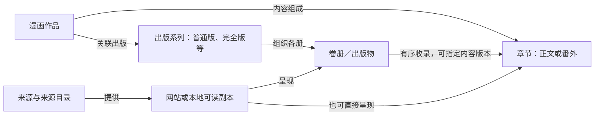

# 通用漫画作品管理设计

2026-09-22：本文转为 **2026-09-14 旧模型的历史设计依据**，下文“当前”“已实现”和后续范围均属于当时状态。本地源文件、来源 / 格式解耦与简化 `Work → ReadingUnit → Document` 已按[来源与缓存架构](COMIC_SOURCE_ARCHITECTURE.md)替换，实际模块和验收见[新实施记录](COMIC_SOURCE_IMPLEMENTATION.md)。出版套系、收录、再版与作品关系管理已删除；本文不再定义当前数据库和 UI。

日期：2026-09-14。状态：**用户已确认方案并授权实现；首轮功能已实现，不兼容旧数据，不编写任何兼容代码。** 当前实现与验收范围见[实现记录](COMIC_LIBRARY_IMPLEMENTATION.md)，下文的后续范围仍保持待实现。

适用于本地漫画文件、网页漫画来源及后续适配器。MangaCopy 是来源之一，参见[MangaCopy 来源适配](MANGACOPY_LIBRARY_DESIGN.md)。本文件是作品管理、关系和交互的主设计；源站分类不能定义核心漫画模型。

## 1. 行业依据与设计取舍

日本文化厅MADB的实际漫画类定义包括漫画作品、漫画单行本系列、漫画单行本、漫画杂志、杂志各号、刊载履历、内容细目和所藏信息。它已经区分“创作内容、出版组织、具体出版物与所藏”，不是网站文件夹结构。[MADB类定义](https://mediag.bunka.go.jp/madb_lab/about-db/schema-guide/)

其较早的建库指南说明：同一漫画可有普通版、文库版、爱藏版等不同单行本系列，需要在作品和单册之间记录各版的全卷集合。这是实际编目实践的依据，不声称历史数据库表结构与今天的MADB模式完全相同。[文化厅建库指南，印刷页43](https://www.bunka.go.jp/seisaku/geijutsubunka/media_art/pdf/media_arts_db_guideline.pdf)

其他直接依据：

- 国际ISBN机构区分语言、版本、出版形式和多卷作品中的各册身份；ISBN不能作为跨版本的作品ID。扫描文件换格式也不能自行生成“新ISBN”。[ISBN分配说明](https://www.isbn-international.org/node/88)
- ONIX列举合订、修订、增补等版次特征；卷册的出版形式和正文内容性质不是同一个维度。[ONIX版本类型表](https://ns.editeur.org/onix/en/21)
- VIZ《One Piece》合订版第1册收录普通版第1—3卷，是“同一内容以不同卷册组织再出版”的实际例子。[出版社产品页](https://www.viz.com/manga-books/manga/one-piece-omnibus-edition-volume-1-0/product/2452)
- ComicInfo分别记录系列、册号、出版形式、语言、译者、扫描信息和故事篇章；其`Volume`还可能是美漫系列的某一轮刊行，不能机械对应日漫单行本的卷号。[ComicInfo维护者文档](https://github.com/anansi-project/comicinfo/blob/main/DOCUMENTATION.md)

以下类名、字段和界面是本项目据此做出的产品设计，并非声称逐项照搬某一标准、覆盖所有漫画业务或已经实现标准兼容。采取足够表达实际漫画内容与出版关系的模型，同时允许缺少元数据时先导入阅读。

## 2. 先分清这些名词

| 名词 | 在本设计中的含义 | 不应混淆的概念 |
| --- | --- | --- |
| 作品 | 一部具有独立创作身份的漫画，可为连载作品或独立短篇 | 网站条目、下载文件、同名作品或同一IP下所有外传 |
| 话／章 | 作品的一次章节内容，可独立连载，也可被卷册收录 | 文件、杂志的一整期、出版卷册 |
| 番外 | 章节内容的性质／角色；有些外传有独立作品身份 | 与“话”互斥的载体类型，或所有标题带“番外”的材料 |
| 单行本 | 独立成册出版的形式；可有一册或多册、可收录多话 | “只有一卷的漫画”、网站专属文件夹 |
| 卷／册 | 某出版系列中的具体册及其卷次；本项目用于成册单位 | 美漫系列刊行轮次、季、故事篇章，以及网站任意写出的“卷” |
| 版本 | 内容版本与出版版本需分开：译本／修订／彩色等内容差异，以及出版方／套系／版式等出版差异 | 每个网站自动成为一个版本、每次下载自动产生一个出版版本 |
| 来源 | 从何处获得目录、元数据或可读图片，如网站、本地文件 | 出版社、译者、作品所有者 |
| 可读副本 | 实际可打开的一份扫描件、电子文件或网页图片清单及其修订 | 独立作品或必然完整的一话／一卷 |

因此“话、卷、番外、单行本”不能做成一个互斥枚举。“番外第1话”同时是话与番外；“普通版第1卷”同时是单行本和第1册。整卷都收录番外也不冲突。

## 3. 核心管理对象和关系

### 3.1 内容与出版对象

| 管理类 | 解决的实际问题 | 建议保留的信息 |
| --- | --- | --- |
| `ComicWork` 漫画作品 | 不同版本、网站和文件归于哪个创作主体 | 本地稳定ID、主标题／别名、创作者及角色、原始语言、连载状态、外部标识 |
| `Chapter` 章节内容 | 某一话是谁，属于哪部作品 | 作品ID、标题、显示编号、编号体系、顺序；内容角色为正文／番外／未分类 |
| `ContentVersion` 内容版本 | 同一内容的不同译本、修订或黑白／彩色表达 | 所属作品或章节、语言、译者／制作者、修订／着色说明、可核实的版本依据；可以缺省 |
| `PublicationSeries` 出版系列／版本套系 | 某一套普通单行本、文库版、完全版等如何组织多册 | 套系名称、出版社／品牌、语言、版次说明、编号体系、关联作品；单册无套系时可缺省 |
| `Publication` 卷册／单期出版物 | 具体一本书或一期刊物是什么 | 所属出版系列或期刊、卷次／期号、标题、出版日期、ISBN等、出版形式、出版信息；电子成册出版同样可记录 |
| `ContentInclusion` 收录关系 | 哪些章节／作品被某册或某期收录，采用哪个版本 | 出版物ID、作品或章节ID、可选内容版本ID、收录顺序、可选印刷页范围、关系证据 |

章节与出版物通过收录关系关联，**一话可以被多本书收录，一本书也可以收录多部作品的内容**。已有卷册但不知道内部章节时，卷册仍然可用，不生成猜测的第1—N话。独立短篇可以作为作品直接被收录，不强行制造“第1话”。

如果出版社只说明“合订册收录原版第1—3卷”，以`PublicationRelation`保存出版物之间的合订／再版关系，先记录这些已知对应，不要求同时知道全部章节。只有进一步核实各册目录，才建立具体`ContentInclusion`；不同层级的收录与再版关系都不能出现自引用或循环。

内容版本不等于出版系列：一个译本可以有不同装帧或卷册组合，同一出版物也可能包含不同语言或制作者的内容。信息不足时保留未知，不从“其它汉化版”等网站标签自动创建已确认译本。

`PublicationSeries`不强制只关联一部作品，以容纳作者选集等情况。杂志一期属于`Periodical`期刊，不属于某一漫画作品；期刊和连载刊载记录作为真实领域扩展预留，首轮无需提供完整期刊管理界面。网络单话可直接关联章节与可读副本，无需伪造一本单行本。

图示是主要关系的简化；书架可以展示树形目录，但底层不将这些多对多关系压成单一路径。

### 3.2 来源与数字资源对象

| 对象 | 职责与边界 |
| --- | --- |
| `Source` 来源 | 网站适配器或本地文件来源；只定义发现、获取、重新解析和权限能力 |
| `SourceCatalog`／`SourceEntry` 来源目录与条目 | 原始分组、标题、类型、来源ID、顺序、采集时间与完整性；可以暂未映射到行业对象 |
| `ReadingCopy` 可读副本 | 一份有序图片清单／文件导入结果，可覆盖一话、一卷、整部独立作品或待整理材料；保存来源、修订、语言、扫描信息和可用状态 |
| `CopyCoverage` 副本覆盖关系 | 已核实的副本／副本页面范围对应哪个章节内容或出版物；支持一本CBZ覆盖多话、一个章节存在多个扫描件 |
| `PageAsset`／页序记录 | 图片字节与摘要、页面顺序和角色；同图重复出现保留不同页序槽位，字节可共享 |

来源身份用于判断“同一来源条目是否又导入了一次”，不能直接充当全局作品／章节身份。更换CDN地址不改变内容身份；确认同一内容时可以多来源关联，无法确认则保留候选与独立副本。

同一来源条目更新图片时产生副本清单修订，不能静默让旧位置、旧译图对应到新图。插件生成的译图属于`PageAsset`的派生结果，记录用户、模式、语言与配置版本；不自动登记成新的正式出版套系。

### 3.3 编号、附属内容和作品关系

- 显示编号保留字符串，如“0”“12.5”“前篇”“上册”“2026年第3期”；身份和顺序不用浮点编号计算。编号属于具体作品的连载序列、出版套系或期刊，各自有范围。
- “第2部／第2季”、故事篇章和阅读顺序不等于出版卷。明确由来源或用户建立时可用`StoryArc`或有序`ReadingList`关联；没有证据不从文件夹名自动建成行业关系。
- 番外漫画可以是`Chapter`的内容角色；封面、后记、广告、插画、特典附页先作为出版物附属内容或页面角色保存，不把所有非正文都伪造为一话。
- 续作、前传、独立外传、改编和同人作品具有独立身份时使用`WorkRelation`关联。与原作相关不代表是原作的一个版本；“番外”标签本身不足以判定身份。
- 私人收藏夹和书单属于用户组织工具，可以跨作品，不能改变真实出版或收录关系。

## 4. 元数据不全时如何可靠落地

字段保存来源、观察值和确认状态。源站原始名称／分类始终可追溯；核心字段区分“待确认、已由依据确认、用户指定”。出版方目录、ISBN记录、文件元数据和源站目录都是证据入口，冲突时展示差异，不靠多数票或标题猜测静默覆盖。

典型规则：

1. 只有一个文件名和200张图片：先保存可读副本，可建名称待确认的书架作品；卷号、章节和出版版本留空。能读，不冒充已完成行业编目。
2. 文件可靠元数据标明某作品普通版第3卷：映射到作品、出版系列和卷册，副本另存；同名网站条目仍要核对版本。
3. 来源同时给出“第3话”和“第1卷”但没有收录目录：分别记录，不猜第3话一定在第1卷。
4. 来源把“番外篇01”列在“话”中：保存原始标签；章节类型和内容角色分别处理，不能把`rawType=话`当成“必为正文”的依据。
5. 多个网站宣称同一作品：可提出归并候选；可靠标识、可核实内容对应或用户指定后才归并。相同ISBN指向出版物层，不能作为所有卷共用的作品ID。

与作品的归属尚不清楚的材料进入“待整理”，或以明确标记的候选关系展示；不强迫用户先填齐完整书目。不把来源目录中的“同人／其他系列”自动挂为原作品正文。

## 5. 通用管理界面和操作

### 5.1 书架

一部已确认作品一张卡片，显示封面、标题、最近阅读位置；“继续阅读”直接恢复当前副本。点击封面／标题进入作品管理。不同作品即使标题相同也可分别存在；同一作品多版本不重复铺成多张卡片。

2026-09-14 交互重做：书架与作品内容统一使用网格卡片。书架提供搜索与排序；章节、卷册和来源条目按用户选定顺序展示。日常页面不铺编辑表单；编辑、版本选择和关联在用户点开卡片操作后出现。

统计区分“正文已读12话”“持有普通版3册”“本机完整下载2册”；不把话数、卷数和副本数混为同一个进度。总话数未知时显示已知／已导入数量，不显示虚假的整部百分比。

### 5.2 作品详情

| 视图 | 用户看到的内容 | 关键操作 |
| --- | --- | --- |
| 章节 | 章节网格；正文／番外／未分类和阅读状态可筛选；同一章节的多个版本合并在卡片入口 | 阅读、排序、按需批量选择、标记已读、选择版本 |
| 卷册 | 直接显示卷册网格；不要求先创建或选择出版套系 | 选卷、阅读、排序、按需编辑已知出版信息与收录关系 |
| 版本与来源 | 副本网格；通过按需打开的版本卡片选择，选择状态与成功反馈同步 | 选择优先副本、纠正对应关系、检查来源更新、清理本地副本 |
| 相关作品 | 已建立的前传、续作、独立外传等关系 | 打开关联作品、修正关系 |

采集统一放在“采集中心”，集中显示完整性、进度、失败原因以及下载／补齐、授权、继续、暂停操作；章节与来源卡片不再重复铺采集按钮。批量模式才显示选择条，支持 Shift 连选。出版套系保留已有数据关系，移除没有实际用途的常驻新建／筛选区域；确有已有套系时仅在相关编辑中选择。

写入操作显示处理中并阻止重复提交；完成显示具体结果，失败保留可操作原因。切换内容版本后刷新当前选中状态，清理、优先副本、归属调整和撤销均有明确反馈。

只有一种可读资源时不要求先切多个版本层；直接展示目录和阅读按钮。新增内容可以来自文件或任一已接入来源，都会进入同一套匹配与导入流程。

私人标签／收藏夹提供“整理”能力。用户调整书单或阅读顺序时可撤销；“把第3话整理进一个文件夹”不等同于确认它被某个正式第1卷收录。建立收录关系使用明确的“关联收录内容”操作，并记录用户指定。

### 5.3 通用导入流程

选择来源 → 发现来源目录与元数据 → 匹配已有作品／卷册／章节或保留待确认 → 选择导入范围和副本 → 确认 → 保存目录／下载。

范围支持整部已知正文、指定话区间、指定出版套系的全部册／卷区间、仅番外、逐项选择；所有“全部”都绑定当前清单快照、版本范围和已知完整性。网站“所有分组”属于来源目录选择，不等价于“这部作品所有正版内容”。

确认页显示“归入哪部作品、哪些章节／哪个出版套系、采用哪个来源副本、新增还是补齐”；身份未确认的条目显示待整理，不暗中合并。区间端点用实际条目，编号字符串、分页和排序变动不改变已选身份集合。

本地多文件导入可选择“新建作品／加入已有作品”，再批量指定卷册／章节或保留未分类。保留MOBI、CBZ、CBR、PDF、多图的现有阅读能力。ComicInfo等元数据需要单独实现、校验和测试；本文引用它的语义不表示现有解析器已经支持。

默认“导入目录，阅读时获取”，可选“同时下载原图”。导入不创建翻译任务；已保存的自动翻译偏好仅在用户进入阅读器后按既有规则生效。下载的可靠性、权限和本地队列约束见第6节与各来源文档。

### 5.4 阅读和状态

- 页内位置绑定`ReadingCopy`的清单修订、页面ID和相对位置；同话不同译本、分话文件和整卷文件各自保留精确位置。
- 逻辑章节的“读过”与某副本的精确页位置分开。缺少可靠收录／页面对应关系时，读完一卷不推算已读哪些话；有完整确认的对应关系时可以汇总章节阅读情况，并注明所读版本。
- 更换修订版、彩色版或译本不声称新版本已被逐页阅读。没有页映射，不将相同百分比当成精确续读位置。
- “按话阅读”沿已选择的章节序列继续；“按卷阅读”沿当前出版套系继续。到末尾提示当前范围读完，不自动跨到另一套版本重复读。自选书单是明确的另一种阅读顺序。
- 下载、阅读、翻译分别记录状态；页面缺失保留占位，单页／单话失败不阻塞其他内容。

## 6. 通用可靠性约束

作品／章节身份、出版物身份、来源身份、副本与图片摘要分别管理。相同图片摘要允许复用字节和符合既有条件的译图，不足以单独证明作品或出版版本相同。

重复点击、双标签页和恢复先按来源操作身份去重，再处理已确认的内容映射。已确认同一来源章节的不同筛选入口不重复导入；不通过文件名、标题或卷号强行合并。分组移动、改名和网站URL变化不更换核心对象ID。

“目录完整、图片清单完整、原图完整下载”分三步验证。未知时展示实际已发现／已保存数量；HTTP成功不代表完整，图片需要可解码和持久化。已选择的离线副本与临时缓存分开，空间不足暂停，不静默淘汰离线内容后仍显示可离线阅读。

下载／采集状态本地持久化。首轮由打开的插件页面协调，关闭弹窗不影响；关闭负责采集的页面或浏览器后暂停，重开恢复。后端翻译独立持久化，不依赖扩展service worker常驻。不同来源分别限流、退避和校验访问上下文；不上传源站Cookie、令牌，不提供后端任意URL抓取代理。

检查更新按每个来源产生差异预览：新增来源条目、已有内容的新副本、内容修订、来源不可见分别表达。来源部分失败不覆盖旧目录；移除的条目不自动加回；网站下架不删除本地资料，不改写作品完结状态。

清理本地副本保留作品、出版元数据和可恢复位置；移除作品与删除服务器译图是明确分开的动作。多对象共享页面资源时按引用处理，不因移除一个副本破坏另一个。纠正归属与合并提供预览和可撤销操作。

## 7. 全新模型实现与设计验收

按全新领域模型与存储结构实现，不兼容旧数据。原代码中含`pages[]`的`Chapter`集合已移除；现在`Chapter`只表示章节内容，`ReadingCopy`保存实际页面，文件与卷册各自保留身份。

新模型使用独立的新存储命名空间与契约。不读取、转换、迁移或保留旧书架结构；不提供旧字段别名、兼容DTO、旧消息／接口桥接、双读双写、旧结构回退或迁移脚本。开发与验收直接使用新模型构造的隔离数据，不执行当前用户数据的清理操作。

新模型内部仍需处理真实业务中的信息缺失、重复导入、任务恢复、来源变化和副本修订；这些规则直接基于新模型实现。网站适配器将外部来源数据映射到统一模型，不承担旧插件数据兼容职责。

| 真实场景 | 模型必须做到 |
| --- | --- |
| 只有网络连载，没有单行本 | 作品→章节→副本即可使用，出版套系可为空 |
| 只有整卷CBZ，不知道分话 | 卷册与副本可阅读，内部收录目录未知，不伪造章节 |
| 普通版与完全版各有第1卷 | 按各自出版套系识别，不因为卷号相同合并 |
| VIZ合订版第1册收录普通版第1—3卷 | 保留两套册号，依据确认的收录关系展示对应；未知章节明细不编造 |
| 番外作为独立文件，也收录于某卷 | 同一内容可有多个出现位置与副本，关系经确认再关联 |
| 独立短篇／全一册漫画 | 不强迫存在连载或多个卷；作品、单册和副本各有身份 |
| 杂志一期／合集含多个作品 | 出版物可收录多个作品；不能把所有内容归到第一部作品 |
| 两个网站和一个本地文件提供同一话 | 确认后关联同一章节，保留来源和副本差异；恢复位置不猜页映射 |
| 续作、重制、同人或跨作品阅读顺序 | 用作品关系／阅读清单表达，不伪装成原作的普通版本 |
| 来源标签混乱、只有文件名 | 原始值保留，待确认材料可读，不要求编造出版方或版本 |

首轮实现应覆盖作品、章节、出版套系、卷册、基本收录关联、来源／副本，以及选话／选卷／选番外和重复导入，全部直接使用新模型。内容版本允许元数据缺省；精细跨版本页映射、自动拆章、完整期刊管理、复杂篇章书单与跨设备云书架属于后续范围。预留这些关系不等于当前已实现。

以上管理对象、页面组织及首轮范围已经用户确认。来源适配不能反过来修改这些概念的含义。
