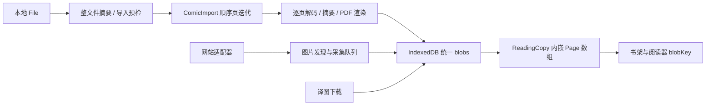
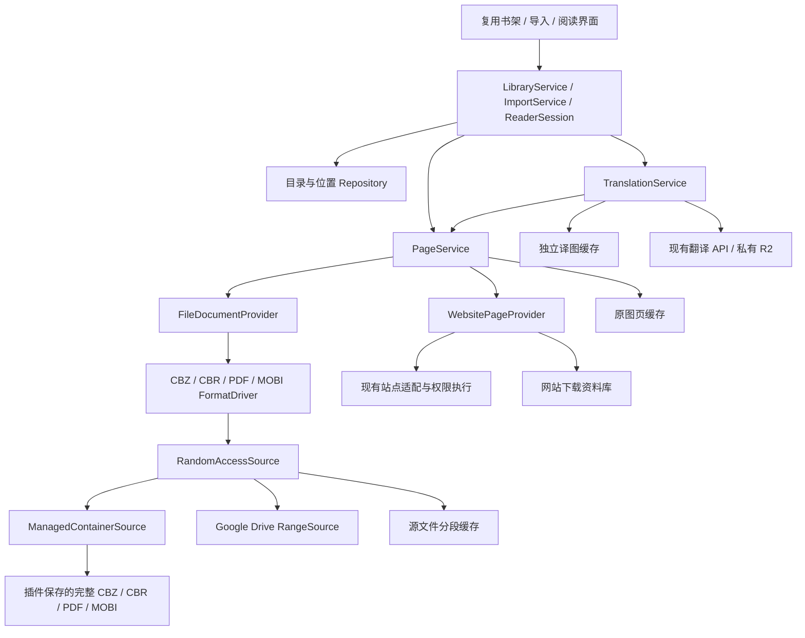

# 漫画来源、原文件阅读与缓存架构重设计

日期：2026-09-22，授权边界更新于 2026-09-23。状态：**新核心、本地完整源文件、按页阅读、独立缓存与简化书架已实现，并完成部分真实浏览器验收；未提交、发布或生产部署**。实际模块、验收证据和未完成项见[实施记录](COMIC_SOURCE_IMPLEMENTATION.md)。

本文针对本地完整源文件保存、Google Drive 按需阅读、现有网站采集下载和漫画管理解耦。旧文档中的逐页导入、统一 Blob 存储和复杂出版关系已由本次新基线替换，不做旧数据迁移、双写或兼容回退。翻译任务、权益、幂等、私有 R2 和网站安全边界继续遵循现有契约。

实施选择与设计目标分开记录：完整源文件固定使用 **`chunked-idb-v1`（每块 1 MiB）**，未采用 OPFS；Drive 只开放 CBZ/ZIP 与单图。用户已确认网页授权后的真实导入阅读，并在新增 Chrome 托管策略交付后反馈当前流程恢复正常；Chrome 重启恢复已有模拟 Google 服务的隔离浏览器证据，真实重启和长期续期未单独确认。云盘多账户、撤权、版本变化和 Range 网络统计没有完整真实验收；Firefox 尚无运行验收。下文保留设计约束和验收清单，不代表全部目标已经通过，第 2 节专门保留重构前的审查依据。

## 1. 结论与已确认范围

将“导入漫画 = 提取并保存全部图片”改为“本地保存完整源文件 / 云盘登记文件引用，再建立页面索引”。阅读器只向统一页面服务请求某一页，不直接读取数据库 Blob，也不判断本地文件还是云盘。

- 本地 CBZ/ZIP、CBR/RAR、PDF、未加密 MOBI：**允许把完整源文件复制一次到插件存储**，以后从该文件按页解压或渲染；不引用外部文件，不预先持久保存整卷展开图片。
- Google Drive：独立的连接、授权和选文件流程；导入文件引用，阅读时按范围取字节；缓存已经读取的原始页面。不能按范围读取的文件明确拒绝云端直接阅读，不偷偷下载整包。
- 网站：保留多站点发现、目录采集、图片下载、暂停、补齐、重试。用户主动下载得到的原图是受保留策略保护的本地资料，不能当普通缓存淘汰。
- 本地完整源文件、原图页缓存、源文件分段缓存、译图缓存、网站下载资料分别管理。它们可以共用底层存储工具，不能共用预算、淘汰规则或删除命令。
- 旧视觉与合适的交互复用；数据模型、数据库、导入与阅读编排允许整体替换。
- Chrome、Edge、Firefox 正常重启后都直接读取已保存的源文件，无需重新选择。**不使用 Native Messaging、不安装本地助手、不依赖持久外部文件句柄。** 本文以下各节均按这一最终要求设计。

这里的“云盘接入”是插件直接读取用户选中的云盘文件，不是把整个书架同步到服务器，也不需要用户安装 Codex 的 Google Drive 插件。

## 2. 重构前代码审查（历史记录）

本节描述 2026-09-22 实施前的源码，不再是当前运行架构。旧路径仅用于解释替换原因；当前入口见[实施记录](COMIC_SOURCE_IMPLEMENTATION.md#实际模块与数据流)。

### 2.1 数据流与已有抽象



用户描述的“拷贝到我们的目录”，在当前代码中具体是写入 `node-comics-library` 的 IndexedDB `blobs` store，不是用户选择的磁盘目录。本地文件 `File` 只供本次导入使用，没有持久化文件句柄。

**已有三类抽象，但没有统一的可随机取页抽象：**

1. 编目模型：作品、章节、内容版本、出版套系、卷册、收录、可读副本及关系。
2. 网站来源：`SourceDefinition`、`SourcePageSession`、目录和页面清单、站点注册表；已分离站点差异与权限执行。
3. 文件导入：`ComicImport` / `ComicPage` 提供顺序页面迭代和关闭；输出必须是已经取得字节的页面，不能表达“尚未读取但可定位的第 80 页”。

`Page` 同时承载原图地址、原图 Blob、摘要、账户、远端资产、翻译任务和译图键；`ReadingCopy` 内嵌所有页。存在组件拆分，不等于存储与阅读职责已经解耦。

### 2.2 关键文件清单

以下行号与职责是实施前的定位，不能用于定位当前源码；已删除文件保留为历史路径文本。

| 范围 | 历史文件与定位 | 作用及重构处理 |
| --- | --- | --- |
| 通用页面与副本 | [types.ts](../apps/extension/src/types.ts)，18–19 行 | `Page` / `ReadingCopy` 混合源、缓存、翻译和阅读状态；拆分 |
| 编目实体 | `src/library/types.ts`、`src/library/model.ts` | 作品、章节、出版关系及默认 `offline`；简化模型 |
| 数据与预算 | `src/library/store.ts`，13–48、95–112 行 | IDB、全库读取、Blob、预算、全库修改；整体替换 |
| 本地导入编排 | `src/library/import-queue.ts`，50–67、138 行；`src/library/local-import.ts`，11–32 行 | 全文件摘要、逐页提取入库、导入时关联译图；删除这条物化链 |
| 格式公共层 | `src/importers/comic-shared.ts`，10–15 行；`src/importers/comic.ts` | 顺序 `ComicImport`；替换为索引与取页契约，复用校验规则 |
| 格式实现 | `src/importers/zip.ts`、`src/importers/pdf.ts`、`src/importers/mobi.ts`、`src/importers/rar.ts`、`src/importers/rar-core.ts`、`src/importers/rar.worker.ts` | ZIP/PDF/MOBI 有分段读取基础；RAR 当前依赖整份 `ArrayBuffer`，不能直接用于云盘懒加载 |
| 译图缓存 | `src/library/result-cache.ts`，1–45 行 | 有账户键、请求合并和 Web Locks；但仍依赖统一 store / 预算，迁入独立缓存模块 |
| 网站抽象 | [sources/contracts/definition.ts](../apps/extension/src/sources/contracts/definition.ts)、[page.ts](../apps/extension/src/sources/contracts/page.ts)、[source.ts](../apps/extension/src/sources/contracts/source.ts)、[sources/index.ts](../apps/extension/src/sources/index.ts) | 保留站点协议与注册表；通过网站页面提供器接入新核心 |
| 采集与导入 | `src/library/acquisition.ts`、`src/library/web-import.ts`、[sources/runtime/image-fetch.ts](../apps/extension/src/sources/runtime/image-fetch.ts) | 保留站点获取、安全与恢复规则；替换持久化及调度接口 |
| 应用总编排 | [App.tsx](../apps/extension/src/App.tsx)，45–47、143 行 | 全库重载、导入、整份采集与阅读交织；改为应用服务与局部订阅 |
| 管理 UI | [ui/Library.tsx](../apps/extension/src/ui/Library.tsx)、`src/ui/library/shared.ts`、`src/ui/library/CopyCards.tsx`、`src/ui/library/LibraryEditor.tsx` | 无 Blob 禁读、复杂关系管理；保留视觉，替换 ViewModel 与命令 |
| 导入 UI | [ui/LocalImport.tsx](../apps/extension/src/ui/LocalImport.tsx)、[CatalogImport.tsx](../apps/extension/src/ui/CatalogImport.tsx)、[SourceImport.tsx](../apps/extension/src/ui/SourceImport.tsx) | 增加来源选择，本地、Drive、网站分别实现；复用范围选择和归属确认 |
| 阅读图像 | [reader/Images.tsx](../apps/extension/src/reader/Images.tsx)，28–35 行；[Reader.tsx](../apps/extension/src/reader/Reader.tsx) | `getBlob(blobKey)` 与数组改页；改为页面租约与能力命令 |
| 连续阅读 | [reader/useChapterStream.ts](../apps/extension/src/reader/useChapterStream.ts)、`src/library/reading.ts`、`src/library/directory.ts` | 保留位置恢复思路，改为有界章节 / DOM 窗口与索引查询 |
| 翻译接入 | [translation/useAutomaticTranslation.ts](../apps/extension/src/translation/useAutomaticTranslation.ts)、[automatic.ts](../apps/extension/src/translation/automatic.ts)、[coordinator.ts](../apps/extension/src/translation/coordinator.ts)、`src/reader/recovery.ts`、[api.ts](../apps/extension/src/api.ts) | 从统一页面服务取得实际图片摘要；替换持久操作里的原图 Blob 依赖，去掉整卷文件页匹配前置依赖 |
| 网页原位翻译 | [inline/background.ts](../apps/extension/src/inline/background.ts) | 同步更换译图缓存接口，不让网页原位翻译保留旧存储入口 |
| 导出 | [export/plan.ts](../apps/extension/src/export/plan.ts)、[files.ts](../apps/extension/src/export/files.ts)、[images.ts](../apps/extension/src/export/images.ts)、[pdf.ts](../apps/extension/src/export/pdf.ts) | 通过页面流读取；明确导出会主动读取所选全部页 |
| 服务端身份 | [backend/app/file_pages.py](../backend/app/file_pages.py)、[reader_api.py](../backend/app/reader_api.py)、[contracts/openapi.json](../contracts/openapi.json) | 核实摘要复用、可选文件页身份和操作恢复，不把云盘位置冒充图片身份 |

### 2.3 必须解决的问题

- **整文件摘要挡住首屏。** 导入预检会完整读取文件计算 SHA-256；云盘不能继续把整卷摘要当导入或恢复的前提。本地允许保存整文件后，可在同一次复制中顺便计算，不再增加一遍全文件扫描。
- **原图与译图策略耦合。** 两者共用 Blob 表和 `cacheLimitMb`；预算统计包括原图，淘汰却保护原图；默认 `retention=offline` 还保护该副本译图。仅新增 `cloud` 字段不能解决这个问题。
- **全库读写放大。** `readCopies` 读取全部副本、所有 Blob 键；`cacheSize` 读取所有 Blob 记录求和；`editLibrary` 为局部修改读取、重新写入全部副本。逐页导入 / 采集和库事件会反复触发这些操作。
- **可读性被缓存绑架。** 无本地 Blob 就禁用阅读，清理缓存还增加 `manifestRevision`。来源不变时，缓存淘汰不应改变文档身份或位置。
- **窗口只限制了解码。** 当前阅读器有约 5 页 / 3200 万像素的解码约束，但跨章加载的 DOM 和章节集合持续累积。
- **缓存调用不一致。** 阅读器调用 `loadResultBlob` 未传预算，网页内翻译会传；统一策略必须由缓存服务自身执行，不能靠每个调用点记住传参。

## 3. 新模型：目录、文档、字节源分开

不再要求用户完成出版数据库级别的编目。采用最小层次，仍允许同一内容有不同来源版本：

| 实体 | 字段重点 | 边界 |
| --- | --- | --- |
| `Work` | ID、标题、别名、封面引用、最近阅读摘要 | 书架的一部作品；不内嵌所有文档或页面 |
| `ReadingUnit` | workId、标题、排序、`kind=chapter/volume/book/unclassified`、`role=main/extra/unknown`、首选 documentId | 用户阅读的一个单位；番外是独立角色字段；一文件不必拆出猜测章节 |
| `Document` | unitId、sourceBindingId、format、当前 revisionId、语言 / 版本标签、索引状态 | 一份文件或网站图集；同一单元可有多个文档，不从同名自动合并 |
| `SourceConnection` | provider、稳定账户标识、展示名、连接状态 | 本地、某个 Drive 账户、某个网站权限范围；没有翻译账户令牌 |
| `SourceBinding` | connectionId、locator、来源标识 | 指向本地 containerId、Drive fileId/resourceKey 或网站条目；URL 不是永久身份 |
| `ManagedContainer` | objectId、SHA-256、字节数、格式、ready 状态、引用 | 插件保存的完整源文件；不可变，不参与页面缓存 LRU |
| `DocumentRevision` | documentId、固定来源快照 / containerId、来源版本戳、解析器版本、索引版本、状态 | 一次稳定的内容快照；不因缓存清理 / 阅读移动而变化 |
| `PageDescriptor` | revisionId、稳定 pageId、ordinal、格式专用 locator、可选尺寸 | 表示页面存在且可定位；不要求图片字节、摘要、任务或缓存已存在 |
| `PageMaterialization` | pageId、revisionId、renderProfileId、imageSha256、尺寸、字节数 | 真正读取 / 渲染后得到的内容身份，独立记录 |
| `ReadingPosition` | workId、documentId、revisionId、pageId、relativeOffset、updatedAt | 排序号不是身份；清缓存和切换显示结果均不改位置 |
| `TranslationBinding` | API origin、用户、imageSha256、模式、语言、配置 / 结果版本、operationKey / jobId | 只连接页面内容和翻译，不嵌入源清单 |

`ReadingUnit.kind` 只是阅读目录分类，不声称取代 ISBN / 正式出版模型。本轮删除出版套系、章节收录、多作品覆盖、再版关系和作品关系图；需要时以后建立独立编目模块，不为这些未来关系保留空表和多级管理界面。

文件页序由原文件索引决定，默认只读。同图在书中出现两次是两个 `pageId`，但可共享一个 `imageSha256`。网站图集可显式编辑页序；新增 / 删除页面生成新的清单修订，稳定来源页尽量沿用 pageId。跨文档插页不修改原文件，首轮取消向文件副本插页的功能。

`Document` 指向当前 revision，每个 revision 固定自身的 containerId 或云盘版本快照；更新当前 SourceBinding 不能让旧 revision 读到新字节。容器引用按仍保留的文档版本登记，明确删除旧版本才释放其引用；多个版本共享同内容文件也不能重复删除。

## 4. 核心接口与依赖方向



**两条独立扩展轴：来源决定如何拿字节，格式决定如何从字节定位页面。** 加 Dropbox 只新增来源驱动；加 EPUB 只新增格式驱动。网站通常提供页面集合，不伪造为 ZIP 字节源。Google Drive 不塞进网站 DOM 适配器注册表。

2026-09-23 已将文件来源落实为 [FileSourceDriver](../apps/extension/src/comics/sources/contracts.ts)：`registry` 提供能力发现与访问事件，`runtime` 统一打开和范围缓存，`install` 显式注册具体驱动。应用与页面服务只消费公共契约，Google 品牌、OAuth、快照字段和 Range 校验留在驱动及安装 / 权限配置处；新增同类来源不改核心、阅读器或翻译。`providerItemId` 标识连接内稳定资源，`sourceKey` 标识文档版本；多版本共享 binding、各自固定 revision 快照。公共契约依赖和显式安装是必要连接，不以“字面没有任何依赖”作为解耦标准。实际修复与旧开发记录限制见[来源驱动边界记录](validation/SOURCE_PROVIDER_BOUNDARIES_2026_09_23.md)。

以下保留目标契约草图，类型名称与签名不保证与最终实现逐字相同；实际来源契约见 [sources/contracts.ts](../apps/extension/src/comics/sources/contracts.ts)，字节源 / 格式契约见 [formats/contracts.ts](../apps/extension/src/comics/formats/contracts.ts)，页面租约见 [pages/service.ts](../apps/extension/src/comics/pages/service.ts)。`SourceSnapshot` 等名称归属文件核心，避免与网站同名类型混用。

```ts
interface RandomAccessSource {
  readonly snapshot: SourceSnapshot; // 大小、来源身份、版本证据、访问能力
  readAt(offset: number, length: number, signal: AbortSignal): Promise<Uint8Array>;
  validate(signal: AbortSignal): Promise<'unchanged' | 'changed' | 'unavailable'>;
  close(): Promise<void>;
}

interface SourceDriver {
  readonly id: string;
  select(context: SelectionContext): Promise<SourceSelection[]>;
  open(binding: SourceBinding, signal: AbortSignal): Promise<RandomAccessSource>;
  connect?(request: ConnectionRequest): Promise<ConnectionResult>;
  reconnect?(binding: SourceBinding): Promise<ReconnectResult>;
}

interface FormatDriver {
  readonly id: string;
  probe(source: RandomAccessSource, limits: ParseLimits): Promise<FormatCapabilities>;
  open(source: RandomAccessSource, context: DocumentContext): Promise<DocumentSession>;
}

interface DocumentSession {
  index(cursor?: string, signal?: AbortSignal): Promise<PageIndexBatch>;
  materialize(page: PageDescriptor, profile: RenderProfile,
              signal: AbortSignal): Promise<MaterializedPage>;
  close(): Promise<void>;
}

interface PageService {
  acquire(request: PageRequest): Promise<PageLease>;
  // PageRequest 含 revision / page / profile / signal / priority / purpose
  // PageLease 含 Blob、实际内容身份及 release()；不泄露 token、handle、存储路径
}
```

- `FormatCapabilities` 必须描述 `access=random/sequential/full-buffer`、固实 / 加密 / 分卷、索引是否完整，以及远程可用性与失败原因。不能只有 `supportsCBR: true`。
- `DocumentSession` 是可销毁的解析会话；`DocumentRevision` 与索引是持久数据，不能把 WASM 指针、Blob URL、Worker 或访问令牌存进它。
- `PageService` 负责读取合并、优先级、页缓存、内容规范化、租约释放；格式驱动不调用数据库、不查译图、不扣额度。
- `SourceDriver` 只负责文件类来源；网站提供同等页面能力的 `WebsitePageProvider`。`ImportService` 汇总两类导入结果，不强行令所有来源实现无意义方法。
- UI 只消费 `WorkCardViewModel`、`DocumentViewModel`、`PageViewState` 和命令。能力决定是否显示下载、重连、排序等按钮，不在组件内散布 `if googleDrive`。
- 翻译可以依赖 `PageService`；`PageService`、源驱动、格式驱动禁止依赖翻译模块。

## 5. 本地导入：保存完整源文件，读取时解析

### 5.1 三浏览器同一条路径

用户通过普通文件选择 / 拖放选择漫画，插件把该文件流式保存到自己的字节库，得到不可变的 `ManagedContainer`。之后 `ManagedContainerSource.readAt` 读取保存文件的范围；Chrome、Edge、Firefox 正常重启后都只凭 containerId 打开，不再访问原来的本机路径。

本轮选择分块 IndexedDB 保存完整文件，字节库为 `node-comics-sources-v1-container-bytes`，固定后端标识 `chunked-idb-v1`，每块 1 MiB；目录和索引位于独立 `node-comics-sources-v1-catalog`。没有使用 OPFS、外部持久文件句柄或本地助手。OPFS 作为后续可替换后端的设计依据仍可参考[官方说明](https://developer.mozilla.org/en-US/docs/Web/API/File_System_API/Origin_private_file_system)，不属于本轮已实现能力。需要在真实 `chrome-extension://` / `moz-extension://` 运行环境分别验证读写、Worker 与重启持久化，不能仅用普通网页预览证明扩展已可用。

三浏览器代码使用同一个分块 IDB 路径；这仍然只保存同一份源文件，不是兼容旧漫画数据，也不做 OPFS / IDB 双写。每个新库固定登记后端类型，写入失败不会无提示在另一处再存一份。Chrome / Edge 已有扩展关闭重开证据；Firefox 运行与操作系统重启场景仍待实测。

### 5.2 导入提交与去重

1. 预检文件类型、大小与少量格式签名，估算源文件及暂存空间；记录 importId 和字节预算预约。名称 / 大小只作重复提示，不能据此跳过不同内容。
2. 分块读用户选择的 File，带背压写入 staging，同时增量计算 SHA-256；复用当前增量摘要基础，避免先全文件哈希再复制、`file.arrayBuffer()` 或把全部 chunks 留在内存。这里全文件读取是本地复制的一部分，**Drive 没有这一步**。
3. 写入全部源字节、flush / close 并确认长度后记录 `bytesClosed`。以 SHA-256 + 长度唯一约束，事务选定一个 ready 容器并登记文档引用；并发重复导入的暂存副本在发布后释放。复用已有容器前在持有对象租约时定点确认字节存在且长度匹配，再于事务复核 generation；若浏览器已回收字节，则标记 availability=missing，发布新完整对象修复同内容引用，不能删除新 staging 后继续引用失踪对象。文件字节、文件名、页序和文档归属分别处理，同一容器可以被多个文档引用。
4. 从保存的容器建立格式索引，不提前解码所有图片或渲染整份 PDF。源文件保存与文档登记可以先提交为 `indexing`；UI 分别显示“源文件已保存 / 正在建立目录 / 可以阅读”，只有索引达到驱动的可读条件才显示导入完成。最多按需生成一张小封面。
5. 导入成功后不再依赖最初的 File 对象。外部文件被移动、删除或修改均不影响已保存漫画；用户再次导入不同字节，创建新容器 / 新文档版本，不监听或自动追踪外部文件。
6. 复制未完成时关闭标签页或崩溃，记录为中断并清理无活跃租约的 staging，重试需要重新选择源文件；不得展示为完整导入。若字节已经完整，仅索引尚未完成，可直接从保存对象恢复索引，不要求重选。正常完成项的重启读取与未完成导入的异常恢复分开验收。
7. 用户取消复制时先使操作 generation 失效，停止流和 Worker，再清理 staging / 预算预约；不影响其他导入。源文件已发布后停止索引，保留可见的“源文件已保存、索引暂停”条目；若用户明确撤销该次导入，则撤销登记并释放对应引用，不能留下无归属的保留容器。

将字节发布、容器去重和文档引用登记放进受 fencing 保护的提交协议，细节见第 9 节。已保存但解析失败的条目保留失败原因，可重试索引或显式移除；不是把损坏文件当可读书。

### 5.3 源文件保留与用户操作

虽然用户允许“复制源文件作缓存”，它是插件重启后阅读的唯一完整来源，内部使用 `ManagedContainerStore`，界面称“本地源文件”。**不纳入自动 LRU，也不被“清理原图页缓存 / 译图缓存”删除。** 用户主动删除源文件 / 移除文档并释放最后一个引用时才回收；正在读取的会话通过租约延后物理删除。

存储不足时暂停新导入、释放可重建缓存或提示管理本地源文件，不为腾空间偷偷删掉另一部本地漫画。跨浏览器 / profile 不自动共享存储；插件卸载、用户清除扩展数据或浏览器回收可能移除保存内容。可申请持久存储并记录结果，但不能保证 browser 一定批准或用户永不清理。[StorageManager.persist](https://developer.mozilla.org/en-US/docs/Web/API/StorageManager/persist)。

保留“保存源文件到本机”的导出动作，直接流式输出已保存容器，不重新打包或解压。若用户主动仅删除源文件并保留条目，显示“源文件已移除，需要重新导入”，少量页缓存不冒充整卷离线可读。多图导入可按独立原图对象加图集清单保存，不额外创建 ZIP，也不复制成另一套原图缓存。

### 5.4 本地 CBR 的特殊处理

现有 `node-unrar-js` 浏览器接口要求完整 ArrayBuffer。本地兼容范围可暂由**有大小上限的 Worker 内存会话**读取已保存 CBR 完成，不落展开目录；仅返回请求页，其他解压输出立即释放。固实包访问后页可能要从前序开始解压，显示可取消的准备状态并限制 CPU / 内存 / 总展开量。

保存一份 CBR 不意味着必须全量解压入库，也不意味着解码时零内存或低延迟随机访问。不能把该实现用于 Drive；最终是否替换为支持回调读取的 RAR 解码器，由第 13 节技术验证决定。若现库无法在限制内丢弃前序输出，超限样本直接拒绝，不能突破资源上限。

## 6. Google Drive：独立授权、选择、读取

### 6.1 连接与导入

入口为“导入 → Google Drive → 连接账户 → 选择文件 → 确认归属”。只连接云盘不要求登录漫画翻译账户，两套身份和退出动作独立。

- 默认采用 `drive.file` 与 Google Picker，仅访问用户通过 Picker 明确选中的文件。这个 scope 实际也允许应用修改其获授权文件；应用自己只实现读取，不能将授权文案写成 Google 提供的“严格只读权限”。全盘只读 `drive.readonly` 权限面更广，不是默认替代。
- 首轮支持二进制漫画文件多选；不做全盘扫描、目录递归同步、自动关注文件夹。选文件夹不代表所有子文件都获 `drive.file` 授权。共享盘 / 快捷方式仅在 Picker 选择及目标文件读取权限均可验证时支持，禁止只凭名称解析。
- 保存稳定账户标识、fileId、可选 resourceKey、文件大小、格式和版本证据。名称与文件夹变化不创建新作品。重新选中同一账户的同一 fileId 提示已导入，内容变化按新 revision 处理。
- 核验元数据与 `capabilities.canDownload`，不把 Picker 返回的 URL 当可信下载地址；构造固定 Drive API 请求，二进制用 `files.get?alt=media`。Google Docs 类在线文档导出不属于本轮漫画文件读取能力。

Google 官方说明：[权限范围](https://developers.google.com/workspace/drive/api/guides/api-specific-auth)、[Picker 概览](https://developers.google.com/workspace/drive/picker/guides/overview)、[文件下载与 Range](https://developers.google.com/workspace/drive/api/guides/manage-downloads)。

### 6.2 OAuth 与浏览器实现

Drive 授权和选文件独立于漫画账户 OIDC session，不把 Google refresh token 存入业务后端。Chrome 已实现可选的浏览器托管授权；Edge / Firefox 和未配置 Chrome client 的构建使用 GIS token model。配置和实际验证边界见 [drive-connect/README.md](../apps/drive-connect/README.md) 与 [2026-09-23 授权回归](validation/DRIVE_AUTH_2026_09_23.md)。

Chrome 构建可通过 `VITE_GOOGLE_CHROME_CLIENT_ID` 配置 **Chrome Extension** OAuth client，注册的扩展 ID 必须与稳定安装 ID 一致；只有 Chrome manifest 写入 `oauth2` 和 `drive.file`。用户点击 Drive 入口时才允许 `identity.getAuthToken({interactive: true})`，阅读只用非交互请求，由 Chrome 缓存处理 token 过期。需要登录或同意时显示重连提示，不在后台弹窗。账户由 Drive `about.user.permissionId` 核对，不猜测 Chrome profile 邮箱，也不把 Google account ID 与 Drive permission ID 混用。[Chrome OAuth 配置](https://developer.chrome.com/docs/extensions/how-to/integrate/oauth)、[Chrome Identity](https://developer.chrome.com/docs/extensions/reference/api/identity)。

两种认证策略仍共用自有 HTTPS 选文件页、Web client 和 Google Picker。远程 SDK 只在该页面运行，扩展页遵守 MV3 CSP。随包的专用桥只注入当前授权 tab 的固定 HTTPS origin / path、顶层 frame；background 校验 sender、tab、documentId、导航状态、一次性 nonce、期限和字段，再用固定 Drive API 核验账户与文件。桥和 SDK 都就绪且已有有效凭据时自动打开一次 Picker，取消后可手动重开，不撤销 Chrome 连接。该桥短暂接触 token，漫画网站通用 content script 不接触它。[MV3 CSP](https://developer.chrome.com/docs/extensions/reference/manifest/content-security-policy)、[扩展与宿主页面通信](https://developer.chrome.com/docs/extensions/develop/concepts/content-scripts#host-page-communication)。

`chrome.storage.local` 仅持久保存允许自动恢复的账户和连接代次，没有 access token 或 refresh token。短期凭据放在可信 `chrome.storage.session`；Chrome 交给 Picker 的 5 分钟期限只是本页租约，不是 Google token 到期时间。session 因重启或重载丢失后，未断开的 Chrome 连接可以静默重取凭据；已断开连接的自动恢复记录与本机 token 缓存会删除，后台不能自行恢复。token 禁止进入 URL、日志、漫画数据库、localStorage 或同步存储。授权页无广告 / 分析脚本，不代理漫画文件字节，业务后端不接收 token。

Edge 显式排除 Chrome 托管策略，Firefox 缺少 `getAuthToken` 时走 GIS。网页模式只复用有效期内 token，过期或 session 丢失后由用户点击重新连接；不能承诺永久无感续期。页面“切换 / 重新连接账户”是用户显式选择的临时网页授权；Chrome 租约过期时主按钮要求回插件重新打开，不自动降级到 GIS。远端撤权、Chrome 登录状态变化等情况仍可能要求重新连接。[GIS token model](https://developers.google.com/identity/oauth2/web/guides/use-token-model)、[Edge 支持列表](https://learn.microsoft.com/en-us/microsoft-edge/extensions/developer-guide/api-support)。

Google desktop/mobile Picker OAuth 流仍是备选，不能未经验证就假定“扩展可以免 client secret 用 PKCE 换长期 token”。真实 Google Chrome 托管授权、跨浏览器登录、多账户与撤权尚待验收，模拟 Identity API 不能替代。Google 资源配置由用户协调；当前只提供本地临时 HTTPS 测试页，没有生产部署。

### 6.3 懒加载与版本一致性

`DriveRangeSource` 的职责：

1. 用元数据确认大小、权限、账户和源版本；`version` 是变化证据，不是图片摘要，也不是保证可永久下载的历史版本地址。
2. 按需发单范围 `Range: bytes=start-end`，检查 `206`、`Content-Range`、实际字节数和请求边界。服务器忽略 Range 返回 `200` 时，在读取响应体前中止，不调用 `arrayBuffer()` 吃完整文件；很小且业务明确请求全范围的文件可按显式完整区间处理。
3. 相邻小读取合并、相同范围请求合并；建议块大小 256 KiB–1 MiB，索引与当前页优先，后页低优先。上限均可配置，不能预取整个剩余文件。本轮已合并相同范围请求，相邻范围合并尚未实现；不会据此增加隐式整文件预取。
4. 每个会话固定 revision。远端内容版本在一组未缓存范围读取前后复核；变更则丢弃该组新字节和未交付页，终止旧会话并重新索引。若服务提供可验证的强 HTTP 条件请求则使用并实测，不假定 Drive `version` 可以直接用作 `If-Match`。
5. Drive 普通历史 revision 不能视为永久存在；只读连接不设置 `keepForever`、不改用户文件。缓存分段必须附 revision，严禁混合更新前后的压缩数据。若实测无法保证范围读取期间的一致性，该文件路径不得通过云端阅读验收。
6. 缓存完整页面可以离线显示为“已缓存版本”；未缓存页显示离线状态。在线发现变更后停止为旧 revision 补缺失片段，用户可以查看已有旧缓存或切换新版。重新认证验证到同一账户后才继续取云端数据。

这里的懒加载是“不预先拉完整源文件、不在后台为了导入读完整包”；读完全书的累计流量可能覆盖原文件全部内容，这是正常按需读取，不保证总流量始终小于文件大小。

### 6.4 格式能力矩阵

下表保留设计目标。**本轮远程格式入口仅开放 CBZ/ZIP 与单图；PDF、MOBI、RAR 明确拒绝云端直接阅读。** 本地格式的真实样本和云盘网络行为分别验收，不能由本地读取成功推导 Drive 已支持。

| 格式 | 本地已保存源文件读取 | Drive 直接阅读目标 | 必须承认的限制 |
| --- | --- | --- | --- |
| CBZ/ZIP Store、Deflate | 尾部 / 中央目录建索引；按图片条目解压 | 首轮主路径，读目录和目标条目压缩范围 | 加密、分卷、损坏目录拒绝；ZIP64 仅在驱动验证后开放；某个超大目录本身可能超过索引预算 |
| PDF | PDF.js 自定义 range transport，按需对象读取、逐页渲染 | 条件支持；关闭自动抓完整文件的行为 | 非线性化、交叉引用 / 对象分布、共享资源会导致额外范围请求；不能承诺一页只读固定小块，也不能承诺任意 PDF 首屏都不触及整文件 |
| 未加密 MOBI6 / MOBI6+KF8 | PDB 表、有限正文与 recindex 建索引；按记录读取图片 | 条件支持同一本地子集 | 首次可能读取多条正文记录才能确定页序；DRM、HUFF/CDIC、独立 KF8/AZW3 仍拒绝；索引预算超限时不自动整包拉取 |
| CBR/RAR 非固实 | 可受限整文件内存读取；目标为可定位条目读取 | 扩展目标，当前依赖不能实现；新解码 I/O 验证前显示不支持云端直接阅读 | 需要能从 range source 回调取字节的解码器，不能给 `node-unrar-js` 传伪造稀疏 ArrayBuffer |
| CBR/RAR 固实 | 有界顺序解压，后页可能较慢 | 首轮明确不支持 | 解码字典依赖前序，跳后页可能读取接近整包；需用户在外部转换为 CBZ 或下载后从本地导入 |
| 独立图片 | 保存一份原图对象与有序图集清单 | 单个图片文件按需读取 | 图片本身就是一页，加载这一页自然读取该图片文件的全部字节 |

对 PDF / MOBI 设置“建索引”和“当前页准备”的独立网络 / 解压预算、超时与取消；超限保留原因并停止，而不是 fallback 全文件下载。原型先以索引 16 MiB、单次页面准备新增读取 32 MiB 作为测量起点；这些是待样本调优的策略值，不是格式规范，不作为已验收支持承诺。CBR 云端可用性和复杂 PDF 是技术门槛，不包装为已具备功能。

格式依据：[zip.js 自定义 Reader](https://gildas-lormeau.github.io/zip.js/api/classes/Reader.html)、[PDF.js API](https://mozilla.github.io/pdf.js/api/draft/module-pdfjsLib.html)、[RARLAB 格式规范](https://www.rarlab.com/technote.htm)、[node-unrar-js 输入与生命周期](https://github.com/YuJianrong/node-unrar.js)。现有 PDF transport 已设置 `disableAutoFetch` 与 `disableStream`，应保留；当前问题主要是上层遍历渲染全卷。MOBI 云端可行性属于依据现有记录读取代码得出的设计推断，尚未实测。

## 7. 缓存与下载资料的完全分离

### 7.1 存储类别与策略

本轮元数据和字节均使用 IndexedDB，但分库、分策略管理：完整容器采用分块字节库，各缓存采用独立命名空间数据库；没有 OPFS 写入。容器字节块、操作与引用在同一数据库内提交，目录登记通过导入 journal 定点恢复，见[实施记录](COMIC_SOURCE_IMPLEMENTATION.md)。第 9 节保留跨后端写入必须满足的原子性约束。

| 类别 | 内容与键 | 初始策略建议 | 清理影响 |
| --- | --- | --- | --- |
| 本地源文件 `containers` | 完整 CBZ/CBR/PDF/MOBI，按 SHA-256 + 长度共享对象 | 独立计量；用户保留的来源资料，不自动淘汰，不设置页缓存式 LRU 上限 | 仅用户明确删除及最后引用释放后回收，不影响外部原文件 |
| 外部云盘文件 | Drive locator；只有引用 | 不纳入插件字节预算；源文件只读 | 移除引用绝不删除用户云盘文件 |
| 网站下载资料 `downloads` | 采集图片；来源修订 + 页映射，内部可按摘要共享 | 显式下载保留，不参与任何缓存 LRU；显示总占用并可暂停下载 | 仅“删除下载内容 / 删除书架资料”释放，保留其他引用 |
| 原图页缓存 `source-pages` | 连接 / 文档修订 / 页 / renderProfile → 完整原图 | Drive 默认写入，2 GiB 预算、LRU；普通本地文件默认不写；昂贵本地渲染可显式启用同一独立预算 | 下次从原来源重新读取；不影响源文件、译图、目录与位置 |
| 源文件分段 `source-ranges` | 连接 / binding / 源修订 / offset / length | 256 MiB 预算、LRU；加速 Drive 范围访问，完整本地容器不重复写入分段缓存 | 重取分段；不能删除原图页或译图 |
| 译图缓存 `translations` | API origin / 用户 / 不可变结果版本 / 输出资产 | 独立 1 GiB 预算、LRU；实际额度由设置维护 | 重取有效译图；不得触发翻译生成 |
| 缩略图 `thumbnails` | 文档修订 / 页 / 缩略 profile | 64 MiB 独立预算；可见时生成、低并发 | 展示占位；不扫描全部文件重建 |
| 显示内存 | Blob lease、ImageBitmap、Object URL | 先按像素 / 字节再按页数限制，当前页保护 | release 关闭位图、撤销 URL；不改持久索引 |

预算是首版建议配置，不是承诺设备一定有这些空间。设置页分别展示“本地源文件”“原图页缓存”“源文件分段”“译图缓存”“网站下载资料”，提供各自清理 / 管理命令。本地多图的原图对象按显式保留资料管理，可复用 downloads 的图集存储能力，不能纳入 source-pages 的自动淘汰。缓存命中只更新轻量元数据，禁止重新写整张 Blob 或整卷清单。

初版跨类别**不共享物理对象**，避免原图淘汰牵连下载保留或译图授权。类别内部可摘要去重并记录引用；Drive 内容还须带连接 / 账户范围，不能利用另一账户的缓存绕过所选来源权限。将来若增加跨类别去重，必须以独立引用及所有策略均释放为物理删除条件，不能提前引入复杂性。

### 7.2 独立策略也需要共同处理磁盘不足

各服务维护自己的用量、预约字节与 LRU 索引；`StoragePressureCoordinator` 只协调设备总空间，不决定某张原图是否使译图失效。按建议先清缩略图、分段，再请求各缓存释放自己的未被使用对象；不碰本地完整源文件、显式原图资料、目录、位置和翻译操作回执。

用 `navigator.storage.estimate()` 估算、捕获 `QuotaExceededError` 作真实依据。一次有界清理后仍无法写缓存，当前页可在内存中继续看，并显示“本页未缓存”；主动网站下载 / 本地导入则暂停或失败并说明空间不足，不能把尚未保存完整的本地源文件标成成功。存在未清理来源对象不能导致无限重试。持久存储请求只能降低浏览器回收风险，不是永久保留保证。

缓存淘汰不递增 revision、不修改 PageDescriptor、不修改已读状态；可用性由缓存目录和来源状态即时计算。仅已完整写入、校验成功的对象可以命中；解析中的半页不能当成功缓存。

## 8. 网站多源采集保留，但与阅读预取分开

保留现有站点身份、注册表、内容脚本、画布资源、导航版本、来源资源校验和按需 host permission。现有 MangaCopy / Comic PASH / Gunnerkrigg / xkcd 的发现与获取实现应作为可复用模块，不因文件源重构而重写站点规则。

- 导入来源目录：保存文档绑定及目录完整性；“已发现”与“图片已下载”分开统计。通用网页选中 N 张构成固定图集，保留该契约。
- 按需阅读：只请求当前阅读窗口需要的页面，不因打开一章而调用旧的整章 `queueCopies`。站点必须依赖可见页面会话 / 画布时，提供“打开来源并恢复”动作，不伪装成永久直链。
- 主动下载：`AcquisitionService` 持久化下载意图与逐页结果，写 `downloads`；暂停、继续、失败页重试、重复投递幂等、同一站点顺序和公平性保留。网站下载不触发翻译。
- `OriginalAvailability` 分别表示索引是否完整、来源能否读取、缓存多少页、显式下载多少页；禁止用一个 `offline` 布尔值覆盖全部含义。
- 当前页 > 相邻阅读页 > 索引 / 封面 > 用户下载的后台执行。下载与阅读可通过同页请求合并共享正在获取的字节，但最终按各自类别 / 保留策略提交。
- 把网页图集的排序 / 删除作为 `editableManifest` 能力；文件文档没有这个能力。清理网站下载与清理阅读缓存是两个命令。

任务持久化表示意图可以恢复，不表示浏览器关闭后还能下载。可见扩展任务页负责执行和续租；关闭后中断网络并保留已完成页，重开恢复。MV3 service worker 不持有唯一队列状态，也不成为长解析、长下载的唯一执行者。

## 9. 数据库、原子性与执行性能

### 9.1 新库基线

新建独立基线，例如 `node-comics-sources-v1-catalog` 和分用途缓存索引库；不沿用旧 `copies/pages/outputBlobs` 结构。目录库按记录拆表：works、units、documents、bindings、connections、containers、containerReferences、importOperations、revisions、pageDescriptors、materializations、positions、acquisitionTasks、translationBindings、translationOperations。没有真实本机路径、外部文件句柄或助手授权表。

典型索引：units(workId, order)、documents(unitId)、bindings(connectionId, providerItemId)、pages(revisionId, ordinal)、positions(updatedAt)、tasks(status, nextRunAt)。书架卡片用聚合摘要，局部事务维护文档数 / 最近阅读；长任务只修改所属文档和任务记录。缓存索引单独维护 `size / usedAt / state / lease / owner`，算总量不读 Blob。

页面描述符按 100 条左右批次查询，并以 `(revisionId, formatLocator)` 建唯一约束、批次 UPSERT；重试索引不能为同一页产生新 pageId，ordinal 只作排序。书架与作品目录分页或虚拟化。稳定实体 ID 用于订阅，`BroadcastChannel` 只发布受影响 ID 和 revision，不发送全库快照；同一标签页同时触发对应局部订阅。进度事件合并节流，完成 / 失败及时发布。

### 9.2 字节写入和崩溃恢复

1. 每个对象键通过 Web Locks 或短事务租约合并写入；**先持久化 operationId、staging 路径、所属实体 / generation、活跃租约及预算预约，再创建字节文件**。预算含待写大小和实现所需暂存开销，锁名包含用途、连接范围与不可变身份。
2. 在字节库写 `staging/<operationId>`，关闭写句柄并校验大小 / 摘要；目录索引以 `staging → ready` 提交，字节路径可保持为该对象的不可变路径，**不依赖 OPFS rename 与 IDB 的跨存储原子性**。
3. 读者只看 `ready`；崩溃留下的暂存对象按已登记操作有界恢复，不在每次打开书架扫描所有文件。恢复不能删除其他标签页仍持活跃租约的 staging。用量预约和已提交字节分别记账；目录扫描只作为低频故障修复。完整源文件的去重胜者、引用增加、ready 状态在同一 IDB 事务提交，失败者的 staging 随后释放。
4. 删除先将缓存对象标记 `evicting`，拒绝新租约；等现有页租约释放后删字节，再移除索引。进程中断后继续完成。文件已被浏览器回收则定点标记 miss，不改来源文档。
5. 仅插件缓存 / 暂存目录可执行缓存垃圾回收。containers 和 downloads 按明确的文档引用与读取租约管理，不靠页缓存反向引用保留，也不能因清缓存减掉源文件引用；私有 R2 的长期保留规则不因此改变。
6. 断开连接、移除文档、切换 revision、索引重建递增对应 generation 或登记删除墓碑。索引批次、字节 ready 发布、任务完成写回均在提交事务中检查 generation；晚到响应只能被丢弃或进入待清理状态，不能在清理后重新落盘、复活文档。缓存命中也检查对象所关联连接 / 修订的允许状态。

### 9.3 阅读和解析窗口

`ReaderSession` 持有当前位置附近的描述符与显示资源。建议当前章和前后相邻章作为元数据窗口，页 DOM 使用虚拟化和尺寸占位；未知尺寸被真实尺寸替换时，以当前 pageId + relativeOffset 修正滚动锚点，避免页面跳动。解码同时遵守页数、总像素与内存预算。离开章节即释放其会话 / DOM / 位图，保留位置与必要尺寸摘要。

原图预取是独立调度策略，可建议前 1 / 后 2 页，并根据网络和内存缩减；翻译仍按现有用户意图请求当前页和后三页，两种窗口不能共用一个队列或互相扩大。优先准备当前页，后台摘要或后三页错误不阻塞当前图。重复请求共享工作；一个消费者取消不应取消其他仍需同页的消费者。

ZIP 解压、RAR WASM、MOBI 正文解析和大页哈希放在 Worker；PDF.js 使用其文档 Worker 和按页渲染任务。`AbortSignal` 贯穿读取与解析；不能真正取消的 WASM 工作可终止所属有界 Worker。限制条目数、解压倍率 / 总量、单页像素、单页字节、CPU 时间；不执行电子书 HTML，不把压缩路径拼成任意输出路径。

## 10. 翻译身份与现有后端衔接

**跨来源的取页 / 翻译契约不要求全卷哈希，保持真实页内容摘要作为复用依据。** 本地复制顺便得到容器 SHA-256，可用于本地文件去重，不将它变成云盘读取的前置条件。

1. 页面未被读取时只有来源定位，没有 `imageSha256`；不得编造 `file_hash = SHA256(Drive fileId/version)`，该字段原本表示文件内容，二者语义不同。
2. 用户选择常规 / AI 后，页面服务按窗口生成实际上传字节、`imageSha256 / byteSize / mime`。GIF 首帧、EXIF 方向、PDF 分辨率等规范化用固定 profile，显示原图与翻译输入的对应规则明确。
3. 通过现有 `POST /v1/translation-plans` 使用真实摘要和可选本人 assetId；`file_hash/page_index` 本来就是可选。翻译 / 恢复不要求整卷 hash，也不调用要求文件身份的整卷 `file-pages/match`；本地复制得到的容器摘要仅作为可用的来源元数据。
4. 恢复以已持久化 operationKey / jobId 为先；重开或换设备只需读取相关页、计算相同图片摘要，通过计划的 `allow_new=false` 匹配已有结果 / 任务，再按用户当前翻译意图受理必要新任务。不得为了书架封面或原图阅读建立翻译需求。
   本地操作冻结 `documentRevision / pageId / renderProfile / imageSha256` 和业务参数，通过页面服务重新取得上传字节，不持久依赖旧 `blobKey`。恢复出的字节摘要不一致时停止上传并报告来源变化，不能修改原 operation 的内容；若全部来源都已失效，则保留原回执并提示无法准备上传。
5. `TranslationBinding` 与内容摘要关联。PDF 页缓存键还包含解析 / 渲染 profile；不同运行环境若实际像素编码不同，允许摘要不命中，不能只凭 PDF 页码宣称译图适用。已生成旧译图继续保留原版本，不自动变成新配置结果。
6. 原图页缓存淘汰后重读源文件，译图缓存淘汰后按有效授权重新下载，均不新建生成操作或再次收费。原文件 / Drive 凭据不上传后端；明确翻译的页面仍按现有契约上传私有 R2，源盘断开不会代替服务端图片删除操作。
7. 保留本人已上传原图的 R2 恢复能力：独立 `OriginalReplicaRepository` 记录 `imageSha256 → 本人有效 assetId`，由授权原图服务按需读取。接口及实现归入 `comics/originals`，翻译上传成功时通过接口登记；页面服务不导入 translation 模块。无摘要 / 无有效访问记录不能把 R2 当云书架补全服务。

首轮优先复用现有摘要计划与操作恢复契约，不扩大成后端漫画文件代理。若在实施时删除了旧文件页接口，须同步审查网页原位翻译及所有调用方，再删除无用字段 / 表和契约，直接重建初始基线；不能留下无人使用的兼容路由。本稿不授权改动计费规则或实际运行数据库。

## 11. 旧界面复用与功能删减

| 保留的用户体验 | 重接方式 |
| --- | --- |
| 书架大封面、最近阅读、搜索、章节 / 卷册标签 | 从分页摘要 ViewModel 读取；可读性由来源与页面状态决定 |
| 导入面板、进度、批量选择、归属选择 | 插件页提供本地 / Google Drive 入口；网站导入由网页内嵌按钮触发，不新增插件页网站按钮或 URL 对话框。三种流程独立，完成后提交同种文档登记命令 |
| 卡片、弹窗、主题、16 语言字典、选择和反馈组件 | 保留纯展示组件与样式，删除组件直接调用 store 的路径 |
| 阅读方向、缩放、原译对比、页内位置恢复、缩略目录 | 图片输入改为 PageLease；错误动作由服务给出重试 / 授权 / 定位 / 打开来源 |
| 网站采集中心 | 保留为下载管理，只显示显式采集任务；云盘阅读缓存不列成下载整本任务 |
| 简单来源 / 版本选择 | 同一 ReadingUnit 的 Document 选择器；切换不同分页版本只在可确认时映射位置 |
| 单页保存与导出 | 通过页面服务流式读取，限制并发；整卷导出明确是主动读取全部所选页面的操作 |

首轮移除：出版套系管理、正式收录 / 合订 / 重印关系、作品关系图、多作品页范围覆盖、任意文件副本插页 / 删页 / 重排、仅为存满原图服务的“本地导入补齐”逻辑、原图 / 译图捆绑清理、无本地 Blob 就禁读、打开漫画自动下载整章。

整卷导出可保留，但从默认操作中收起；支持文件句柄写入时流式输出，无流式保存能力的平台设明确大小限制，不能先在内存攒完整大 ZIP / PDF。导出生成新文件是用户显式动作，不是导入阶段的隐藏复制。

不实现复杂新拖拽编目或自动多来源内容合并。保留用户指定归属、简单排序、语言 / 版本标签，避免存储重构同时演变成大型出版管理工程。

### 状态和删除语义

| 场景 | 展示与动作 |
| --- | --- |
| 本地源文件已保存，页面未解码 / 缓存 | 可以阅读，按需读取容器；Chrome / Edge / Firefox 正常重启都不重新选文件 |
| 本地源文件被用户清理或浏览器移除 | 保留尚存条目与位置，提示重新导入；不能用少量页缓存冒充完整来源 |
| Drive 在线，页面未缓存 | 可以阅读，显示当前页加载，不宣称已离线下载 |
| Drive 离线，部分页已缓存 | 已缓存版本可读，未缓存页显示网络恢复动作 |
| Chrome 无法静默取凭据 / 网页 token 过期 | 已缓存页可按本机策略阅读；新读取停止，显示重连 / 重新授权 |
| 远端明确撤销访问或用户断开连接 | 停止连接任务并清理该连接的自动源缓存 / 分段 / 缩略图；书架保留失联条目以便移除或重新连接 |
| 云盘文件变化 / 用户导入本地新版 | 建立新 revision，保留旧位置，重新索引；不混接旧片段；本地外部文件变化不自动影响已保存容器 |
| 格式不支持范围读取 | 明确格式原因；可选由用户外部转换或在自己的目录下载后重新选本地文件 |
| 清理原图缓存 | 只清 `source-pages`，保留译图、下载资料、文件引用与位置 |
| 移除本地文档 | 释放文档和容器引用，最后引用及读取租约释放后删插件内源文件；外部原文件不受影响 |
| 移除 Drive 文档 | 移除书架引用及无其他引用的插件缓存，绝不删除云盘文件 |
| 删除网站下载资料 | 释放所选下载引用；来源条目可保留供重新采集 |
| 删除作品 | 移除目录及从属引用；分别释放插件自身资料和缓存，不调用云盘删除 API 或 R2 物理删除 |

“断开连接”与“Google 临时 token 过期”分开；不能因短暂 401 清掉用户刚缓存的整本书。显式 Drive 禁止下载、访问撤销与暂时离线分别用错误码表达。离线客户端无法实时知道远端撤权，不承诺远程撤权能立即抹掉离线设备已存字节。

## 12. 目标文件布局与替换顺序

以下模块布局已落地；名称代表职责边界，具体入口和当前能力以[实施记录](COMIC_SOURCE_IMPLEMENTATION.md#实际模块与数据流)为准：

```text
src/comics/domain/                 Work / Unit / Document / Revision / Page
src/comics/application/            LibraryService / ImportService / ReaderSession
src/comics/repositories/           分记录目录、索引、位置与任务仓储
src/comics/pages/                  PageService / 文件与网站 PageProvider
src/comics/sources/local/          容器导入 / ManagedContainerSource
src/comics/sources/google-drive/   auth / picker bridge / metadata / range source
src/comics/formats/                registry / zip / rar / pdf / mobi
src/comics/acquisition/            网站下载任务与执行租约
src/storage/bytes/                固定 chunked-idb-v1 字节后端与 staging 协议
src/storage/containers/           完整本地源文件与引用保留
src/storage/source-pages/         原图页缓存策略
src/storage/source-ranges/        源文件块缓存策略
src/storage/downloads/            显式网站下载资料
src/storage/thumbnails/           小封面缓存
src/storage/translations/         译图缓存策略
src/storage/pressure/             设备空间协调
src/comics/originals/              原图副本接口与授权读取实现
src/translation/                  原有计划协调 + 新内容绑定
src/sources/                      现有网站适配与安全运行层
src/ui/                           复用的显示组件与新 ViewModel hooks
```

模块检查禁止 UI 直接访问 IDB / OPFS，禁止格式驱动依赖 Drive 或翻译，禁止源缓存导入译图缓存，禁止网站适配依赖书架 UI。共用 RequestPool、hash、typed errors、staging 工具可以复用，但默认策略由各业务服务持有。

以下保留实施顺序及验收目标；源码已完成新基线替换，真实云盘和未覆盖浏览器仍按验收门槛开放，不把清单整体标为完成：

1. **技术原型**：三浏览器扩展所选字节后端的分块保存 / 重启直读 / 空间与崩溃行为、Drive 授权 / Range、CBZ 随机页、PDF range 行为、MOBI 索引上限、RAR 可行性；用隔离样本确定支持矩阵。
2. **新核心和本地闭环**：目录分表、容器存储、文件索引、PageService、位置、独立缓存与纯 UI 接口；做到源文件复制一次、按页读、重启继续，不展开保存整卷图片。
3. **网站与翻译接入**：复用适配器重接下载资料，替换旧存储、摘要恢复和独立译图缓存；覆盖网页原位翻译 / 导出 / 设置所有消费者。
4. **Drive 产品闭环**：独立来源选择、授权、读页、缓存、离线、源变更与断开；跨浏览器验证后再声明格式支持。
5. **清除旧模型**：删除旧 library store、顺序物化导入链、旧 UI 数据 hooks、被删除功能的组件 / 文案 / 夹具；新格式驱动复用过来的函数移至新位置，不保留兼容 façade。更新构建边界检查和全部受影响文档。

不用旧数据恢复新书架。实施及验证只用全新浏览器 profile / 新库；真实已用环境的旧库释放单独作为明确的重置动作，不在本次设计中执行删除。Git 提交、推送、授权页面发布、商店打包发布和部署均不是这份设计的交付状态。

## 13. 验收证据与待验证项

### 13.1 必须通过的行为检查

这是目标验收清单，不是全数通过的报告。本轮已执行结果分别见[实施记录](COMIC_SOURCE_IMPLEMENTATION.md)、[主应用验收](validation/SOURCE_ARCHITECTURE_2026_09_22.md)与[阅读窗口验收](validation/READER_WINDOW_2026_09_22.md)。

| 检查 | 可重复证据 |
| --- | --- |
| 本地只保存源文件 | 导入大 CBZ/PDF/MOBI/CBR，持久增量约为一份源文件加有界索引 / 封面；抽查容器字节摘要与输入相同，没有全卷展开图；重复导入只保留一个物理容器 |
| 重启与独立性 | Chrome / Edge / Firefox 扩展正常关闭重开及系统重启均不重新选择；外部源文件移动、删除、修改后已导入内容照常读；不依赖 Native Messaging 或外部句柄 |
| 本地导入恢复 | 复制中断不显示成功；字节已完成但索引未完成可重启恢复；多标签并发去重、最后引用删除、低空间预约、未完成 staging 清理不误伤其他活跃导入 |
| 云盘懒加载 | 记录索引、首屏、跳第 100 页的请求区间和累计网络字节；不在导入前做全文件 hash；非请求全范围的 `200` 被及时中止 |
| 缓存命中 | 第一次打开产生 Range 和页缓存；关标签重开同 revision 已缓存页不重复获取文件内容，允许轻量版本 / 权限检查；断网缓存页可读 |
| 缓存隔离 | 清原图 / 分段 / 译图分别只变动对应字节与预算；下载资料不受 LRU 影响；任一缓存清理均不改变 revision / 阅读位置 / operationKey |
| 配额与低空间 | 写入中磁盘不足、缓存禁用、并发写超预算；页面仍可内存显示，下载明确暂停；未完成对象不命中 |
| 版本一致性 | 请求之间改写 Drive 文件、同名不同字节文件再次导入、缓存半文件后断网；不同 revision 永不混合，旧译图不贴到新页 |
| 格式失败 | Solid RAR / 加密 / 分卷 / ZIP bomb / 超大 PDF 资源 / 损坏 MOBI 记录；可取消且停止读取，不能 fallback 整包 |
| 网站回归 | 多源目录、有限窗口获取、画布授权恢复、主动下载暂停续传、重复任务、部分失败、固定 N 页选择图集；发现数量不冒充下载完成 |
| 翻译回归 | 原图模式不新建翻译；当前与后三页、幂等回执、相同图片跨容器复用、模式 / 语言 / 账户隔离、源缓存删除不重复结算 |
| 资源与大库 | 至少 1000 文档 / 10 万页元数据的隔离夹具；书架读取不扫描 Blob、局部更新不全库写入；连续阅读跨 30 章 DOM / 位图数量保持有界 |
| 崩溃恢复 | 在写字节、索引提交、淘汰各阶段中断；重开定点恢复、预算校正、下载意图恢复，没有半页或僵死锁 |
| 真实 UI | Chrome / Edge 目标扩展及 Firefox 对应能力实测截图、导入、加载失败、重连、切换原译图、位置恢复、窄屏和大字体 |

现有 `npm run check`、`npm test`、`npm run build` 是实施后的构建检查入口；测试内容需要随新契约重写，不能靠旧 mock 测试证明 Drive 的 Range、OAuth、PDF 或 RAR 真实可用。依赖版本 / 字体 / WASM 许可与来源沿用项目要求核实记录，不能拿仓库许可证代替 UnRAR 等组件许可。

### 13.2 本稿明确保留的技术门槛

- OPFS / 备选字节后端必须在真实 Chrome / Edge / Firefox 扩展上下文验证；完成导入项的重启直读、低空间和崩溃恢复是硬性标准，不以 Firefox 每次重选降级。Android 等平台需要对应真实验收，不由桌面通过自动推导。
- Drive 生产 OAuth 注册、选文件桥接、多账户及 Chrome / Edge / Firefox 的真实授权流程；短期 token 续期体验需要实测。
- Drive 版本证据和条件读取的实际行为，确保缓存分段不会跨内容版本组合；不依赖自动保留历史版本。
- 当前 zip.js / PDF.js 的自定义 range 接口、自动拉取开关和恶意文件资源上限；MOBI 索引扫描量。只有实际样本与网络区间记录才能确定开放范围。
- CBR 非固实的云端读取依赖新的随机 I/O 解码路径；固实 CBR 在本设计首轮明确不支持云端直接读取。不能承诺所有格式任意文件同时满足“随意跳页、极小流量、无需整包”。
- 2 GiB / 256 MiB / 1 GiB 等缓存预算和索引 / 页面读取阈值属于可调整默认建议；不会据此改变用户权益或服务端成本约束。

本轮已完成源码替换、自动化检查和隔离浏览器内的本地文件 / 阅读器验收；运行边界以实施记录为准。Drive 授权页已通过用户启动的临时 Cloudflare 隧道提供本地测试，尚未完成真实账户授权与文件读取。没有处理用户漫画、清理用户旧库、调用真实翻译供应商或部署生产版本；未提交 Git、推送或发布商店。
