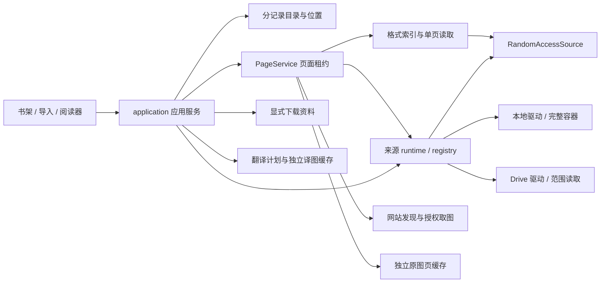

# 漫画来源与缓存架构实施记录

日期：2026-09-22，Drive 授权、来源驱动边界与作品管理更新于 2026-09-23。本轮已在源码中替换旧漫画库，并完成自动化检查和隔离浏览器内的本地阅读验收。设计约束见[来源与缓存架构](COMIC_SOURCE_ARCHITECTURE.md)，实际浏览器记录见[主应用验收](validation/SOURCE_ARCHITECTURE_2026_09_22.md)、[阅读窗口验收](validation/READER_WINDOW_2026_09_22.md)、[启动数据库修复](validation/DATABASE_BASELINE_2026_09_22.md)与[作品管理验收](validation/WORK_MANAGEMENT_2026_09_23.md)。**未发布商店或生产部署；Drive 只有临时 HTTPS 测试页。用户已确认真实网页导入阅读，并反馈授权修复后的流程恢复正常；代理未读取其私人文件或凭据。真实账户重启恢复和长期续期未单独确认。**

本轮按新库实现，8 个来源相关数据库统一采用 `node-comics-sources-v1-` 命名空间，打开时先核验结构。没有读取、迁移或清理用户已有旧库，早期导入需重新导入。旧 `src/library/`、顺序解码整卷图片的导入链和复杂出版关系 UI 已删除。旧设计 / 实现文档保留历史依据，不作为当前功能清单。

## 实际模块与数据流



| 入口 | 当前职责 |
| --- | --- |
| [comics/domain](../apps/extension/src/comics/domain/index.ts)、[repositories](../apps/extension/src/comics/repositories/index.ts) | `Work → ReadingUnit → Document`，独立 revision、page descriptor、内容物化身份、位置与翻译绑定；分记录查询和变更，不在目录记录中保存 Blob |
| [application/library-service.ts](../apps/extension/src/comics/application/library-service.ts) | 书架分页、目录 / 阅读 ViewModel、位置保存、删除与引用释放 |
| [application/import-service.ts](../apps/extension/src/comics/application/import-service.ts)、[import-journal.ts](../apps/extension/src/comics/application/import-journal.ts) | 本地复制、文件 / 图集与通用 `SourceSelection` 登记、索引与中断恢复；导入不创建翻译任务 |
| [storage/containers](../apps/extension/src/storage/containers/index.ts)、[storage/bytes](../apps/extension/src/storage/bytes/database.ts) | 完整源文件分块写入、增量摘要、去重、引用、读取租约及删除 |
| [formats/contracts.ts](../apps/extension/src/comics/formats/contracts.ts)、[formats 说明](../apps/extension/src/comics/formats/README.md) | 来源无关的随机字节接口；索引只生成定位符，`materialize()` 只返回请求页 |
| [pages/service.ts](../apps/extension/src/comics/pages/service.ts) | 当前页优先、最多两个活跃读取、同页请求合并、内容规范化、摘要和每消费者独立租约 |
| [sources/contracts.ts](../apps/extension/src/comics/sources/contracts.ts)、[registry.ts](../apps/extension/src/comics/sources/registry.ts)、[runtime.ts](../apps/extension/src/comics/sources/runtime.ts) | 通用来源契约与注册，按 provider 打开文件源、装饰范围缓存、跟踪与关闭活跃来源；不导入具体云盘 |
| [sources/install.ts](../apps/extension/src/comics/sources/install.ts)、[source-service.ts](../apps/extension/src/comics/application/source-service.ts) | 安装入口显式注册驱动；应用服务按注册能力提供来源列表、选择与账户重连 |
| [sources/google-drive/driver.ts](../apps/extension/src/comics/sources/google-drive/driver.ts)、[drive-connect](../apps/drive-connect/README.md) | Drive 品牌、选择结果映射、冻结快照校验、授权桥、账户与文件身份、版本和 Range 协议；不维护漫画目录或缓存策略 |
| [comics/acquisition](../apps/extension/src/comics/acquisition/index.ts)、[download-service.ts](../apps/extension/src/comics/application/download-service.ts) | 网站主动下载的任务、进度、暂停和重试；与阅读窗口取图分开 |
| [source-lifecycle.ts](../apps/extension/src/comics/application/source-lifecycle.ts) | 启动恢复、源连接失效、重连及各存储类别清理 |
| [export-service.ts](../apps/extension/src/comics/application/export-service.ts) | 页面租约串行导出、已有译图导出和完整本地源文件原字节导出 |

网站适配器仍位于 `src/sources/`，其消息来源、导航和资源范围校验继续生效；Google Drive 不进入网站 DOM 注册表。`ReadingCopy` / `Page` 是供现有阅读器和翻译控制器消费的运行时 ViewModel，持久目录不再内嵌完整页面及译图状态。

## 文件来源驱动边界

2026-09-23 的复审发现三个侵入点：应用导入 / 重连直接消费 Drive 类型，PageService 把所有非本地文件当 Drive 并强转快照，Drive 字节源反向导入范围缓存并配置应用清理。现以 `FileSourceDriver → registry → runtime` 和通用 `SourceSelection` / `SourceAccessChange` 替代；App、导入、页面、阅读器与翻译不再直接依赖 Google 实现。来源负责取得可信字节，范围缓存预算与写入策略在公共 runtime，页缓存和目录失效在页面 / 应用服务。复审及验证范围见[来源驱动边界记录](validation/SOURCE_PROVIDER_BOUNDARIES_2026_09_23.md)。

`providerItemId` 是连接内稳定资源身份，例如 Drive fileId；`sourceKey` 是包含版本的文档去重身份。相同文件的多个版本共用一个 SourceBinding，各 revision 保存独立快照；打开时驱动验证该冻结快照，不能用后续修改的 locator 替换旧版本。撤权作用于指定连接 / 资源下的全部版本，删除一个文档仅在没有其他引用时删除共享 binding。

驱动实现公共契约、安装入口显式引用驱动、构建配置声明 OAuth / host permissions，都是必要连接；解耦不等于没有任何依赖。目标是在现有文件格式能力内新增来源时，只新增驱动和注册 / 配置，不修改核心、阅读器或翻译。网站继续使用独立的网页发现与图片读取流程，不伪装成文件源。

本次不迁移早期开发数据，也不切换或清空整个数据库。早期 Drive 测试条目曾把版本 sourceKey 存入 providerItemId，不符合新稳定资源契约；需要用户从书架移除这些测试条目后重新导入，**重复登记同一来源不会修复旧条目**。代码不自动删除既有记录或字节，本地完整源文件不受此限制影响。

## 完整源文件与索引

本地字节库固定使用 **`node-comics-sources-v1-container-bytes` / `chunked-idb-v1`**，每块 1 MiB。没有实现 OPFS，也没有静默切换后端、双写或外部持久文件句柄。Chrome、Edge、Firefox 代码走同一路径；是否在特定浏览器运行通过，单独由验收决定。

导入先持久化意图，分块复制 File 并在同一次读取中计算 SHA-256。块、操作预约、ready 对象、引用及读取租约在字节库内提交；SHA-256 + 长度标识不可变容器，重复内容可共享物理字节。只有完整字节发布后才登记文档并建立格式索引，普通本地文件不会产生整卷原图页缓存。多图作为有序图集引用各自容器，不额外打包一份 ZIP。

目录库为 `node-comics-sources-v1-catalog` 新基线。索引使用 `revisionId + pageId` 标识页，ordinal 只表示顺序；页面定位符与真正读取后得到的图片 SHA-256 分开。阅读位置独立保存 `documentId / revisionId / pageId / relativeOffset`。清理缓存不改变修订、页身份、位置或翻译操作键。

取消复制清理该操作暂存，失败不会显示整本已导入。完整字节已经提交、目录尚未发布时，启动按导入 journal 点查引用并保留可恢复条目；已发布文档可从容器重新建立索引。复制未完成仍需重新选择文件，不能把部分文件宣称为可重启读取的完整来源。最后一个引用释放后才删除容器；活跃读取租约会延后物理删除。

本地 CBZ/ZIP、PDF、未加密 MOBI、CBR/RAR 和单图已有驱动。ZIP / MOBI 解析在 Worker，PDF 使用 PDF.js Worker 和显式范围 transport；RAR 仍需有界完整压缩输入的 WASM 会话，不能宣称低流量随机读取。精确格式、索引、字节和时间上限集中维护在[格式模块说明](../apps/extension/src/comics/formats/README.md)。ZIP64、加密、分卷、DRM 和超预算样本明确拒绝，不通过无限资源重试绕过限制。

## 分开的存储策略

| 类别 | 当前默认与清理语义 |
| --- | --- |
| 完整本地容器 | 不参与 LRU；删除文档释放引用，最后引用与读取租约结束后回收 |
| `source-pages` | 2 GiB、独立 LRU；用于远程按需阅读原图，普通本地文件默认不重复保存展开页 |
| `source-ranges` | 256 MiB、独立 LRU；按连接、文件、来源版本和范围标识 Drive 字节，完整本地容器不重复缓存分段 |
| `translations` | 默认 1 GiB，由现有译图缓存设置维护；按 API origin、用户和不可变输出身份隔离，清理只导致重新取得已有有效结果 |
| `thumbnails` | 64 MiB、独立 LRU；低并发按需生成封面，不为书架扫描全卷 |
| `downloads` | 显式网站下载资料，不参与自动 LRU；用户删除文档或下载资料时释放 |

各自动缓存是独立的 `node-comics-sources-v1-<name>` IndexedDB。元数据维护用量、预约和 LRU，不通过加载全部 Blob 求和。清理 / 删除使用 epoch 和 owner generation 防止在途旧读取重新发布；缓存写失败不阻止已经取得的页面在内存显示。设备总空间不足可以清可重建缓存，不自动删除完整容器或主动下载资料。真实磁盘耗尽 / 浏览器回收与任意崩溃时刻没有全数实测，自动化故障注入不等于这些环境均通过。

## Google Drive 的已实现与未验收边界

独立 HTTPS 页面源码位于 `apps/drive-connect/`，两种授权策略共用 Google Picker，scope 均为 `drive.file`。Chrome 构建可用 `VITE_GOOGLE_CHROME_CLIENT_ID` 配置与稳定扩展 ID 匹配的 Chrome Extension client，由 `identity.getAuthToken` 管理凭据缓存和过期。只有用户点击 Drive 入口才允许交互授权，读取漫画始终非交互；Edge / Firefox 和未配置 Chrome client 的构建继续使用 GIS token model。两种模式仍需 `VITE_DRIVE_CONNECT_URL`、Web client、同项目 API key / project number 和匹配的 HTTPS origin。Google 控制台配置由用户协调，实际值只在忽略配置中，生产页面尚未部署。该 scope 允许修改所选文件，应用只实现读取，不写入或删除云盘文件。

背景验证固定 HTTPS origin / path、nonce、标签页、顶层 frame、sender 扩展身份、documentId、有效期和一次性消费；导航变化及断开会使旧流程失效。账户用 Drive `about.user.permissionId` 核对，文件由固定 Google API 重新核实，Picker 返回地址不作为任意网络代理。`chrome.storage.local` 只保存自动恢复的账户与连接代次，不保存任何 token；短期凭据在内存 / 可信 `chrome.storage.session`，不进业务数据库、localStorage、同步存储或日志，也没有后端 refresh token。Chrome 向 Picker 交付的 5 分钟期限是桥租约，不是 Google token 的到期时间。

代码仅开放 **CBZ/ZIP 与单图** 的远程登记。Drive PDF / MOBI / RAR 明确拒绝，不能通过格式驱动降级为整包下载。Range source 验证 206、Content-Range、字节长度和上下界，拒绝非请求整段的 200 并取消响应体；读取前后核对文件版本，版本变化后停止该 source，分段键包含版本。相同范围并发合并；单个消费者取消不影响其他消费者。相邻范围合并尚未实现。

Chrome 会话存储清空后，可凭未断开的账户记录向 Chrome 静默恢复；网页 token 到期或静默取凭据失败时提示重新连接，不能等同撤权而清掉源缓存。用户断开会持久移除自动恢复记录和本机 token 缓存，并清理该连接的自动原图 / 分段 / 缩略图，保留书架失联条目。取消 Picker 仅取消选文件，不撤销 Chrome 连接。已撤权文件需重新选中授权，单纯恢复账户不自动重新开放所有文件。离线设备不能立即知道 Google 端撤权，不承诺远程擦除。

已修复网站来源监听器抢答 Drive 请求的问题；有效会话在专用桥和 SDK 就绪后自动打开一次 Picker，取消后可以再次选择。“切换 / 重新连接账户”需用户明确点击，并提示使用临时网页授权；Chrome 租约到期时要求回插件重新打开，不自动调用 GIS。网页 token 往返不续长原到期时间，同一连接保留代次。原回传故障见 [Drive 导入回归](validation/DRIVE_IMPORT_2026_09_22.md)，两种授权策略与重启恢复见 [Drive 授权回归](validation/DRIVE_AUTH_2026_09_23.md)。

用户已反馈网页授权后的真实文件“已导入并能阅读”。Chrome 托管授权、真实多账户、云盘首屏 / 跳页网络统计、令牌更新和撤权仍未完成真实验收。模拟契约和隔离 Chrome 浏览器已覆盖两种模式的导入阅读、网页 token 复用、Chrome 重启后静默恢复以及断开后禁止恢复；**模拟 Chrome Identity API 不证明用户 Google grant 已正常续期**。

## 书架、阅读和导出

书架按作品分页展示 `Work → ReadingUnit → Document`，以应用服务 ViewModel 和命令驱动。书架和阅读器只提供“导入漫画”入口，在弹框中选择本地文件或注册的文件来源；Google Drive 名称来自驱动，不在通用组件内硬编码。**网站导入继续由网站页面内的嵌入按钮触发**，随后进入来源目录 / 图片选择，插件页不新增网站来源按钮或输入 URL 的导入对话框。作品详情恢复分类筛选、元数据编辑、封面、首选版本、同作品归属、批量已读及顺序管理，卡片沿用旧版布局并收起次要操作；导入支持全库查询作品和单元。旧出版套系、收录、再版与作品关系图不恢复，决策见[作品管理交互](WORK_MANAGEMENT_UX.md)。没有本地原图页缓存不再成为禁读条件，按需读取失败保留可操作原因。

连续阅读最多保留当前及前后相邻 **3 章 / 全局 11 页 DOM**，解码另受约 5 页 / 3200 万像素限制。页高前缀和占位支持直接跳进未挂载区域，页 ID + 相对偏移用于跳页、尺寸更新、适应方式切换及重开恢复。30 章、每章 120 页的隔离夹具已验证数量上限、跳第 100 页、失败占位和 390px 窄屏，截图见[阅读窗口记录](validation/READER_WINDOW_2026_09_22.md)。

导出通过页面租约串行读取，导出所有页是用户显式发起的完整读取。支持文件选择器的环境可流式写 CBZ / ZIP 或完整源文件；无流式保存能力的缓冲下载及 PDF 有 128 MiB 上限。完整源文件导出原样读取已保存容器，不解压重打包。已有译图导出不创建新的翻译任务。

保留 16 个 UI 语言字典，主要新流程使用字典键。新加键的简体中文以外目前采用英语 fallback，旧翻译不变；这不是 16 语言均已人工复核的翻译交付。部分服务错误诊断仍为中文。

## 验证入口与剩余范围

在 `apps/extension` 执行当前脚本：

```text
npm run check
npm test
npm run build
npm run build:web
```

以上为实际存在的检查 / 构建入口。自动化覆盖分记录仓储、大库元数据、容器去重和恢复、缓存隔离、页面租约、格式边界、Drive 模拟消息 / Range、阅读窗口及导出；来源基线见[主验收记录](validation/SOURCE_ARCHITECTURE_2026_09_22.md)，最新 Drive 改动后的全量结果见[授权回归](validation/DRIVE_AUTH_2026_09_23.md)。自动化不能替代浏览器文件解码、真实 OAuth 或供应商验收。

浏览器脚本和环境变量集中维护在[scripts/README.md](../scripts/README.md)。Chrome 普通网页、Chrome for Testing 解压扩展和 Edge 解压扩展已有本地 CBZ 导入、跳页、关闭浏览器重开、缓存清理和窄屏证据；格式样本的实际运行范围见主验收记录。Firefox 没有 runtime 实测，Firefox 构建结果也不能替代运行验收。

还不能报告完成的项目包括 Chrome 托管与跨浏览器真实授权、Drive 多账户 / 撤权 / 版本变化、Firefox runtime、操作系统重启、真实低磁盘 / 浏览器回收、任意时刻崩溃，以及所有恶意或复杂格式样本。网站真站点全面回归和真实翻译供应商效果不因本次本地隔离验收自动成立。未新增远端漫画同步、原文件代理、后端计费规则或旧库迁移。
