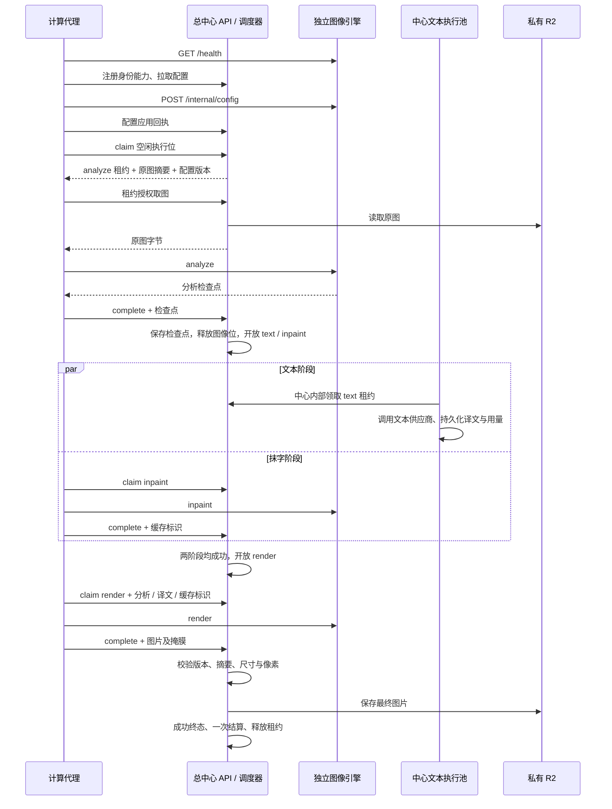

# 总中心与计算节点的任务交互

本文依据当前 `cluster_api.py`、`scheduler.py`、`workers.py`、`dispatcher.py` 和 `services/compute-agent/agent.py`，描述保留的对外协议。仓库不附带图像引擎；本文不涉及其内部计算实现。

## 职责与流转

总中心是任务状态与执行权的唯一来源。代理主动拉取单个阶段；中心不直接调用引擎，不将整页任务长期绑定给某台机器。每次领取重新参与公平调度，按可用能力、目标语言、引擎版本、节点配置和执行位筛选，再按实时／预存份额、用户权重及阅读顺序选页。已运行阶段不被新实时页抢断。

`analyze` 完成即释放该租约；等待文本期间不占图像执行位，仍占用户在途容量和额度预占。无文字分析直接结束为 `no_text`。`text` 与 `inpaint` 均成功才开放 `render`；任一终态失败会阻止后续交付。

## 身份、配置与阶段接口

代理访问中心均携带 `Authorization: Bearer <node_token>` 和 `X-Node-Id`。节点身份由后台预建；注册不能创建身份、扩容、修改物理资源绑定或解除停用。

| 接口 | 请求／返回与用途 |
| --- | --- |
| `POST /internal/nodes/register` | 报告 `capabilities`、`engine_version`、`device`、`resource_id`；返回中心配置 |
| `GET /internal/nodes/{id}/config` | 拉取配置版本、启用状态、执行位及代理／引擎参数，同时更新节点在线时间 |
| `POST /internal/nodes/{id}/config/applied` | 上报 `version`、实际 `engine` 与 `supported_languages`，失败报告 `ENGINE_CONFIG_FAILED`；中心确认后才能领取 |
| `POST /internal/nodes/{id}/claim` | 提交 `stages` 与 `config_version`；无可用任务返回 `lease: null` |
| `GET /internal/leases/{id}/input` | 携带 `X-Lease-Token`，中心验证租约后从对象存储读取原图，代理复核 SHA-256 |
| `GET /internal/leases/{id}/input/authorize` | 缓存命中时重新授权，返回摘要；无需读取 R2 |
| `POST /internal/leases/{id}/heartbeat` | 提交 `lease_token` 续期；中心决定有效期 |
| `POST /internal/leases/{id}/complete` | 提交 `lease_token` 及 `result` 或 `error`，必须二选一 |

领取返回 `lease_id`、`lease_token`、`job_id`、`stage`、`input.url/sha256`、`config`、`analysis`、`translations`、`language`、`cache_key`、`expires_at`。不下发数据库、R2 或供应商密钥。任务引擎快照现在只含 `version`；模型、字体和影响结果的算法配置由接入引擎纳入版本标识，并与中心 `CLASSIC_ENGINE_VERSION` 一致。

配置变更时代理停止新领取，等待所有当前阶段和交付结束，再应用引擎配置并向中心确认。节点被停用只禁止新领取；旧凭据轮换后立即失效。引擎重启或实际配置漂移触发重新同步。

## 代理与引擎的最小接口

| 接口 | 合约 |
| --- | --- |
| `GET /health` | `ready`、`instance_id`、`version`、`resource_id`、`device`、`capabilities`、`runtime`；能力须为 analyze/inpaint/render |
| `POST /internal/config` | 接收中心 `engine` 覆盖字段，返回实际 `runtime` 和 `supported_languages` |
| `POST /v1/analyze` | 返回分析检查点 |
| `POST /v1/inpaint` | 返回抹字缓存标识 |
| `POST /v1/render` | 返回最终 PNG 与掩膜 |

引擎 POST 请求使用独立 `engine_token`。阶段输入含 `config`、`scope=job_id`、`input_hash` 和 Base64 `image`；可选缓存优化为 `image_ref`，以及阶段需要的 `analysis`、`translations`、`language`、`cache_key`。所有结果必须带一致的 `version` 与 `input_hash`。

- `analyze`：`width/height`、`segments`（每项唯一 `id` 与非空 `source`）、等量 `regions`（含四点文字多边形 `lines`），有文字时提供同尺寸 PNG `mask`；检查点限 4 MiB。无文字时 `segments/regions` 为空、`mask` 为空。
- `inpaint`：提供 64 位小写十六进制 `cache_key`。中心只保存键与节点标识，不持久化中间清理图。
- `render`：Base64 PNG `image`、`mask`、`glyph_mask`；尺寸须等于原图，字形掩膜非空，两掩膜并集之外 RGB 不得变化。中心恢复原图 alpha 后保存最终字节。

阶段可在不同节点执行；当前调度不保证 render 回到抹字节点。接入引擎必须能在 `cache_key` 无效或跨节点时根据授权原图和分析重建所需背景。代理的 `image_ref` 丢失仅在引擎明确返回 HTTP 410 / `ENGINE_INPUT_CACHE_MISS`（计算前）时，用已授权字节重试一次；不因不确定超时盲目重复调用。

## 失败、取消与最终交付

中心用租约令牌、节点身份、代次、过期时间和任务状态阻止旧结果提交。代理持续续租至结果交付结束；完成响应丢失时重发同一结果，不重新计算。中心保存结果摘要并拒绝同租约冲突内容；重复相同成功结果不重复结算。

代理发现授权失效后不提交图片或检查点；等本次计算返回，再发送停止回执释放占用。维护进程处理到期租约：先尝试恢复已写入最终对象，再决定是否有限重试当前阶段，复用已完成分析与译文。默认最多三次阶段尝试，具体以中心配置为准。

图片输出由中心解码与校验，先记录内容寻址对象键，再写 R2，最后确认资产、成功终态及额度结算。图像节点的 HTTP 成功不等于任务成功。文本供应商用量与用户页数分开计量。

## 保留与删除边界

保留：中心受理／调度／租约／恢复、文本执行池、R2 与权限、计算代理及其协议测试。移除：自带图像实现、其模型准备与专用启动脚本、单元测试和图像效果／性能记录。新引擎须单独接入；默认关闭常规翻译不影响阅读器原图和已授权历史结果。
