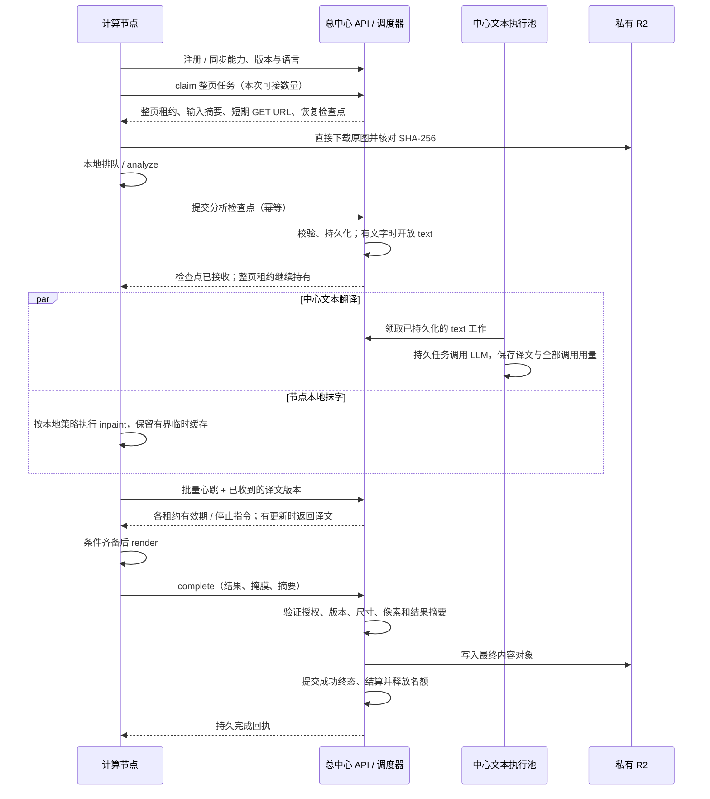

# 总中心与计算节点的任务交互

2026-09-19 设计修订并已完成本地实现。**已确认：新节点的执行位表示同时承接的整张图片任务数，从领取到整页交付结束持续占位；节点内部串行、并行、批处理与设备分配由节点自行决定。** 本文约定 v2 协议；具体消息、数据库切换和验收边界见 [v2 实施说明](COMPUTE_V2_IMPLEMENTATION.md)。

新常规任务已使用 page / text 独立租约，图像节点从 R2 授权直读。旧 analyze / inpaint / render 接口已删除，不提供旧任务兼容入口。本文只调整常规翻译计算协议，AI 重绘仍使用中心独立执行池；代码完成不代表线上已切换。

## 1. 职责与目标流程

中心负责受理、整页公平分配、执行授权、文本供应商调用、持久检查点、图片验收与一次结算。计算节点负责已接任务的本地排队、图像计算和结果交付。中心只依赖节点的外部任务协议；代理与引擎可以分开，也可以是一个进程。

恢复任务有有效分析检查点时跳过 analyze，已有译文时直接复用。无文字检查点经中心验证后直接结束为 `no_text`，不调用文本模型，也不要求抹字或嵌字。图中的并行只表达两项工作没有相互依赖，不要求节点采用特定执行方式。

## 2. 执行位与调度边界

`execution_slots = N` 表示中心最多让该节点同时持有 N 个未释放的整页租约。例如 N=4 时，节点可以接 4 页，然后串行计算、同时计算 2 页，或按自身策略交错执行各页阶段，中心不据此推断 GPU 并发数。

| 情况 | 是否占节点名额 |
| --- | --- |
| 已领取，正在本地排队、取图或计算 | 占用 |
| 等待中心文本结果、上传结果或等待完成回执 | 占用 |
| 成功 / 无文字 / 失败已由中心确认并结束租约 | 释放 |
| 已取消，但节点尚未确认停止当前工作 | 仍占用，直到停止回执或中心回收 |
| 租约到期，尚未由维护进程确认回收 | 仍计入未释放租约，不能靠过期自行扩容 |

- 领取数量由节点按实际可承接量请求，中心在事务内按 `max(0, execution_slots - 未释放整页租约数)` 截断。节点可以少领，不能通过多个进程、并发请求或自报空闲量突破上限。
- 在一个批量领取请求内，每分配一页都重新更新公平调度状态；不把一批直接交给同一用户。实时 / 预存、同级用户权重与阅读顺序仍由中心控制。
- 正常路径整页留在同一节点，不再让 inpaint / render 重新参与全局领取。节点失联或显式失败后才由中心恢复并重新分配。节点不能私自转交租约。
- 缩容只约束后续领取，不中断已承接任务；停用同样只禁止新领取。用户取消会使执行授权失效，与管理后台停用节点不同。
- 节点整页名额与账户滚动 60 秒普通 30 / PLUS 100 张新增翻译准入分别计算；中心文本池的容量、供应商 RPM 和调用时限也独立保留。

取舍：等待文本会占接单名额，但节点可计算其他已接页面。名额过大时，本地待处理任务会使后来实时页等待更久；中心只保证**尚未分配任务的公平分配**，不能承诺节点内部的执行次序或 GPU 时间份额。首版保留有界名额和任务处理时限，不增加远程线程控制、阶段抢占或独立的节点预取队列。

图像池公平计量建议改为整页名额占用时间：领取时预记整页估时，结束时按中心记录的占位时间校正，包含本地排队、文本等待及交付。原实时 / 预存份额在此口径下解释，不再称为物理设备计算时间；文本池单独计量。节点报告的阶段耗时用于观测，不决定授权和结算。

## 3. 输入改为租约授权的 R2 直读

建议采用：**中心检查访问资格并签发单对象短期 GET URL，节点直接向私有 R2 取原图。** `claim` 同时返回 URL、`url_expires_at`、SHA-256、字节数、MIME 和尺寸，正常路径无需再向中心请求原图字节。

现有 [storage.py](../backend/app/storage.py) 已提供 `download_url`，签名本地生成，无需 HEAD 或 GET 探测 R2。R2 预签名 URL 是限定对象、操作和期限的持有者授权，支持在到期前重复使用；使用 S3 API 域名。[Cloudflare 官方说明](https://developers.cloudflare.com/r2/api/s3/presigned-urls/)

需要保留以下边界：

1. 签发或续签前验证节点身份、当前租约及代次、任务未取消、原图访问仍有效，并记录授权访问时间。只授权该任务对应原图的 GET，不把 R2 长期凭据或任意对象读写权限下发节点。
2. 建议默认 URL TTL 上限 60 秒，并限制为不晚于本次已确认租约到期时间，预留时钟误差。有效下载窗口不足时先续租再签发；本地排队较久的任务在真正取图前续签，不把 URL TTL 当作整页处理时限。
3. R2 不查询中心租约。取消、回收或轮换节点凭据可以立即阻止后续续签与提交，但**已经签出的 URL 仍可能在其剩余有效期内可用**。直读设计接受这个短窗口；节点一旦收到停止指令便停止使用已取得的 URL 和缓存。
4. 对 R2 使用独立的无控制凭据 HTTP 客户端，不发送 `Authorization: Bearer <node_token>`、`X-Node-Id` 或租约令牌。仅接受受信控制响应中的 HTTPS URL，并校验部署配置的 R2 精确端点；禁止任意主机与自动跨域跳转。
5. 节点按字节上限读取，核对 SHA-256 和图片信息；URL、查询参数、图片文字和完整错误响应不进入默认日志。签名响应使用 `Cache-Control: no-store`。
6. URL 已过期时向中心续签，继续同一租约；网络中断只重试下载。403 先核对有效期并有限续签，仍失败则报告存储授权错误；404、摘要不符或内容非法均有界失败，不循环领取新任务。

缓存命中不再调用独立的“缓存授权”接口：当前 `claim` 或成功心跳就是执行授权，原图字节必须匹配该任务摘要。缓存只证明字节可复用，不能延长租约；已过期或收到停止响应后禁止启动后续计算。恢复到新租约时重新核对输入和配置版本。

这样去掉生产计算链路中的中心原图转发和每阶段缓存再授权。中心在最终验收时仍可能读取原图做像素对照，这与节点取图是两项用途。隔离测试所用本地对象存储不生成 R2 URL，由测试适配器覆盖，不保留生产静默回退到中心转发的路径。

## 4. 必须保留与可以收缩的环节

| 现有环节 | 目标处理 | 理由 |
| --- | --- | --- |
| 节点身份、能力 / 语言 / 引擎版本匹配 | 保留 | 防止越权和把页面交给不兼容实现 |
| 租约、续期、代次、取消与失联恢复 | 保留，改为整页租约 | 超时后的旧节点不能覆盖新执行结果 |
| 中心受理、公平调度、用户容量和一次结算 | 保留 | 节点内部调度不接管业务权益 |
| 中心转发原图 | 改为 R2 短期 GET URL | 减少中心带宽和原图缓冲 |
| 每阶段 `input/authorize` | 移除常规调用，只保留 URL 续签用途 | 当前整页授权已经覆盖本地缓存复用 |
| analyze / inpaint / render 三次 claim / complete | 改为一次整页 claim、分析检查点、最终 complete | 减少租约切换、重排与跨节点抹字重算 |
| 分析检查点 | 保留 | 中心需要 OCR 文本调用 LLM，恢复时避免重复 OCR |
| 中心文本执行池与持久译文 | 保留 | 密钥、供应商限流、全部子调用成本与文本重试统一管理 |
| inpaint 的中心完成通知与 `cache_key` | 移出外部协议 | 中心无需据此调度 render；清理图与缓存引用由节点管理 |
| 节点逐阶段进度 | 可通过心跳报告，不设独立强制接口 | 可观测即可，不为每个内部步骤增加服务端状态机 |
| 节点线程数、显存调度、OpenCV / Torch 参数 | 归节点本地配置 | 不属于中心接单容量或跨实现协议 |
| 原图引用、代理到引擎的 Base64 / `image_ref` | 归节点内部协议 | 中心无需规定节点是单进程还是代理加引擎 |
| 完成摘要、R2 持久化和终态事务 | 节点直传，中心登记 | 图像与 alpha 由可信计算节点处理；中心核对租约、摘要、上传回执并结算 |
| WebSocket、消息队列、常驻反向连接 | 首版不引入 | 主动领取和心跳足以完成这一流程 |

`resource_id` 可保留为稳定的逻辑节点资源组标识和运维展示字段，不强制等于一张 GPU。一个节点可以管理多张设备；中心只限制这个节点承接的整页数量。

## 5. 目标接口与消息约束

以下 v2 接口已经实现，统一使用 `/internal/compute/v2` 前缀。新节点显式声明协议版本；不让相同字段在未协商版本的情况下混用阶段 / 整页语义，新节点不包含旧引擎兼容适配层。

控制请求携带节点独立凭据和 `X-Node-Id`。对具体租约的操作还携带 `lease_id`、`lease_token`，中心从数据库校验代次及任务归属，不能相信节点自行报告的状态。

节点身份仍由后台预建，注册不能创建身份、扩容或解除停用；节点不持有数据库、R2 长期凭据或文本供应商密钥。轮换节点凭据后旧凭据立即失效，存量租约需使用有效凭据恢复通信，不能继续靠旧凭据续期。

| 接口（相对上述前缀） | 最小用途 |
| --- | --- |
| `POST /nodes/register` | 报告协议、引擎版本、支持语言、就绪状态；返回中心配置和该身份尚未释放的租约清单，用于启动对账 |
| `POST /nodes/{id}/claim` | `request_id`、已知配置版本、本次可接数量；返回 `leases[]`，每项是整页输入、配置快照、租约期限和已有分析 / 译文 |
| `POST /nodes/{id}/heartbeat` | 批量提交各租约令牌和已收到的 `translations_revision`；逐项返回续期、停止 / 终态，以及尚未确认收到的译文；同时返回变化的节点配置 |
| `POST /leases/{id}/analysis` | 提交分析检查点和稳定摘要；持久化后才开放中心文本任务，相同检查点重试返回同一回执 |
| `POST /leases/{id}/input/authorize` | 仅在需要新下载授权时调用，校验租约后返回新短期 URL 和输入元数据，不返回图片字节 |
| `POST /leases/{id}/output/authorize` | 提交固定结果元数据，取得限定对象、长度、类型和 MD5 的临时 PUT URL |
| `POST /leases/{id}/complete` | 提交结果元数据与上传 ETag，或固定错误码；中心提交终态事务后返回稳定回执 |

空闲节点也发送不含租约的心跳，更新在线状态与配置。心跳返回中心时间；每个租约独立核对任务状态、代次与原图访问有效性：一个已结束租约不能使整批其他任务续期失败，遗漏的租约不会自动续期。只在节点报告的译文版本落后时返回译文正文，避免每次心跳重复发送。

节点保持变更长轮询，文本状态提交后即唤醒批量心跳以接收译文，续租心跳独立运行；阅读器也通过长轮询同步完成状态。通知不是持久消息，重连后使用数据库状态与游标恢复。具体约束见[实施说明](COMPUTE_V2_IMPLEMENTATION.md)。

保留的数据合约：分析包含与原图一致的 `width/height`、具有唯一 `id` 和非空 `source` 的 `segments`、等量且按项对应的 `regions`（`lines` 为四点文字多边形），有文字时带同尺寸非空 PNG `mask`；无文字时两个列表为空且 `mask=null`。译文按 segment ID 对应，并绑定分析摘要和目标语言。最终结果只包含 `version`、`input_hash`、分析／译文摘要，以及 PNG 的 SHA-256、MD5、长度、尺寸与类型；不再把结果图片或掩膜提交中心。分析结构检查见 [classic.py](../backend/app/classic.py)，结果登记见 [compute_v2.py](../backend/app/compute_v2.py)。

幂等与恢复约束：

- **领取也要幂等。** 节点先保存 `request_id` 再发送请求；中心按节点身份与请求编号在领取事务内保存分配回执，同编号不同请求内容拒绝。响应丢失后重发相同编号只取回原分配，不再占新名额。已回收的分配返回结束状态，不能凭旧编号再次领取；明确收到空结果后，下一轮才使用新编号。重取有效回执可以刷新输入 URL，但不能延长执行权。
- 分析检查点绑定任务、输入摘要、引擎版本和当前代次；同代次不同分析内容返回冲突，不替换已触发文本调用的内容。无文字结果在该事务中结束整页租约。
- 申请上传授权时先冻结结果摘要；相同结果重发取回原回执，冲突内容拒绝。结果确认丢失时保留本地结果并重试交付，不能重新计算或把任务当成已释放；心跳也可返回已持久化的完成回执。
- 中心持久化分析和译文，清理图只留在节点有界临时缓存中。节点失联后，新节点拿到更高代次的整页租约，复用检查点和译文，必要时重做抹字。缓存键不能作为跨节点恢复依据。
- 整页图像租约与中心 text 租约独立。图像节点失联不会重新创建仍在运行或已成功的文本调用；按任务、分析摘要和文本配置识别已有文本工作，复用其译文和用量记录。
- 节点按最近一次确认的 `expires_at` 管理本地执行截止，结合中心时间和单调时钟留出误差余量。续期网络不确定时只重试心跳，到授权截止便停止启动新工作；已无法中断的本地计算结束后丢弃旧代次结果。中心回收后允许其他节点恢复，不承诺物理计算恰好执行一次。
- 心跳不能让卡死任务无限占位。整页承接时长、等待文本时长、交付重试时限与恢复次数分别有界，由中心配置并在领取时返回；处理时限与短租约 TTL 分开。文本达到其时限时中心结束任务并通知节点停止。

进程重启先注册对账，只恢复仍有效且本地能继续的租约；不能继续的租约报告失败，失效租约停止。中心在新领取前仍按全部未释放租约计数，防止重启后多领。节点停止回执或维护回收释放名额，不能仅依赖进程内计数。

停止回执通过 `complete` 的固定错误码 `LEASE_STOPPED` 表达。中心可在验证原节点与原租约令牌后确认该旧租约停止，但不接受其图片 / 检查点，不修改新代次，也不据此让已取消任务重新排队。失败、取消和到期后的租约释放与业务任务是否允许重试分别决定。

## 6. 配置只控制协议与能力

中心保留启停、`execution_slots`、轮询 / 心跳 / 请求时限、任务处理与恢复限制、可调度语言及接受的引擎版本。节点报告自身实际能力；管理员允许的语言与节点支持语言取交集。模型、字体和影响结果的算法配置纳入引擎版本，用于恢复和结果复用匹配。

普通容量调整、停用和轮询参数更新不需要先排空节点、调用本地引擎配置接口再提交应用回执：新设置直接约束后续领取 / 心跳，存量租约继续按其配置快照完成。缩容后若已持有数量超限，停止补领直到回落。

影响结果的引擎版本或能力变化需要节点确认实际就绪。节点可以排空旧任务再升级，也可隔离保留旧版本完成存量任务；中心只检查新任务的能力匹配及交付版本，不规定节点如何升级。若无法继续执行存量版本，显式失败后走恢复，不能用新版本悄悄完成旧快照。

移除中心对 `torch_threads`、`opencv_threads`、本地缓存布局和引擎内部 HTTP 接口的强制约束，也不再要求所有配置变化都执行 `config/applied`。代理加引擎的现有接入形式可以保留在节点实现中。

## 7. 结果交付：节点并发直传 R2

计算节点负责生成最终 PNG、保留原图 alpha、计算 SHA-256 与 MD5，先把固定图片与元数据写入有界恢复日志。渲染完成即释放计算线程；独立交付线程池申请授权并直接 PUT R2，默认最多并发 4 页，与下载及后续页面计算重叠。上传积压仍受整页租约数、页面内存和日志预算约束。

中心只签发当前节点、当前有效租约对应的不可变内容键；URL 最长 60 秒，且不超过租约／处理截止。签名绑定 `Content-Length`、`Content-Type`、`Content-MD5`、`If-None-Match: *` 和私有缓存策略，节点不接收 R2 长期密钥。R2 校验上传字节的 MD5；条件 PUT 防止复用 URL 覆盖已有对象。原图与最终译图仍按内容共享、长期保留。

节点收到 R2 成功 ETag 后，先持久化上传回执，再向中心提交小型元数据。中心核对身份、租约代次、原图／引擎／分析／译文版本、冻结摘要和 ETag，在一个数据库事务中登记资产、结算并释放租约，不 GET 原图或结果，不做像素验收、HEAD 探测或结果 PUT。可信自管计算节点对产物与上传回执负责；不把此协议作为不可信公开节点的证明机制。

PUT 响应丢失时重试相同对象，412 表示该不可变内容对象已经存在；中心回执丢失时只重交元数据。节点重启从私有日志恢复尚有效租约。租约失效且没有中心终态时，维护进程按现有次数限制重新分配，复用已持久化分析和译文，不从 R2 回读图片恢复旧代次。迟到 PUT 可留下长期保留的对象，但不能发布到已取消或新代次的任务。

这次明确移除了中心图片验收与候选对象发布流程；没有保留旧 Base64 结果接口。签名能力参考 [Cloudflare 临时链接](https://developers.cloudflare.com/r2/api/s3/presigned-urls/)与 [R2 PutObject 兼容性](https://developers.cloudflare.com/r2/api/s3/api/)。

## 8. 当前实现与验收

中心实现为 [compute_v2.py](../backend/app/compute_v2.py)，节点实现为 [agent.py](../services/classic-engine/classic_node/agent.py) 与 [pipeline.py](../services/classic-engine/classic_node/pipeline.py)。旧阶段 API 和代理已删除；运行时不兼容旧任务、旧上传收据或旧节点配置。

验收覆盖容量、公平调度、取消、截止时间、通知重连、丢回执重试、冻结结果恢复和跨代次隔离；具体结果见[流水线验收](PIPELINE_VALIDATION.md)。单页端到端延迟、多页吞吐与纯计算耗时分别报告。
