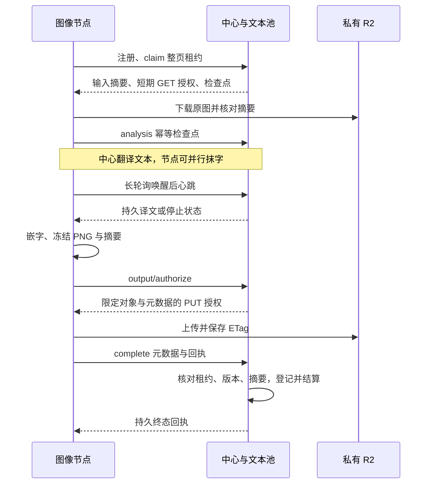

# 总中心与计算节点协议

常规翻译使用 v2 整页协议，中心实现为 [compute_v2.py](../backend/app/compute_v2.py)，节点为 [classic-engine](../services/classic-engine/README.md)。仅支持空库基线与新节点日志，不兼容旧阶段 API、旧上传收据或旧节点配置。AI 重绘使用中心独立执行池。

## 职责与执行位

中心负责受理、公平分配、授权、文本调用、持久检查点和一次结算；可信自管节点负责图像计算、PNG／alpha 正确性及上传回执。`execution_slots` 表示未释放的整页租约数，包含等待文本和交付，不是 GPU 并发数。并发 claim 和到期未回收租约均计入容量；每分配一页重新选举公平候选。

缩容与停用只约束新领取，用户取消要求节点停止并确认。节点按已确认的租约截止停止启动工作；短租约与整页／文本等待／交付时限分别有界。配置默认值与语言能力见[节点配置](NODE_CONFIGURATION.md)。

## 存储与信任边界

授权只覆盖当前租约的原图 GET 或冻结结果 PUT，最长 60 秒且不晚于执行授权截止。已经签出的 URL 在剩余有效期内可能仍可使用；取消或凭据轮换立即阻止后续签发与提交，不能撤销 R2 已签链接。

节点使用独立无控制凭据的 R2 客户端，仅接受配置的精确 HTTPS 端点，禁止任意跳转；按上限读取并核对摘要。403 有限续签，404／摘要或内容错误有界失败。缓存不延长执行权。签名响应不缓存，默认日志不写 URL、原始异常、图片或 OCR 全文。

PUT 绑定长度、MIME、MD5、`If-None-Match: *` 与私有缓存策略。中心完成接口只核对元数据和 ETag，不 GET／HEAD 原图或译图、不做像素验收或结果 PUT；该协议不用于证明不可信公开节点的产物。响应丢失时继续同一冻结对象，412 表示不可变对象已存在；中心回执丢失只重交元数据。

## 具体消息

所有路径以前缀 `/internal/compute/v2` 开始，请求头携带 `Authorization: Bearer <node_token>` 与 `X-Node-Id`。控制 URL 和 R2 URL 的客户端隔离；节点对 R2 不发送控制凭据。摘要统一为 UTF-8 编码的 `json.dumps(value, sort_keys=True, ensure_ascii=True, separators=(',', ':'))` 的 SHA-256；图片摘要直接散列原始字节。禁止 NaN／Infinity。

| 操作 | 请求字段 | 主要响应 |
| --- | --- | --- |
| `POST /nodes/register` | `protocol_version:2`、`engine_version`、`resource_id`、`device`、`supported_languages`、`ready` | `protocol_version`、`server_time`、`config`、该身份未释放的 `leases` |
| `POST /nodes/{id}/claim` | `request_id`、`config_version`、`count`（1–32） | 原 `request_id`、`server_time`、`config`、`leases` |
| `POST /nodes/{id}/updates` | `revision`、`wait_seconds`（0–20） | 新 revision；仅唤醒，节点再从心跳获取租约状态 |
| `POST /nodes/{id}/heartbeat` | `config_version`、`leases:[{lease_id,lease_token,translations_revision,phase}]` | `server_time`、`config`、逐项续期／停止／终态回执；译文有更新才返回正文 |
| `POST /leases/{id}/analysis` | `lease_token`、`analysis_hash`、`analysis` | `analysis_hash`、`receipt`；有文字时为 null，无文字时为稳定终态 |
| `POST /leases/{id}/input/authorize` | `lease_token` | 新下载授权和输入元数据，绝不返回图片字节 |
| `POST /leases/{id}/output/authorize` | `lease_token`、`result` 元数据 | 临时 PUT `url`、必须原样发送的 `headers`、有效期、`result_hash`；已完成返回 `receipt` |
| `POST /leases/{id}/complete` | `lease_token`、`result`＋`etag` 或 `error:{code}`，二选一；可带独立 `timings` | 稳定 `terminal` 回执 |

活动 lease 包含 `lease_id`、`lease_token`、`job_id`、`generation`、`status:active`、`expires_at`、`limits`、`input`、`config.engine`、`language`、已有 `analysis`／`analysis_hash`／`translations`。`input` 包含 `url`、`url_expires_at`、`server_time`、`sha256`、`byte_size`、`mime`、`width`、`height`。GET 授权最多 60 秒，且早于已确认租约截止；签名不访问远端对象。每次授权、成功心跳记录原图授权访问时间。

译文包为 `{analysis_hash, language, translations:{segment_id:text}, revision}`，`revision` 是前三项组成对象的摘要。只有 text 工作成功后才发送完整译文；节点使用变更长轮询唤醒，收到通知立即批量心跳获取译文；独立续租心跳默认 10 秒。最终 `result` 包含 `version`、`input_hash`、`analysis_hash`、`translations_revision` 和 `output:{sha256,md5,byte_size,width,height,mime}`，必须绑定当前分析和完整译文；`mime` 固定为 `image/png`。结果图片不经过中心，旧图片／掩膜字段被拒绝。

分析的 `regions` 保留 manhua-engine 的分组几何和排版参数，同时提供中心要求的四点 `lines`；`segments` 按相同顺序提供唯一 ID 和原文。无文字为两个空列表与 null mask。分析不超过 4 MiB。节点保留原图 alpha、编码最终 PNG，并在申请上传授权前冻结最终字节与摘要；中心只核对元数据尺寸、长度和版本，不验收像素。R2 签名 PUT 绑定固定长度、MIME、MD5 与禁止覆盖条件，中心完成接口只接受登记元数据及 ETag。

`status:stop` 携带固定 `code`；节点必须先停止／排空本地工作，再用 `error:{code:LEASE_STOPPED}` 确认。已结束 lease 返回 `status:terminal`，包含 `outcome`、`job_status`、`result_hash`、`completed_at`。一个失效／错误令牌不影响同批其他租约。

节点失败仅上传固定代码，不上传原始异常或图片文字。允许的错误包括 `ENGINE_UNAVAILABLE`、`CLASSIC_LOCAL_INTERRUPTED`、`INPUT_INVALID`、`INPUT_HASH_MISMATCH`、`STORAGE_AUTH_FAILED`、`STORAGE_UNAVAILABLE`、`CLASSIC_ANALYZE_FAILED`、`CLASSIC_INPAINT_FAILED`、`CLASSIC_RENDER_FAILED`、`ENGINE_VERSION_MISMATCH`、`TEXT_DEADLINE_EXCEEDED`、`DELIVERY_DEADLINE_EXCEEDED`、`PAGE_DEADLINE_EXCEEDED` 和 `LEASE_STOPPED`。

## 配置、幂等与恢复

v2 `config` 仅下发版本、启停、`execution_slots`、`poll_seconds`、`heartbeat_seconds`、`request_seconds`、`page_seconds`、`text_wait_seconds`、`delivery_seconds`、`allowed_languages`。中心不再接受旧阶段、引擎线程和缓存覆盖字段，节点本地实现参数见[节点配置](NODE_CONFIGURATION.md)。

整页处理时限默认 900 秒，首次分析后的文本等待默认 600 秒，首次申请结果上传授权后的交付窗口默认 120 秒；中心把有效期限制在最早截止之前，心跳不能无限占位。每个 lease 保留接单时限快照，普通配置调整直接约束后续领取，既有页继续完成；恢复次数使用现有 `CLUSTER_STAGE_ATTEMPTS`。文本首次调用的处理时限和自动重试仍由中心独立管理。

节点先持久化 claim 编号，再请求中心；同编号不同内容冲突，已回收编号返回终态，空回执也被保存。中心当前保留 claim 回执，不自动清理它们。分析重复不会重新开放 text；恢复页复用已经持久化的分析、运行中的 text 和成功译文。image 与 text 有各自的代次，节点失联不重复已完成文本计量。

结果在网络请求前冻结到本地日志，中心签发 PUT URL 前冻结其摘要。同结果重交返回原回执，不同结果冲突。上传成功先持久化 ETag，再向中心登记；中心事务中断时，节点只重交元数据。永久失联或租约失效后重新领取，复用分析与译文；中心不从 R2 读取旧页产物。迟到旧代次不能覆盖新代次，抹字图无需跨节点保存。

## 分阶段流水线与通知

节点用独立下载、分析提交、有限计算、交付池调度页面；页面等待文本时只有状态和缓冲，不占计算线程。默认 8 个整页租约、2 个计算步骤、4 个下载与 4 个交付线程；内存和本地日志双重限额。阻塞一个交付或文本工作不能阻止其他页面计算。取消先排空本地步骤，再异步确认停止。

PostgreSQL 提交事务发送 `NOTIFY`，API 进程用独立 `LISTEN` 连接唤醒节点与对应用户的长轮询。回滚不通知；等待不持有业务数据库连接。订阅后重读数据库避免丢失窗口，5 秒内部重查和最长 20 秒响应负责断线补偿；通知内容只有用户标识／计算主题，无图片或 OCR 内容。阅读器保持单独的等待请求池，完成后立即同步持久游标并下载译图，不再等待 4 秒定时刷新。

后台将整页租约标记为“整页执行与交付”，另外列出下载、计算等待、OCR、抹字、分析提交、等译文、嵌字编码、上传授权、节点 R2 PUT 与中心登记结算。`timings` 不参与冻结的结果摘要；不同环节可重叠，不能相加当作 GPU 用时。

## 验证边界

协议回归：[中心](../backend/tests/test_compute_v2.py)、[节点联调](../backend/tests/test_compute_node_v2.py)、[PostgreSQL](../backend/tests/test_compute_v2_postgres.py)、[节点传输](../services/classic-engine/tests/test_node_transport.py)。运行环境见[后端验证](../backend/README.md#验证)和[节点验证](../services/classic-engine/README.md#验证)。覆盖容量、公平性、取消、截止、断线通知、丢回执、冻结结果恢复、文本复用、旧代次与凭据隔离。

历史边界：2026-09-19 曾以真实 PostgreSQL、AMD GPU、R2 与在线文本模型验证流水线；当时中心像素验收／上传路径的耗时不能用于当前节点直传协议。后续直传回归使用隔离对象存储与固定文本；不能据此宣称真实 R2 直传、Linux／NVIDIA、负载吞吐或公开部署已验收。历史宿主机环境已移除，重新验证按当前运行文档准备。
