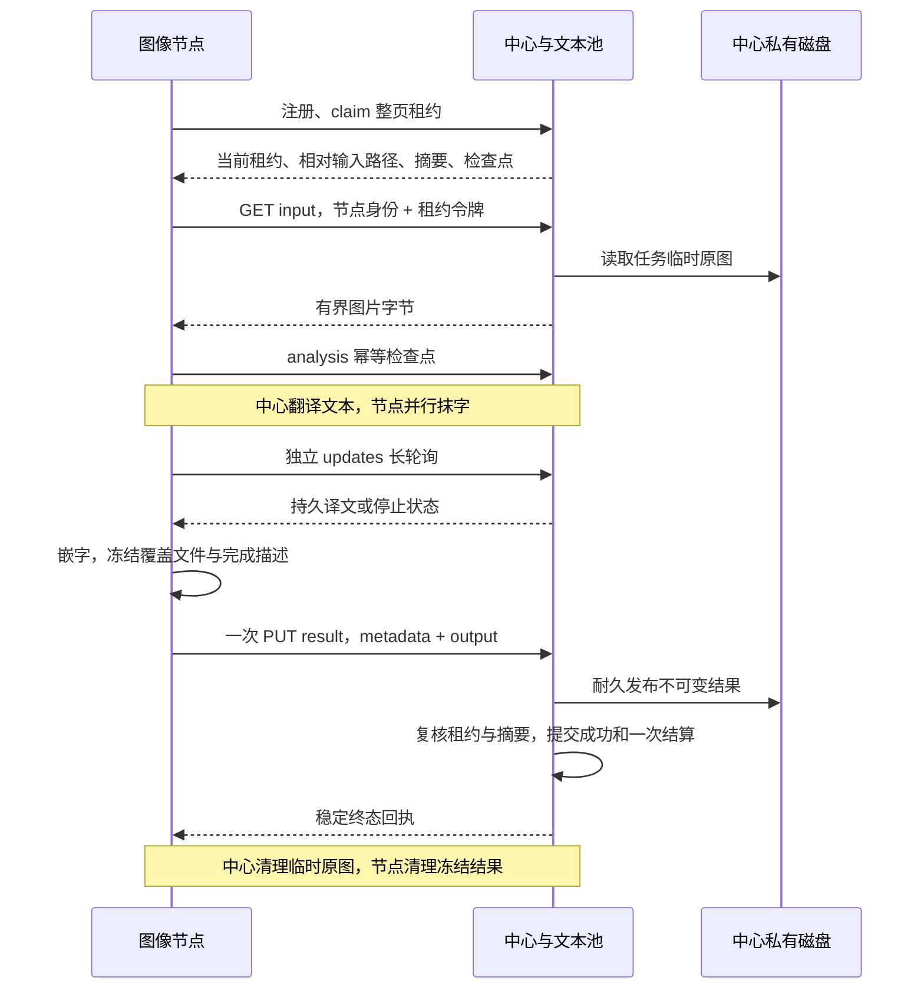

# 总中心与计算节点协议

本文描述仓库中的 **v3 整页计算协议**。中心实现为 [compute_v3.py](../backend/app/compute_v3.py)，节点为 [classic-engine](../services/classic-engine/README.md)。部署需配套更新中心、节点和客户端；旧节点协议不提供兼容入口。AI 重绘仍由中心独立执行池处理。

## 职责与执行位

中心负责受理、有限候选内的简单会员优先分配、租约授权、文本调用、持久检查点和一次结算；可信自管节点负责图像解码、像素校验、检测、OCR、抹字、固定字体嵌字及无损覆盖输出。中心只解析有界文件结构和元数据，不解码原图、掩膜或结果像素。节点质量声明不等于中心已验收模型效果。

`execution_slots` 是未释放整页租约数，下载、等待文本、交付均占租约；GPU 计算并发由节点的 `local_pages` 控制。新 claim 每批最多分配 4 页，并发 claim 和到期未回收租约均计入容量。缩容、停用只限制新领取；取消要求停止本地工作并确认。配置默认值与语言能力见[节点配置](NODE_CONFIGURATION.md)。


```mermaid
sequenceDiagram
    participant N as 图像节点
    participant C as 中心与文本池
    participant F as 中心私有磁盘
    N->>C: 注册、claim 整页租约
    C-->>N: 当前租约、相对输入路径、摘要、检查点
    N->>C: GET input，节点身份 + 租约令牌
    C->>F: 读取任务临时原图
    C-->>N: 有界图片字节
    N->>C: analysis 幂等检查点
    Note over N,C: 中心翻译文本，节点并行抹字
    N->>C: 独立 updates 长轮询
    C-->>N: 持久译文或停止状态
    N->>N: 嵌字，冻结覆盖文件与完成描述
    N->>C: 一次 PUT result，metadata + output
    C->>F: 耐久发布不可变结果
    C->>C: 复核租约与摘要，提交成功和一次结算
    C-->>N: 稳定终态回执
    Note over N,C: 中心清理临时原图，节点清理冻结结果
```

## 传输与信任边界

所有路径以前缀 `/internal/compute/v3` 开始，携带 `Authorization: Bearer <node_token>` 和 `X-Node-Id`。中心使用 HTTPS；节点只接受当前租约的精确相对输入路径，不接受外部 URL、任意跳转或源站凭据。原图、覆盖文件都通过中心传输，不签发下载/上传 URL，不使用对象存储客户端、MD5 或 ETag 上传确认。

原图 GET 额外携带 `X-Lease-Token`，中心核对节点、租约令牌、代次、取消状态和期限后直接返回字节。已经开始的流式读取有界完成或被客户端中断；取消立即阻止后续读取和交付，不能召回已经下载的字节。节点验证长度与 SHA-256，缓存不延长执行权。

JSON 摘要为 UTF-8 编码的 `json.dumps(value, sort_keys=True, ensure_ascii=True, separators=(',', ':'), allow_nan=False)` 的 SHA-256；文件摘要直接散列字节。默认日志不写图片、OCR 全文、令牌或原始异常。

## 消息

| 操作 | 请求 | 响应 |
| --- | --- | --- |
| `POST /nodes/register` | `protocol_version:3`、引擎版本、资源 ID、设备、语言、ready、可选 result_formats | 协议版本、server_time、config、该身份未释放的 leases |
| `POST /nodes/{id}/claim` | request_id、config_version、count（1–32） | 原 request_id、server_time、config、leases；新分配最多 4 页；空批可带短退避提示 |
| `POST /nodes/{id}/updates` | revision、wait_seconds（0–20）、config_version、can_claim、最多 32 项 leases 快照 | revision、claim_ready、变化的 leases；配置变化时带 config；不续租、不领取 |
| `POST /nodes/{id}/heartbeat` | config_version、leases 中的 lease_id、lease_token、translations_revision、phase | server_time、config、逐项续期／停止／终态；只返回更新的译文 |
| `POST /leases/{id}/analysis` | lease_token、analysis_hash、analysis | analysis_hash、receipt；有文字时 receipt 为 null，无文字时为稳定终态 |
| `GET /leases/{id}/input` | 节点头与 X-Lease-Token | 原图二进制；不跳转、不签名 |
| `PUT /leases/{id}/result` | multipart：一个 metadata 字符串字段、最多一个 output 文件 | 稳定 terminal 回执本体 |
| `POST /leases/{id}/complete` | lease_token、error:{code}，可带 timings | 错误或停止确认的稳定 terminal 回执；不接受结果图片 |

`error.code` 为 1–60 位大写字母、数字或下划线，首位必须为字母；不要求中心枚举节点诊断码。中心仅对停止确认、临时故障重试等已有调度码执行特殊逻辑，其他码作为通用失败结束并释放预占额度，保留原码供后台和客户端展示。错误负载不接受任意异常正文。新增诊断码无需再次升级中心；从严格枚举的旧中心升级时须先发布中心再更新节点。

结果上传被明确拒绝为无效负载（400、413、415、422）时，节点将冻结文件原子替换为 `RESULT_REJECTED` 失败回执并释放文件，不能循环重传相同无效图片。网络结果未知、429 和 5xx 仍保留冻结字节按同一租约重试，不重新计算或调用 LLM。

活动 lease 含 lease_id、lease_token、job_id、generation、status:active、expires_at、limits、input、config.engine、language，以及已有 analysis／analysis_hash／translations。输入描述固定为：

```json
{
  "path": "/internal/compute/v3/leases/<lease-id>/input",
  "sha256": "<实际送译字节摘要>",
  "byte_size": 12345,
  "mime": "image/png",
  "width": 1600,
  "height": 2400,
  "normalization_version": 1
}
```

输入必须已规范化为静态单帧和 sRGB：EXIF 方向为 1／缺省；带 ICC 的源图必须先完成颜色转换，再移除 ICC，节点拒绝仍带 ICC 的输入。节点不变换已绑定摘要的输入。节点接受 PNG、JPEG、WebP，图片字节与单边准入统一由中心执行，默认 128 MiB、单边 100000，不设独立总像素上限；节点关闭 Pillow 隐含的总像素限制。中心校验文件长度、摘要、容器结构、尺寸和规范化元数据；节点下载不得超过中心声明的 byte_size，首次完整解码再核对尺寸、摘要和 MIME。损坏像素以 `INPUT_INVALID` 终结该页，发生在 OCR 和文本调用之前；工作内存不足以 `INPUT_MEMORY_EXCEEDED` 终结，不反复重试相同输入。节点的工作内存、并发、检查点与结果传输预算仍独立有效。

注册的 `result_formats` 缺省为 `["overlay-v1"]`；新节点声明 `["overlay-v1","overlay-tiles-v1"]`，中心在 ready 报告中记录分块能力。普通租约配置保持原结构；分块租约额外带 `config.result_format=overlay-tiles-v1`，只分配给支持该格式的节点。旧节点在协议上只能领取普通任务，已有检查点仍是 v3。此次发布同时迁移资产 MIME 列并把完整像素校验移至节点：在维护窗口排空旧任务，按[部署规范](DEPLOYMENT.md)迁移并更新中心，再升级全部节点并核实校验能力，最后恢复受理及启用新版客户端。旧节点的格式兼容不代表支持新尺寸和校验职责，不能只升级中心便开放新流量。没有分块能力的任务不能提交分块结果。新节点的 `RESULT_REJECTED` 诊断码也要求中心支持上述非枚举错误码。

analysis 的 regions 保留分组几何和排版参数，并提供四点 lines；segments 按相同顺序提供唯一 ID 和原文。无文字为两个空列表与 null mask。整个分析不超过 4 MiB；只有有界 mask 检查点仍用 PNG base64，不携带完整原图或译图。节点生成掩膜时检查非空像素，恢复已有检查点时在恢复文本工作前解码并校验掩膜；中心只校验其文件结构、尺寸和区域元数据。相同分析重复提交不会重新打开文本任务。

译文为 `{analysis_hash, language, translations:{segment_id:text}, revision}`，revision 是前三项组成对象的摘要。只有 text 成功后才发送完整译文。updates 增量为 `{lease_id,status:active,translations}`，不带输入或 expires_at；相同 revision 不重发正文。长轮询不延长执行截止，迟到的活动响应不能恢复已停止页面。

## 覆盖结果与一次提交

节点在原图 RGB 上完成抹字和嵌字，以最终 RGB 与原图逐像素差异计算变化范围，包含背景、字形、描边和抗锯齿，不能只使用 OCR mask。忽略原图 alpha 为 0 的隐藏 RGB，裁剪到最小整数 bbox；变化位置保存最终 RGB、alpha=255，其余为透明。alpha 表示像素替换，不再对字形抗锯齿做软混合。文件是单帧无损 RGBA WebP，统一使用 Pillow `lossless=True, method=4, quality=10, exact=False`，不切换 PNG，不使用有损或 near-lossless 编码，去除无关元数据。无损模式的 quality 控制压缩投入，不降低可见像素质量；透明像素的隐藏 RGB 不作保真要求。格式依据见 [WebP 编码参数](https://developers.google.com/speed/webp/docs/cwebp)。

空字符串或纯空白译文仅跳过对应区域的绘字，保留抹字结果并留白，后续区域照常绘制；缺失 ID 和非字符串仍拒绝。全部译文为空时仍提交正常的翻译结果，抹字产生的可见差异照常编码；没有可见差异时返回 original，不将有 OCR 文字的页面归类为 no_text。

无字通过 analysis 完成，公开结果为 `kind=no_text, representation=original`。有文字且嵌字校验成功但可见差分为空时，通过 result 提交 `representation=original` 元数据，不附 bbox 或文件，中心记录 `kind=translated`。检测或嵌字失败不能伪装成成功。

### WebP 分块包

完整渲染和可见差分完成后，若 bbox 单边超过 WebP 格式上限 16383，且任务已协商分块，按最多 2048×4096 的网格切最终像素，跳过无变化块，每块再裁剪到自身差分范围。跨块文字已完成排版，字形像素可拼合，不对块分别 OCR、抹字或调用文本模型。所有块使用上述无损 WebP 参数。普通 bbox 沿用单 WebP 输出，不增加包封装。

分块结果使用 `representation=overlay-tiles-v1`，没有 bbox，`output.width/height` 为完整输入尺寸，MIME 为 `application/vnd.nodelane.overlay-tiles`。它仍是一次 result multipart 的一个二进制文件，整包摘要、耐久保存、回执与页数结算均沿用原规则。

包字节顺序为 8 字节 ASCII `NCOT0001`、4 字节小端无符号清单长度、UTF-8 JSON 清单、按清单顺序连续拼接的 WebP 文件。清单字段为：

```json
{
  "format": "overlay-tiles-v1",
  "input_sha256": "<冻结输入摘要>",
  "width": 800,
  "height": 100000,
  "tiles": [
    {"x": 10, "y": 4080, "width": 100, "height": 16,
     "byte_size": 1234, "sha256": "<该 WebP 字节摘要>"}
  ]
}
```

清单最多 256 KiB、1–4096 块；块坐标为非负整数，宽高至少 1，范围不能越过整页且不能互相重叠。中心和客户端核验输入身份、整页尺寸、每块尺寸／摘要、单帧 WebP、整包长度和无尾随字节。节点在冻结普通覆盖或分块结果前解码编码产物，校验尺寸、单帧和非空二值 alpha；失败返回 `CLASSIC_OUTPUT_ENCODE_FAILED`，不上传成功结果。中心不检查像素。图片本体不放进 JSON 或 base64。包受现有结果字节预算限制。

规范化、原图身份、客户端合成与缓存统一见[翻译契约](READING_TRANSLATION_CONTRACT.md#4-状态与结果)。

metadata 是 JSON 文本：

```json
{
  "lease_token": "<当前租约令牌>",
  "result": {
    "version": "<引擎版本>",
    "input_hash": "<送译摘要>",
    "analysis_hash": "<分析摘要>",
    "translations_revision": "<译文版本>",
    "representation": "overlay-v1",
    "normalization_version": 1,
    "width": 1600,
    "height": 2400,
    "bbox": {"x": 80, "y": 120, "width": 1300, "height": 1900},
    "output": {
      "sha256": "<WebP字节摘要>",
      "byte_size": 48320,
      "width": 1300,
      "height": 1900,
      "mime": "image/webp"
    }
  },
  "timings": {}
}
```

result 的 width/height 是整页尺寸；output 的尺寸必须等于 bbox，bbox 不得越界。original 的 bbox/output 均为 null，并省略 output 文件。metadata 最多 64 KiB，output 受中心 `cluster_max_result_bytes` 约束，与原图 `max_upload_bytes` 分开；节点编码和传输上限为 88 MiB，与中心默认值一致。这是单文件协议限制，不作为磁盘容量准入。未知字段、多余文件或重复字段均被拒绝。timings 不参与 result 摘要。

`render` 包含 `render_areas`（气泡分析）、`render_layout`（排版绘字及校验）、`render_diff`（覆盖差异提取）和 `render_encode`（输出编码／校验）。节点采用大图提前分块时，块内差分、编码和校验并发完成，整体墙钟计入 `render_encode`，`render_diff` 仅为分块前规划；跨版本比较输出成本使用二者之和，细节见[节点运行](../services/classic-engine/docs/NODE_OPERATIONS.md#状态与恢复)。可选诊断字段 `detect_lock_wait`、`ocr_lock_wait`、`inpaint_lock_wait` 已包含在所属计算阶段内；当前 MTU 的 `ocr_lock_wait` 累计本页等待各识别／取色模型及语言评分锁的时间，不是 GPU 执行时间，也不能跨页相加当作端到端延迟。细分计时不改变结果身份、租约与结算；新增字段须先升级中心以接受，再更新节点。中心记录的 `delivery.protocol` 是协议版本，不能按耗时展示。

中心先冻结提交摘要和交付意图，在调度锁外检查文件长度、SHA-256、容器声明尺寸和文件结构。像素解码和二值 alpha 校验已由节点完成。校验完成后再次检查租约及最早截止，在短事务中持久化受理时间与截止快照，然后耐久发布文件。最终事务与崩溃恢复共用同一规则：必须有及时受理记录、当前执行代次、对应分析/译文版本且未取消，才能提交 Job 结果描述、产物关联、任务成功、一次结算和稳定回执。无文件 original 也必须完成请求校验后才能受理。恢复与清理规则以[文件存储](OBJECT_STORAGE.md#文件发布与恢复)为准。

节点在发请求前，以同一 SQLite 事务将 completion JSON 和覆盖字节 BLOB 写入本地恢复数据库；不存结果 base64，也不另建文件确认流程。响应丢失时重交相同描述与二进制，中心返回原回执。只保留未完成领取和未确认租约，终态后同事务清除记录与字节，SQLite 自动回收空闲页；不为恢复数据库设置容量领取门槛，也不按时间清除未确认交付。同租约不同摘要冲突，旧代次不能覆盖新结果。中心文件已耐久发布而最终事务未提交时，maintenance 可复核当前代次恢复交付，不重新调用文本模型。

无字仍通过 analysis 的终态回执完成。stop 携带固定 code；节点排空本地工作后发送 `error:{code:LEASE_STOPPED}`。terminal 含 lease_id、outcome、job_status、result_hash、completed_at。一个错误令牌不影响同批其他租约。失败只传固定代码，不传异常正文；允许代码以 [NodeError](../backend/app/compute_v3.py) 为准。

## 构建与兼容性

`protocol_version:3` 同时约束输入、分析检查点与覆盖结果结构。`engine_version` 和 analysis/result 的 `version` 是实际构建指纹，仅用于追溯，不参与任务路由、输入缓存键或跨节点恢复判定。中心的任务 engine 配置仅包含 `protocol_version:3`，不配置默认构建版本。

兼容节点可以接续其他构建保存的分析和成功译文；原分析及其摘要保持不变，不重新 OCR 或重复调用文本供应商。提交仍验证输入摘要、分析摘要、译文版本、尺寸、租约身份及当前执行代次。不兼容的检查点结构必须升级协议，不能仅沿用 v3 标签。

## 配置、幂等与恢复

节点先持久化 claim 的 request_id、config_version 和 count，未知结果重放原内容；全部返回租约落入日志后才清除请求。同编号不同内容冲突，空回执也保存。非空批后仍有余量可立即补领；空批等待 poll_seconds、新就绪提示或资源释放。中心在候选查询前预查回执、配置和容量，进入调度锁后复核。

并发竞争导致候选失效时，中心提交并释放锁后最多重选一次；最终空批仍有可领取工作时可附 0.1–0.3 秒随机退避提示。提示不分配、不预留执行权，不改持久回执。

整页时限默认 900 秒，首次分析后文本等待 600 秒，首次冻结结果交付意图后交付窗口 120 秒；以最早截止为准，心跳不能无限延长。既有租约使用领取时快照，中心配置只控制执行位、轮询和期限，本地模型与线程由节点配置。节点失联后可从中心临时原图重建，复用已持久化分析和成功译文；原图丢失进入同请求补传，不能重复计费。

multipart 请求体接收受 `upload_body_timeout_seconds` 总时限约束，持续发送少量字节也不能延长；超时关闭临时文件并返回 408。及时受理后，中心为本地落盘保留固定宽限：取受理前租约到期与受理时间加该总时限的较晚值；心跳和重放不延长它。宽限不授权节点继续计算，只避免维护程序在已校验文件尚未落盘时抢先重试。处理截止后落盘仍可成功；没有及时受理记录的文件不能通过维护恢复发布。

## 分阶段流水线与通知

节点使用独立下载、分析提交、计算和交付池；等待文本、传输和回执不占计算线程。heartbeat、claim、updates 各最多一个在途请求。PostgreSQL NOTIFY 仅唤醒，持久状态从数据库重读；订阅后复查、5 秒内部重查及最长 20 秒响应负责断线补偿。

无关全局通知不立即结束长轮询；配置、租约集合、具体租约或真实可领取状态变化可触发增量。claim_ready 只是提示，节点忽略早于最新领取尝试的旧提示。中心文本、重绘和上传恢复池继续独立有界，调度规则见[集群设计](TRANSLATION_CLUSTER_DESIGN.md#按就绪顺序领取)。

## 验证边界

回归入口：[中心](../backend/tests/test_compute_v3.py)、[长轮询](../backend/tests/test_compute_updates.py)、[节点联调](../backend/tests/test_compute_node_v3.py)、[PostgreSQL](../backend/tests/test_compute_v3_postgres.py)、[节点调度](../services/classic-engine/tests/test_node_scheduling.py)、[节点传输](../services/classic-engine/tests/test_node_transport.py)。

模拟文本和隔离中心验证协议、并发、丢回执、终态清理及恢复；真实 GPU 的检测/抹字/覆盖像素、真实文本服务、公网吞吐与目标机 Windows 服务另行验收。通过本地单一样图不能推断所有页面的压缩率或翻译效果。
