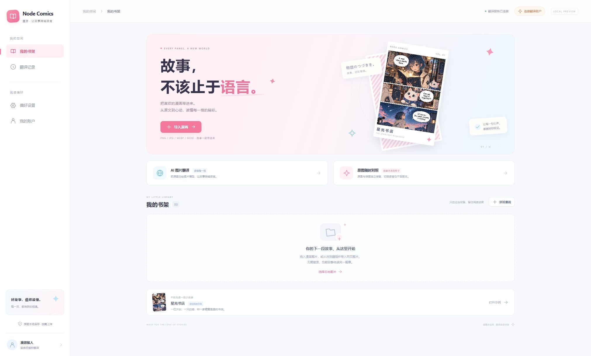
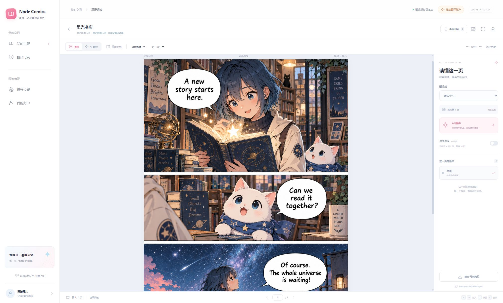

# 本地实现与验证

当前节点管理已改为 `shared_0001`，见[节点配置](NODE_CONFIGURATION.md)；下述旧基线记录为历史验证证据。仓库当前不附带图像引擎，接入边界见[计算协议](COMPUTE_PROTOCOL.md)。

2026-09-15：翻译已采用全新集群基线 `cluster_0001`。现行任务与队列规则见[翻译集群设计](TRANSLATION_CLUSTER_DESIGN.md)，最新代码、测试与浏览器验收边界见[集群验收](CLUSTER_VALIDATION.md)。以下早期样本和截图保留为历史证据，不代表当前部署状态。

2026-09-14 新增[漫画作品管理与 MangaCopy 实现](COMIC_LIBRARY_IMPLEMENTATION.md)：通用领域模型、新书架、详情页范围导入与可恢复原图采集已完成本地验收；旧扁平书架逻辑已移除，无旧数据兼容代码。

2026-09-13 的实现交付为可以本地运行的浏览器插件、阅读器和 AI 图片翻译后端，当时取消的处理管线源码、容器和镜像已移除。2026-09-14 用户重新增加常规翻译需求，已基于[开源方案调研](CLASSIC_TRANSLATION_RESEARCH.md)实现，详见[常规翻译运行说明与验证](CLASSIC_IMPLEMENTATION.md)。以下历史截图与已有证据仍对应 AI 图片翻译版本；常规模式的浏览器验收交由用户。

## 启动与使用

需要 Docker Desktop（Linux 容器）、Node.js 22 和 npm。仓库根目录 `.env` 配置图片供应商，参考 [.env.example](../.env.example)。不要将 Key 放入 `VITE_*` 或插件文件。

```powershell
./scripts/bootstrap.ps1 -Start
cd apps/extension
npm ci
npm run dev
```

打开 [阅读器](http://127.0.0.1:5173/)；[API 文档](http://127.0.0.1:18088/docs)。新账户为普通用户，每日 100 页常规翻译；PLUS 常规不限量，每会员月 300 页重绘。每种模式的在途容量分别为普通 10 页、PLUS 500 页；实时名额分别为 2 页、10 页。开发用户名 admin 可管理会员与周期补偿；管理员角色不自动获得 PLUS。运行前确认使用新数据库，详见[会员额度实现](MEMBERSHIP_IMPLEMENTATION.md)。

单页、选定页段、预存本章与主动重译先确认模式权益及本次页数上限，再保存持久化上传清单。可选择在有空位时持续补充本次已确认范围，当前阅读页面优先取得下一个上传空位。客户端根据当前页及最近阅读章节调整本人顺序；服务端负责实时名额、优先级和公平调度。未知提交保留原请求与幂等编号，按原编号核实。

浏览器的 `localhost`、`127.0.0.1` 和扩展页面是不同来源，拥有各自本地书架和阅读位置；登录同一服务的同一账户后，重新导入相同文件可匹配服务器译图。译图与原图可随时对照，阅读器支持页码跳转、单页/连续阅读、方向、缩放、范围排序和单图导出。

## 文件匹配与并发

2026-09-14 新增 CBZ/ZIP、CBR/RAR、PDF 本地导入，以及按图片 SHA-256 回退的免上传匹配；详见[格式与缓存说明](IMPORT_FORMATS_AND_CACHE.md)和[本次验证](evidence/import-cache-validation.md)。更新前端时须同步更新 API，本次没有重启正在运行的产品服务。

本次验证的隔离方式、测试和 Chrome 检查见[文件页复用与队列验收](evidence/file-reuse-queue-validation.md)。

- MOBI 按整文件 SHA-256＋从 0 开始的原始页索引匹配；单张图片按该文件 SHA-256＋索引 0 匹配。文件名不参与标识，页面排序／移除不重编号。不同字节的文件不视为同一文件。
- `POST /v1/translation-submissions` 提交图片摘要与可选成对的 `file_hash`、`page_index`，领取缺失原图的上传回执；按回执 PUT 后调用 `/v1/uploads/{id}/complete`，等待异步校验。`POST /v1/file-pages/match` 按页批量查询（每次最多 100 页）。映射按账户私有；同一标识对应不同图片字节返回冲突。
- 打开已导入漫画后，用当前账户、服务、翻译方式和目标语言匹配任务，再按阅读附近页面授权下载结果。查询和恢复不创建新任务、不再次扣页数；不会为匹配上传整卷。原图和最终译图存私有 R2，当前无限期保留、未启用自动清理；未来可按长期未访问情况清理。结果按有效配置版本区分，用户删除或显式清理策略仍使资源失效；例行查询不探测远端对象，下载或执行时发现缺失。书架与阅读位置没有云同步。
- 两台电脑同时首次提交同一内容、模式、语言和配置时，后端在用户事务内复用进行中任务。不同批次保存各自页序与原图引用，实际预占只发生一次；每个操作编号另存幂等记录，不能因原任务失败或配置变化而把同一次提交变成新收费任务。取消该共享任务会影响同账户引用它的批次；明确的“主动生成新版本”继续独立确认和计费。
- 无文字页面也可免费复用检测结果。原图仍有效且未取消的重绘结果不明任务，普通提交在供应商／价格变化后仍返回原未决任务；需要明确确认重新生成才会再次调用。
- 前端传输并发默认 2，可调 1–10，与服务器执行资源独立。`GET /v1/me/queues` 返回常规、重绘两种队列的容量、实时名额及当前占用；服务端通过 `FREE/PLUS_QUEUE_CAPACITY`、`FREE/PLUS_REALTIME_SLOTS`、`FREE/PLUS_SCHEDULER_WEIGHT` 分别配置套餐。
- 常规与 AI 重绘独立排队；实时优先，预存保留最低服务份额，同级按用户的配置权重公平分配，PLUS 默认权重更高。资源空闲时单用户可借用更多执行位；有竞争后在后续阶段重新分配。设备、阶段池和供应商资源上限共同约束实际执行。
- API、控制 worker、计算节点和前端配套更新，采用租约恢复与过期执行代次隔离。新基线需要新数据库，不兼容旧调度、提交接口或队列消息；升级不会自动清空旧产品数据。

## 构建与测试

```powershell
cd apps/extension
npm run check
npm test
npm run build
npm run build:web
npm run zip
```

Chrome / Edge 在扩展管理页打开开发者模式，加载 `apps/extension/.output/chrome-mv3`。压缩包位于同级 `.output`。浏览器预览用于本地导入；当前网页发现与图片右键需要安装扩展。

后端运行命令、配置和独立 PostgreSQL 并发测试入口见 [backend/README.md](../backend/README.md)。轻量 API 检查（需要 Python、httpx、Pillow）与真实 MOBI 解析检查：

```powershell
python scripts/smoke_api.py
node --experimental-strip-types scripts/inspect_mobi.mjs
```

`smoke_api.py --translate --wait` 会创建一次真实图片模型请求并保存操作 ID；后续运行核对相同任务，不盲目创建新付费请求。已有本次待核实记录，不要通过删除证据文件规避这个保护。

Compose 后续操作必须同时加载两个环境文件：

```powershell
docker compose --env-file .env --env-file deploy/.env.local ps
docker compose --env-file .env --env-file deploy/.env.local up -d --build
docker compose --env-file .env --env-file deploy/.env.local down
```

`deploy/.env.local` 由引导脚本产生本地数据库和签名密钥，已忽略。`down` 保留数据卷。API 只绑定 `127.0.0.1:18088`；数据库、Redis 无宿主机公开端口。不要在模型调用进行中强制重启 worker。

## Logto 接入配置

2026-09-14 已确认登录服务为 `https://auth.nodelane.net/`，应用 ID 为 `dept2iz42nzidf5pao6fo`（SPA），项目计划上线地址为 `https://comics.nodelane.net/`。已读取线上 discovery 和 JWKS：issuer 带 `/oidc`，当前公钥为 EC / P-384 / ES384；后端已支持 ES384。这里只验证公开元数据可用，尚未完成真实用户登录或项目公开部署。

以下端点已写入本地、被 Git 忽略的 `.env`：

```dotenv
OIDC_CLIENT_ID=dept2iz42nzidf5pao6fo
OIDC_ISSUER=https://auth.nodelane.net/oidc
OIDC_AUTHORIZATION_ENDPOINT=https://auth.nodelane.net/oidc/auth
OIDC_TOKEN_ENDPOINT=https://auth.nodelane.net/oidc/token
OIDC_JWKS_URL=https://auth.nodelane.net/oidc/jwks
```

接入剩余配置：

- 2026-09-16 用户已确认 Logto「API 资源」创建完成，Identifier 为 `https://comics.nodelane.net/api`，该值已写入根 `.env` 和独立生产配置的 `OIDC_AUDIENCE`。这是资源标识，不要求存在对应 HTTP 路由。客户端在授权及授权码换令牌时都携带 `resource`，后端校验对应 JWT 的 audience；不能用 App ID 代替 API audience。
- 已将用户提供的 Chrome 商店公钥写入 `apps/extension/wxt.config.ts` 的 `manifest.key`，由此计算固定扩展 ID 为 `aiajdjliifeeaogpalejpggkiccjbneo`。在 Logto 应用的 Redirect URIs 中添加 `https://aiajdjliifeeaogpalejpggkiccjbneo.chromiumapp.org/oidc`。本地 `.env` 已加入 `EXTENSION_IDS=aiajdjliifeeaogpalejpggkiccjbneo`；部署环境也需设置。重新加载构建后的扩展，并核对扩展管理页和商店条目 ID 一致；回调以扩展内 `chrome.identity.getRedirectURL('oidc')` 为准，其他商店或不同 ID 另行登记。公钥可随源码保存，不需要私钥。
- 若同时提供网页阅读器，在站点根路径使用时登记 `https://comics.nodelane.net/`；本地网页调试可登记 `http://127.0.0.1:5173/`。当前回调为 `location.origin + location.pathname`，如果实际入口为 `/index.html` 或其他路径，需要登记完整的对应地址。在 Logto Allowed CORS origins 中登记实际网页来源（例如 `https://comics.nodelane.net`），不要包含路径。
- 部署时设置 `CORS_ORIGINS=https://comics.nodelane.net`；Compose 支持环境覆盖，本地默认来源仍保留。阅读器设置里的服务地址也需要指向实际发布的后端入口；当前默认仍是本地 `http://127.0.0.1:18088`。
- 生产使用独立 `deploy/.env.production`：`APP_ENV=production`、`DEV_AUTH=false`、精确 CORS / 扩展来源和专用数据库凭据，Compose 项目名隔离为 `node-comics-production`。后端默认生产模式，身份配置不完整即拒绝启动；详见 [生产身份说明](PRODUCTION_IDENTITY.md)。`deploy/.env.local` 显式 `APP_ENV=development` 并保留本地开发登录，不用于生产。使用 `scripts/bootstrap.ps1 -Production -Start` 或明确选择 `COMICS_ENV_FILE` 的生产 Compose 命令；仅修改根 `.env` 不会切换本地登录。本次仅补齐配置和预检，未切换、未重启运行服务，未完成真实账号登录验收。

相关验证命令（隔离签名密钥、临时数据库和模拟响应，不访问真实账户）：

```powershell
cd backend
.venv/Scripts/python.exe -m pytest tests/test_oidc.py -q
cd ../apps/extension
npm test -- src/auth/oidc.test.ts
```

参考：[本实例 OIDC 元数据](https://auth.nodelane.net/oidc/.well-known/openid-configuration)、[Logto Chrome 扩展接入](https://docs.logto.io/quick-starts/chrome-extension)、[Logto API 资源](https://docs.logto.io/zh-CN/authorization/global-api-resources)。

## 已获得的证据

| 项目 | 证据与边界 |
| --- | --- |
| 页面风格 | Chrome 实际运行，桌面书架和原创阅读页截图见下方；粉蓝色、漫画插画与紧凑阅读工具 |
| MOBI | 用户提供 221,624,973 字节样本，正文 194 页（193 JPEG + 1 GIF），按正文顺序提取；[解析记录](evidence/mobi-import.json) |
| 百页阅读 | Chrome 第 100 页实际显示，重开恢复到第 100 页，仅加载第 98–102 页共 5 张图片；194 页其余位置占位。修复后台任务与其他标签页覆盖进度的问题。私有漫画截图保存在被忽略的 `private-test-data/` |
| 窄屏阅读 | Chrome 390×844 截图已复核，工具栏默认折叠、导航保留无障碍名称，文档宽度 390；[截图](evidence/reader-mobile.png) |
| 真实图片模型 | `.env` 图片供应商、`gpt-image-2`、`POST /images/edits` multipart；已有用户触发的中译与英译任务完成，授权下载和完整解码通过；[脱敏交付记录](evidence/live-delivered.json) |
| 已知不确定请求 | 首次原创样本请求返回 `outcome_unknown`，未自动重发；[记录](evidence/live-redraw.json)。供应商可能已产生费用，用户预占与供应商消耗分别记录 |
| 后端契约与并发 | 本次 140 项临时 SQLite / 模拟上游测试通过，另有真实 PostgreSQL 的 14 项隔离并发测试通过。默认测试命令跳过 PostgreSQL 专项，另行启用验证；[本次验收记录](evidence/file-reuse-queue-validation.md) |
| 前端测试与构建 | 本次 77 项测试、TypeScript、扩展和 Web 构建通过，并完成 Chrome 恢复／并发操作验收；[本次验收记录](evidence/file-reuse-queue-validation.md)。早期 ZIP 与依赖审计结果见[模块验证记录](evidence/frontend-validation.md) |
| 身份 | 早期完成 OIDC/PKCE、回调防重放和服务来源绑定模拟测试；2026-09-16 已补齐确认的 API audience 和独立生产配置，并验证公钥撤销与首次登录并发，见[生产身份说明](PRODUCTION_IDENTITY.md)。真实账号登录仍未验收 |

封面原图 1066×1600，译图 1024×1536。视觉检查确认主标题可读、人物构图基本保持，部分线条、字体与专名表达有变化。按用户最新决定，不增加底部标记、作者署名或专名必须保留的约束，继续使用原提示词 `comics-translate-v1`。这次样本不能证明整卷或所有语言的质量。





## 交付边界

- 插件可以构建和打包；Chrome 网页阅读器已实际验收。加载解压扩展后的真实站点采集尚未人工完成，不能将浏览器预览等同于已安装插件验收。站点适配与消息权限有本地契约验证。
- `.env` 的默认图片网关在使用常规 Python User-Agent 时曾返回 403；本地通过供应商可配置 `user_agent=Mozilla/5.0` 接通。该配置不代表任意兼容网关都需要它。
- 真实 OIDC 账号登录验收、HTTPS 部署、正式价格、支付、站点覆盖和发布仍未完成，尚未公开部署。
- MOBI 首版支持未加密 MOBI6 / MOBI6+KF8 漫画，本次已新增 CBZ/ZIP、CBR/RAR、PDF；独立 KF8、EPUB、长图切片与整卷打包导出属于后续范围。

原创发布样例的来源与生成提示见 [samples/README.md](../samples/README.md)。私有漫画、提取图片和凭据不包含在插件产物中。
