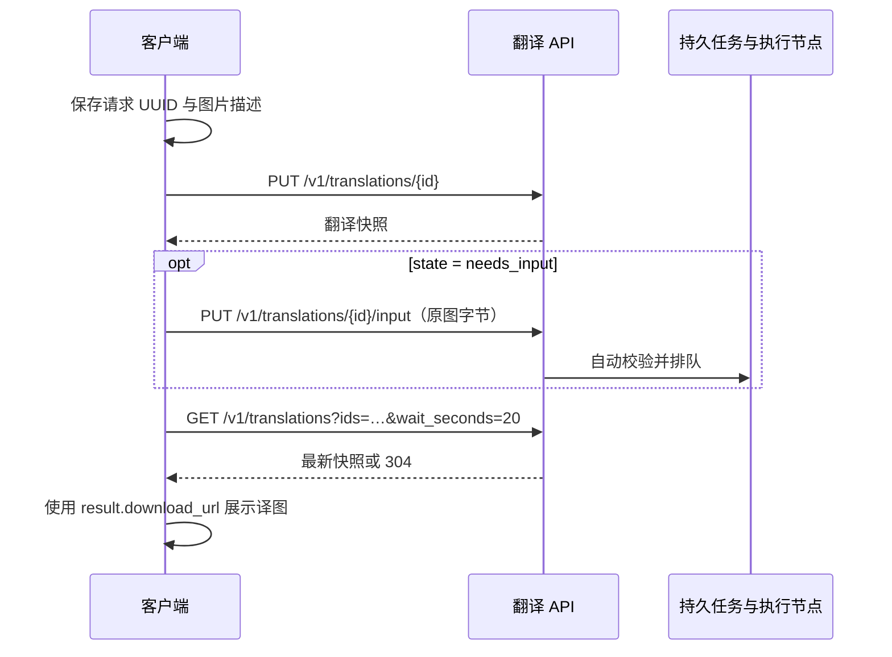

# 翻译接口与阅读恢复契约

本文约束 **NodeLane 官方渠道**的后端 API 与客户端恢复行为。客户端渠道抽象、MTU 直传协议及缓存边界见[客户端翻译渠道](TRANSLATION_CHANNELS.md)；本地渠道不要求实现本文的账号、权益或持久任务协议。

当前实现采用逐图翻译资源，机器契约见 [OpenAPI](../contracts/openapi.json)。后端使用 `translations_0001` 全新空库，客户端使用 `node-comics-reading-v2-*` 新数据库；不读取、迁移或兼容旧数据。旧库不会自动删除，新客户端需要重新导入漫画。设计取舍见[简化说明](TRANSLATION_API_SIMPLIFICATION.md)。代码实现与本地验证不代表公开部署。

## 1. 翻译流程



已有原图无需上传；完成结果命中直接返回成功快照。没有阅读会话、续租、窗口序号、控制权接管、策略版本、账户变更游标、上传 complete 或单独的结果 access 查询。

## 2. 页面身份与请求身份

- 本地 `targetKey`（原 `page_key` 用途）为页面上下文与模式的 SHA-256，固定 64 个十六进制字符，不再拼接 UUID 和完整页 ID。这个本地键不进入翻译请求。
- 每次新的翻译意图生成标准 UUID，公开 `id` 固定 36 字符；发送前把 UUID 与完整业务输入保存到 IndexedDB。账户、内容、模式、语言分别隔离。
- 同一账户、同一 UUID 永久绑定相同业务输入。重复 PUT 返回原资源；换图、换模式、换语言或改变重试来源返回冲突。`priority` 是调度提示，不参与业务摘要。
- 网络失败、刷新、扩展重启或回包丢失均继续使用原 UUID。先 GET 核实；明确未受理时可以重放原 PUT。不得通过生成新 UUID 自动重试结果未知的重绘。
- 多个 UUID 指向相同的本人任务或结果时，服务端复用已有工作，不重复创建计算任务或扣量。删除后的旧 UUID 保留撤销回执，不能使被删除访问复活。

## 3. 创建与上传

```http
PUT /v1/translations/84ca7300-156d-46e8-952f-c2a65a447e72
Authorization: Bearer …
Content-Type: application/json

{
  "image": {
    "sha256": "<原图字节的 SHA-256，64 个十六进制字符>",
    "byte_size": 123456,
    "content_type": "image/png"
  },
  "mode": "classic",
  "target_language": "zh-Hans",
  "priority": "current"
}
```

`mode` 为 `classic` 或 `redraw`；`priority` 可省略，支持 `current`、`prefetch`。客户端不传书目、页码、客户端页键、会员策略或扣费上限。后端先核实重复请求、本人任务与完成结果，再检查分钟预算和会员额度；受理、分钟事件、页数预占与 UUID 回执在同一事务中提交。

返回 `needs_input` 时，向同一资源的 `/input` 子路径发送原图字节。服务端限制实际收流大小、摘要、格式和可解码尺寸，存入私有 R2 后自动进入持久校验与执行，不需要第二次确认。重传不会重复创建任务或收费；输入过期、取消及原图不可用返回明确错误。

内部上传保护仍有期限和并发限制，崩溃恢复可核实已上传对象；它不是客户端必须维护的阅读会话。校验、重绘和常规流水线由后端继续完成，不依赖扩展 service worker 常驻。

## 4. 状态与结果

| `state` | 含义 |
| --- | --- |
| `needs_input` | 尚缺原图字节 |
| `queued` | 已受理，等待校验或执行 |
| `running` | 正在翻译 |
| `succeeded` | 可交付结果，包括部分结果或无字原图 |
| `failed` | 失败、取消或结果已不可用；具体原因看 `error` |
| `needs_attention` | 上游结果未知，等待核实 |

快照包含 `id`、`state`、`mode`、`target_language`、`image_sha256`、`input_asset_id`、`input_expires_at`、时间、`result` 与 `error`。公开 ID 始终是当前用户的请求 UUID，不泄露共享来源任务 ID。

成功的 `result` 包含 `kind=translated|partial|no_text`、私有 `asset_id`、尺寸、`quality_flags`、`download_url`、`download_expires_at` 和 `authorization_required`。无字结果显示原图，不因滚动自动重新生成。

R2 签名地址直接下载且不附带账户令牌；显式测试环境的本地授权下载按 `authorization_required` 处理。签名地址仅在内存使用，不写入 IndexedDB 或日志。下载失败保留已成功的翻译状态；重试下载可以重新 GET 同一 UUID 获取新签名，不能触发重新翻译。签名查询不发送 R2 HEAD。

## 5. 查询与恢复

- `GET /v1/translations/{id}`：查询一个本人请求，刷新结果授权地址。
- `GET /v1/translations?ids=<逗号分隔 UUID>&wait_seconds=20`：最多 32 个请求的批量快照，返回 `{items, missing_ids}`。未找到的 ID 与终态失败分开表示，不暴露其他账户数据。
- `ETag` / `If-None-Match`：未变化时最多等待 20 秒，返回 304；变化时返回最新完整快照。通知只是唤醒提示，数据库是最终状态。没有需要永久保存的事件游标。
- `GET /v1/translations?offset=0&limit=50`：私有分页历史。插件不新增翻译记录页，也不通过历史接口恢复当前阅读。

每个客户端协调器合并活动 UUID 的状态查询。刷新后按已保存 UUID 批量核实，不能先取回整个账户历史。终态结果退出等待集合，离开页面停止无关轮询。网络故障遵循退避，不持续进行 PUT/GET 循环。

## 6. 失败重试与重新翻译

显式重试使用新的 UUID 和 `{ "retry_of": "<旧请求 UUID>" }`；只适用于已失败或取消的任务。已成功结果的显式重新翻译使用新的 UUID 和 `{ "regenerate_of": "<旧请求 UUID>" }`。

未知重绘不能普通重试，先核实供应商。用户明确确认可能再次产生费用后，才可发送 `regenerate_of` 与 `acknowledge_unknown_cost: true`。同一新 UUID 的重复点击仍只受理一次。未确认、自动滚动、状态查询、下载重试均不能重新调用图片模型。

`POST /v1/translations/{id}/cancel` 取消可取消任务；反馈与常规结果详情使用同一 UUID 的 `/feedback`、`/classic` 子路径。文件页关联独立走 `PUT /v1/file-pages/bind`，不把漫画管理信息塞回翻译输入。

## 7. 阅读触发与优先级

新漫画默认原图。用户选择常规／AI 或明确打开译本后，才申请当前页与后三页；当前页立即触发，后三页延后 150ms 预取。滚动合并 80ms、最长 200ms，快速翻页保留最新待提交窗口。同一页切换结果保持阅读位置，四页独立完成，失败不互相阻塞。

客户端将当前页标记 `current`，邻页标记 `prefetch`。后端给予当前页短时优先，默认 90 秒；重复请求不延长优先期限，预取任务首次成为当前页可以提升。后台保留同级用户公平调度，无阅读会话或续租流量。已受理的旧窗口请求会继续完成；客户端隐藏或暂停时停止新增请求。

## 8. 限频、额度与安全

普通／PLUS 每滚动 60 秒最多新增 10／100 张翻译图片，跨模式、语言、设备合计。已有原图的新翻译也计数；重传、UUID 重放、本人在途复用、完成结果复用不计数。取消和失败不退还分钟次数。常规每日额度、PLUS 会员月重绘额度和赠送按[会员规则](MEMBERSHIP_AND_QUOTAS.md)处理，不由客户端预判队列容量。

`IMAGE_RATE_LIMITED` 为图片分钟限制，`REQUEST_RATE_LIMITED` 为独立 HTTP 保护，均返回 429 和 `Retry-After`；客户端保留最新待提交窗口，按期限恢复，任务完成不能提前解除分钟退避。额度不足只影响对应图片，图内提供升级入口，常规额度只在账户页展示。

图片授权和请求按用户隔离；内容去重与已完成结果跨用户复用遵循[结果共享](RESULT_SHARING.md)。删除只撤销本人访问，原图和最终译图不按年龄或无数据库引用自动删除。供应商成本与用户页数独立计量。

## 9. 删除的旧协议

已删除 `translation-plans`、`reading-sessions`、`translation-operations`、`translation-changes`、公开 `/v1/jobs` 及 `/v1/uploads` 控制端点；不保留兼容路由。数据库删除阅读会话、策略版本、旧操作回执与账户变更序号，以最终模型重建初始迁移。计算节点执行租约、内部 Job、结算账本与必要上传保护继续保留。

## 10. 验证入口

使用[后端说明](../backend/README.md#验证)的 Docker 隔离测试或本地虚拟环境。PostgreSQL 并发套件仅连接 `nodecomics_concurrency_test`，每例随机 schema；不读取或重置产品库。

```powershell
cd backend
.venv/Scripts/python.exe -m pytest -q tests/test_translation_requests.py tests/test_recovery_snapshots.py tests/test_submission_limits.py tests/test_result_cache.py
```

插件目录执行 `npm run check`、`npm test`、`npm run build`。浏览器脚本需要 Playwright 和兼容 Chromium；`PLAYWRIGHT_MODULE`、`TEST_CHROMIUM` 可以指定已安装路径。模拟图片验证交互，不能证明真实翻译效果。

```powershell
# 终端一，在 apps/extension 运行
npm exec vite -- --host 127.0.0.1 --port 5176 --strictPort
# 终端二，从仓库根目录运行
node scripts/verify_reading_translations.mjs
node scripts/verify_inline_translation.mjs
node scripts/verify_source_database_baseline.mjs
# 真实 API / worker，使用临时库和合成供应商
$env:READER_FIXTURE_PORT='18093'
backend/.venv/Scripts/python.exe backend/tests/manual_ui_server.py
# 将打印目录设为 UI_FIXTURE_DIRECTORY，另一个终端运行
node scripts/verify_reading_api.mjs
```

检查请求重放、跨用户隔离、撤销后恢复、上传回包丢失、终态／下载失败、分钟竞争与结算；浏览器检查当前页与后三页、断网恢复、位置保持和零旧接口请求。真实 R2 或付费供应商验收需要单独配置，不由这些模拟检查代替。
