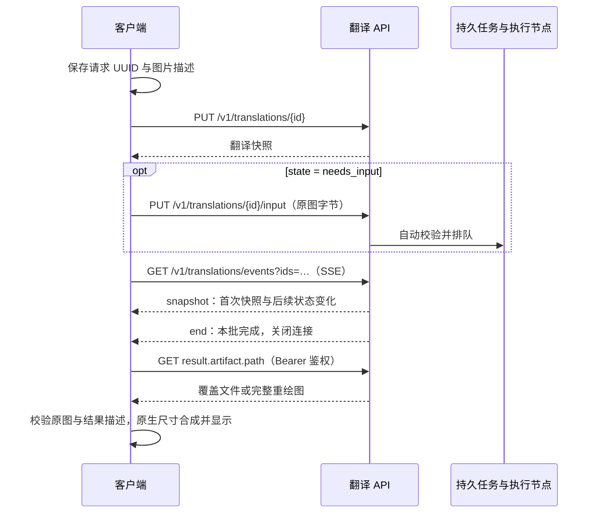

# 翻译接口与阅读恢复契约

本文为现行接口。官方常规翻译交付 `overlay-v1` 覆盖文件，重绘交付 `full-image-v1` 完整结果；全部文件经中心鉴权直读。中心原图只保留到任务终态，不提供原图恢复；计算与存储分别见[集群架构](TRANSLATION_CLUSTER_DESIGN.md)和[存储规范](OBJECT_STORAGE.md)。

本文约束 **NodeLane 官方渠道**的后端 API 与客户端恢复行为。客户端渠道抽象、MTU 直传协议及缓存边界见[客户端翻译渠道](TRANSLATION_CHANNELS.md)；本地渠道不要求实现本文的账号、权益或持久任务协议。

采用逐图翻译资源，机器契约见 [OpenAPI](../contracts/openapi.json)。客户端页面库使用 `node-comics-reading-v2-*` 和 `original-v2-static-srgb` 渲染身份；官方请求使用独立的 `translation-requests-overlay-v1` 库及带 `overlay-v1` 的账户 scope。升级与数据库基线遵循[部署规范](DEPLOYMENT.md)，不兼容旧资产下载协议。

## 1. 翻译流程


```mermaid
sequenceDiagram
  participant C as 客户端
  participant A as 翻译 API
  participant W as 持久任务与执行节点
  C->>C: 保存请求 UUID 与图片描述
  C->>A: PUT /v1/translations/{id}
  A-->>C: 翻译快照
  opt state = needs_input
    C->>A: PUT /v1/translations/{id}/input（原图字节）
    A->>W: 自动校验并排队
  end
  C->>A: GET /v1/translations/events?ids=…（SSE）
  A-->>C: snapshot：首次快照与后续状态变化
  A-->>C: end：本批完成，关闭连接
  C->>A: GET result.artifact.path（Bearer 鉴权）
  A-->>C: 覆盖文件或完整重绘图
  C->>C: 校验原图与结果描述，原生尺寸合成并显示
```

同一在途任务已收到输入时无需重复上传；本人完成结果命中直接返回成功快照，不要求中心仍有原图。客户端只维护逐图 UUID，无需阅读会话或上传完成确认；结果地址随快照返回。

## 2. 页面身份与请求身份

- 本地 `targetKey` 为页面上下文与模式的 SHA-256，固定 64 个十六进制字符。这个本地键不进入翻译请求。
- 每次新的翻译意图生成标准 UUID，公开 `id` 固定 36 字符；发送前把 UUID 与完整业务输入保存到 IndexedDB。账户、内容、模式、语言分别隔离。
- 同一账户、同一 UUID 永久绑定相同业务输入。重复 PUT 返回原资源；换图、换模式、换语言或改变重试来源返回冲突。任务不携带阅读优先级。
- 网络失败、刷新、扩展重启或回包丢失均继续使用原 UUID。先 GET 核实；明确未受理时可以重放原 PUT。不得通过生成新 UUID 自动重试结果未知的重绘。
- 多个 UUID 指向相同的本人任务或结果时，服务端复用已有工作，不重复创建计算任务或扣量。删除后的旧 UUID 保留撤销回执，不能使被删除访问复活。

### 账户内复用

`Job` 保存执行和冻结结果，`TranslationRequest` 保存账户 UUID、请求摘要、Job 关系及撤销墓碑，`Asset` 保存输入与产物描述。匹配键包含送译 SHA-256、模式、语言、有效配置、规范化及结果版本，查询始终限制账户；图片摘要不赋予跨账户权限。

受理按 scheduler → user 顺序加锁，先核实原 UUID，再查本人在途与完成结果，未命中才创建任务和预占。命中不新增执行、分钟计数或页数预占，也不刷新生成时间；同 UUID 不受后来默认配置改变影响。显式重译创建新任务，保留旧结果；不同账户分别计算和结算，不共享原图或译文。

原图终态删除后，成功快照、本人复用、结果下载与译文详情仍有效。撤销一个 UUID 不影响其他有效本人引用，最后引用撤销后的回收见[存储规范](OBJECT_STORAGE.md#原图与结果清理)。

## 3. 创建与上传

```http
PUT /v1/translations/84ca7300-156d-46e8-952f-c2a65a447e72
Authorization: Bearer …
Content-Type: application/json
X-Translation-Protocol: overlay-v1

{
  "image": {
    "sha256": "<实际送译字节的 SHA-256，64 个十六进制字符>",
    "byte_size": 123456,
    "content_type": "image/png",
    "normalization_version": 1
  },
  "mode": "classic",
  "target_language": "zh-Hans"
}
```

能力响应必须声明 `result_protocol=overlay-v1`。全部 `/v1/translations` 业务路由都要求 `X-Translation-Protocol: overlay-v1`，包括创建、上传、单项／批量／历史查询、SSE、下载、取消、删除、反馈和详情；CORS OPTIONS 预检除外。缺少或不匹配时在读取请求体前返回 409 `CLIENT_UPGRADE_REQUIRED`，包含 `update_url=https://comics.nodelane.net/download/`；不能只保护创建而让旧客户端读取覆盖文件。

来源页先统一静态首帧、EXIF 方向与 sRGB 色彩语义；普通静态图片保留原字节，带 EXIF/ICC/动画等语义的输入转换为静态 PNG。阅读原图不因翻译而缩小。

官方渠道在创建请求前按 `min(1, 1800 / 短边)` 等比例缩小送译副本，尺寸四舍五入，不放大小图。需要缩小，或原文件超过 1 MiB 时，仅执行一次高质量 WebP 编码（`quality=0.90`）；不追求硬性 5 MB 目标，不循环降质量。无需缩小且不超过 1 MiB 时直接复用原字节；同尺寸重编码没有节省字节时也保留原文件，避免无收益的有损压缩。原图始终不改写。摘要、大小和尺寸绑定实际送译字节；本地另外保存来源摘要用于页面匹配，不能把送译摘要覆盖到原图身份上。编码策略固定为 `short-edge-1800-webp90-v1`，重试复用冻结字节。缩放与编码在 Worker 内执行；扩展 service worker 直接使用自身后台线程，像素处理跨上下文串行，并复用同一锁限制结果合成。上传不占用像素处理锁。

中心统一校验实际输入字节与尺寸，默认最多 128 MiB、3200 万像素、单边 16000；字节上限是传输安全边界，不是压缩目标。插件按能力响应提前检查缩小后的图片，过长条漫明确失败，不自动切片或继续缩小短边。节点不另设图片字节、像素或单边准入上限，仅核对中心元数据、摘要、格式和规范化；资源并发与工作内存预算仍有效。

预处理不改变公开请求／响应字段或 `overlay-v1` 标识；来源摘要、编码策略和冻结尺寸只保存在插件本地。新插件按中心能力与本地安全上限的较小值检查输入，可连接仍采用旧上限的 overlay-v1 中心；升级后也可继续原字节任务。旧 overlay-v1 插件的旧范围任务仍可使用新中心，但旧插件不能保证读取超出其 8192／2400 万像素上限的结果，也不能在降级后恢复新版已缩小／重编码的待上传输入或缓存缺失的覆盖结果。此兼容性不包含缺少 overlay-v1 协议头的更早客户端。

`mode` 为 `classic` 或 `redraw`。客户端不传书目、页码、客户端页键、会员策略或扣费上限。后端先核实重复请求、本人任务与完成结果，再检查分钟预算和会员额度；Redis 原子预占分钟次数，数据库将任务受理、页数预占与 UUID 回执在同一事务中提交。异常时短期次数可保守保留至过期，不重复扣页数，见[请求保护](SUBMISSION_SCHEDULING.md)。

为兼容已有 overlay-v1 插件，创建、重试与重译请求仍接受已弃用的 `priority: "current" | "prefetch"`，校验后忽略，不持久化、不参与调度或请求摘要。同一 UUID 增删或改变该字段仍返回原资源，不新增任务或预占；其他未知字段继续返回 422。新插件不发送此字段，已有 overlay-v1 插件无需随调度简化同步更新。

返回 `needs_input` 时，向同一资源的 `/input` 子路径发送已绑定摘要的实际送译字节。服务端限制实际收流大小、摘要、格式和可解码尺寸，原子写入中心任务私有临时文件后自动进入持久校验与执行，不需要第二次确认。重传不会重复创建任务或收费；输入过期、取消及原图不可用返回明确错误。

内部上传保护仍有期限和并发限制，崩溃恢复可核实已发布的任务输入文件；它不是客户端必须维护的阅读会话。校验、重绘和常规流水线由后端继续完成，不依赖扩展 service worker 常驻。

## 4. 状态与结果

| `state` | 含义 |
| --- | --- |
| `needs_input` | 尚缺原图字节 |
| `queued` | 已受理，等待校验或执行 |
| `running` | 正在翻译 |
| `succeeded` | 可交付结果，包括部分结果或无字原图 |
| `failed` | 失败、取消或结果已不可用；具体原因看 `error` |
| `needs_attention` | 上游结果未知，等待核实 |

快照包含 `id`、`state`、`execution_resolved`、`mode`、`target_language`、`image_sha256`、时间、`result` 与 `error`。公开 ID 始终是当前用户的请求 UUID，不泄露来源任务 ID，也不返回原图／译图资产 ID 或签名地址。

成功的 `result` 包含以下冻结描述：

- `kind=translated|partial|no_text`、`representation=overlay-v1|full-image-v1|original`。
- `input_sha256`、`normalization_version=1`、整页 `width/height`、`quality_flags`。
- 有文件时，`artifact={sha256,byte_size,mime,path}`，其中 `path` 固定为当前 UUID 的 `/v1/translations/{id}/result`。
- 覆盖结果另含整数 `bbox={x,y,width,height}` 和 `composite=source-atop`；文件为裁剪到变化范围的无损 RGBA WebP，透明像素代表保留原图。
- `original` 不带文件、bbox 或 composite。`kind=no_text` 表示无文字；`kind=translated` 表示确认翻译成功但没有可见变化。二者都不下载图片，不因滚动自动重译。

扩展受信上下文向配置的中心 origin 携带 Bearer 和协议头 GET 读取 artifact，禁止外部 origin、其他 UUID、查询签名或重定向；令牌不进入来源页面。下载限制字节数和 MIME，公共 `materializeResult(result, original)` 统一核验 artifact 摘要，以及送译原图摘要、规范化版本、整页与覆盖尺寸。阅读器、原位翻译和导出共用此路径：先在原生尺寸画布画底图，再按整数 bbox 使用 `source-atop` 覆盖，最后由显示层缩放，保留原图 alpha 和阅读位置。

IndexedDB 保存结果描述与校验后的完整译图：常规覆盖首次合成为整页 PNG，重绘直接保存完整结果，不另存覆盖文件。阅读器、原位翻译和导出命中完整译图缓存时直接读取，不再恢复原图、校验覆盖文件或合成。持久译图受用户缓存预算限制，内存最多保留四页并受字节预算限制。完整译图缓存缺失时才重新下载同一结果并合成；原图独立保存于来源页缓存／主动离线存储，找不到时从同一来源恢复并核验摘要。恢复失败明确显示原图不可用，不能向中心取永久副本或自动重新扣费翻译。

缩小输入的覆盖结果始终在送译尺寸合成，不放大覆盖层到阅读原图。完整译图缓存缺失时优先读临时送译副本；缓存已淘汰或写入失败则从原图按冻结尺寸重新生成，并严格核对送译摘要，不假定跨浏览器版本的编码字节一致。摘要不符只报恢复失败，不自动重译。临时副本的缓存规则见[存储规范](OBJECT_STORAGE.md#插件临时送译副本)。

同一执行上下文的运行时与图片显示端共享最近 128 个快照，直接使用 SSE 描述；已有描述不追加 access 或签名查询。下载失败保留成功任务，只重试同一 UUID 的文件读取，不重调模型。

## 5. 查询与恢复

- `GET /v1/translations/{id}`：查询一个本人请求及其冻结结果描述。
- `GET /v1/translations?ids=<逗号分隔 UUID>`：最多 32 个请求的批量快照，返回 `{items, missing_ids}`，用于刷新恢复和结果不确定时核实。未找到的 ID 与终态失败分开表示，不暴露其他账户数据。
- `GET /v1/translations/events?ids=<逗号分隔 UUID>`：同样最多 32 个本人 UUID，返回 `text/event-stream`。首个 `snapshot` 事件包含完整批量快照，之后只在内容变化时推送；`end` 的 `reason=complete` 表示本批无活动任务，`reason=reconnect` 表示应重新鉴权连接。客户端用流式 fetch 的 Bearer 头鉴权，令牌不放入 URL。
- SSE 使用数据库提交通知唤醒，合并短时间内的通知；等待时不持有数据库连接。20 秒注释心跳不查库，60 秒核实一次持久状态以补偿通知丢失。连接最多 295 秒且不越过令牌有效期，使用独立 Redis 请求预算与 300 秒并发租约；同一账户跨 API 实例合计默认最多 4 条，受 `translation_request_concurrency` 控制，超过上限返回 429 和 `Retry-After`。正常结束或客户端断开即释放，代理禁止缓冲响应。
- `ETag` / `If-None-Match`：普通快照未变化时立即返回 304；HTTP 快照查询不挂起等待。状态等待统一使用 SSE，通知只是唤醒提示，数据库是最终状态，不保存事件游标。
- `GET /v1/translations?offset=0&limit=50`：私有分页历史。插件不新增翻译记录页，也不通过历史接口恢复当前阅读。

每个客户端协调器最多保持一个 SSE 订阅，阅读器与原位翻译都在连续等待中复用此连接。部分页完成时保留订阅供剩余页面使用；阅读窗口或新增 UUID 改变订阅时才重建。无活动任务、隐藏、暂停、断网、离开页面、账户或渠道切换均中止订阅；连续 45 秒未收到数据或心跳则释放无响应连接。刷新后按已保存 UUID 批量核实，不能先取回整个账户历史。断流使用原 UUID 重连，网络故障指数退避并遵守 `Retry-After`，不持续进行 PUT/GET 循环。

协议切换不复用旧输入引用或旧结果缓存。新请求库没有当前页记录时，只读取旧库中的最小 UUID 与页面身份；当前页旧 UUID，以及同账户的旧未知／不确定重绘请求，仅用 GET 核实。明确未找到才可自动发起新请求；已明确结束的旧页需要用户手动重新翻译。仍为 needs_input、queued、running、needs_attention 或网络核实失败时，不新建、不补传。旧不确定重绘收到 `TRANSLATION_UNAVAILABLE` 时，只有 `execution_resolved=true` 才能解除未知保护；字段缺失或为 false 均继续阻止新建。该字段默认为 false，仅用于已撤销或不可用请求的执行证明：本人任务须已明确终态、额度已结算或释放，且无进行中或未核实的供应商调用；旧共享授权墓碑只使用迁移时冻结的完成证据，不查询他人的任务或费用。解除保护不恢复旧结果，同页仍须手动发起新 UUID；手动核实不重放旧 PUT、原图或旧 retry_of 描述。该检查按账户进行，不能因规范化后摘要变化而绕过。

配置、额度、订阅信息和用量统计在同一执行上下文内按 API 地址与登录会话共享 5 分钟内存缓存，并合并进行中的相同请求；令牌续期沿用会话缓存，退出后新会话不能读取旧账户缓存。`capabilities` 已含额度，不紧接着重复请求 `entitlements`。缓存只按需过期，不设置刷新定时器；普通点击、重试和页面获焦复用缓存。账户用量仅在进入页面、切换范围或明确刷新时读取；明确刷新权益与支付返回可强制更新，支付同步结果写回缓存。缓存展示不替代服务端受理时的权限与额度检查。

## 6. 失败重试与重新翻译

显式重试使用新的 UUID 和 `{ "retry_of": "<旧请求 UUID>" }`；只适用于已失败或取消的任务。已成功结果的显式重新翻译使用新的 UUID 和 `{ "regenerate_of": "<旧请求 UUID>" }`。

未知重绘不能普通重试，先核实供应商。用户明确确认可能再次产生费用后，才可发送 `regenerate_of` 与 `acknowledge_unknown_cost: true`。同一新 UUID 的重复点击仍只受理一次。未确认、自动滚动、状态查询、下载重试均不能重新调用图片模型。

`DELETE /v1/translations/{id}` 撤销当前 UUID 的访问，最后一个有效引用消失后按存储规则回收结果。`POST /v1/translations/{id}/cancel` 取消可取消任务；反馈与常规结果详情使用同一 UUID 的 `/feedback`、`/classic` 子路径。漫画与页面关系由客户端保存，不再提供独立文件页匹配或绑定接口。

## 7. 阅读触发与优先级

新漫画默认原图。用户选择常规／AI 或明确打开译本后，才申请当前页与后三页；当前页立即触发，后三页延后 150ms 预取。滚动合并 80ms、最长 200ms，快速翻页保留最新待提交窗口。同一页切换结果保持阅读位置，四页独立完成，失败不互相阻塞。

客户端先提交当前页，再按有限窗口提交邻页；翻页不向中心更新优先级。中心按任务阶段就绪顺序领取。已受理的旧窗口请求继续完成；客户端隐藏或暂停时停止新增请求。

## 8. 限频、额度与安全

普通／PLUS 每滚动 60 秒最多新增 10／100 张翻译图片，跨模式、语言、设备合计。已有原图的新翻译也计数；重传、UUID 重放、本人在途复用、完成结果复用不计数。取消和失败不退还分钟次数。常规每日额度、PLUS 会员月重绘额度和赠送按[会员规则](MEMBERSHIP_AND_QUOTAS.md)处理，不由客户端预判队列容量。

`IMAGE_RATE_LIMITED` 为图片分钟限制，`REQUEST_RATE_LIMITED` 为独立 HTTP 保护，均返回 429 和 `Retry-After`；客户端保留最新待提交窗口，按期限恢复，任务完成不能提前解除分钟退避。额度不足只影响对应图片，图内提供升级入口，常规额度只在账户页展示。

图片授权、请求及结果复用按用户隔离，仅复用本人在途工作和结果，遵循[账户内复用](#账户内复用)。摘要不是跨账户访问凭据。中心原图在终态提交后立即清理，缺失清理可补偿；最终结果按[存储规范](OBJECT_STORAGE.md)保留。供应商成本与用户页数独立计量。

## 9. 验证入口

使用[后端说明](../backend/README.md#验证)的 Docker 隔离测试或本地虚拟环境。PostgreSQL 并发套件仅连接 `nodecomics_concurrency_test`，每例随机 schema；不读取或重置产品库。

```powershell
cd backend
.venv/Scripts/python.exe -m pytest -q tests/test_translation_requests.py tests/test_translation_events.py tests/test_recovery_snapshots.py tests/test_submission_limits.py tests/test_result_cache.py
```

插件目录执行 `npm run check`、`npm test`、`npm run build`。浏览器脚本需要 Playwright 和兼容 Chromium；`PLAYWRIGHT_MODULE`、`TEST_CHROMIUM` 可以指定已安装路径。模拟图片验证交互，不能证明真实翻译效果。

```powershell
# 终端一，在 apps/extension 运行
npm exec vite -- --host 127.0.0.1 --port 5176 --strictPort
# 终端二，从仓库根目录运行
node scripts/verify_translation_overlay.mjs
node scripts/verify_reading_translations.mjs
node scripts/verify_inline_translation.mjs
node scripts/verify_source_database_baseline.mjs
# 真实 API / worker，使用临时库和合成供应商
$env:READER_FIXTURE_PORT='18093'
backend/.venv/Scripts/python.exe backend/tests/manual_ui_server.py
# 将打印目录设为 UI_FIXTURE_DIRECTORY，另一个终端运行
node scripts/verify_reading_api.mjs
```

检查请求重放、跨用户隔离、撤销后恢复、上传回包丢失、终态／下载失败、分钟竞争与结算；浏览器检查当前页与后三页、断网恢复、位置保持和零旧接口请求。覆盖像素验收检查半透明合成、EXIF/ICC 与动画规范化、摘要错误、原图缺失、无字复用与最后引用回收；真实 GPU／付费供应商验收需隔离配置，不由模拟检查代替。
