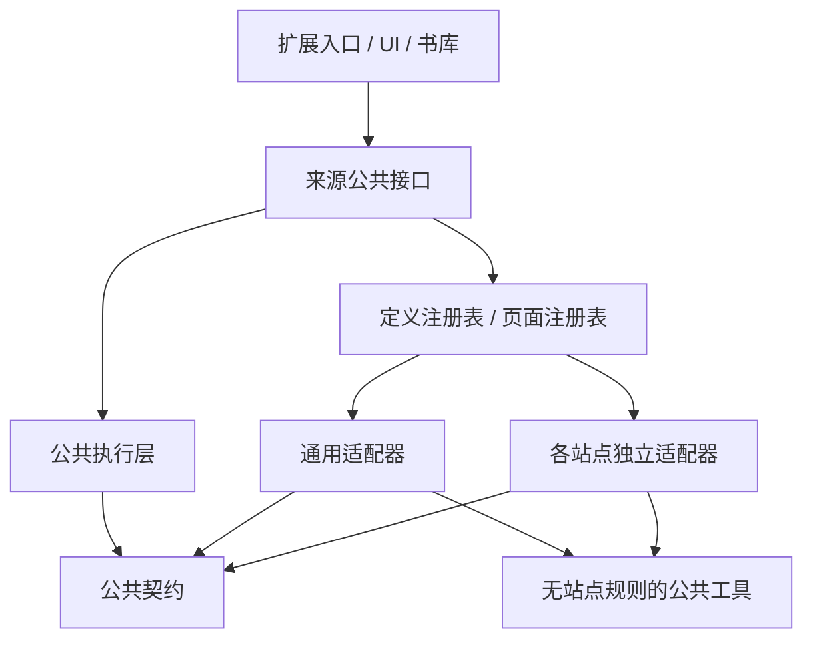

# 通用适配与独立站点适配架构

日期：2026-09-22。状态：**本轮架构设计，尚未执行目录迁移与代码重构**。当前实现和 Comic PASH 验证记录见[网站图片适配](SITE_ADAPTERS.md)。本文定义下一次重构的目标结构、接口、依赖约束和验收条件。

## 1. 设计结论

采用“公共执行层 + 通用适配器 + 独立站点适配器”。通用适配器和站点适配器使用同一套契约；站点适配器按站点分别放在 `sites/<site-id>/`，互不导入。站点匹配、URL 解析、图片发现、目录解析、原始标签映射、特殊读取和观察规则都由对应站点持有。

公共层负责选择适配器、生命周期、消息校验、权限、资源登记、有限轮询和结果交付。阅读器、书库、翻译调度和后端不包含站点名称分支、域名、站点选择器或 URL 拼装规则。

这次重构目标包含现有目录能力的解耦；不会因此新增任何站点的目录、付费内容获取或自动翻章功能。

## 2. 当前需要消除的耦合

以下是本轮核实的代码现状，不是推测：

| 当前位置 | 耦合 | 目标归属 |
| --- | --- | --- |
| `sources/adapters.ts` | xkcd/Gunnerkrigg 的域名和选择器，以及 MangaCopy 的实现组装 | 各站点的 `definition.ts`、`page.ts`；注册表只装配 |
| `sources/builtin.ts` | 通用发现与 MangaCopy 图片容器规则混在同一文件 | `generic/page.ts`、`sites/mangacopy/pages.ts` |
| `entrypoints/background.ts` | MangaCopy 详情页判断、目录归属、章节等待、镜像跳转校验 | 站点身份定义 + 公共目录校验、发现和导航服务 |
| `entrypoints/content.ts` | MangaCopy 的自动注入范围、导入按钮位置、目录读取 | 站点定义与页面会话；入口只注册公共消息 |
| `wxt.config.ts` | 直接导入 `MANGACOPY_PERMISSIONS` | 从站点定义注册表聚合既有安装权限和自动注入规则 |
| `sources/client.ts` | 镜像页判断、MangaCopy 专属提示 | 公共来源服务；站点名称来自定义 |
| `library/store.ts`、`library/web-import.ts`、`ui/SourceImport.tsx` | 通用来源身份函数放在 MangaCopy 模块中 | 公共身份服务，内部调用所选站点定义 |
| `library/directory.ts` | 根据 MangaCopy 路径拼目录地址 | 使用站点返回的目录引用 |
| `library/model.ts` | 将源站的“卷／番外／話”直接解释为导入类别 | MangaCopy 解析为标准建议；领域层只采用用户选择或标准建议 |
| `ui/CatalogImport.tsx` | 副本来源名称写死为 MangaCopy | 使用 `sourceId` 对应的展示名称 |
| `inline/content.ts` | 公共观察器包含 `data-comici-viewer-id` | Comic PASH 会话声明观察规则 |

当前模块检查只检测循环引用和不可达模块，尚不能阻止站点间导入或核心层引用站点内部文件；需要增加架构边界检查。

## 3. 目标目录

以下为**目标目录**，不是已经存在的代码：

```text
apps/extension/src/sources/
├── index.ts                    # 后台、书库、UI 使用的公共接口；不加载 DOM 实现
├── page.ts                     # 内容脚本使用的公共接口
├── contracts/
│   ├── source.ts               # 可序列化的身份、图片清单、目录、诊断
│   ├── definition.ts           # 纯站点定义和 URL 身份接口
│   └── page.ts                 # 仅页面环境使用的会话与渲染目标接口
├── registry/
│   ├── definitions.ts          # 仅注册各 definition；不包含站点规则
│   └── pages.ts                # 仅注册各 page 工厂；仅内容脚本导入
├── core/
│   ├── resolve.ts              # 站点优先、通用兜底、冲突检测
│   ├── identity.ts             # 来源身份、目录引用、受控镜像等价判断
│   ├── discovery.ts            # 快照、有限等待、取消、部分结果
│   ├── catalog.ts              # 目录结构与条目归属校验
│   ├── navigation.ts           # 导航代次、会话失效、受管标签页归属
│   └── resources.ts            # 页面资源登记、限额、读取和失效
├── runtime/
│   ├── background.ts          # 扩展权限、消息处理和受管标签页
│   ├── content.ts             # 当前页面会话与观察器生命周期
│   └── client.ts              # UI/书库调用的消息客户端
├── shared/
│   ├── urls.ts                # HTTP(S) 地址等纯校验工具
│   ├── dom-images.ts          # 参数化的图片枚举、尺寸和可见性工具
│   ├── canvas.ts              # 画布读取、尺寸与字节上限
│   └── observe.ts             # DOM/加载/尺寸变化观察工具
├── generic/
│   ├── definition.ts          # 通用适配身份和能力声明
│   ├── page.ts                # 已加载图片识别、通用渲染目标
│   └── tests/
└── sites/
    ├── mangacopy/
    │   ├── definition.ts      # 主站/镜像域名、URL 身份、权限、能力
    │   ├── page.ts            # 页面会话装配、导入入口位置
    │   ├── pages.ts           # 漫画容器、页槽、完整性
    │   ├── catalog.ts         # 分组/目录、原始标签到标准建议
    │   ├── data.ts            # 页面内联数据读取和解码
    │   ├── README.md          # 已支持范围、证据和局限
    │   └── tests/             # *.test.ts 与脱敏 HTML/JSON 样本
    ├── comicpash/
    │   ├── definition.ts      # 主机、episode 身份、能力
    │   ├── page.ts            # Comici 页槽、画布版本、观察规则
    │   ├── README.md
    │   └── tests/
    ├── xkcd/
    │   ├── definition.ts
    │   ├── page.ts
    │   └── tests/
    └── gunnerkrigg/
        ├── definition.ts
        ├── page.ts
        └── tests/
```

每站至少有 `definition.ts` 和 `page.ts`，其余文件按实际复杂度拆分，不为简单站点创建空目录解析器。标准 `` 显示和画布覆盖层仍属于 `inline/` 的通用展示实现；其中不保留站点选择器和站点身份判断。通用按钮样式属于 UI，站点只提供挂载位置，公共运行时负责点击行为与清理。

## 4. 依赖方向



- 站点目录之外，`registry/` 是生产代码中唯一允许直接导入站点实现的装配位置；同一站点内部可以互相导入。注册表只保存定义和工厂列表，不写 URL 正则、选择器或站点条件分支。
- `core/` 接收注册表／会话接口，不直接导入 `sites/` 或 `generic/` 的内部实现。
- `sites/a/` 不得导入 `sites/b/`。需要复用时从 `shared/` 组合函数，不建立站点类的继承链。
- `generic/` 不知道任何站点；站点不得导入整个通用适配器来触发隐式兜底，只复用无站点语义的工具。
- `shared/` 和 `contracts/` 不反向导入适配器、注册表或执行层，避免公共工具间接携带站点规则。
- 站点模块不导入 `library/`、`ui/`、`inline/`、账户、翻译 API、存储或扩展后台模块；它们不直接调用 `chrome.*`，也不创建翻译任务。普通 UI 文案可使用现有 i18n 工具，契约本身不依赖 UI。
- `definition.ts` 及其传递依赖必须可在构建工具、service worker 中加载，不访问 `document`、`window`、Canvas、CSS 或浏览器全局对象。页面实现只经 `page.ts` 的公共入口进入内容脚本。

先使用显式、随扩展打包的注册表。扩展静态代码中注册新站点即可，不增加远程脚本、动态安装适配器、运行时扫描文件夹或用户输入脚本机制。两份注册表通过契约测试校验 ID 集合一致，防止元数据与页面工厂脱节。

## 5. 两层适配契约

### 5.1 纯定义：身份、能力和安装元数据

目标接口骨架如下；类型位于目标 `contracts/` 中，**本轮尚未添加到源码**：

```ts
type PageKind = 'reader' | 'catalog' | 'other';

interface SourceLocation {
  sourceId: string;
  pageKey: string;              // 带来源命名空间的逻辑身份
  kind: PageKind;
  url: string;                  // 实际访问地址，保留有效查询参数
  catalog?: { key: string; url: string };
}

interface SourceDefinition {
  id: string;
  name: string;
  identify(url: URL): SourceLocation | null;
  capabilities: {
    pages: boolean;
    inline: boolean;
    catalog: boolean;
    completePageList: boolean;  // 能否在受管发现流程中补全清单
  };
  installation: {
    requiredOrigins: readonly string[];
    autoContentMatches: readonly string[];
  };
}
```

`identify` 只解析已验证的 URL，不发请求、不读 DOM。主机白名单、路径类型、章节／目录身份和镜像归一化在站点内部完成。域名相同不表示页面相同，章节 ID 相同也不能跨站等同。

通用适配保留安全检查后的完整页面地址作为默认身份，不统一删除查询参数或 hash；它们可能承载章节路由。站点可以在有证据时忽略追踪参数或统一镜像身份，但实际访问 URL 单独保留。

公共身份服务通过 `sourceId + pageKey` 判断已声明来源的逻辑等价；后台只将它用于受管导航／镜像校验。原图授权仍绑定实际标签页、文档、导航代次及已登记资源，不能仅凭逻辑身份通过过期引用读取新文档。

安装元数据只集中现有权限。新增站点默认 `requiredOrigins` 和 `autoContentMatches` 均为空，继续通过用户操作和既有可选权限注入；注册站点不自动扩大安装时权限。MangaCopy 已有安装权限及详情页按钮行为在重构中保留。

### 5.2 页面会话：发现、渲染目标和变化通知

每个文档／导航代次创建一个适配会话。会话仅持有当前页面状态，不作为模块级全局单例缓存不同标签页或不同章节。

```ts
interface SourcePageContext {
  document: Document;
  location: SourceLocation;
  signal: AbortSignal;
}

interface SourcePageSession {
  discoverPages?(): Promise<PageDiscovery>;
  discoverCatalog?(): Promise<CatalogDiscovery>;
  inlineTargets?(): readonly RenderedTarget[];
  observe?(changed: () => void): () => void;
  importAnchor?(): Element | null;
  dispose(): void;
}

type CreateSourcePage = (context: SourcePageContext) => SourcePageSession;
```

声明的能力必须有对应实现，由契约测试检查。通用适配可以使用共享 DOM 观察工具；Comic PASH 会话在自己的目录中登记 `data-comici-viewer-id` 等特殊变化。公共层将变化合并后刷新，不在调度器中追加站点属性名。

会话不把 DOM、函数或 Blob URL 放入持久清单。`RenderedTarget` 是页面内部对象，至少包含稳定页键、来源版本、显示元素、阅读方向，以及需要时在本地读取 Blob 的函数。HTML 图片和 canvas 使用通用渲染类型；站点仅负责找对目标、判断是否完成渲染及版本是否改变。

`PageDiscovery`／`CatalogDiscovery` 使用可序列化的联合结果：`ready`、`not-ready`、`unsupported`、`error`。`ready` 可以包含部分清单，完整性单独表达；`not-ready` 可附带已发现部分和“等待加载／需要用户操作”的原因。`error` 携带稳定诊断码，不包含站点脚本、原文全文、凭据或带签名地址。

### 5.3 持久清单和临时资源分离

图片描述采用明确的资源类型：

```ts
type ImageResource =
  | { kind: 'http'; url: string }
  | { kind: 'page'; resourceKey: string };

interface DiscoveredPage {
  id: string;                   // 稳定页槽，不根据临时 URL 生成
  order: number;                // 源站阅读顺序，缺页不重编号
  width: number;
  height: number;
  resource: ImageResource;
}
```

源站会话提供的 `resourceKey` 是本地逻辑引用。公共资源注册器为跨扩展消息创建不透明句柄，绑定 `tabId/documentId/navigationId/pageKey/版本`；站点不能通过自选句柄获得读取授权。发现快照可以携带该临时描述；持久记录只保存页槽身份、可恢复来源或已采集内容引用，不把 `resourceKey` 或句柄当成跨会话可用的原图来源。已授权快照和句柄由公共运行时管理。

HTTP 图片只在已登记范围内获取。页面内图片在编码前后核实当前版本，超时、取消、离页、替换画布或导航后拒绝旧请求。原图遵守已有单图尺寸／字节限制，缩略图使用有界预算。编码结果不写入默认日志；副本落地后保存内容哈希和 Blob 键，失效的页面句柄不成为可重试的网络原图地址。

重复 URL 可属于不同页槽，页序身份与字节去重分开。格式修订或来源版本改变不能把旧译图贴到新内容上。

### 5.4 目录和领域模型分离

将来源观察类型放入 `contracts/source.ts`：`SourceCatalogSnapshot`、`SourceEntry`、`SourceGroup`。站点返回原始标签、来源身份、标题、次序和标准化的分类建议；“卷／話／番外”等标签含义由对应站点解释。

`workId`、用户排除项、已确认的归属和本地采集状态留在书库的来源绑定记录中，不由站点解析器生成或覆盖。UI 展示来源名称，采用标准建议并允许用户修改；它不解析某个站点的语言标签。来源条目 ID 不等于全局作品／章节 ID。

目录校验分两层：公共层检查结构、重复 ID、顺序、分组引用和资源限制；所选定义的 `identify` 验证每个目录／条目 URL、来源身份及所属目录键。声明目录能力的站点必须能给条目提供可靠的目录归属；不能根据同名标题推断。未知来源 ID 或不属于已登记目录的条目禁止启动受管采集。

## 6. 选择、回退和生命周期

1. 公共入口先校验普通 HTTP(S) 页面地址，再让站点定义进行纯 URL 识别。
2. 恰好一个站点匹配时使用该站点；没有站点匹配时使用 `generic`。多个站点同时匹配是配置冲突，明确报错，不依赖数组先后决定结果。
3. 站点可将已知但不支持的路径识别为 `other` 并返回 `unsupported`；明确未认领的路径才走通用适配。能力缺失和解析失败均不触发隐式通用回退。
4. 内容运行时创建会话，调用所需能力并统一校验输出。网页发现与网页翻译必须使用同一个选择结果和页序定义，不能分别猜站点。
5. 预览读取当前快照；受管采集仅在站点声明可补全清单时使用公共有限轮询。暂停、AbortSignal、总时限和不增长时限属于公共层。页数暂时不增长不能证明完整，也不能自动触发翻页。
6. 只有显式总数、已验证清单或站点单页契约能声明完整。Canvas 的已渲染窗口通常为部分；通用适配不声称整章。
7. URL／文档／源站逻辑身份改变时，中止在途发现、撤销资源句柄、移除译图和挂载入口、停止观察器，再创建新会话。SPA 使用公共导航检测结合会话变化通知，并在每次消息处理时复核身份；不只在首次注入时读取 URL。
8. 插件停用、标签页关闭和内容卸载执行同一清理路径。重新打开按持久业务状态恢复，不能复用旧 DOM 引用。

通用适配的首轮能力保持当前边界：发现已加载的大图，读取 `currentSrc/src`，网页翻译支持当前已支持的页面内图片；不盲目读取所有 `data-*`，不自动采集任意 canvas、CSS 背景或 iframe。新渲染类型需要单独验证和明确的资源／展示契约。

## 7. 现有站点如何落位

| 适配器 | 图片发现与来源 | 目录 | 自动补全策略 |
| --- | --- | --- | --- |
| `generic` | 已加载 ``；网页内已有 blob/data 支持保留 | 无 | 快照，完整性未知 |
| `mangacopy` | 容器页槽 + 已验证内联数据；HTTP 原图 | 保留现有目录及标签映射 | 有界等待完整数据，不自动滚动 |
| `comicpash` | Comici 已渲染 canvas、页槽与版本 | 本次仍无 | 快照；用户翻页触发新目标，不自动翻完整章 |
| `xkcd` | 自有页面选择器、单期图片 | 无 | 单期完整性契约 |
| `gunnerkrigg` | 自有页面选择器、当前漫画页 | 无 | 单页完整性契约 |

相同阅读器引擎不自动意味着不同网站的权限、目录和身份相同。以后若有第二个已验证的 Comici 站点，可提取不含域名／目录规则的共享读取工具；两个站点仍保留独立定义、页面装配和测试。当前不预建通用引擎插件系统。

## 8. 重构实施顺序与完成条件

1. 提取纯契约与定义／页面注册表，建立 `generic/` 和四个独立站点目录。分拆 `builtin.ts`，所有站点规则移到对应目录。
2. 把后台、配置、消息客户端、目录 UI、书库身份和标签建议改为公共接口；自动注入范围从纯定义聚合。处理当前公共层的 MangaCopy 分支和 Comic PASH 特殊观察属性。
3. 统一会话生命周期、资源登记及失败语义；保留当前导入、阅读位置、逐页失败、权限与任务恢复行为。
4. 删除已替代的根目录站点文件和旧入口，直接更新引用；不保留转发文件、双注册表兼容路径或旧逻辑回退。若来源类型落地需要存储结构变更，按项目新库基线处理，不在设计阶段删除现有数据。
5. 扩展现有 `check-modules.mjs`：按解析后的导入目标检查跨站点引用、核心直接引用站点、页面代码进入纯定义依赖链、站点引用 UI／存储／翻译层。检查静态导入、重导出和动态导入；已有循环引用／不可达检查保留。
6. 添加注册表冲突／能力一致性测试和站点契约测试。通过公共入口注入一个测试站点，证明新增站点无需修改后台、书库、UI 和翻译调度代码。

验收必须覆盖：未知网站走通用；已匹配站点等待／失败不误抓广告；站点域名与伪造相似域名隔离；镜像同页与跨作品跳转区分；部分页槽与重复 URL；目录分组引用和标准分类建议；暂停／取消／SPA 切换；失效句柄与来源替换；原图恢复、画布变换对齐和权限不扩大。

实施后在扩展目录运行 `npm run check`、`npm test`、`npm run build`，再执行现有 `verify_web_import.mjs`、`verify_inline_translation.mjs`、`verify_comicpash.mjs` 及相关 MangaCopy 检查。真实站点、隔离样本、真实模型效果分别记录；测试数量以实施后的运行结果为准。本轮只检查设计内容、代码对应关系和文档链接，不重复报告上一轮测试为本轮架构已实现。

## 9. 已确定与后续范围

本设计采用函数组合和显式注册，通用适配与站点适配使用统一契约；所有现有站点逻辑按目录隔离；目录、身份、安装元数据和观察规则一起解耦。无需进一步选择框架或增加运行时依赖。

本轮交付为该设计文档。代码重构、第二个目录站点、iframe／CSS 背景支持、自动翻章和远程适配分发尚未实施；后续按具体任务独立确定范围。
