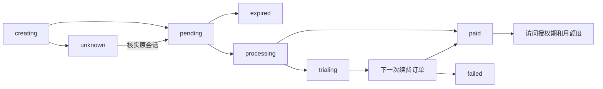

# 多渠道订阅、产品价格与订单

支付目录按“产品 → 月付／年付价格 → 渠道绑定”组织，支持 Stripe 和 Creem。产品权益与价格不可变，调价新建价格，原订阅继续使用原价与权益。本文件沿用原路径，内容已替换为多渠道契约。公开部署、真实支付与本地模拟验证分别记录。

## 已确认的产品规则

- 初始产品 PLUS：月付 US$9.99，年付 US$99.99；每月 300 页 AI 重绘，首次绑卡试用 7 天／30 页。空库中的月付和年付价格默认草稿，核验渠道商品后才能发布。
- 年付一次收费，以实际账期原始 UTC 日／时刻拆成 12 个会员月。未来月额度预先持久化，到该月才可用，剩余不累积。1 月 31 日的后续月界为 2 月末、3 月 31 日，不漂移到 28 日。
- 试用资格按 Node Comics 账户记录，跨产品、跨 Stripe／Creem 不能重复领取。正式额度必须来自已结清账期，不能仅凭 active 状态或成功返回页发放。
- 付费产品共用 PLUS 常规翻译不限累计页数、滚动分钟准入及调度档位；每产品的重绘和试用配置来自不可变权益版本。每产品独立常规额度、速率和调度权重仍不在当前范围。
- 运营赠送与订阅独立生效，不顺延支付渠道的扣款日期。任务继续结算受理时的额度周期。
- 官网和插件账户 PLUS 卡片均按月付／年付选择报价，后台全站只设置一个默认支付渠道，前端自动使用它，不提供渠道选择。插件沿用原卡片风格，在右上角切换月付／年付。官网未登录时读取公开目录并在登录后保留已选周期；插件未登录不展示报价，登录后通过账户的“订阅”子标签页打开订阅卡；待核实结账锁定原报价和原渠道，已有订阅通过其所属渠道的客户门户管理。

## 数据模型

最终空库基线为 `translations_0001`。旧支付表结构、旧接口和旧支付逻辑不提供升级、回填、双写或兼容分支；使用新空库建立最终模型。程序不会自动删除原数据库、漫画或 R2 对象。

| 表 | 职责 |
| --- | --- |
| `billing_settings` | 单例记录全站唯一默认支付渠道，首次初始化选择首个已启用渠道；未启用渠道时留空，由管理员设置 |
| `billing_plans` | 稳定产品标识和产品名称 |
| `billing_plan_revisions` | 不可变权益版本：名称、每月重绘页数、试用天数和页数 |
| `billing_prices` | 渠道无关的不可变价格：产品与权益版本、环境、币种、金额、month/year；同产品／环境／币种／周期最多一个在售价格 |
| `billing_price_bindings` | 每个价格对应的 Stripe 或 Creem 商品，独立草稿／发布／停售状态；同价格、渠道和环境最多一个在售绑定 |
| `billing_accounts` | Node Comics 账户级试用记录，防止换渠道再次领取 |
| `billing_customers` | 用户、渠道、环境与远端 Customer 的唯一绑定 |
| `billing_checkouts` | 原价格、渠道绑定、试用选择、远端会话、过期与核实状态；私有保存已校验的 Creem 结账地址用于原会话恢复，不在管理详情或日志返回 |
| `billing_subscriptions` | 可信结账建立的订阅、原价格与渠道绑定、生命周期日期 |
| `billing_invoices` | 幂等账单回执，与权益发放同事务提交 |
| `billing_terms` | 已授予的试用／付款访问期，关联订阅、价格和账单 |
| `quota_periods` | 可消耗月额度，订阅来源必须关联 term；年付 12 个桶，用量和预占独立 |
| `billing_orders` | 首次购买和每次续费的独立订单，记录渠道、环境、金额、状态及关联资源 |
| `billing_order_transitions` | 追加的订单流转历史，含来源、前后状态、事件编号和脱敏详情 |
| `billing_events` | 验签通知的持久收据、处理重试状态及对账所需最小字段 |

关系：产品 → 权益版本 → 价格 → 渠道绑定 → 结账／订阅 → 订单与账单 → 授权期 → 月额度。

Stripe 的一个 Product 可关联多个 recurring Price。Creem 的周期和金额属于 Product，本地一个产品的月付／年付分别绑定对应的远端 Product，不让渠道的数据结构决定本站产品结构。

Creem 试用属于远端商品且结账不能覆盖，因此含试用的价格绑定两个远端商品：`product_id` 为无试用的正式商品，`trial_product_id` 为同价同周期的 7 天试用商品。首次合资格结账使用后者，用过试用的账户使用前者。两者都须在发布时核验；Stripe 仍使用同一 Price，由服务端选择试用。

## 订单和状态

后台“订单管理”覆盖两渠道的首次购买和续费订单，支持渠道、状态、环境、时间范围、用户与订单编号搜索，以及分页。详情关联原产品价格、Checkout、订阅、按时间排列的完整流转记录，以及最近 100 条关联支付通知的接收、处理、重试和异常状态。订单历史留在本地，即使渠道暂时不可用也可查看。

支付状态、订阅状态与权益分别建模。取消续费保留已授予的当期权益；欠费、暂停和取消不授予下一期。成功页只展示结果提示，不发放额度。退款／争议等结果通过订单记录和对账处理，不把“结账 HTTP 成功”当作付款成功。

全额退款或争议撤销对应付费授权期及其当前／未来额度，部分退款保留授权；所有历史额度桶均保留供审计。

## 幂等与恢复

- 创建结账时锁定用户，在两渠道之间共同限制一个待核实购买意图。前端 POST 明确价格与目录中的默认渠道，服务端拒绝通过非默认渠道创建新意图；pending 期间选择另一价格或渠道会被拒绝。切换全站默认不改变已创建意图或订阅。
- Stripe 使用固定原意图的幂等键。结果未知时核实原会话；超过保证期限不重复发起购买。
- Creem `request_id` 用于关联本地意图，不当作未经平台保证的幂等键。创建 POST 结果未知时不盲目重发；依赖已知会话和可信 webhook 恢复，前端继续显示原意图。
- Creem 免费试用交易可能保留常规 `amount`（例如 999 美分），而 `amount_paid=0`。只有试用资格、远端试用状态及有界试用账期均已验证，且交易起止与该试用期一致时，才按试用记账；不能把常规金额字段当作实际收款。
- Creem GET 结账响应可能不含地址。优先复用首次 POST 后私有保存的已校验地址；若创建响应丢失，使用已验证归属的产品与结账 ID 恢复官方规范地址，不再次创建结账。
- 管理员可在订单详情核实平台状态。未知的首次结账若缺少远端编号，可填写对应平台结账编号；服务端验证原意图、用户、渠道、环境及唯一关联后恢复，不重新发送创建结账请求。
- Webhook 必须先验签再持久化；按渠道和环境命名空间隔离外部 ID，重复和乱序通知不得重复发放。对账校验环境、用户绑定、原价格／商品、币种、数量及完整账期。
- maintenance 重试持久事件、待核实结账和订阅；真实已付款账单与授权发放同事务提交，失败不留下半份权益。
- 已确认的全额退款或争议状态不能被迟到的已支付、试用或部分退款结果覆盖；已撤销的授权不能因旧账单再次核实而恢复。

## 配置与发布

两个渠道独立开启，默认均关闭；开启渠道必须配置其环境匹配的 API 密钥、Webhook 验签密钥和 HTTPS 返回页。仅配置 API 密钥不足以启用结账。同一运行环境中启用的渠道必须同为 test 或同为 live，生产只接受 live。API 与 maintenance 使用一致配置，测试与正式使用独立数据库。凭据仅保存在服务端环境配置，不能写进前端、日志或仓库。

| 配置 | 用途 |
| --- | --- |
| `STRIPE_ENABLED` / `CREEM_ENABLED` | 独立启用开关 |
| `STRIPE_ENVIRONMENT` / `CREEM_ENVIRONMENT` | test/live；启用的渠道必须一致 |
| `STRIPE_SECRET_KEY` | Stripe 服务端密钥 |
| `CREEM_API_KEY` | Creem 对应环境 API 密钥 |
| `STRIPE_WEBHOOK_SECRET` / `CREEM_WEBHOOK_SECRET` | 各渠道专用 webhook 验签密钥 |
| `STRIPE_RETURN_URL` / `CREEM_RETURN_URL` | HTTPS 账户返回页，不含查询参数或片段 |
| `STRIPE_PORTAL_CONFIGURATION_ID` | 可选专用 Stripe 客户门户配置 |

Creem 测试 API 为 `https://test-api.creem.io/v1`，正式 API 为 `https://api.creem.io/v1`。两渠道均跳转官方托管页面，不加载客户端支付 SDK、不收集银行卡。前端只接受所选渠道的官方 HTTPS 主机；Creem Checkout 路径为 `/checkout/` 或 `/test/checkout/`，Portal 为 `/my-orders/login/` 或 `/test/my-orders/login/`。

Creem 返回页可能携带签名收据参数。成功页只展示提示，不根据这些参数发放权益，并在页面头部立即清除 URL 查询和片段，设置 `no-referrer`。后端 Docker 和文档启动命令均关闭 Uvicorn 访问日志；部署代理也需避免记录支付返回页完整查询串。真实验收记录仅保留脱敏状态，不能保存带签名返回地址。

发布流程：先建立产品及权益版本，再建立月付／年付价格，为每个价格添加渠道绑定并核验发布，最后发布价格。发布校验远端环境、金额、币种、周期、商品及试用天数。停售价格或绑定只影响新购买，不改变已有订阅。

Stripe Portal 应开放付款方式、账单历史和期末取消，关闭套餐切换、数量调整和即时取消。多订阅并行、换套餐补差、促销和用量计费不在本次范围。

## 接口

| 接口 | 行为 |
| --- | --- |
| `GET /v1/billing/catalog` | 公开在售价格与 `channels`，以及产品分组 |
| `GET /v1/billing/status` | 可用渠道、在售价格、试用资格、`checkout_price`／`checkout_provider`、订阅原价和渠道 |
| `POST /v1/billing/checkouts` | 必填 `{price_id, provider}`；返回 `checkout_url`、`provider`、`environment`、`trial` |
| `POST /v1/billing/portal` | 必填订阅所属 `{provider}`；返回当前用户该渠道专属 `url` 和 `provider` |
| `POST /v1/billing/sync` | 核对原渠道，返回最新订阅和权益 |
| `POST /webhooks/stripe` / `POST /webhooks/creem` | 各自验签、持久收据和后台处理 |
| `GET /v1/admin/billing/catalog` | 产品及其权益版本、价格、渠道绑定和配置状态 |
| `PUT /v1/admin/billing/default-provider` | 管理员提交 `{provider}`，替换唯一全站默认；必须为已启用渠道 |
| `POST /v1/admin/billing/products` | 新建产品及初始权益版本 |
| `POST /v1/admin/billing/products/{product_id}/revisions` | 新建不可变权益版本 |
| `POST /v1/admin/billing/prices` | 新建月付或年付草稿价格 |
| `POST /v1/admin/billing/prices/{price_id}/bindings` | 添加 Stripe／Creem 渠道绑定 |
| `PUT /v1/admin/billing/bindings/{binding_id}/status` | 核验发布或停售渠道绑定 |
| `PUT /v1/admin/billing/prices/{price_id}/status` | 发布或停售价格 |
| `GET /v1/admin/billing/orders` | 全部渠道订单筛选和分页 |
| `GET /v1/admin/billing/orders/{order_id}` | 订单详情、完整流转历史及最近关联支付通知；通知含总数与展示上限 |
| `POST /v1/admin/billing/orders/{order_id}/reconcile` | `{session_id?: string}`；核实已有平台状态，缺少远端结账编号时可填入对应编号恢复原订单 |

公开目录只返回默认渠道有可用绑定的价格，其 `channels` 恰有一项；不因默认渠道不可用而自动切换其他渠道。报价 `channels` 每项包括 `provider`、`binding_id`、`trial_days`、`trial_redraw_pages`；管理目录 `default_provider` 表示唯一默认值，顶层 `channels` 则表示各渠道的环境、启用和密钥／Webhook 配置状态。消费者不能自行提交金额、试用资格或远端商品编号。待核实订单返回其原绑定，即使该价格已停售；订阅价格可以没有在售渠道。

## 验证边界

后端与 PostgreSQL 命令见[后端说明](../backend/README.md#验证)，真实支付与 Webhook 在独立测试环境验收。应覆盖跨渠道试用去重、并发／重复通知、在途固定渠道、月底拆月、迟付恢复、原价格续费、退款和订单状态历史。

前端在插件运行 `npm run check`、`npm test`、`npm run build`，官网运行 `npm test`、`npm run build`。用隔离浏览器覆盖周期切换、默认渠道、待付款恢复、退款撤权及失败重试；模拟响应不替代真实付款与 Webhook。

后台独立验证：在 `backend/admin-ui` 执行 `npm ci`、`npm run check`、`npm test`、`npm run build`；随后在 `backend` 执行 `.venv/Scripts/python.exe tests/manual_billing_server.py`（已安装 `requirements.txt` 的 Python 3.11 环境）。浏览器打开 `http://127.0.0.1:18091/console-test/#billing`，用开发用户名 `admin` 登录。夹具创建独立临时 SQLite 和模拟渠道，不读取项目 `.env`；每次启动有 34 笔跨渠道订单，并打印 `controls.json` 路径。修改该文件的 `fail`、`empty_orders` 或 `delay` 可复现失败、空列表和加载状态。结束时在服务终端按 Ctrl+C。

官方参考：[Stripe 价格管理](https://docs.stripe.com/products-prices/manage-prices)、[Creem 产品](https://docs.creem.io/api-reference/endpoint/create-product)、[Creem 客户门户](https://docs.creem.io/features/customer-portal)、[Creem API](https://docs.creem.io/api-reference/introduction)。
