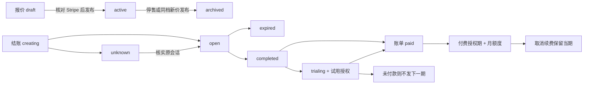

# Stripe 订阅、套餐与额度

2026-09-20：已实现多套餐、月付／年付、不可变报价及权益版本。已有订阅保留原价和原权益，新订阅使用新发布报价。插件 PLUS 卡片暂时隐藏（`Account.tsx` 的 `SHOW_PLUS_CARD=false`）；官网和后台使用同一服务端目录。生产发布与本地／沙盒验收分别记录。

## 产品规则

- 初始目录仅提供 PLUS v1（每月 300 页重绘、首次绑卡试用 7 天／30 页）及 US$9.99 月付**草稿**。没有虚构或启用商业年付价格。草稿未绑定 Stripe，不能结账；配置后由管理员显式发布。
- 套餐可配置名称、每月重绘页数、首次试用天数及试用页数。目前付费套餐共用常规翻译不限累计页数、PLUS 分钟准入与调度档位；每套餐独立的常规额度、速率和权重尚未实现。
- 年付一次收费，以该付费账期原始 UTC 日／时刻拆分 12 个会员月。未来月额度预先持久化，到该月才可用，剩余不累积。1 月 31 日的边界为 2 月末、3 月 31 日，不永久漂移到 28 日。
- 试用资格按账户记录，跨套餐不能重复领取。试用完成且账单结清后发放正式权益；余额抵扣后的零现金已结清账单也可履约。
- 新价仅影响新结账；已发出的结账固定原报价直到会话到期。已有订阅始终按原报价和权益版本续费。
- 官网定价页与账户页通过月付／年付卡片切换，再选择该周期的套餐报价；未开放的周期不可选。登录保留已选报价，在途结账锁定原报价。
- 运营赠送与订阅独立生效，不顺延 Stripe 扣款日期。任务继续结算受理时的额度周期。

## 数据模型

最终空库基线为 `subscription_0001`。旧迁移链、用户表上的支付权益投影和全局产品／价格配置已删除，不提供旧库升级、回填、双写或兼容分支。旧库启动失败，需另建空数据库；程序不会自动删除已有数据库、漫画或 R2 对象。

| 表 | 职责与约束 |
| --- | --- |
| `billing_plans` | 稳定套餐标识，不承载可变计费条款 |
| `billing_plan_revisions` | 不可变权益版本：名称、每月额度、试用配置；套餐内版本号唯一 |
| `billing_prices` | 不可变报价：权益版本、环境、币种、最小单位金额、month/year、Stripe Product/Price；只有发布状态可变。同套餐／环境／币种／周期最多一个在售报价 |
| `billing_accounts` | 用户与 Stripe Customer 唯一绑定、环境、试用使用记录 |
| `billing_checkouts` | 持久意图：原报价、返回地址、客户、试用选择、Session ID、过期及核实状态；不保存可直接使用的 Checkout URL |
| `billing_subscriptions` | 可信 Checkout 建立的订阅，引用原报价，记录渠道生命周期与日期 |
| `billing_invoices` | 已处理账单回执，含币种与金额；与权益发放在同一事务提交 |
| `billing_terms` | 试用／已付款的访问授权期，关联订阅、报价和账单；同订阅／类型／起点唯一 |
| `quota_periods` | 独立可消耗额度，订阅来源必须关联 term。月付一个桶、年付十二个桶，用量和预占独立保存 |
| `billing_events` | 验签通知的持久收据与重试状态；不保存完整报文或客户资料 |

关系：套餐 → 权益版本 → 报价 → 结账／订阅 → 账单 → 授权期 → 月额度。新版本不会追溯改写旧价格和权限。

## 状态流转

Stripe 的 active、past_due、unpaid、paused、canceled 等是支付渠道状态，**不能独立授予访问**。服务端读取当前有效授权期；未付款不预发下一期，取消保留已授当期，试用转正式时关闭重叠试用额度。未来 term 也只能从其起点开始生效。

报价可以重新发布，内容不可编辑；重新发布同档旧价会停售当前价。调价新建 Stripe Price 和本地报价；调整权益先新建权益版本，再建立新 Price 与报价。不会自动修改已有 Stripe Subscription。

## 幂等与恢复

每账户加锁创建在途意图，Stripe 请求使用 `checkout:<意图ID>` 幂等键。参数来自持久意图和不可变报价。未知响应沿原意图恢复；超过幂等保证期限或接近到期时只分页查询原会话，不重新购买。

原始 webhook 经官方 SDK 验签后入库。通知触发读取 Stripe 当前资源，校验环境、客户、可信会话、metadata、原报价、产品、币种、数量和完整账期，不信任通知顺序。账户锁、账单回执和 term 唯一键阻止重复发放。未付款、按比例调整或非套餐账单不授予新权益。

maintenance 重试持久事件、在途结账和有效订阅，含已完成但尚未绑定订阅的 Checkout。账单按已付款记录完整分页补查，不按创建时间漏掉迟付账单；中途失败回滚本次事务。结果未知时前端继续原报价，禁止另起不同报价购买。

## 配置与接入

后端使用 `stripe-python==15.6.1`，API 版本 `2026-08-26.dahlia`，`RequestsClient(timeout=20)`。前端跳转托管 Checkout，不加载客户端支付 SDK，不收集银行卡，无需注入 Stripe 公钥或密钥。

| 配置 | 用途 |
| --- | --- |
| `STRIPE_ENABLED` | 默认 false |
| `STRIPE_ENVIRONMENT` | test/live；生产只接受 live；不同环境独立数据库 |
| `STRIPE_SECRET_KEY` | 后端对应环境密钥 |
| `STRIPE_WEBHOOK_SECRET` | 专用 webhook 签名密钥 |
| `STRIPE_RETURN_URL` | HTTPS 账户返回页，不含查询参数或片段 |
| `STRIPE_PORTAL_CONFIGURATION_ID` | 可选专用 `bpc_` 配置，留空使用 Stripe 默认配置 |

产品和价格在后台“订阅套餐”维护。发布向 Stripe 核验金额、币种、周期、产品、licensed recurring Price；Checkout 固定 quantity=1。金额使用 Stripe 最小货币单位；结账固定报价币种、禁用 Adaptive Pricing，避免账户级自动换汇与本地报价不一致，仅开放 card。

Portal 允许付款方式更新、账单历史和**期末取消**；关闭套餐切换、数量调整和即时取消。专用配置避免修改共享默认 Portal。退款仍人工处理；退款／争议自动撤销、换套餐补差、优惠促销、用量计费和并行多订阅尚未实施，未来需独立定义契约。

Webhook：`https://<API origin>/webhooks/stripe`，建议使用同版 API，事件：

- `checkout.session.completed`、`checkout.session.expired`、`checkout.session.async_payment_succeeded`、`checkout.session.async_payment_failed`
- `customer.subscription.created`、`customer.subscription.updated`、`customer.subscription.deleted`、`customer.subscription.paused`、`customer.subscription.resumed`
- `invoice.paid`、`invoice.payment_failed`、`invoice.payment_action_required`、`invoice.voided`、`invoice.marked_uncollectible`

成功返回 `/payment/success/`，取消及 Portal 返回账户页。成功页不携带支付身份、不授予权益；只由验签回调／对账的可信账单授权。

## 接口

| 接口 | 行为 |
| --- | --- |
| `GET /v1/billing/catalog` | 公开在售报价；关闭时为空 |
| `GET /v1/billing/status` | 在售报价、试用资格、在途原报价、订阅原价和状态 |
| `POST /v1/billing/checkouts` | 必须提交 `{price_id}`；用户、金额和试用资格由后端确定 |
| `POST /v1/billing/portal` | 当前用户专属 Portal URL |
| `POST /v1/billing/sync` | 核对 Stripe，返回最新订阅和权益 |
| `POST /webhooks/stripe` | 验签、持久收据、后台处理 |
| `GET /v1/admin/billing/catalog` | 管理员目录及 Stripe 绑定 |
| `POST /v1/admin/billing/plans/{plan_id}/revisions` | 新建套餐／不可变权益版本，稳定 id 支持同内容重试 |
| `POST /v1/admin/billing/prices` | 创建草稿；同 id 不同内容报冲突 |
| `PUT /v1/admin/billing/prices/{price_id}/status` | active/archived；不迁移已有订阅 |

## 验证

Docker 全量和 PostgreSQL 命令见[后端说明](../backend/README.md#验证)。重点用例：`test_stripe_billing.py`、`test_billing_catalog.py`、`test_billing_postgres.py`、`test_request_limits_migration.py`、`test_membership.py`、`test_membership_days.py`。

覆盖月底／闰年拆月、未来额度不可用、取消保留期限、欠费／迟付、旧价旧权益续费、新客新价、在途冻结、试用去重、零额度套餐访问权、分页重放和 PostgreSQL 并发。模拟 transport 不能替代真实结账。

前端运行各项目现有命令：插件 `npm run check`、`npm test`、`npm run build`；官网 `npm test`、`npm run build`；后台 `npm run build`。

`backend/tests/manual_billing_server.py` 使用临时 SQLite 和模拟 Price 校验，18091 端口提供目录 UI 验证，拒绝支付操作且不读取真实密钥。真实沙盒与临时隧道证据见[订阅验收](SUBSCRIPTION_ACCEPTANCE.md)。

官方参考：[不可变价格与停售](https://docs.stripe.com/products-prices/manage-prices)、[计费锚点](https://docs.stripe.com/billing/subscriptions/billing-cycle)、[测试卡](https://docs.stripe.com/testing)、[Test Clock](https://docs.stripe.com/billing/testing/test-clocks)。
