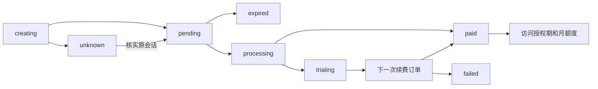

# 多渠道订阅、额度购买与订单

支付目录按“产品 → 不可变权益版本 → 月付／季付／年付／一次性价格 → 渠道绑定”组织，支持 Stripe 和 Creem。调价新建价格，原订阅和已购买额度继续使用原价与权益；一次性额度不创建虚假订阅或账期。本文件沿用原路径，维护统一支付契约。公开部署、真实支付与本地模拟验证分别记录。

## 已确认的产品规则

- 官网定价页是订阅与额度包唯一购买入口，插件与官网账户页只展示权益／余额、已有订阅管理和“前往定价页面”链接，不复制报价卡和结账逻辑。定价页“开通／购买”进入所选报价的托管支付页，保留续费、试用、税费与退款说明。未登录先走现有 OIDC，登录后只消费一次、最长 15 分钟有效的同标签页结账意图；纯 URL 参数不能自动创建订单。结账前重新读取账户可售报价，准确匹配价格编号；不回退另一周期。已有有效订阅／赠送不能另开重复订阅，但仍能买额度包；待付款不锁套餐或周期，同一价格继续原订单与原渠道，不同价格可直接新建；不提供取消待付款或更换套餐流程。写请求失败不自动重发，跳转仍校验原渠道及官方 HTTPS 地址。

- 新 PLUS／Pro 和两档永久额度包的价格、页数与模型档位见[当前套餐](MEMBERSHIP_AND_QUOTAS.md#0-商业套餐与当前实现)。初始化草稿与官网静态展示共用 `backend/app/catalog_defaults.json`，只有已核验的渠道报价可结账。
- 季付／年付一次收费，有限页数按实际账期原始 UTC 日／时刻拆成三个／十二个会员月，逐月生效、不结转；不限量授权覆盖实际已付款期。1 月 31 日后为 2 月末、3 月 31 日，不漂移。Stripe 季付校验 `interval=month, interval_count=3`；Creem 季付校验 `billing_period=every-three-months`，不将月价或年价误作季价。
- 新套餐不使用试用：`trial_days=0`、`trial_classic_pages=0`，Creem 不关联试用产品，Stripe 不发送试用参数。首笔付款直接开启正式账期；免费账户额度与试用独立。通用试用能力保留为后台可配置项，不能仅凭 active 状态或成功返回页发放正式额度。
- 有限与不限量订阅共用付费准入和调度机制；可选 `hourly_image_limit=null` 表示无小时限额。免费模型先扣免费额度，再扣订阅、购买额度；高级模型仅使用订阅、购买额度。适用余额全部耗尽则拒绝新任务。
- 独立额度包一次性购买固定常规页数，逐页成功结算，不自动续费、不含试用或周期页数。版本明确 `quota_pages`、`quota_validity_days`（null 为不过期）、已有会员服务档位 `service_plan_id` 和小时限制；当前商品定义见会员额度规范。只有实际使用购买额度的新任务才享受相应会员模型、分钟准入和调度档位；余额用尽回到普通权益，详见[页数规则](MEMBERSHIP_AND_QUOTAS.md#独立购买常规额度)。
- 有有效订阅／赠送会员也可买包；有限订阅耗尽后可扣购买余额，不限量订阅不扣购买余额，但限期包的到期时间不顺延。额度包不消耗跨渠道试用资格，不参与赠送、订阅续费或暂停恢复排期。
- 运营赠送与已付款权益顺序生效：当前已确认授权期 → 赠送期 → 后续付费期。赠送期间不扣款，取消续费保留已付款与赠送权益。任务继续结算受理时的额度周期。
- 定价页订阅按月付／季付／年付选择可售报价，额度包单独展示一次性页数与有效期；后台全站只设置一个默认支付渠道，前端自动使用它，不提供渠道选择。未登录时读取公开目录，登录后保留所选报价；每笔待核实请求分别恢复自己的原报价和原渠道，即使已经停售。已有订阅在账户或插件通过其所属渠道客户门户管理。
- 官网公开定价与购买资格分离：多语页面静态展示 PLUS／Pro 季付、年付及两档永久额度包，展示数据没有可购买渠道，不作为结账参数。加载、无报价或读取失败时保留公开价格并禁用购买；实时 API 成功返回后，实际金额、权益和价格编号以已发布报价为准。
- 官网使用免费卡与可售订阅卡，突出月页数、价格、模型及分钟／小时限制，月付／季付／年付在同一选择器切换；额度包独立展示。受理限额不代表完成速度，调度优先级不承诺完成时长。

## 数据模型

数据库迁移与当前版本见[部署规范](DEPLOYMENT.md)。支付与赠送顺延字段只做结构升级，不提供旧交易数据转换、回填、双写或旧接口兼容；已有账户、漫画、翻译任务保留。

| 表 | 职责 |
| --- | --- |
| `billing_settings` | 单例记录全站唯一默认支付渠道，首次初始化选择首个已启用渠道；未启用渠道时留空，由管理员设置 |
| `billing_plans` | 稳定产品标识和产品名称 |
| `billing_plan_revisions` | 不可变订阅／额度包权益版本：订阅的月页数／试用总页数（均允许 null 表示不限量），或一次性常规页数／有效天数／会员服务档位；共用可选小时准入 |
| `billing_prices` | 渠道无关的不可变价格：产品与权益版本、环境、币种、金额、month/quarter/year/once；同产品／环境／币种／周期最多一个在售价格 |
| `billing_price_bindings` | 每个价格对应的 Stripe 或 Creem 商品，独立草稿／发布／停售状态；同价格、渠道和环境最多一个在售绑定 |
| `billing_accounts` | Node Comics 账户级试用记录，防止换渠道再次领取；同一账户最多一笔待核实结账预留试用，其他价格可按无试用正式商品购买 |
| `billing_customers` | 每个用户／渠道／环境的默认远端 Customer；每笔订阅另保留实际客户 |
| `billing_checkouts` | 原价格、渠道绑定、试用选择、远端会话、过期与核实状态；一次性购买按用户＋意图键唯一；私有保存已校验的 Creem 结账地址用于原会话恢复，不在管理详情或日志返回 |
| `billing_subscriptions` | 可信结账建立的订阅、原价格与渠道绑定、生命周期日期 |
| `billing_invoices` | 幂等账单回执，与权益发放同事务提交 |
| `billing_terms` | 已授予的试用／付款访问期，关联订阅、价格和账单 |
| `quota_periods` | 订阅月额度关联 term；购买来源关联唯一 order，允许不过期，独立保存撤销时间、用量和预占 |
| `billing_orders` | 首次购买和每次续费的独立订单，记录渠道、环境、金额、状态及关联资源 |
| `billing_order_transitions` | 追加的订单流转历史，含来源、前后状态、事件编号和脱敏详情 |
| `billing_events` | 验签通知的持久收据、处理重试状态及对账所需最小字段 |

关系：产品 → 权益版本 → 价格 → 渠道绑定 → 结账／订阅 → 订单与账单 → 授权期 → 月额度。

一次性购买在结账后分流为“可信支付 → 订单 → 购买额度桶＋Ledger”，不经过 subscription、invoice 或 term。订单、购买桶、账本与本地完成状态同事务提交，以订单唯一外键及 `purchase:<order_id>:classic` 来源键防止重复到账。

Stripe 的一个 Product 可关联多个 recurring Price。Creem 的周期和金额属于 Product，本地一个产品的月付／季付／年付分别绑定对应的远端 Product，不让渠道的数据结构决定本站产品结构。

一次性价格使用 Stripe `one_time` Price／Checkout `mode=payment`；Creem 商品为 `billing_type=onetime`、`billing_period=once`。到账校验本地意图、归属、环境、原绑定、金额、币种、数量及真实支付状态，不根据成功页、客户端传参或仅 completed 会话发放。Stripe 核实 PaymentIntent 和已捕获 Charge；Creem 核实 checkout.order 对应 transaction。Creem 缺可信支付时间的限期包等待验签 `checkout.completed` 的发生时间，不用对账时间延长期限；永久包可用首次核实时间开始，但订单付款时间保持未知并记录审计，不冒充平台付款时间。

Creem 试用属于远端商品且结账不能覆盖，因此含试用的价格绑定两个远端商品：`product_id` 为无试用的正式商品，`trial_product_id` 为同价同周期的 7 天试用商品。首次合资格结账使用后者，用过试用的账户使用前者。两者都须在发布时核验；Stripe 仍使用同一 Price，由服务端选择试用。

## 赠送与续费顺延

赠送复用用户的连续运营会员段和 `MembershipOperation` 幂等审计，不新增活动账本或第二套付费授权。多次领取延长该段；活动审核仍由运营处理。月付、年付和有效试用均先完整使用已授予的授权期，再使用赠送。等待支付渠道确认时赠送为 pending；确认后为 scheduled／active，账户分别显示已付款期、赠送时间、预计恢复续费日期，渠道确认的下次扣款日期单独保留。

- Creem 使用 `cancel(mode=scheduled, onExecute=pause)` 预约期末暂停。不能提前调用即时 pause 后再按原付费期末计算恢复，因为渠道恢复会保留暂停时剩余的付费时间。确认预约后可安排赠送；赠送结束且渠道实际为 paused 时才调用 resume。恢复成功不代表付款，仍以真实已结清交易产生新的付费授权与额度。
- Stripe 通过无比例结算的 `trial_end` 延后下一次收费，该渠道状态不产生新的首次试用权益，也不重置试用资格。已有付费授权保持原账期，新的付费授权仍来自实际账单。Stripe 已确认延期或写入结果待核实期间，追加赠送必须先确认取消自动续费，以免旧 `trial_end` 在新增赠送内收费；拒绝时原赠送不变。Creem 可直接多次追加赠送。
- 延期关联、计划恢复时间、操作与核验状态保存在原订阅记录。渠道写入前持久化发送状态；响应未知时只读核实，不盲目重发。操作轨迹复用订单历史，maintenance 与账户同步共用同一处理逻辑。
- 用户通过 `POST /v1/billing/cancel-renewal` 关闭自动续费，先持久化不再自动恢复的意愿。Creem 立即终止渠道订阅（也适用于已经预约暂停的订阅），本地已付款期和赠送仍可用；Stripe 按期取消。用户在门户取消后，同步同样停止自动恢复。取消请求可重复提交，不产生第二次扣费操作。
- 赠送期间首次开通订阅暂不开放即时结账，返回 `BILLING_GIFT_ACTIVE`，提示赠送结束后开通；一次性额度购买不受此限制。不会为没有订阅的获赠账户自动建立扣费关系。待核实的订阅结账必须先核实，才可安排赠送；购买额度的结账不参与赠送排期。欠费或尚未完成的订阅需先处理或确认取消，避免原欠款仍在重试收取时启用赠送。
- 退款／争议继续撤销原付费来源，不修改历史账期，也不自动增加赠送。管理员提前撤销赠送不提前已约定的续费时间。非本站操作导致赠送期内恢复计费时标记待核实，不静默重排已经承诺的赠送。

## 订单和状态

后台“订单管理”覆盖两渠道的首次购买和续费订单，支持渠道、状态、环境、时间范围、用户与订单编号搜索，以及分页。详情关联原产品价格、Checkout、订阅、按时间排列的完整流转记录，以及最近 100 条关联支付通知的接收、处理、重试和异常状态。订单历史留在本地，即使渠道暂时不可用也可查看。

```mermaid
flowchart LR
  C[creating] --> P[pending]
  C --> U[unknown]
  U -->|核实原会话| P
  P --> E[expired]
  P --> R[processing]
  R --> T[trialing]
  R --> A[paid]
  T --> N[下一次续费订单]
  N --> A
  N --> F[failed]
  A --> G[访问授权期和月额度]
```

支付状态、订阅状态与权益分别建模。取消续费保留已授予的当期权益；欠费、暂停和取消不授予下一期。成功页只展示结果提示，不发放额度。退款／争议等结果通过订单记录和对账处理，不把“结账 HTTP 成功”当作付款成功。

全额退款或争议撤销对应付费授权期及其当前／未来额度，部分退款保留授权；所有历史额度桶均保留供审计。

额度包全额退款／争议仅撤销该订单购买桶，保留 granted／used／reserved 和原始有效期，已受理任务仍结算／释放原桶；释放不能重新激活撤销余额。部分退款保留原页数并在后台标记人工核定，不自动按钱折算页数，不扣其他桶补差。先到退款或争议持久化后，迟到付款通知不得恢复该订单额度。

Stripe 购买在授予前、同一账户事务内按精确 Charge 核实退款与争议资源，不能只依赖可能滞后的 Charge 汇总字段。普通订单增加两次只读查询；每类最多读取 10 页、每页 100 条，结果不完整、未知状态或超过上限则回滚并保留待核实，不扫描客户历史。正式争议即使后来胜诉也不自动恢复已撤销额度；仅预警／调查状态不新增撤销。额外请求只发生在支付核实，不进入逐页翻译热路径；真实渠道延迟需单独实测。

## 幂等与恢复

- 创建结账时锁定用户，订阅按价格复用待核实意图，同价格的重复点击不重复建单，不同产品／周期可独立下单。原单结果未知只阻止该价格重复发送，不阻挡其他价格。已有有效订阅仍不开放新购或恢复其他待付链接；此前发出的旧链接若后来付款，仍按原单核实记账。额度包每笔订单独立：不同幂等键可同时购买相同或不同价格，不被其他额度包或订阅的待付款状态阻挡。前端 POST 明确价格与目录中的默认渠道，服务端拒绝通过非默认渠道创建新意图；原意图继续原报价与渠道，切换全站默认不改变它或已有订阅。
- 额度包只冻结本单的远端客户，并核实原会话、订单与交易的完整归属，不建立或抢占订阅的 `BillingCustomer`。创建时已有订阅客户则沿用并严格锁定；首次确认客户时拒绝已明确属于其他账号的订阅客户。已冻结的原单以后核实或退款仍按原客户校验，不受后来订阅客户映射变化影响。订阅保留一个默认渠道客户供后续创建使用；每笔订阅按自己的 Checkout 冻结客户，允许付款前独立创建的订单形成不同平台客户，但不能绑定其他账户的已知客户。客户门户按当前订阅实际客户打开。
- 额度包必须提供稳定 `Idempotency-Key`，同一账号的原键只对应一笔购买；重复点击、响应丢失和恢复沿用该笔原键与报价，不能静默换键重试。已完成原意图返回 `fulfilled=true`、`checkout_url=null`，不创建第二笔订单。用户明确发起另一笔购买才使用新键；额度包不出现在账户的订阅待付款字段中，不得据此丢弃原键。已核实未付款的关闭会话返回专用重购状态，由用户再次明确选择新建购买；未知状态只阻止原意图重复发送，不限制独立新订单。
- Stripe 使用固定原意图的幂等键。结果未知时核实原会话；超过保证期限不重复发起购买。
- Creem `request_id` 用于关联本地意图，不保证重复 POST 返回原会话：官方参考提及避免重复付款，但测试模式相同参数重放仍可返回不同待付款会话，不能据此重发未知订单。创建结果未知时依赖已知会话、可信 webhook 或管理员精确对账恢复；原意图重试仍返回待核实，不自动新建。
- Creem `pending` 或明确 `expired` 的未付款结账响应可缺省 `customer`；仅在原意图、商品、环境与会话校验通过后接受该状态，并保留本地预期客户。已核实过期释放原购买意图；不能仅凭本地超时推断远端过期。显式客户冲突、畸形客户字段、已完成会话缺少客户或未知状态不适用豁免；付款与权益发放仍须完整核实客户归属。待核实保护的后续拦截不覆盖首次失败原因。
- 新建 Creem POST 已返回会话、但后续客户或地址校验失败时，只有不可变意图、环境、商品、数量、编号格式与唯一归属均通过，才在原异常事务保留 `session_id` 供 GET 核实；状态仍为 unknown，不保存未验证地址、不改客户、不发权益，原错误继续返回。正常成功路径不增加事务；管理员／Webhook 的绑定仍须整体通过。进程中断或响应丢失前未落库的编号、修复前已丢编号的旧记录不能凭空恢复，仍需可信通知或管理员提供原会话编号。
- Creem 免费试用交易可能保留常规 `amount`（例如 999 美分），而 `amount_paid=0`。只有试用资格、远端试用状态及有界试用账期均已验证，且交易起止与该试用期一致时，才按试用记账；不能把常规金额字段当作实际收款。
- Creem GET 结账响应可能不含地址。优先复用首次 POST 后私有保存的已校验地址；若创建响应丢失，使用已验证归属的产品与结账 ID 恢复官方规范地址，不再次创建结账。
- 管理员可在订单详情核实平台状态。未知的首次结账若缺少远端编号，可填写对应平台结账编号；服务端验证原意图、用户、渠道、环境及唯一关联后恢复，不重新发送创建结账请求。
- Webhook 必须先验签再持久化；按渠道和环境命名空间隔离外部 ID，重复和乱序通知不得重复发放。对账校验环境、用户绑定、原价格／商品、币种、数量及完整账期。
- maintenance 有界重试持久事件、待核实结账和订阅，不轮询全部历史已完成额度包。账户每轮按最久核实顺序独立轮转最多一笔待付订阅与两笔到期需检查的额度订单，再核实最近一笔已完成发放的额度订单并去重；待付额度只选择已启用渠道，按 `coalesce(last_checked_at, created_at)`、创建时间、编号轮转。已发送请求的失败也推进核实时间，一条失败继续其他订单；尚未发送的 Creem 意图保留空时间哨兵，不伪装为已发送。maintenance 同样按最久核实顺序取最多 10 笔待付记录后去重账户，避免单个账户积压永久挡住其他账户。历史购买由可信通知或管理员精确订单核实。真实支付与权益发放同事务提交，失败不留下半份权益。
- 官网账户首屏并发读取本地账户与账单快照，账户资料返回即显示，不等待支付渠道；自动结算由可信 webhook 与 maintenance 负责。“刷新”显式核实支付状态，同一会话合并进行中的刷新，进度和失败只影响账单区域，不隐藏已有权益。账单读取失败的重试只读本地快照；退出、换号及后续订阅操作使旧响应失效。已知 Creem 会话同步跳过重复恢复请求，但仍保留归属绑定和付款事务内的权威复核。
- 已确认的全额退款或争议状态不能被迟到的已支付、试用或部分退款结果覆盖；已撤销的授权不能因旧账单再次核实而恢复。

## 配置与发布

两个渠道独立开启，默认均关闭；开启渠道必须配置其环境匹配的 API 密钥、Webhook 验签密钥和 HTTPS 返回页。仅配置 API 密钥不足以启用结账。同一运行环境中启用的渠道必须同为 test 或同为 live，生产只接受 live。API 与 maintenance 使用一致配置，测试与正式使用独立数据库。凭据仅保存在服务端环境配置，不能写进前端、日志或仓库。

| 配置 | 用途 |
| --- | --- |
| `STRIPE_ENABLED` / `CREEM_ENABLED` | 独立启用开关 |
| `STRIPE_ENVIRONMENT` / `CREEM_ENVIRONMENT` | test/live；启用的渠道必须一致 |
| `STRIPE_SECRET_KEY` | Stripe 服务端密钥 |
| `CREEM_API_KEY` | Creem 对应环境 API 密钥 |
| `STRIPE_WEBHOOK_SECRET` / `CREEM_WEBHOOK_SECRET` | 各渠道专用 webhook 验签密钥 |
| `STRIPE_RETURN_URL` / `CREEM_RETURN_URL` | HTTPS 账户返回页，不含查询参数或片段 |
| `STRIPE_PORTAL_CONFIGURATION_ID` | 可选专用 Stripe 客户门户配置 |

Creem 测试 API 为 `https://test-api.creem.io/v1`，正式 API 为 `https://api.creem.io/v1`。两渠道均跳转官方托管页面，不加载客户端支付 SDK、不收集银行卡。前端只接受所选渠道的官方 HTTPS 主机；Creem Checkout 路径为 `/checkout/` 或 `/test/checkout/`，Portal 为 `/my-orders/login/` 或 `/test/my-orders/login/`。

Creem 返回页可能携带签名收据参数。成功页只展示提示，不根据这些参数发放权益，并在页面头部立即清除 URL 查询和片段，设置 `no-referrer`。后端 Docker 和文档启动命令均关闭 Uvicorn 访问日志；部署代理也需避免记录支付返回页完整查询串。真实验收记录仅保留脱敏状态，不能保存带签名返回地址。

发布流程：先建立订阅或额度包产品及权益版本，再建立对应 month/quarter/year 或 once 价格，为每个价格添加渠道绑定并核验发布，最后发布价格。发布校验远端环境、金额、币种、周期、商品及试用天数。停售价格或绑定只影响新购买，不改变已有订阅或已购额度。

Stripe Portal 应开放付款方式、账单历史和期末取消，关闭套餐切换、数量调整和即时取消。不主动开放已有订阅的重复购买、换套餐补差、促销或用量计费。多个旧链接均付款时，各订单、订阅、授权与额度按原报价独立记录，不自动合并、退款或顺延；后台订阅列表及详情提示多笔有效订阅，并支持 `duplicates_only=true` 筛选，运营人工核对重复收款和自动续费。重复状态按同用户、同环境的未结束订阅或有效授权判断，跨渠道可识别；只有结束订阅且无有效授权后才不计入，退款本身不会清除仍在续费的订阅提示。多笔未结束订阅须先人工核实，才能安排赠送顺延。

## 接口

| 接口 | 行为 |
| --- | --- |
| `GET /v1/billing/catalog` | 公开订阅 `offers`、额度包 `quota_offers` 与 `channels`，以及订阅产品分组 |
| `GET /v1/billing/status` | 两类在售报价、试用资格、`subscription_checkout` 待付订阅提示及其原价和渠道；可传 `price_id` 精确查询该价格原单，不返回待付订单列表 |
| `POST /v1/billing/checkouts` | 必填 `{price_id, provider}`；额度包另需 `Idempotency-Key`；返回 `checkout_url`、`provider`、`environment`、`trial`，完成原意图返回 `fulfilled=true` |
| `POST /v1/billing/portal` | 必填订阅所属 `{provider}`；返回当前用户该渠道专属 `url` 和 `provider` |
| `POST /v1/billing/sync` | 核对原渠道，返回最新订阅和权益 |
| `POST /v1/billing/cancel-renewal` | `{provider}`；关闭原订阅自动续费，保留已付款及赠送权益 |
| `POST /webhooks/stripe` / `POST /webhooks/creem` | 各自验签、持久收据和后台处理 |
| `GET /v1/admin/billing/catalog` | 产品及其权益版本、价格、渠道绑定和配置状态 |
| `PUT /v1/admin/billing/default-provider` | 管理员提交 `{provider}`，替换唯一全站默认；必须为已启用渠道 |
| `POST /v1/admin/billing/products` | 新建产品及初始权益版本 |
| `POST /v1/admin/billing/products/{product_id}/revisions` | 新建不可变权益版本 |
| `POST /v1/admin/billing/prices` | 新建月付、年付或一次性草稿价格，周期必须匹配权益版本 |
| `POST /v1/admin/billing/prices/{price_id}/bindings` | 添加 Stripe／Creem 渠道绑定 |
| `PUT /v1/admin/billing/bindings/{binding_id}/status` | 核验发布或停售渠道绑定 |
| `PUT /v1/admin/billing/prices/{price_id}/status` | 发布或停售价格 |
| `GET /v1/admin/billing/orders` | 全部渠道订单筛选和分页 |
| `GET /v1/admin/billing/orders/{order_id}` | 订单详情、完整流转历史及最近关联支付通知；通知含总数与展示上限 |
| `POST /v1/admin/billing/orders/{order_id}/reconcile` | `{session_id?: string}`；核实已有平台状态，缺少远端结账编号时可填入对应编号恢复原订单 |

公开目录只返回默认渠道有可用绑定的价格，其 `channels` 恰有一项；不因默认渠道不可用而自动切换其他渠道。报价 `channels` 每项包括 `provider`、`binding_id`、`trial_days`、`trial_classic_pages`；管理目录 `default_provider` 表示唯一默认值，顶层 `channels` 则表示各渠道的环境、启用和密钥／Webhook 配置状态。消费者不能自行提交金额、试用资格或远端商品编号。待核实订单返回其原绑定，即使该价格已停售；订阅价格可以没有在售渠道。

账户状态的 `subscription_checkout` 仅作原单恢复提示，不代表购买锁；未指定 `price_id` 时取最早待付订阅，指定后只取该用户该价格的原单。字段为 null 或 `{id, provider, price, idempotency_key, error}`；`id` 是本地 Checkout 编号，`price.channels` 仅含该意图的原绑定。顶层 `provider` 只表示当前订阅渠道，无订阅为 null。额度购买按本地保存的每笔幂等键精确恢复；状态接口只读本地有界快照，响应大小不随待付订单数增长，不调用支付渠道。

订阅与额度包使用分开的报价集合，不共享购买排他锁；不保留旧单意图字段、双槽兼容、接口版本开关、支付回填或双写。官网与插件同步使用此契约；完整购买入口、服务档位与余额展示需要更新插件，翻译提交和持久化恢复协议不变。

## 验证边界

后端与 PostgreSQL 命令见[后端说明](../backend/README.md#验证)，真实支付与 Webhook 在独立测试环境验收。应覆盖跨渠道试用去重、并发／重复通知、在途固定渠道、月底拆月、迟付恢复、原价格续费、退款和订单状态历史。

额度购买额外覆盖：两渠道支付凭据核实、签名通知乱序、同意图完成重放、不同键并发独立购买、无订阅客户的多单到账、已冻结客户不可替换、迟到订阅客户不阻断原单退款、有界公平轮转、待付数量不扩大状态响应、真实 PostgreSQL 最后一页并发、永久／限期包排序、原桶跨期结算、会员共存与到期回退、退款撤销及部分退款人工核定、已用历史不拖慢新任务查询。支付及并发测试使用隔离传输，不代表真实渠道支付已验收。

赠送顺延额外覆盖：月付／季付／年付／试用期后排期、重复赠送与稳定额度桶、30／60 天跨二月、暂停与恢复的未知响应、取消与恢复并发、未来赠送撤销、赠送期间禁止即时新购订阅但允许买包，以及真实付款回执与恢复请求的区分。沙盒应分别核实预约期末暂停、取消预约暂停中的订阅、恢复与账期变化、真实事件签名；未实际等待完整账期时，不能将模拟时间边界测试写为自然续费已验收。

前端在插件运行 `npm run check`、`npm test`、`npm run build`，官网运行 `npm test`、`npm run build`。用隔离浏览器覆盖待付款时套餐／周期切换、同价原单恢复、默认渠道、双订单迟付与后台重复提示、退款撤权及失败重试；模拟响应不替代真实付款与 Webhook。

后台独立验证：在 `backend/admin-ui` 执行 `npm ci`、`npm run check`、`npm test`、`npm run build`；随后在 `backend` 执行 `.venv/Scripts/python.exe tests/manual_billing_server.py`（已安装 `requirements.txt` 的 Python 3.11+ 环境）。浏览器打开 `http://127.0.0.1:18091/console-test/#billing`，用开发用户名 `admin` 登录。夹具创建独立临时 SQLite 和模拟渠道，不读取项目 `.env`；每次启动有 34 笔跨渠道订阅订单和 1 笔部分退款的永久额度订单，并打印 `controls.json` 路径。修改该文件的 `fail`、`empty_orders` 或 `delay` 可复现失败、空列表和加载状态。结束时在服务终端按 Ctrl+C。

官方参考：[Stripe 价格管理](https://docs.stripe.com/products-prices/manage-prices)、[Creem 产品](https://docs.creem.io/api-reference/endpoint/create-product)、[Creem 客户门户](https://docs.creem.io/features/customer-portal)、[Creem API](https://docs.creem.io/api-reference/introduction)。
