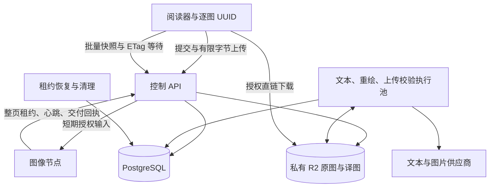
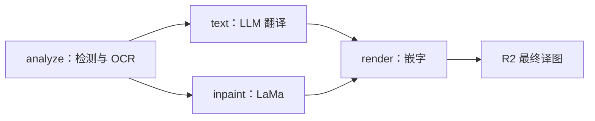

# 翻译集群、预上传与阅读优先队列

已实现[翻译接口契约](READING_TRANSLATION_CONTRACT.md)，全新空库基线 `translations_0001`。客户端使用逐图 UUID、可选原图补传和批量快照，服务端保留持久任务、公平执行与私有 R2。

计算节点使用[整页协议](COMPUTE_PROTOCOL.md)：整页租约、有限接单名额、R2 短期授权直读、独立文本池与有界流水线。验收边界见[流水线验证](COMPUTE_PROTOCOL.md#验证边界)。

## 1. 当前实现规则与默认配置

| 同一账户合计 | 普通用户 | PLUS |
| --- | --- | --- |
| 每滚动 60 秒新增翻译图片 | 10 张 | 100 张 |
| 用户在途任务数硬上限 | 无 | 无 |
| 同优先级调度权重 | 1 | 2（可配置） |

- 分钟准入跨模式、语言、作品与设备合计。已有原图的新翻译仍计数；重传、操作重放、本人在途任务和完成结果复用不计数。
- 取消、失败或上传过期不退分钟次数；任务终态按原规则结算或释放页数权益。
- 阅读窗口固定为当前页与后三页；后台仅接受 current／prefetch 优先提示，无阅读会话、epoch 或客户端队列查询。
- 优先级先于会员权重：普通实时页优先于会员预存页。竞争时默认实时占 90%、预存保底 10%，按长期资源占用时间计；没有竞争时借用空闲能力。
- 实际执行仍受节点和资源池容量控制。降级保留已受理任务，新任务使用当前分钟限额与调度权重。
- 普通常规每日 30 页，PLUS 常规不限页数、每会员月重绘 300 页；赠送额度与分钟限制独立。
- 原图和最终译图存私有 R2，计算节点只保留有界临时缓存。

## 2. 结构

控制服务独占数据库和 R2 凭据。图像节点通过独立身份认证的 HTTPS 接口领取整页租约，不访问数据库、其他节点或供应商密钥。节点中心连接强制 HTTPS，隔离测试使用显式适配器。

## 3. 受理、上传与断点恢复

1. 客户端在 IndexedDB 保存本地 64 字符页面键、36 字符请求 UUID 和图片／模式／语言；不传书目和额度策略。
2. `PUT /v1/translations/{id}` 在调度锁与账户锁内核实重复请求、已有任务和完成结果，再检查分钟预算和页数权益。单图请求、分钟事件和预占原子提交；各图失败互不阻塞。
3. 返回 `needs_input` 才调用 `PUT /v1/translations/{id}/input`，服务端限制实际字节、摘要、格式和可解码尺寸；原图存入私有 R2 后自动进入持久校验，无 complete。
4. 已有原图直接翻译，完成结果命中直接返回成功。内部上传保护默认 15 分钟、最长 1 小时，崩溃恢复自动核实已上传对象；过期／取消释放用户页数，不返还分钟次数。
5. 回包丢失按原 UUID 查询快照或重放，不新建未知重绘。关闭阅读器不取消已受理任务，后台继续执行。
6. 完成译图按内容、模式、语言和有效配置版本跨账户复用，生成本人私有授权；进行中的跨用户任务独立执行与结算。
7. HTTP 请求保护与分钟图片预算分开，配置与候选调度见[请求保护](SUBMISSION_SCHEDULING.md)。

上传经产品 API 的取舍是保留一次传输流量和有界内存占用，以实际字节上限保证服务端约束。没有开放浏览器可反复覆盖原图键的永久 PUT 授权。R2 下载签名在本地生成，不探测对象。[Cloudflare 签名链接说明](https://developers.cloudflare.com/r2/api/s3/presigned-urls/)

## 4. 客户端阅读优先级

打开或显式翻页立即申请当前页，滚动按 80ms 合并（最长 200ms），后三页延后 150ms 预取。同页滚动不改变请求身份；客户端保留最新待提交窗口。

当前页传 `priority=current`，邻页传 `prefetch`。后端当前页优先默认持续 90 秒，重复请求不续期；预取任务首次提升为当前页可获得优先。没有阅读会话、窗口序号、控制权接管或心跳。已经受理的旧窗口请求继续完成，后台无可见页面时客户端停止新增。

限流按 `Retry-After` 恢复；任务完成不提前释放分钟预算。`GET /v1/translations?ids=…&wait_seconds=20` 合并当前关注 UUID 的快照等待；ETag 未变化返回 304，无账户游标。完成快照直接含下载地址，不再查询 image access。

## 5. 按资源公平调度

数据库是唯一排序与执行权来源。

每次空闲领取：先筛选节点能力、引擎版本、资源容量、源图可用性和阶段依赖；在同一资源池中先选实时／预存，再按加权虚拟服务时间选择用户，最后按该用户页面优先提示和等待时间选页。调度先预记阶段估时，完成后按实际占用时间校正，因此慢页不会与快页简单等量计费。会员权重只改变同级用户间份额，不扩大阅读窗口。

同图像引擎的 analyze/inpaint/render 共享物理设备容量。文本与重绘是不同控制执行池，分别受后台配置的执行位、文本 RPM、调用次数/时限和供应商并发限制，文本成本只计量。所有 API／控制副本通过 PostgreSQL 事务级 advisory lock 顺序更新调度状态、用户和任务；网络 I/O、图像计算均在短锁之外。[PostgreSQL 锁说明](https://www.postgresql.org/docs/current/explicit-locking.html)

文本 RPM 由后台供应商记录管理，每个供应商跨副本、跨历史版本共享额度；一个供应商限流或停用，不阻塞其他供应商的可执行阶段。任务提交时固定供应商和版本，默认切换仅影响后续任务；停用后的排队阶段等待重新启用。旧环境文本配置不再读取，见 [LLM 翻译供应商](TRANSLATION_PROVIDERS.md)。

## 6. 常规流水线与集群

- 常规页面持有整页租约；节点内 OCR、抹字、嵌字共享有界计算池，文本等待期间设备可处理其他页面。
- 分析检查点与译文由中心持久化，不保存中间抹字图。失联页由其他匹配节点重新领取整页租约，按原图与检查点重建背景并复用译文。
- 当前整页协议通过中心租约数和节点本地缓冲预算限制在途页面；OCR／抹字／嵌字使用有限计算池，文本等待不占计算线程。配置见[节点配置](NODE_CONFIGURATION.md)。
- 等待译文仍属于未交付任务，保留页数额度预占；仅释放设备资源，不提前显示成功或结算。若所有已受理页都已预处理且没有可执行的渲染，设备没有剩余图像工作，最终完成速度仍受文本服务限制。
- 后台预建节点并绑定稳定 `resource_id`，签发独立凭据（仅摘要入库），设备只可报告自身能力。设备内部资源管理由独立引擎负责。
- 计算代理只允许从本控制服务获取输入，验证 SHA-256。同任务原图在代理内按 128 MiB、512 项、15 分钟绝对 TTL 缓存；命中时通过当前租约的 `input/authorize` 接口重新校验节点、执行代次及原图有效性，不读取 R2。返回结果再次校验版本、像素、尺寸、输出类型和租约。
- 引擎支持任务/输入摘要/配置绑定的 `image_ref`，后续阶段不重复传 Base64 原图。引用丢失返回明确的 `ENGINE_INPUT_CACHE_MISS`，发生在模型执行前，代理可用已授权原图重试一次；超时或不确定错误不触发此重试。
- 节点身份、配置与执行位见[节点配置](NODE_CONFIGURATION.md)。仓库保留计算代理与中心协议，图像引擎需独立接入；参见[任务交互](COMPUTE_PROTOCOL.md)。

## 7. 租约、故障与结算

`JobStage` 保存依赖、代次和重试计数；`ExecutionLease` 保存节点、令牌、占用时间及结果摘要。心跳、输入、交付都校验当前代次。一个阶段完成后另一阶段失败，不得被晚到结果复活。

节点冻结 PNG 和摘要，中心核验租约后签发不可覆盖的对象 PUT 授权；节点上传并保存 ETag，完成接口核对元数据后登记结算。中心不读取产物做像素验收；冲突结果和旧代次拒绝交付，回执丢失只重交同一冻结结果的元数据。详见[计算协议](COMPUTE_PROTOCOL.md)。

租约恢复在锁内重新核对到期，避免误回收刚续期的执行。先查已持久化的交付记录与检查点，再决定阶段重试。图像阶段可有限重算；文本调用保留每次成本计量与已有分组结果。

重绘调用前持久化调用意图。意图之前失联可以安全重排；意图之后超时、断连或进程退出，先核实结果，不自动再次调用图片模型。未知状态到期限释放用户预占，但继续保留成本证据；之后补交付不重新扣量。用户主动重绘新版本需要再次确认未知成本。

原图和最终译图默认无限期保留，`expires_at=null`，翻译完成不删除。记录最近授权访问时间，为将来清理长期未访问资源提供依据；当前未启用按闲置时间自动删除。活跃引用继续保护任务原图，上传会话与节点内存缓存仍有期限，临时上传对象不因会话过期自动删除。用户删除提交本人访问记录与请求撤销状态，共享持久对象继续保留；不扫描删除超过一天或当前数据库无引用的对象；签名查询不执行远端 HEAD，下载失败时客户端显示可重试状态。

## 8. 接口与代码

| 接口／模块 | 职责 |
| --- | --- |
| `PUT /v1/translations/{id}` | 单图幂等受理、分钟计数与优先提示 |
| `PUT /v1/translations/{id}/input` | 有界上传，自动校验与排队 |
| `GET /v1/translations/{id}`、`GET /v1/translations?ids=…` | 快照恢复与 ETag 等待，直接结果授权 |
| `GET /v1/translations?offset=…` | 私有分页历史 |
| `/internal/compute/v2/nodes/*`、`/internal/compute/v2/leases/*` | 注册、领取、输入、心跳、交付 |
| `GET /v1/admin/compute-nodes` | 设备能力、在线状态和占用 |
| `app/scheduler.py`、`workers.py`、`dispatcher.py` | 调度、执行与恢复 |
| `src/translation/`、`src/inline/` | 客户端 UUID 持久恢复、自动阅读调度、快照同步与原网页翻译；队列界面已移除 |

## 9. 配置与运行边界

配置模板见[.env.example](../.env.example)，运行命令见[后端说明](../backend/README.md)。`FREE/PLUS_IMAGES_PER_MINUTE`、`FREE/PLUS_SCHEDULER_WEIGHT`、`REALTIME_SHARE` 均为服务端配置。

本地 Compose 默认项目为 `node-comics-nodes`，生产引导固定使用独立项目 `node-comics-production`、新数据库卷和专用对象前缀；不能将旧数据库直接升级到该基线。资源策略旨在减少等待并持续填满可用执行位；跨机网络、R2 上传、模型热身和实际 GPU 吞吐仍需要目标部署测量，代码测试不承诺设备利用率始终 100%。

## 10. 节点配置与独立身份

后台添加、版本化配置与热更新协议见[节点配置说明](NODE_CONFIGURATION.md)。节点不能自注册创建身份、修改执行位或自行解除停用。未应用当前配置的节点不领取新阶段；更新时排空当前阶段再应用，失败报告可见且停止新领取。新安装基线为 `translations_0001`，已合并被替代的迁移，不兼容旧数据库和共享注册 Token。
