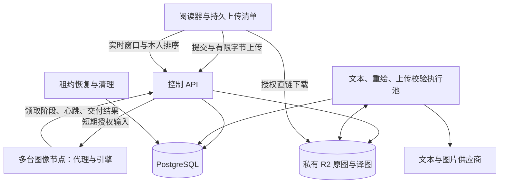
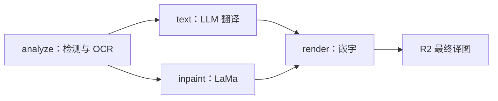

# 翻译集群、预上传与阅读优先队列

2026-09-15：已实现前后端重构；本地隔离验证与实际部署分别记录于[验收说明](CLUSTER_VALIDATION.md)。全新数据库基线 `cluster_0001`，不兼容旧提交接口、任务结构或队列消息。

## 1. 已确认规则与默认配置

| 每种模式分别计算 | 普通用户 | PLUS |
| --- | --- | --- |
| 同时在途容量 | 10 页 | 500 页 |
| 实时任务名额 | 2 页 | 10 页 |
| 同优先级调度权重 | 1 | 2（可配置） |

- 常规与 AI 重绘是两个用户队列；各模式的不同语言、作品与设备合并计数。
- 在途包括上传占位、校验、排队、执行、恢复和核实期限内的未知重绘。终态释放空位，同一个实际任务被多个清单引用只计一次。
- 优先级先于会员权重：普通用户实时页优先于会员预存页。持续竞争时，默认实时占 90%、预存保底 10%；这是按资源占用时间分配的长期目标，单页不保证精确比例。没有竞争时借用全部空闲能力。
- 不限制某用户必须始终只能执行 2 页。已有执行不被强杀，有竞争时后续领取重新公平分配。
- 每日／会员月额度独立于队列容量：普通常规每日 100，PLUS 常规不限量、每会员月重绘 300；限时赠送继续适用。普通有重绘队列容量不代表有重绘权限。
- 会员到期不撤销已受理任务；按当前套餐阻止超容量新增，调度使用当前套餐权重。
- 原图和最终译图均存私有 R2。计算节点仅保存有界、可丢弃的内存缓存，不依赖共享图片目录。

## 2. 结构

控制服务独占数据库和 R2 凭据。图像节点通过令牌认证的 HTTPS 接口领取阶段，不访问数据库、其他节点或供应商密钥。Compose 同机网络允许明确配置的 HTTP；跨机器使用 HTTPS。

## 3. 受理、上传与断点恢复

1. 客户端在 IndexedDB 保存待上传清单、页身份、模式、语言、已确认额度上限和稳定操作编号；先按本人文件页／内容摘要匹配。
2. `POST /v1/translation-submissions` 在一个事务内检查权益、每模式容量与 `max_quota_pages`，记录清单、任务、上传占位及额度预占。整份受理原子成功或回滚；同内容任务可跨清单复用。
3. 新图得到有期限的上传会话。客户端带账户令牌 `PUT /v1/uploads/{id}/content`；API 限制实际接收字节，用内存缓冲写 R2 临时对象，不落盘。客户端无法把任意远端 URL 作为翻译输入。
4. `POST /v1/uploads/{id}/complete` 排入校验阶段。校验执行池读取对象，核对大小、SHA-256、格式、可解码尺寸，并将同一缓冲写为不可变原图键，再短事务提交资产和任务状态。
5. 校验完成进入模式队列，控制服务持续消费。关闭阅读器只停止尚未上传的本地工作，不取消服务器已受理任务。
6. 上传占位默认 15 分钟，最大生命周期 1 小时；过期、非法上传和取消释放容量与预占。已经进入校验队列的有效上传不因等待设备而被上传 TTL 误杀。
7. 网络结果未知时沿用原提交编号查回执，不新建第二份任务。全部复用不扣新额度，也不消耗阅读上传预留位。

上传经产品 API 的取舍是保留一次传输流量和有界内存占用，以实际字节上限保证服务端约束。没有开放浏览器可反复覆盖原图键的永久 PUT 授权。R2 下载签名在本地生成，不探测对象。[Cloudflare 签名链接说明](https://developers.cloudflare.com/r2/api/s3/presigned-urls/)

## 4. 客户端阅读优先级

客户端基于当前页、阅读方向及最近访问章节计算本人顺序，发送 `session_id`、递增 `sequence`、`expected_version`、`realtime_job_ids` 和 `ordered_job_ids`。服务端检查所有权、模式、实时名额和版本；不能通过一次排序把 500 页都提升为实时。

实时资格默认 90 秒，阅读活动续期；离线过期后回到预存。终态页不占实时名额。较早版本不能覆盖新的阅读位置；另一设备需要明确接管会话，重复同一指令返回同一版本。

队列已满、当前新页未上传时，客户端申请 `reserve_next_upload`：任务完成后的下一个空位优先留给该阅读会话。其他设备的后台补充不能抢走最后这个空位。此预留计入可见容量，并随阅读会话超时释放；已经运行的任务自然完成。

“暂停本地补充”和“暂停服务器此模式队列”是两个独立操作。暂停服务器只阻止新阶段领取，运行中阶段仍可提交检查点。两个模式分别暂停。

## 5. 按资源公平调度

数据库是唯一排序与执行权来源。删除 Celery、Redis、Outbox、预派发准入和固定用户执行上限。

每次空闲领取：先筛选节点能力、引擎版本、资源容量、源图可用性和阶段依赖；在同一资源池中先选实时／预存，再按加权虚拟服务时间选择用户，最后按该用户的阅读顺序和等待时间选页。调度先预记阶段估时，完成后按实际占用时间校正，因此慢页不会与快页简单等量计费。会员权重只改变同级用户间份额，不改变实时上限。

同图像引擎的 analyze/inpaint/render 共享物理设备容量。文本与重绘是不同控制执行池，分别受槽位、文本 RPM、页预算和供应商并发限制。所有 API／控制副本通过 PostgreSQL 事务级 advisory lock 顺序更新调度状态、用户和任务；网络 I/O、图像计算均在短锁之外。[PostgreSQL 锁说明](https://www.postgresql.org/docs/current/explicit-locking.html)

## 6. 常规流水线与集群

- 每个阶段单独持有租约。OCR 完成释放图像位，文本等待期间设备可处理其他用户页面。
- OCR／遮罩检查点及译文存 PostgreSQL；原图解码数组和中间清理图共享引擎内存 LRU，默认 256 MiB、512 项、15 分钟绝对 TTL。换节点或缓存丢失时重新抹字，复用已保存译文；缓存满只淘汰旧项，不等待 LLM 或阻止新任务。
- `CLUSTER_MAX_IMAGE_STAGES` 只限制已完成 OCR、尚未完成抹字的活跃预存页数；实时页可越过此水位。抹字完成但等待译文的页面不计入图像水位，不占设备执行位。译文到达后 render 重新参与原公平调度，不抢断正在执行的图像阶段。
- 等待译文仍属于未交付任务，保留用户在途容量与额度预占；仅释放设备资源，不提前显示成功或结算。若所有已受理页都已预处理且没有可执行的渲染，设备没有剩余图像工作，最终完成速度仍受文本服务限制。
- 设备通过稳定 `resource_id` 去重注册；同主机引擎还使用共享设备锁文件避免多个进程争抢同一 GPU。锁文件无用户图片。
- 计算代理只允许从本控制服务获取输入，验证 SHA-256。同任务原图在代理内按 128 MiB、512 项、15 分钟绝对 TTL 缓存；命中时通过当前租约的 `input/authorize` 接口重新校验节点、执行代次及原图有效性，不读取 R2。返回结果再次校验版本、像素、尺寸、输出类型和租约。
- 引擎支持任务/输入摘要/配置绑定的 `image_ref`，后续阶段不重复传 Base64 原图。引用丢失返回明确的 `ENGINE_INPUT_CACHE_MISS`，发生在模型执行前，代理可用已授权原图重试一次；超时或不确定错误不触发此重试。
- 节点配置、第二台机器和 CUDA 部署见[计算节点说明](../services/compute-agent/README.md)。当前引擎每设备安全容量 1，不把容器数量当作 GPU 并行能力。

## 7. 租约、故障与结算

`JobStage` 保存依赖、代次和重试计数；`ExecutionLease` 保存节点、令牌、占用时间及结果摘要。心跳、输入、交付都校验当前代次。一个阶段完成后另一阶段失败，不得被晚到结果复活。

首次交付先在短事务冻结结果摘要，再写以租约 ID 命名的对象。同租约冲突结果在写对象前拒绝；旧代次的对象键不同，不能覆盖已交付版本。完成通知丢失只重发相同结果。

租约恢复在锁内重新核对到期，避免误回收刚续期的执行。先查已保存最终对象，再决定阶段重试。图像阶段可有限重算；文本调用保留每次预算与已有分组结果。

重绘调用前持久化调用意图。意图之前失联可以安全重排；意图之后超时、断连或进程退出，先核实结果，不自动再次调用图片模型。未知状态到期限释放用户预占，但继续保留成本证据；之后补交付不重新扣量。用户主动重绘新版本需要再次确认未知成本。

原图和最终译图默认无限期保留，`expires_at=null`，翻译完成不删除。记录最近授权访问时间，为将来清理长期未访问资源提供依据；当前未启用按闲置时间自动删除。活跃引用继续保护任务原图，临时上传与节点缓存仍有期限。删除先提交数据库墓碑与增量状态，再物理清理；签名查询不执行远端 HEAD，下载失败时客户端显示可重试状态。

## 8. 接口与代码

| 接口／模块 | 职责 |
| --- | --- |
| `POST/GET /v1/translation-submissions` | 原子受理／分页摘要 |
| `GET /v1/translation-submissions/{id}` | 提交回执、逐页任务与上传状态 |
| `PUT /v1/uploads/{id}/content`、`POST .../complete` | 有界上传与排入校验 |
| `GET /v1/me/queues`、`GET .../{mode}/items` | 两种模式的容量与任务列表 |
| `POST .../{mode}/priority`、`POST .../{mode}/pause` | 阅读需求、顺序与暂停 |
| `GET /v1/me/translation-changes` | 账户增量结果同步，持久单调游标 |
| `/internal/nodes/*`、`/internal/leases/*` | 注册、领取、输入、心跳、交付 |
| `GET /v1/admin/compute-nodes` | 设备能力、在线状态和占用 |
| `app/scheduler.py`、`workers.py`、`dispatcher.py` | 调度、执行与恢复 |
| `src/translation/`、`ui/TranslationQueue.tsx` | 客户端清单、阅读调度、同步与队列界面 |

## 9. 配置与运行边界

配置模板见[.env.example](../.env.example)，运行命令见[后端说明](../backend/README.md)。`FREE/PLUS_QUEUE_CAPACITY`、`FREE/PLUS_REALTIME_SLOTS`、`FREE/PLUS_SCHEDULER_WEIGHT`、`REALTIME_SHARE` 均为服务端配置。

Compose 使用独立项目 `node-comics-cluster` 和新数据库卷；不能将旧数据库直接升级到该基线。没有启动生产替换、数据库搬迁或公开部署。资源策略旨在减少等待并持续填满可用执行位；跨机网络、R2 上传、模型热身和实际 GPU 吞吐仍需要目标部署测量，代码测试不承诺设备利用率始终 100%。
