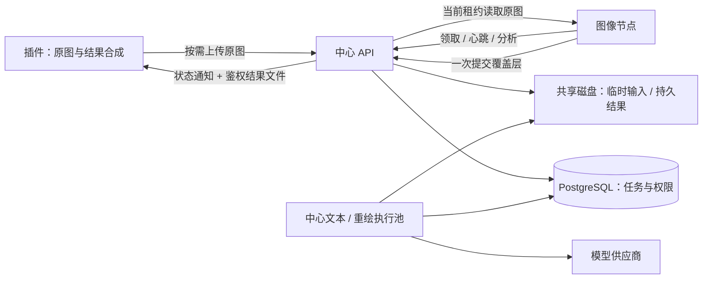

# 翻译集群架构与性能取舍

中心运行 API、control-worker 和 maintenance，共享 PostgreSQL、Redis 与同一持久文件卷；图像节点独立扩容。接口分别由[客户端翻译契约](READING_TRANSLATION_CONTRACT.md)、[v3 计算协议](COMPUTE_PROTOCOL.md)维护，部署和数据库切换见[部署规范](DEPLOYMENT.md)。

## 数据流

```mermaid
flowchart LR
    C[插件：原图与结果合成] -->|按需上传原图| A[中心 API]
    A --> D[(PostgreSQL：任务与权限)]
    A --> F[共享磁盘：临时输入 / 持久结果]
    N[图像节点] -->|领取 / 心跳 / 分析| A
    A -->|当前租约读取原图| N
    N -->|一次提交覆盖层| A
    W[中心文本 / 重绘执行池] --> D
    W --> P[模型供应商]
    W --> F
    A -->|状态通知 + 鉴权结果文件| C
```

API 受理逐图 UUID，按需接收输入；中心校验后调度整页租约。节点检测、OCR 并提交分析，中心文本池生成持久译文，节点并行抹字、随后嵌字和交付。中心耐久保存结果并完成一次结算，终态清理原图。浏览器关闭不取消已受理工作；节点失联可复用中心原图、分析和译文接管。

AI 重绘由中心独立执行池调用整页编辑供应商，交付完整图片。调用意图先持久化，未知结果进入核实；有耐久结果时只恢复交付，不重调模型。文件发布、清理、未知调用和备份的唯一规则见[存储规范](OBJECT_STORAGE.md)。

## 性能取舍

| 选择 | 收益 | 成本与边界 |
| --- | --- | --- |
| 单中心共享文件卷，先扩图像节点 | 图片可流式读写，避免额外对象服务中转 | 中心带宽、磁盘与可用性仍是上限，多台中心不能各挂独立本地盘 |
| 常规翻译交付一个无损 RGBA WebP 覆盖层 | 只传可见变化像素，单次读取、解码和绘制 | bbox 可能接近整页，压缩后字节少不代表解码内存小；客户端首次需原图合成 |
| 首次合成后缓存完整译图 | 再次显示和导出直接读取，避免重复下载与合成 | 增加本地存储，仍须执行缓存和像素预算，及时释放临时位图 |
| 仅账户内任务与结果复用 | 权限和回收关系简单，UUID 重放不重复计费 | 不同账户的相同页面可能重复计算 |
| 有界并发与阶段分离 | 网络、文本等待和交付不占图像计算线程 | 整页租约仍覆盖上述等待；增加执行位不等于提高 GPU 并发或吞吐 |

设原图字节数 S、覆盖层 P，忽略控制消息与重试，常规翻译中心收发合计约 `2S + 2P`；节点仍需取得原图。AI 重绘保留供应商整图上传／下载，不能套用常规覆盖层的压缩收益或裁掉供应商对整页的修改。

单一包围框减少协议与调用次数；图块图集可能降低解码像素，但会增加打包、坐标和合成开销，当前不引入。多中心文件同步、额外消息队列或图块服务须由实测瓶颈与明确需求驱动，遵循 [AGENTS.md](../AGENTS.md#设计与性能)的取舍约束。

## 按就绪顺序领取

- PostgreSQL 保存执行权与就绪队列；Redis 处理分钟准入、HTTP 并发和供应商 RPM。用户页数与供应商成本独立计量。
- 不接收阅读优先级，不计算精确用户份额；在最早的有限候选内优先领取 PLUS 任务，同级按就绪顺序领取。目标语言按节点自动报告的能力匹配，构建指纹仅用于追溯。输入 ready 才能调度，节点有资源余量才领取，每批新分配最多四页。
- 节点下载、分析提交、计算和交付分别有界；中心文本、重绘与上传恢复池独立。内存与执行位边界见[节点配置](NODE_CONFIGURATION.md)。
- 候选在调度锁外选举，锁内复核最新状态；不在锁内读大文件。候选窗口与就绪排序规则见[调度实现边界](SUBMISSION_SCHEDULING.md#数据库领取)。
- claim 回执、租约代次、固定截止与检查点保护重放和接管。通知只唤醒，持久状态从数据库恢复；配置及丢通知不会扩张执行授权。

## 验证与测量

协议回归入口见[计算协议](COMPUTE_PROTOCOL.md#验证边界)，浏览器与真实链路工具见[脚本说明](../scripts/README.md)。至少覆盖中心重启、节点失联、丢回执、旧代次、并发交付与清理、文件写满／只读、原图终态清理后复用和下载、跨账户拒绝及未知重绘恢复。

重绘分别验证结果耐久保存前和保存后、数据库提交前的故障：前者核实供应商，后者恢复同一产物，均不能自动重复调用或结算。客户端检查阅读、原位翻译、导出和位置恢复；覆盖像素与模型效果分别验收。

性能对比使用同一批代表性样本，记录设备、版本、并发和缓存条件，测量原图／完整译图／覆盖层字节数、变化面积、编码与合成耗时、中心流量、结果可见延迟及峰值内存，报告中位数与 P95，密集页单列。租约占用、纯模型时间和端到端延迟分开；重叠阶段不相加。模拟测试不能证明真实 GPU、公网吞吐或模型质量，不将未经测量的压缩率写成收益承诺。
