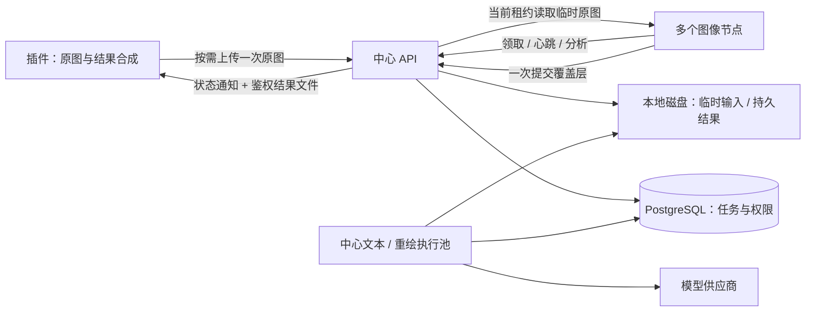

# 翻译集群：本地临时输入与覆盖层交付

本文描述当前代码的翻译集群架构。计算节点使用 [v3 计算协议](COMPUTE_PROTOCOL.md)，插件使用[逐图翻译接口](READING_TRANSLATION_CONTRACT.md)。生产升级须同步更新中心、节点和插件，部署步骤见[部署规范](DEPLOYMENT.md)。

## 1. 方案选择

- 一个中心服务器运行 API、control-worker、maintenance，三个进程共享同一磁盘；多个图像节点按现有租约拉取任务。先扩计算节点，不引入跨中心文件同步。
- 原图仅作为中心和执行节点的临时输入。中心保留到任务终态，支持节点失联后接管；终态提交后立即删除，不再提供服务器原图恢复。
- 常规翻译返回**抹字背景与已嵌字像素组成的稀疏覆盖层**。客户端用自己的原图合成，服务器不保存、不传回整张常规译图。
- 结果二进制保存为服务器文件；PostgreSQL 的 Job 保存执行和冻结结果，TranslationRequest 保存账户 UUID 与 Job 关系，Asset 保存文件描述，检查点和译文继续持久化；Redis 负责短期准入，不存图片。
- 上传、节点取图、结果提交和客户端下载均直连中心 HTTPS，移除 R2、签名 URL、对象上传确认及永久原图资产。
- 第一版仅做账户内任务与结果复用，去掉跨账户结果匹配、共享原图和父原图授权链。不新增“先证明图片持有权，再授权他人译文”的流程；代价是不同账户提交相同页面可能重复计算。

AI 重绘按保留现有整页编辑能力设计：同样移除 R2、临时保存原图、通过中心交付文件，但结果仍为完整重绘图。局部覆盖的压缩收益只适用于常规翻译；要求重绘也只能返回局部，需要另行改变模型输入和效果约束，不能悄悄裁掉供应商对整页的修改。

## 2. 数据流与收益边界


```mermaid
flowchart LR
    C[插件：原图与结果合成] -->|按需上传一次原图| A[中心 API]
    A --> D[(PostgreSQL：任务与权限)]
    A --> F[本地磁盘：临时输入 / 持久结果]
    N[多个图像节点] -->|领取 / 心跳 / 分析| A
    A -->|当前租约读取临时原图| N
    N -->|一次提交覆盖层| A
    W[中心文本 / 重绘执行池] --> D
    W --> P[模型供应商]
    W --> F
    A -->|状态通知 + 鉴权结果文件| C
```

链路是 `插件 → 中心原图 → 节点`，再 `节点 → 中心覆盖层 → 插件`。远程节点通过 HTTPS 读取原图；中心不访问对象存储。实现见 [upload_ingress.py](../backend/app/upload_ingress.py)、[compute_v3.py](../backend/app/compute_v3.py)。

设原图 S、覆盖层 P，不含控制消息与重试，中心收发合计约 `2S + 2P`。压缩收益来自省去结果中未变化的画面；节点仍需取得原图，中心带宽须按实际流量规划。

## 3. 覆盖层格式与客户端合成

第一版固定 `overlay-v1`：**一个裁剪到变化包围框的无损 RGBA WebP，加快照中的坐标**。不打 ZIP、不做 tile atlas、不用图片 base64、不在浏览器重新排字。

节点仍在内存中完成检测、OCR、LaMa 抹字与固定字体嵌字，但不再编码完整 PNG。设原始 RGB 为 I、最终 RGB 为 T：

1. 计算 `M = any(T != I)`，忽略原图 alpha 为 0 的不可见像素。范围包括抹字、字形、描边和抗锯齿，不能只用 OCR mask。
2. 裁剪到 M 的最小整数包围框；变化像素写 `T.rgb, alpha=255`，其余写 `0,0,0,0`。alpha 表示替换像素，不是字形软透明度。
3. 用真正无损 WebP 编码，不用有损/near-lossless；去除无关元数据。无文字返回 `representation=original`，无文件、无下载；有文字却未成功嵌字仍为失败，不能伪装成无字结果。

若嵌字各项校验成功，但可见差分 M 为空，则返回 `kind=translated, representation=original`，不产生 bbox 或文件，也不误标为 no_text；通过 result 接口仅提交冻结元数据。分析应忽略完全透明区域的隐藏文字。

WebP 支持无损 RGBA，全透明像素不必保存隐藏 RGB；最大边长为 16383，当前官方输入的 8192 边长、2400 万像素限制在其范围内。[WebP 格式与限制](https://developers.google.com/speed/webp/faq)、[编码参数](https://developers.google.com/speed/webp/docs/cwebp)。

单一包围框可能接近整页，但透明区域不再包含原图纹理；与图块图集相比，只需一次文件读取、解码和绘制。图集主要降低解码像素数，还会增加打包与坐标协议，本版先不引入。

客户端规则：

- 送译前统一静态帧、EXIF 方向和 sRGB 色彩语义，只有需要规范化的输入才重编码。保留**实际送译字节**作为合成底图，源文件身份与送译摘要分开记录。
- 覆盖描述绑定送译 SHA-256、规范化版本、整页尺寸和 bbox。不符就拒绝合成，不能按 URL/页码将另一份缩放、重压缩图片套上覆盖层。
- 原生尺寸画布先画原图，再用整数坐标、1:1 和 `source-atop` 绘制覆盖层，最后统一缩放。该操作保留底图 alpha，避免透明原图被重复叠加而变实；节点必须保持原图 alpha。[W3C 合成定义](https://www.w3.org/TR/compositing-1/#porterduffcompositingoperators_srcatop)。
- 字形抗锯齿已包含在最终 RGB，不能再用软 alpha 混合。EXIF、ICC 和半透明结果需真实浏览器验收，相同文件摘要不等于不同解码器逐像素一致。
- 首次合成后释放补丁位图和临时画布，持久缓存完整译图供后续直接读取，不另存覆盖文件；缓存预算与失效规则见[翻译契约](READING_TRANSLATION_CONTRACT.md#4-状态与结果)。四页预取不能同时无限保留多套全尺寸像素。
- 阅读器、网页原位翻译、下载/导出共用完整译图缓存；缓存缺失时通过 `materializeResult(result, original)` 校验并生成。结果切换保持尺寸与阅读位置。MTU 本地渠道仍接收其完整图，不要求实现官方覆盖协议。

完整译图已缓存时，显示与导出无需原图。缓存缺失时先从来源缓存或所属来源恢复同摘要原图再合成；失败时显示“原图不可用”，不重新扣费翻译，不再向服务器取永久副本。离线译图读取使用已缓存的完整图片。

## 4. 受理、执行与一次交付

保留逐图 UUID、按需输入、current/prefetch、SSE 和批量快照，不重新引入阅读会话。

1. `PUT /v1/translations/{id}` 核实原 UUID、本人在途工作与完成结果。完成命中不要求服务器原图存在；未命中按现有分钟准入与权益受理。
2. `needs_input` 时调用同资源 `/input`，有界流写中心 `.part`，验证实际大小、摘要、格式和像素限制，原子发布为任务私有输入并排队。同一任务的请求别名复用输入；不同任务不共享可删除原图。
3. 节点 claim 整页租约后，经 `GET /internal/compute/v3/leases/{id}/input` 直接读取原图。请求用节点身份与租约令牌，验证当前代次及截止；不签名、不跳转，节点校验文件摘要。
4. 节点提交分析，中心文本池持久化译文，节点并行抹字。独立心跳、claim、updates 及有界下载/计算池继续保留，等文本不占计算线程。
5. 节点将冻结的覆盖字节、元数据和提交摘要记入本地恢复日志，经一次 `PUT /internal/compute/v3/leases/{id}/result` 发送 multipart：一个受限 JSON 描述、一个二进制文件。移除 `output/authorize → R2 PUT → complete`。
6. 中心验证并耐久保存文件，再在短事务里复核租约代次、取消、分析/译文版本，同时提交 Job 结果描述、产物关联、任务成功、一次结算与稳定回执。崩溃窗口见[文件发布与恢复](OBJECT_STORAGE.md#文件发布与恢复)。
7. DB 提交后立即清理原图、通知客户端；节点收到终态回执后清理本地输入、中间图与冻结结果。丢回执只查询或重交相同结果。客户端一次鉴权 GET 下载覆盖文件并合成。

无字结果沿用 analysis 的终态回执，不提交空文件。错误和停止确认保留独立操作，result 文件接口不兼作错误文本通道。

公开资源路径保留，结果结构为破坏性升级，示例中的摘要与大小仅作格式说明：

```json
{
  "id": "84ca7300-156d-46e8-952f-c2a65a447e72",
  "state": "succeeded",
  "result": {
    "kind": "translated",
    "representation": "overlay-v1",
    "input_sha256": "<实际送译字节摘要>",
    "normalization_version": 1,
    "width": 1600,
    "height": 2400,
    "bbox": {"x": 80, "y": 120, "width": 1300, "height": 1900},
    "composite": "source-atop",
    "artifact": {
      "sha256": "<覆盖文件摘要>",
      "byte_size": 48320,
      "mime": "image/webp",
      "path": "/v1/translations/84ca7300-156d-46e8-952f-c2a65a447e72/result"
    }
  }
}
```

`artifact.path` 只属于配置中的中心 origin，扩展受信上下文带 Bearer fetch 获取 Blob，令牌不进源站或页面 DOM。每次鉴权后直接流式返回，不再查询 image access、刷新签名。图片不进入 SSE。下载失败保留任务成功，只重试读取；详见[结果读取与权限](OBJECT_STORAGE.md#结果读取与权限)。

`full-image-v1` 用于 AI 重绘，不带 bbox/composite；`original` 用于无字或已确认无可见变化的结果，不带 artifact，以 kind 区分二者。

## 5. 按资源公平调度

本次替换数据路径，不重新设计已有调度器：

- PostgreSQL 是执行权与排序的唯一来源；Redis 保留分钟准入、HTTP 并发、供应商 RPM。分钟次数、用户权益、模型成本独立计量。
- 保留 current/prefetch、实时/预存份额、同级账户权重、能力与版本匹配；普通/PLUS 限额不因结果压缩改变。
- 节点有余量才拉取，一批新领取最多四页，中心 text/redraw 池继续有界；输入 ready 才调度，不在锁中读大文件。
- 保留 claim 幂等回执、generation fencing、独立心跳、期限和有限重试、OCR/译文检查点。通知只负责唤醒，状态从数据库恢复。

中心重启从共享盘恢复任务，节点失联由其他节点取中心原图重建并复用已完成文本；浏览器关闭不取消后台工作。

## 6. AI 重绘与未知调用

现有重绘由中心执行整页 `images/edits`，见 [workers.py](../backend/app/workers.py)、[images.py](../backend/app/adapters/images.py)，没有常规节点的结果上传步骤。

中心从临时文件读取原图，将供应商返回的整图冻结为本地结果，通过相同发布、授权和一次结算规则交付。仍有模型供应商上传/下载，不能承诺消除这部分传输。优先使用当前字节上传，不以供应商调用为由重新引入 R2。

调用意图先持久化。结果未知时维持 `needs_attention`，核实窗口内保留必要输入；到期转终态、释放权益、删除原图，只保留调用 ID 和成本证据。结果字节已耐久保存后，结算失败只恢复交付，不能重调模型；只有内存字节或摘要、尚未 fsync 就崩溃时，进入 needs_attention 并尝试查询供应商结果，不能假定本地一定可恢复。晚到结果按既有成本核实规则处理，不复活已撤销 UUID，不二次扣量。

全页重绘做像素差分可能接近整图，无法保证小文件。若要求局部输出，需要先改成区域/掩膜编辑并验证供应商能力与效果，属于产品能力变化，不是存储替换的隐含行为。

## 7. 删除与保留

| 删除 | 保留 |
| --- | --- |
| 翻译链路的 R2 SDK/密钥/桶/CORS/origin、GET/PUT 签名及刷新 | 中心 HTTPS、账户与节点独立身份 |
| output authorize、R2 PUT、ETag/MD5 上传确认 | 一次文件提交、SHA-256、冻结摘要和稳定回执 |
| 永久原图 Asset、父图保留、服务器原图副本下载 | 输入描述、任务临时文件、失联节点恢复 |
| 跨账户结果授权、额外结果副本表、文件页匹配与共享原图引用 | Job 内本人复用、TranslationRequest UUID 撤销与账户隔离 |
| 常规整页 PNG/base64 网络交付 | 小覆盖文件、客户端首次合成、完整译图持久缓存与有限内存缓存 |
| R2 上传恢复池、存储后端选择、磁盘容量预留与低水位分支 | 本地发布恢复、临时文件清理、单请求大小与并发限制 |

存储介质、文件/数据库边界、保留、清理和备份以[存储规范](OBJECT_STORAGE.md)为唯一规则。不新增消息队列、MinIO、共享文件系统或全局图块服务。

## 8. 验收

引擎、中心、插件必须使用相同结果协议。全部 translation 路由拒绝缺少或不匹配的 overlay-v1 头，旧客户端需升级；不保留对象存储 fallback 或双写。数据库切换撤销旧共享授权和远端结果的 UUID，保留墓碑、用户、权益与账本，删除被替代的结果副本、共享授权及文件页结构；不搬运或删除旧 R2 图片。切换前须排空并核实旧任务，步骤见[部署规范](DEPLOYMENT.md)。

必验行为：

- 无 R2 配置/网络访问仍完成上传、翻译、恢复与下载；三个中心进程共享同一挂载。
- 终态立即删除原图，漏删可补偿；原图删除后成功结果、本人复用、无字状态及下载重试仍有效。
- 接收中断、文件落盘后 DB 失败、提交后丢回执、旧代次、并发交付与清理竞争不误删、不重复结算。
- 重绘供应商返回后分别在 fsync 前、fsync 后但 DB commit 前停止 worker：前者核实未知结果，后者恢复同一耐久产物；均不自动重复模型调用，最多结算一次。
- 磁盘满/只读、节点失联、中心重启、结果缺失、未知重绘有明确恢复状态，不自动重调付费模型。
- 无授权不能读结果，节点仅能读当前租约输入；摘要不是跨账户访问凭据。
- Chrome/Edge/Firefox 验证阅读、原位、导出、缩放、对照及位置恢复，原图缺失不错误套用补丁。

对同一批样本测量 S/F/P、变化面积、编码耗时、中心带宽、结果可见耗时和浏览器峰值内存，报告中位数与 P95。常规 P/F 中位数目标不高于 20%，这是待验证目标，不是实测结论；密集页单独报告。模拟测试不能证明真实 GPU、公网吞吐或模型效果。
