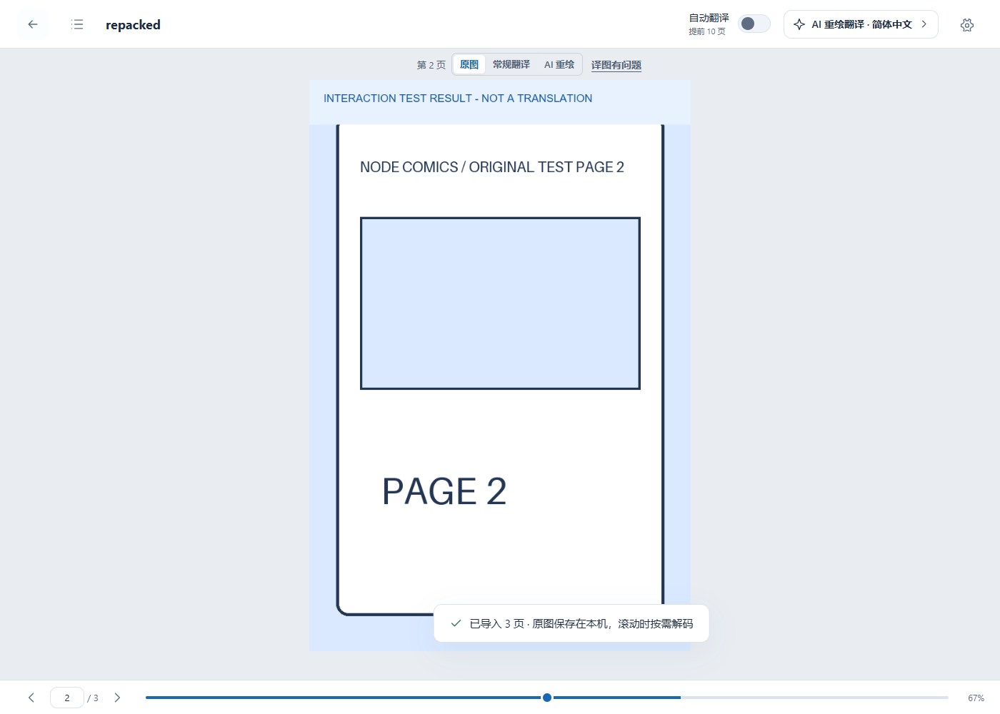
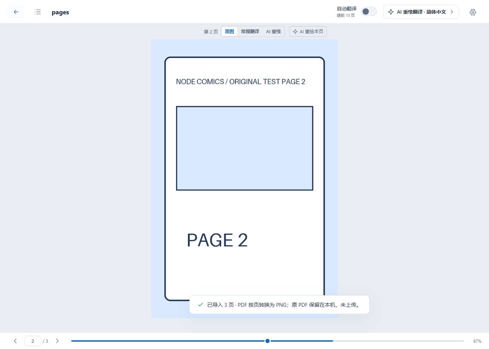

# 格式扩展与内容缓存验收

日期：2026-09-14。实现与限制见[格式与缓存说明](../IMPORT_FORMATS_AND_CACHE.md)。

## 已完成

| 验证 | 结果 |
| --- | --- |
| TypeScript `npm run check` | 通过 |
| `npm test` | 12 个文件，113 项通过 |
| 后端受影响回归 | 102 项通过；两个原有 Starlette/httpx 弃用警告 |
| `npm run build` / `npm run build:web` | 均通过；实际扩展目录约 8.6 MB（WXT 输出列表重复统计共享资产，不作为实际包大小） |
| `npm audit --omit=dev` | 0 个已知运行依赖漏洞 |
| Google Chrome 152.0.7977.83 | Web 生产构建：CBZ、ZIP、重新打包的 CBZ、RAR4、RAR5、PDF；页序、摘要、实际图片解码与重导入第 2 页位置恢复通过 |
| Chromium 141.0.7390.37 | 实际加载 `.output/chrome-mv3`；CBZ、RAR4、RAR5、PDF 导入、页序与阅读位置通过，覆盖 MV3 CSP、Worker/WASM 打包和较旧 Chromium 的 PDF 兼容性 |
| 失败回滚 | ZIP 内第二张图片损坏、密码 PDF、损坏 PDF；显示明确错误，本次书架条目和 Blob 均未残留 |
| 跨包免上传命中 | 同账户已经完成的 3 页，从另一压缩包/文件名恢复；恢复过程中没有 POST 上传、报价或新翻译批次，账户额度及账本完全不变 |

13 项浏览器检查的脱敏机器结果见 [import-cache-browser.json](import-cache-browser.json)。不包含令牌、用户图片或模型输入文本。所有图片由测试脚本独立生成；RAR4/RAR5 样本使用 Store 数据，未单独验收各种高压缩率、固实包及 RAR7 新压缩算法。

后端回归包含按图片内容匹配、同账户不同包装、原图与译图摘要区分、未认证/跨账户访问、重复请求和共享未知任务、配置与语言过滤、到期/删除/物理文件丢失、伪造或冲突客户端摘要、缓存任务免费交付及原有阅读器/常规翻译/rerun 预算行为。数据库使用临时 SQLite；本次没有修改事务/队列算法，也没有重复运行 PostgreSQL 并发套件。

## 截图

重新打包后的漫画恢复测试结果，并保持第 2 页。顶部测试标记明确说明这不是模型译文：



扩展阅读页导入 RAR5：


扩展阅读页导入 PDF：



## 复现

常规验证：

```powershell
cd apps/extension
npm ci
npm run check
npm test
npm run build
npm run build:web
npm audit --omit=dev
cd ../../backend
.venv/Scripts/python.exe -m pytest tests/test_content_match.py tests/test_file_pages.py tests/test_shared_jobs.py tests/test_lifecycle.py tests/test_reader_api.py tests/test_classic.py tests/test_rerun_budget.py -q
```

浏览器验证需要 Node.js、Playwright、Chrome（扩展检查另需可加载解压扩展的 Chromium），以及安装 Pillow/ReportLab 的 Python。启动终端各自从仓库根目录运行：

```powershell
# 生成原创测试包/PDF，输出仅在忽略的 artifacts/import-validation 中
python scripts/generate_import_fixtures.py

# 单独终端：隔离 API/SQLite/文件存储，供应商完全由测试实现替换
backend/.venv/Scripts/python.exe backend/tests/manual_ui_server.py

# 单独终端：已构建 Web 阅读器，不依赖 Vite 开发时的模块热更新
cd apps/extension
npx vite preview --host 127.0.0.1 --port 5174 --strictPort

# 仓库根目录的终端
# 非项目依赖中的 Playwright 可用 PLAYWRIGHT_MODULE 指向其安装目录
# 扩展验收用 TEST_CHROMIUM 指向 Chromium 可执行文件；不设置时明确只检查 Web
node scripts/verify_comic_import.mjs
```

脚本只连接测试 API `127.0.0.1:18089`，创建独立测试账户和原图；测试供应商在本机给图片增加“INTERACTION TEST RESULT - NOT A TRANSLATION”标记。测试不会读取产品 `.env`，不会访问真实图片/文本模型，也不构成 OCR、排版或真实翻译效果验收。完成后关闭测试 API、预览和隔离浏览器即可。

本次完成代码、文档、离线契约、构建和隔离运行验收；没有重启/部署当前产品 API，没有提交、推送或公开发布。已有 OIDC、公钥、Compose 等工作区改动保留。
