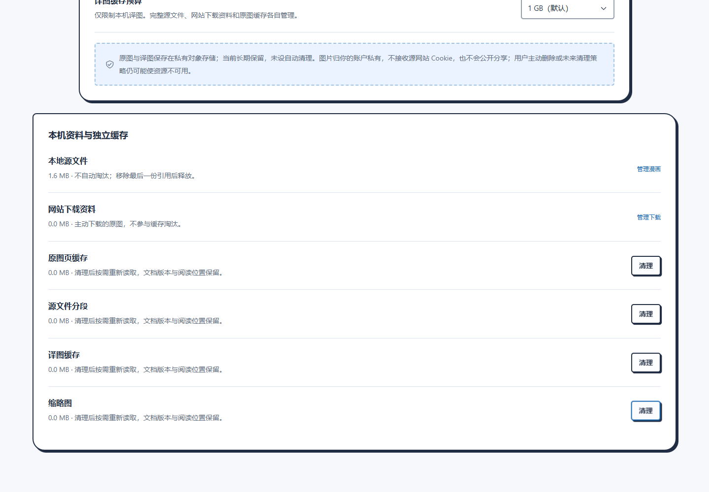

# 来源架构本地验收（2026-09-22）

> 历史记录：此处的旧管理模型和入口已被移除，不是当前功能或可重复执行命令。当前行为及验证见[单来源验收](SIMPLE_READING_2026_09_23.md)。

本记录区分源码检查、模拟协议和真实浏览器运行。实现说明见[来源架构实施记录](../COMIC_SOURCE_IMPLEMENTATION.md)。本轮使用新建隔离浏览器 profile、自制图片与格式样本，没有读取用户漫画、登录用户账户或调用付费翻译供应商，没有提交、发布或部署。

## 自动化与构建

在 `apps/extension` 运行 `npm run check`、`npm test`、`npm run build`、`npm run build:web`，以及 `npx wxt build -b firefox`。类型检查、181 个源码模块的边界与可达性检查、Chrome MV3 / Firefox MV2 / 网页构建均通过。完整测试覆盖目录记录、容器复制恢复与引用、独立缓存、页面租约、格式边界、Drive 消息 / Range、网站下载、翻译恢复及导出。

架构替换阶段全量结果为 **48 个测试文件、406 项通过**，1 项规模测试默认跳过并单独运行通过。随后修复残缺旧库引起的启动错误与调用方诊断吞没，全量增至 **49 个测试文件、435 项通过**，模块检查增至 182 个；新增实际扩展重开回归，详见[数据库基线记录](DATABASE_BASELINE_2026_09_22.md)。最后补查修复了同毫秒入队按随机 ID 乱序的问题：现在按入队批次时间及用户所选顺序执行；停止当前下载的用例连续 10 轮通过。

Drive 后续消息回传、期内授权复用和浏览器 fetch receiver 修复后，全量为 **52 个文件、479 项通过**，规模项仍默认跳过；新增完整编译扩展的隔离 Drive 导入 / 阅读 / 错误交互验收，见 [Drive 修复记录](DRIVE_IMPORT_2026_09_22.md)。

另外显式运行 `NC_CATALOG_SCALE=1 npx vitest run tests/catalog-scale.test.ts`：1,000 个文档、100,000 条页面描述符，通过按页目录查询与单记录修改检查，未调用对象仓库 `getAll()` 或重写整库。该项使用 fake-indexeddb，耗时约 36 秒；不把它当作真实设备性能基准。

完整测试默认跳过上述规模项，需独立开启。格式单测包含真实 ZIP 解压、UnRAR WASM 与合成 MOBI；PDF 单测为 transport / render 契约模拟，浏览器 PDF 实际解码另列于下。

## 浏览器与复现入口

浏览器环境为 Windows：Chrome 153.0.8010.52 普通网页、Chrome for Testing 141.0.7390.37 解压扩展、Edge 153.0.4234.48 解压扩展。使用同一固定 `chunked-idb-v1` 字节存储。Firefox 只有构建证据，未安装可用运行环境，不能报告运行通过。

当前可重复命令与依赖位于 [scripts/README.md](../../scripts/README.md#新来源架构验收)。样本由 `generate_import_fixtures.py` 生成，包括重复资源引用的 MOBI、RAR4 / RAR5 Store 包、普通 / 加密 / 损坏 PDF 和含损坏单页的 CBZ。浏览器脚本阻断产品 API，结果与截图写入忽略目录 `artifacts/source-architecture/`；选定截图另保留在 `output/source-architecture/`。

| 入口 | 已实际通过的行为 |
| --- | --- |
| `verify_source_architecture.mjs` | 插件书架与导入弹窗只提供本地 / Drive 入口；网站从站点内嵌按钮触发。120 页 CBZ 导入只提交完整容器和索引，最多物化封面；跳第 100 页后按需物化，页面 DOM 有界；关闭浏览器后以同一隔离 profile 重开，无需重选文件即恢复第 100 页；分别清理原图页 / 分段 / 译图 / 缩略图缓存，容器字节、修订、页 ID 和位置保留；390px 下无横向溢出且按钮文字可读 |
| `verify_source_formats.mjs` | PDF、MOBI、RAR4、RAR5 实际导入及页面解码；MOBI 重复资源保留独立页面。加密与损坏 PDF 明确拒绝；CBZ 中第二页损坏不妨碍第一页面正常阅读 |
| `verify_source_export.mjs` | 完整源文件导出与输入字节完全相同；CBZ 导出全部 3 页并带清单；PDF 导出可重新解析为 3 页。测试浏览器缓冲下载路径；流式目标与取消由导出单测覆盖 |
| `verify_website_source_lifecycle.mjs` | 6 项：实际站点嵌入按钮打开插件确认页；按需导入不会创建下载任务；发现两页并关闭受管来源标签页后，已登记 HTTP 图片仍可读取；从同一网页入口选择下载后两页完成保存；清除自动原图 / 缩略图缓存不会删除下载；关闭浏览器重开并让图片源返回 503，已下载页仍能读取且不重新请求图片源 |
| `verify_comicpash.mjs`（本地模式） | 10 项：固定 canvas 选集在阅读时物化 600×800 图片，清原图缓存后可从仍活跃的来源页面重新下载；拒绝未登记资源、重渲染前的旧版本、SPA 跳转再返回后的旧导航、移除 canvas 和关闭原标签页后的旧句柄。失效来源保留重新发现提示 |
| `verify_extension_theme.mjs` | 新书架、导入、作品标题修改、导出弹窗及顶层菜单；四种主题色 × 亮暗外观、大字体、键盘取消 / 焦点；阅读设置不改变视口宽度和位置；窄屏导入按钮可读 |

上述浏览器脚本均没有未处理的页面异常。主应用验证的是本地文件链路；Chrome / Edge 通过不等同于 Firefox 通过，也不能推断所有大型或异常格式均受支持。

网站用本机 TLS 页面、临时扩展副本与 host-resolver 隔离 DNS；操作真实的内嵌按钮、扩展消息、受管标签页和下载流程，没有访问公开网站。结果在 `artifacts/source-architecture/website/results.json`。

连续跨章窗口还有独立验收：30 章 × 每章 120 页，总计 3,600 页，最多挂载 3 章 / 11 页 DOM，并限制约 5 页解码；跳入未挂载页、偏移恢复、失败占位与窄屏证据见[阅读窗口记录](READER_WINDOW_2026_09_22.md)。

阅读计划、手动 / 下载重试、未知地址回退三个浏览器脚本已迁移到新容器与目录夹具，合计 **20 项通过**。它们覆盖当前页与后三页、限流到期恢复、未知受理核实且不重复提交、已有译图重新下载、阅读位置与原图空闲无翻译轮询；详情见[阅读流程回归](READING_FLOW_2026_09_22.md)。

## 内容、缓存与翻译身份

单元 / 契约测试验证了同内容容器并发去重、读取租约阻止提前删除、取消复制、目录发布前后恢复、图集重复页及删除后不复活。各缓存的清空 / owner 删除代次会阻止迟到写入；缓存预算不足或缓存访问异常时，有源页面仍可内存交付。网站主动下载资料与完整本地源文件不参与缓存 LRU。

翻译恢复使用冻结的页面引用，读取后核对 SHA-256 和字节数再上传；原文件索引不作为翻译内容身份。测试覆盖相同操作 / receipt 恢复、源内容变化时阻止上传且保留回执、译图缓存禁用后仍可显示、同页并发与撤权后禁止旧读取交付。恢复与计费接口均为模拟协议证据，没有验证真实供应商效果。

## 未验证范围

- Google Drive HTTPS 连接页已使用本地忽略配置与临时隧道，Chrome / Edge 的真实 SDK 与安全桥就绪已验证，但真实账户授权、多账户、云端版本变化 / 撤权和流量比例未验收。用户后续发现的消息回传故障及修复见 [Drive 回归](DRIVE_IMPORT_2026_09_22.md)。当前只开放远程 CBZ / ZIP 与单图，PDF / MOBI / RAR 保持能力门槛。
- Firefox 运行、操作系统重启、真实磁盘耗尽 / 浏览器回收，以及任意崩溃时刻没有完整实测；故障注入不替代这些环境证据。
- 不把隔离网站或模拟 API 的通过写成所有公开站点、真实 R2 或真实翻译模型都通过。复杂固实 RAR、所有恶意压缩包、加密 / 分卷 / DRM 等亦不在通过声明内。

