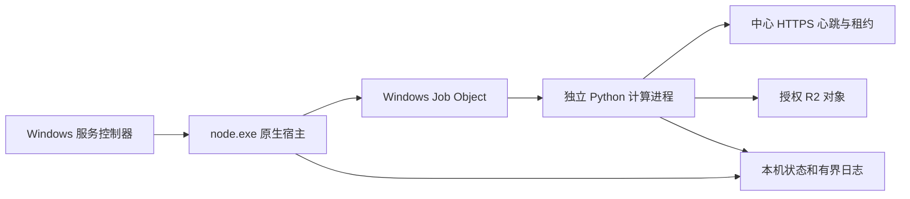

# Node Comics Node — Windows 独立计算节点

发布包中的 `node.exe` 是 Go 原生宿主。程序内置初始化、诊断、后台进程管理和 Windows 服务管理；运行时不调用 PowerShell、计划任务、pip、uv 或 Go，也不依赖目标机器安装 Python。

首版平台为 Windows x64。新电脑仍需 Windows 10/11、可用的 Vulkan / DirectX 12 显卡驱动和足够的 GPU／内存资源；不包含显卡驱动，不声称支持 Linux。

## 新电脑使用

1. 把完整发布包解压到固定目录，例如 `D:\NodeComicsNode`。保持 `node.exe`、`runtime`、`engine`、`models`、`fonts` 和 `release.json` 在一起。
2. 在后台为该电脑创建独立节点，取得中心地址、R2 origin、节点 ID、资源 ID 和节点凭据。
3. 执行以下命令。`init` 交互读取配置，凭据输入不回显，也不进入命令行参数。

```text
node.exe init
node.exe doctor
node.exe run
```

已有私有节点配置可以用 `node.exe init --from D:\Private\node.json` 导入。不会覆盖已有身份；导入时移除原电脑的模型／字体路径，私有 CA 按需复制，目录 ACL 限制为当前用户、管理员与 SYSTEM。导入既有身份前必须停止旧节点，不能克隆身份同时运行。

`doctor` 离线检查发布文件 SHA-256、模型、字体覆盖，并实际预热 Vulkan 检测／OCR 与 DirectML LaMa；它不注册、不领取任务、不调用收费供应商。同一数据目录已有宿主运行时会拒绝诊断，避免重复占用 GPU。输出引擎版本，中心的 `CLASSIC_ENGINE_VERSION` 必须与之匹配。此发布包采用固定 Noto 字体，引擎版本与旧的系统字体版本不同；请先同步中心允许的版本，再切换生产节点。

临时后台运行：`node.exe start`；查询：`node.exe status`；停止：`node.exe stop`。`start` 只有观测到成功注册／心跳才返回成功，超时后仍保留宿主恢复。后台模式不承诺注销或整机重启后启动；长期生产运行安装系统服务。

## 原生 Windows 服务

在管理员终端中：

```text
node.exe service install
node.exe service start
node.exe status
```

服务名 `NodeComicsNode`，开机自动延迟启动，运行账户为专用虚拟账户 `NT SERVICE\NodeComicsNode`，无须输入或保存 Windows 账户密码。该账户只获程序目录读取／执行和本节点数据目录修改权限；节点调用中心与存储仍使用独立应用凭据，不使用域身份认证。

`service start` 表示 SCM 已受理启动，不代表节点在线；以 `node status` 的 `connected=true` 和中心节点状态为准。`service status` 同时返回 SCM 状态和节点状态。停止／卸载：

```text
node.exe service stop
node.exe service remove
```

卸载保留私有数据。普通用户执行安装会明确报需要管理员终端，不偷偷弹出 UAC，不回退为计划任务。SCM 注册、自动启动、虚拟账户下 GPU 与网络访问必须在目标电脑分别验收。

## 目录与升级

```text
node.exe                 原生入口、监督计算进程、SCM 服务
runtime/                 独立 CPython、锁定的推理依赖与 DLL
engine/                  计算协议、图像引擎源码与依赖锁文件
models/                  已校验的推理模型及构建来源记录
fonts/                   固定 Noto Sans / Noto Sans CJK 字体
licenses/                依赖与字体许可证、字体来源清单
source/                  宿主、引擎、模型转换源码与完整构建锁文件
release.json             版本、平台、发布文件摘要
data/                    初始化后创建；发布包绝不预置
```

数据与程序分离，所有命令都可用 `--home D:\Private\NodeData` 指定独立数据目录。初始化要求新建或空的专用目录，不能指向程序目录、其上级或已有文件的目录；程序目录内只允许使用 `data/`。模型、字体始终从当前发布包解析，工作目录、旧电脑盘符、原虚拟环境和用户字体都不影响它们。

升级时先停止节点和移除旧服务；解压新包，指定原数据目录执行 `doctor`，确认中心引擎版本，再从新目录安装服务。不覆盖运行中的 DLL。保留旧包即可回退程序；跨引擎版本切换应先排空在途租约，不能将未完成任务当成新任务重复结算。

同一节点换电脑：停止旧宿主、确认租约处理完成、移除旧服务，然后复制程序包及私有数据，在新电脑执行 `node.exe adopt`、`doctor`、`service install`。`adopt` 拒绝有未确认领取或在途恢复记录的日志，并重新设置本机数据 ACL。旧电脑必须保持停止；本地机器绑定可以阻止误启动复制件，但不替代中心侧分布式租约或凭据撤销。

新增另一台节点：复制未初始化的发布包，执行 `init` 使用新的身份。不要把带 `data` 的已配置目录分发给别人。

## 恢复和可观测性



- 计算进程退出：宿主以 1、2、4…60 秒退避重启，稳定运行 5 分钟后重置退避。
- 宿主退出：Windows Job Object 清理其计算进程，避免 GPU 孤儿进程；服务模式下 SCM 按 5、30、60 秒恢复宿主。
- 网络离线：计算进程内部重试，不因外部断网不断重载 GPU。
- Python／原生推理阻塞：宿主独立观察状态文件；首次状态超过 60 秒、状态停止更新超过 20 秒，或主循环超过 120 秒（初始化 600 秒）则终止计算进程恢复。这个外部看门狗不依赖 Python GIL。
- 人工停止：停止新领取并保留恢复日志，等待 75 秒后才强制结束计算进程。正常服务停止不触发故障恢复。
- 宿主和计算进程分别持有独占锁。状态校验 PID、进程创建时间、程序路径和状态新鲜度；进程存在不等于节点连通。

`data/logs/supervisor.log` 记录进程退出码与重启，`data/state/logs/node.log` 记录注册、成功心跳、HTTP 状态与错误类型。两者分别单文件 10 MiB、最多 5 个轮转备份。`supervisor.json` 与 `state/status.json` 提供本地机器可读状态。日志不保存节点令牌、请求正文、OCR／译文或签名 URL；私有 SQLite 恢复日志保持原契约，不删除或复制成新的业务任务。

## 开发构建与验证

构建工具仅用于开发／发布；节点运行和服务管理使用 `node.exe`。从新的源码检出开始，只需 Windows x64、Windows PowerShell 5.1 和系统自带的 `tar.exe`（Windows 10 1803 及以上）、网络及足够磁盘空间。构建不要求预装 Python、Go、uv 或准备模型，不读取旧节点的虚拟环境、模型、凭据和数据。

```powershell
# 仓库根目录；ExecutionPolicy 只作用于本次 PowerShell 进程。
powershell.exe -NoProfile -ExecutionPolicy Bypass -File services/compute-node/build.ps1
```

可指定 `-Version 0.1.0`、`-OutputDirectory D:\Build\NodeComicsNode-0.1.0-windows-x64` 和 `-WorkDirectory D:\Build\NodeWork`。默认输出到 `services/compute-node/artifacts/dist/`，工作目录为本模块 `.build/`；两者都不进 Git。输出目录必须不存在，同一工作目录同时只允许一个构建。第一次会下载工具、依赖和原始模型；后续只复用摘要一致的下载缓存，模型仍在每次隔离构建中重新导出。建议预留 15 GiB 工作空间。构建不需要管理员权限或 GPU；GPU 与系统服务另行验收。

固定输入如下：

| 输入 | 固定方式 |
| --- | --- |
| CPython 3.12.11 / 20251007、uv 0.12.17、Go 1.27.0 | `toolchain.lock.json` 固定官方发行 URL 和 SHA-256 |
| 节点运行依赖 | `classic-engine/uv.lock`，安装强制核对包摘要 |
| OCR 转换依赖 | `build-deps/ocr/uv.lock`，独立 PyTorch 2.4.1 CPU / PNNX / ONNX 环境 |
| LaMa 转换依赖 | `build-deps/lama/uv.lock`，独立 PyTorch 2.6.0 CPU / ONNX 环境 |
| 打包及源包构建依赖 | `build-deps/packaging/uv.lock`，固定 setuptools / wheel，禁止隐式安装 PEP 517 构建依赖 |
| 模型、OCR 源码与检查点 | `models.json` 和 `toolchain.lock.json` 中的固定来源及 SHA-256 |
| 字体及其许可证 | `assets.json` 中的源码提交和 SHA-256 |

构建顺序为校验工具、准备模型、导出 OCR 和 LaMa、校验运行模型、安装运行依赖、编译并测试原生宿主、生成发布清单与 ZIP。LaMa 导出包含与原模型的数值对照和 ONNX 图检查；OCR 源码、检查点与字表逐项校验。所有运行模型摘要和工具链清单记录进 `release.json`。没有上游资源或摘要不匹配时直接失败，不使用本机旧权重回退。

Git 保存源码、模型清单、转换器、全部锁文件与许可证；大型模型、下载缓存和 ZIP 保持为构建产物。发布包内的模型来源记录不写入构建机绝对路径；引擎文本统一 LF，移除含构建路径的第三方命令入口，ZIP 文件顺序和时间戳固定。完整重建验收不等于跨所有 CPU／操作系统的逐字节一致性保证。

提交后，在新 Git 克隆中执行同一个 `build.ps1` 即可重建。提交前也可以执行以下验收（此辅助检查需要 Git 和 Python 3.12）：

```powershell
python -B services/compute-node/tests/verify_clean_checkout.py --directory D:\Build\node-clean-check
```

辅助检查只收集 Git 可见的两个节点模块源码，在指定的新目录创建临时快照仓库、提交并克隆，以空下载缓存执行统一构建；不修改当前仓库的索引、HEAD 或远端。`inputs.json` 记录源码摘要，`build.log` 记录阶段输出，`result.json` 记录快照提交、耗时、构建后源码状态和 ZIP 摘要。目录必须不存在；此检查不会复用原模型或虚拟环境。

完整发布包验收另有 `tests/verify_release.py`，需要开发验证环境安装 `cryptography`。指定 `--release` 为已解压发布目录、`--work` 为新的隔离目录；它使用真实 GPU 和本机 HTTPS 模拟中心，覆盖错误 Python 环境变量、独立数据目录、注册失败重试、中心不可用后原进程重连、计算进程崩溃恢复和正常停止。没有图片任务或生产凭据，不能替代目标机器上的 SCM 与公网验收。

构建拒绝覆盖已有输出目录，不复制原虚拟环境、凭据、用户图片、状态或日志。随包保留源码、GPL 许可、模型来源、CPython／Go／依赖许可、字体 OFL 许可与完整文件摘要。文件清单用于完整性检查，不等于代码签名或发行者认证；当前未签署 Authenticode。

已验证边界和本机迁移状态见 [节点运维记录](../classic-engine/docs/NODE_OPERATIONS.md)。

实现参考：[Windows 服务账户](https://learn.microsoft.com/windows/security/identity-protection/access-control/service-accounts)、[Go Windows SCM](https://pkg.go.dev/golang.org/x/sys/windows/svc/mgr)、[独立 CPython 运行发行物](https://github.com/astral-sh/python-build-standalone/blob/main/docs/running.rst)。
